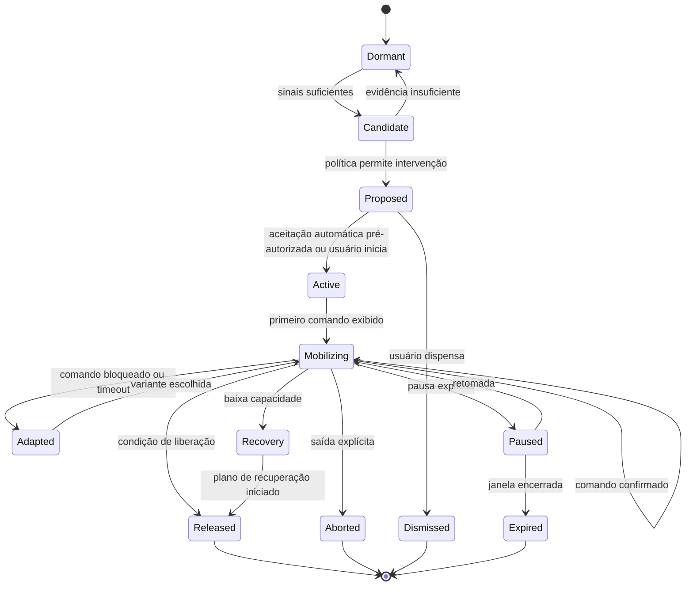
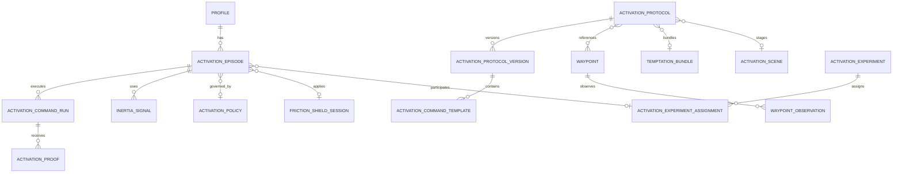
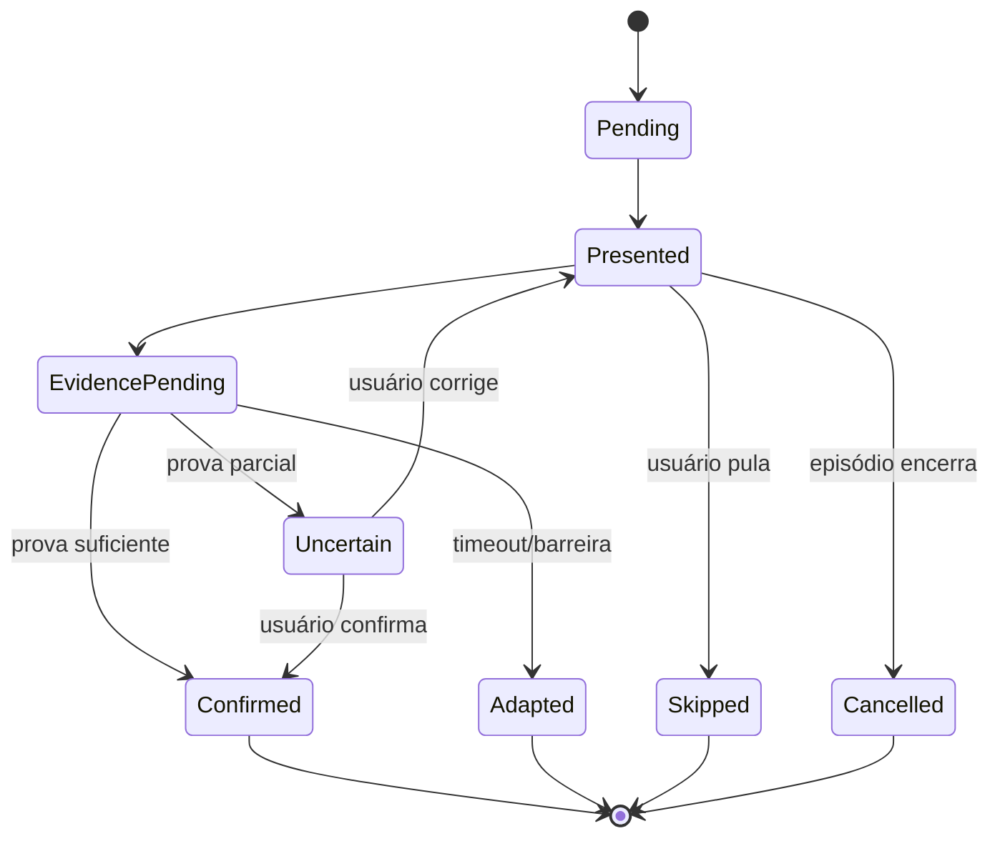
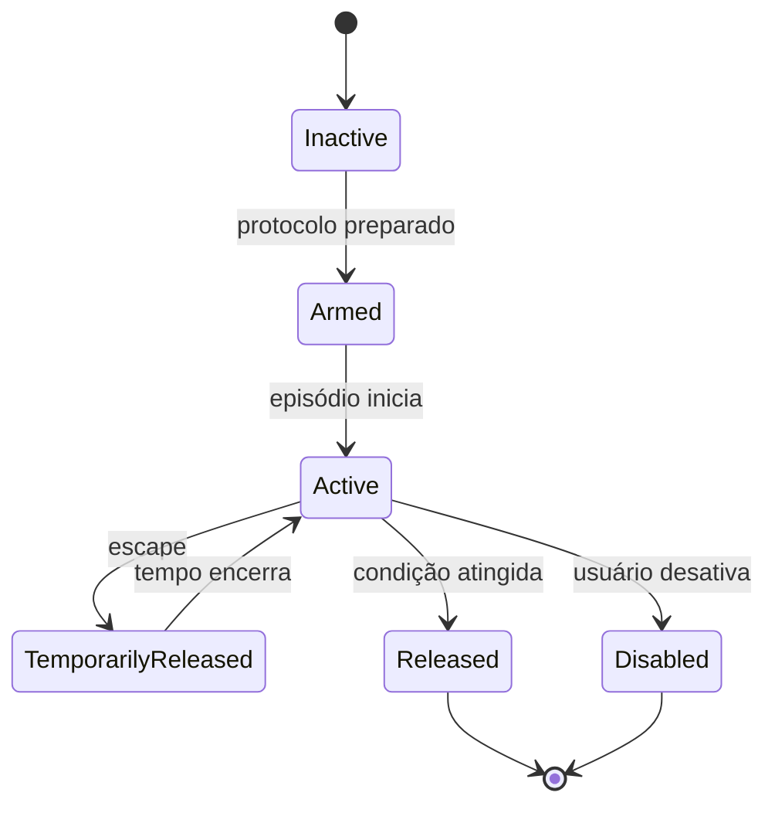

# LIFE COLONY OS — MOTOR DE IGNIÇÃO
## Especificação funcional, comportamental, experiencial e técnica do sistema de mobilização, transições e saída da inércia

**Status:** especificação de produto e engenharia  
**Documento pai:** `LIFE_COLONY_OS_SPEC.md`  
**Integrações relacionadas:** Saúde, Necessidades, Agenda, Trabalho, Tarefas, Zonas, Equipamentos, Crônica, Storyteller e Assistente de IA  
**Plataforma principal:** Flutter para Android, iOS, desktop e extensões vestíveis opcionais  
**Princípio central:** o sistema não acompanha hábitos; ele reduz a distância entre intenção e primeiro movimento físico.

---

# Índice

0. Instrução soberana para a IA desenvolvedora  
1. Síntese da funcionalidade  
2. Encaixe natural no Life Colony OS  
3. Problema de produto  
4. Tese de experiência  
5. Iterações conceituais e solução escolhida  
6. Fundamentos comportamentais e limites das evidências  
7. Princípios absolutos  
8. Antiobjetivos  
9. Vocabulário de domínio  
10. Modelo conceitual em cinco camadas  
11. Unidade fundamental: Episódio de Mobilização  
12. Máquina de estados de ativação  
13. Detecção de inércia  
14. Políticas de intervenção  
15. Protocolos de Ignição  
16. Compilador de intenção em ações físicas  
17. Gramática de comandos  
18. Modo Mobilização — o “draft mode” pessoal  
19. Fila de comandos e pathfinding humano  
20. Waypoints e marcos físicos  
21. Motor de evidências e confirmação passiva  
22. Provas de ativação e confiança  
23. Escudo de Fricção  
24. Desbloqueios, exceções e autonomia  
25. Bundles de Tentação  
26. Sistema sensorial de ignição  
27. Automação do ambiente  
28. Modos de capacidade  
29. Escada de intervenção adaptativa  
30. Protocolo de resgate social  
31. Ignição da manhã  
32. Protocolo de banho  
33. Ignição de trabalho profundo  
34. Ignição de estudo  
35. Ignição de exercício  
36. Saída de casa  
37. Rotina noturna e preparação do terreno  
38. Resgate anti-scroll  
39. Comando “Estou travado agora”  
40. Hábitos reinterpretados como rotas  
41. Aprendizado adaptativo e experimentos N-of-1  
42. Sistema de recompensas sem gamificação vazia  
43. Tela Colônia e painel de prontidão  
44. Tela ativa do Modo Mobilização  
45. Editor de Protocolos  
46. Editor de Waypoints  
47. Configuração do Escudo de Fricção  
48. Inspeção de Episódio  
49. Relatórios e Crônica  
50. Componentes visuais  
51. Linguagem, tom e microcopy  
52. Notificações e alarmes  
53. Acessibilidade  
54. Integração com Necessidades e Saúde  
55. Integração com Agenda e Calendário  
56. Integração com Trabalho, Tarefas e Bills  
57. Integração com Missões e Projetos  
58. Integração com Casa, Zonas e Equipamentos  
59. Integração com Storyteller  
60. Integração com Crônica  
61. Assistente de IA de mobilização  
62. Modelo de dados  
63. Schema SQL de referência  
64. Eventos de domínio  
65. Máquinas de estado detalhadas  
66. Algoritmos e heurísticas  
67. Arquitetura Flutter  
68. Capacidades e limitações por plataforma  
69. Android  
70. iOS e iPadOS  
71. Wear OS e Apple Watch  
72. Casa conectada e Home Assistant  
73. Local-first, sync e operação offline  
74. Privacidade e segurança  
75. Segurança clínica e ética  
76. Observabilidade e métricas  
77. Onboarding  
78. Seeds personalizados  
79. Estratégia de testes  
80. Failure modes e degradação graciosa  
81. Roadmap de implementação  
82. Vertical slices  
83. Backlog inicial  
84. Critérios de aceitação  
85. Definition of Done  
86. ADRs obrigatórios  
87. Patch de integração no spec mestre  
88. Prompt de execução para a IA  
89. Referências  
90. Resultado esperado

---

# 0. Instrução soberana para a IA desenvolvedora

Este documento define um módulo estrutural do Life Colony OS. Ele não deve ser implementado como:

- um habit tracker;
- uma lista de checkboxes matinal;
- um alarme agressivo;
- um sistema de streaks;
- um bloqueador de aplicativos isolado;
- um chatbot motivacional;
- um placar de disciplina;
- um mecanismo de punição;
- um diagnóstico de TDAH, depressão, transtorno do sono ou qualquer condição clínica.

A unidade de valor não é “registrar que o hábito aconteceu”. A unidade de valor é **aumentar a probabilidade de o usuário executar o próximo movimento físico relevante no momento em que está travado**.

Antes de implementar qualquer tela, a IA deve conseguir responder:

1. Qual estado de inércia esta tela resolve?
2. Qual ação física concreta o usuário deve executar?
3. Quantas decisões são exigidas do usuário nesse estado?
4. Qual confirmação pode ser obtida sem input manual?
5. Como o usuário escapa ou reduz a intervenção?
6. Como o sistema evita transformar dificuldade em culpa?
7. O recurso funciona sem internet?
8. O recurso continua útil sem sensores ou permissões especiais?
9. O recurso preserva autonomia e não bloqueia comunicações essenciais?
10. A mesma função já existe em outra entidade do Life Colony OS?

## 0.1 Regras absolutas

- Nunca exibir “você falhou”.
- Nunca usar streak como mecanismo padrão.
- Nunca calcular score de disciplina, valor pessoal ou força de vontade.
- Nunca impedir chamadas de emergência, contatos essenciais, autenticação, mapas ou recursos médicos.
- Nunca exigir justificativa para abandonar um protocolo.
- Nunca aplicar consequência financeira automaticamente.
- Nunca enviar mensagens a terceiros sem autorização explícita anterior e confirmação adequada.
- Nunca assumir que ausência de movimento significa preguiça.
- Nunca interpretar inércia como condição clínica.
- Nunca tornar o app impossível de desinstalar ou desativar.
- Nunca depender de Accessibility Service para comportamentos proibidos pelas políticas da Play Store.
- Toda inferência deve exibir fonte, confiança e opção de correção.
- Toda automação ambiental deve ser reversível.
- Todo bloqueio deve ter escape de segurança.
- O modo ativo deve mostrar uma ação por vez.
- O fluxo principal deve exigir menos interação do que um habit tracker convencional.

## 0.2 Ordem de implementação

A ordem correta é:

1. protocolos locais manuais;
2. execução de uma ordem por vez;
3. confirmação simples;
4. registro automático de episódio;
5. waypoints físicos opcionais;
6. detecção contextual;
7. escudo de fricção por APIs permitidas;
8. adaptação baseada no histórico;
9. integrações vestíveis;
10. automação residencial;
11. IA generativa opcional.

O núcleo não pode depender das fases 7 a 11.

---

# 1. Síntese da funcionalidade

O **Motor de Ignição** é o subsistema do Life Colony OS responsável por transformar intenções vagas em transições físicas executáveis quando o usuário está sob inércia.

Sua metáfora principal vem do modo `Draft` de RimWorld:

- no funcionamento normal, o Pawn escolhe tarefas por prioridades e contexto;
- quando há bloqueio ou uma situação que exige direção explícita, ele é temporariamente “recrutado”;
- durante esse período, não recebe uma lista inteira de responsabilidades;
- recebe uma ordem clara por vez;
- o sistema calcula uma rota entre o estado atual e um estado operacional mínimo;
- ao atingir esse estado, o Pawn é liberado e volta ao fluxo normal.

No Life Colony OS, isso se torna o **Modo Mobilização**.

Exemplo:

```text
Estado atual:
- acordado há 18 minutos;
- telefone ativo no quarto;
- nenhum deslocamento relevante detectado;
- primeira obrigação em 72 minutos.

Objetivo abstrato:
- começar o dia.

Rota compilada:
1. Coloque os dois pés no chão.
2. Leve o telefone ao dock do banheiro.
3. Abra o chuveiro.
4. Entre no banho.
5. Vista a roupa preparada.
6. Vá até a janela ou área externa.
7. Sente-se no posto de trabalho.
8. Abra a primeira ação já escolhida.

Condição de liberação:
- banho concluído;
- fora da zona da cama;
- primeira ação iniciada por 3 minutos.
```

A funcionalidade não pergunta diariamente:

- “Você tomou banho?”
- “Você cumpriu sua rotina?”
- “Quantos hábitos fez?”

Ela observa sinais, oferece a próxima ação, confirma por evidências suficientes e registra o episódio automaticamente.

---

# 2. Encaixe natural no Life Colony OS

## 2.1 Posição na arquitetura de informação

O Motor de Ignição não deve ser um app dentro do app. Ele é um serviço transversal acessível por:

```text
Colônia
├── Agora
├── Modo Mobilização
└── Alertas de transição

Pawn
├── Necessidades
├── Capacidades
├── Trabalho
└── Mobilização

Agenda
├── Blocos
├── Transições
└── Protocolos associados

Casa
├── Zonas
├── Equipamentos
└── Waypoints

Crônica
└── Episódios de mobilização
```

Deep links:

```text
/activation
/activation/start
/activation/episodes/:episodeId
/activation/protocols
/activation/protocols/:protocolId
/activation/waypoints
/activation/shield
/activation/experiments
/pawn/me/activation
/chronicle?domain=activation
```

Command palette:

```text
Estou travado agora
Iniciar ignição da manhã
Iniciar protocolo de banho
Iniciar primeira ação
Pausar escudo de fricção
Editar rota atual
```

## 2.2 Entidades compartilhadas

| Necessidade | Entidade base | Extensão do Motor de Ignição |
|---|---|---|
| ação executável | `Task` | `ActivationCommand` opcional |
| rotina recorrente | `Bill` | gera `ActivationProtocolRun` |
| horário | `ScheduleBlock` | `transition_policy` |
| estado pessoal | `NeedState`, `CapabilitySnapshot` | seleciona modo de capacidade |
| lugar | `Zone`, `Location` | waypoint e prova contextual |
| objeto | `InventoryItem`, `Equipment` | dock, roupa, garrafa, instrumento |
| histórico | `DomainEvent` | episódio e transições |
| objetivo | `Quest`, `Project` | condição final do protocolo |
| pessoa | `Person` | contato de resgate autorizado |
| alerta | `Letter` | carta de transição |
| automação | `AutomationRule` | luz, áudio, tomada, cena residencial |

## 2.3 Integração sem duplicação

- O Motor de Ignição não cria um segundo calendário.
- Não mantém lista paralela de tarefas.
- Não cria uma segunda definição de zonas da casa.
- Não replica dados de sono ou passos.
- Não transforma cada rotina em missão.
- Não cria um “perfil de hábitos” separado do Pawn.

Ele interpreta dados já existentes e produz episódios, comandos e evidências de transição.

---

# 3. Problema de produto

O problema não é ausência de conhecimento.

O usuário frequentemente já sabe que deveria:

- levantar;
- sair da cama;
- guardar o celular;
- tomar banho;
- comer;
- abrir o computador;
- estudar;
- treinar;
- iniciar uma tarefa.

Também não é necessariamente ausência de desejo. O usuário pode valorizar profundamente uma vida produtiva, saudável, criativa e intelectualmente rica e, ainda assim, não atravessar a primeira transição.

O intervalo crítico é:

```text
“eu quero fazer” → “meu corpo começou a fazer”
```

Aplicativos convencionais falham porque costumam agir no nível errado:

| Solução comum | Por que falha na inércia |
|---|---|
| habit tracker | adiciona input depois da ação e quase não ajuda a iniciá-la |
| lista de tarefas | aumenta escolha e exposição ao tamanho do dia |
| alarme | sinaliza o horário, mas não conduz a transição |
| frase motivacional | exige que motivação produza movimento |
| streak | cria culpa acumulada e perde valor após a quebra |
| bloqueador de apps | remove a fuga, mas não fornece uma rota alternativa |
| planejamento detalhado | depende de função executiva no pior momento |
| recompensa distante | perde para gratificação imediata |
| coach por chat | exige leitura, resposta e reflexão antes da ação |

O produto precisa atuar quando:

- a energia para decidir é baixa;
- a recompensa do movimento ainda é abstrata;
- a fuga digital é imediata;
- a tarefa é representada mentalmente como um bloco grande;
- o primeiro movimento parece desproporcionalmente custoso;
- o usuário está negociando consigo mesmo.

---

# 4. Tese de experiência

> Em momentos de inércia, a melhor interface não ajuda o usuário a organizar a vida inteira. Ela elimina decisões, altera o ambiente e oferece apenas o próximo movimento físico suficientemente pequeno.

O Motor de Ignição deve funcionar como:

- **função executiva externa temporária**;
- **compilador de intenções em ações corporais**;
- **pathfinder entre estados pessoais**;
- **orquestrador de fricção e recompensa imediata**;
- **sistema de aprendizado sobre quais transições funcionam**.

A experiência deve transmitir:

```text
“Não preciso sentir vontade de completar o dia.
Só preciso obedecer à próxima ordem que eu mesmo deixei preparada.”
```

A ordem não vem de uma autoridade externa. Ela vem de um contrato reversível entre o usuário em estado de maior clareza e o usuário em estado de baixa capacidade.

---

# 5. Iterações conceituais e solução escolhida

## 5.1 Iteração A — Habit tracker mais inteligente — rejeitada

Ideia:

- hábitos automáticos;
- check-ins rápidos;
- streak flexível;
- gráficos e insights.

Problema:

- continua medindo depois;
- ainda exige input;
- trata banho, levantar e trabalho como itens equivalentes;
- não resolve o momento de transição;
- aumenta a sensação de dívida.

## 5.2 Iteração B — RPG de disciplina — rejeitada

Ideia:

- XP;
- níveis;
- atributos;
- loot;
- penalidades por procrastinação.

Problema:

- a novidade perde força;
- a recompensa é simbólica e distante;
- pode incentivar manipulação de registros;
- transforma autocuidado em performance;
- falhas atingem a identidade.

## 5.3 Iteração C — Bloqueador de celular — insuficiente

Ideia:

- bloquear redes sociais pela manhã;
- liberar após rotina.

Problema:

- bloqueio sem ação substituta produz irritação ou migração para outro conteúdo;
- APIs são assimétricas entre plataformas;
- restrição forte demais pode gerar desligamento do sistema;
- não ajuda em inércia sem celular.

## 5.4 Iteração D — Coach conversacional — insuficiente

Ideia:

- IA pergunta o que está acontecendo;
- usuário descreve o bloqueio;
- IA motiva e sugere passos.

Problema:

- o usuário precisa formular o problema;
- conversa pode virar nova procrastinação;
- texto compete com movimento;
- modelos podem produzir excesso de opções.

## 5.5 Iteração E — Motor de Ignição — escolhida

Combina:

- detecção contextual;
- protocolo pré-aprovado;
- uma ordem por vez;
- ação física mínima;
- waypoints reais;
- confirmação passiva;
- fricção seletiva sobre distrações;
- prazer vinculado ao movimento;
- adaptação por evidência;
- liberação rápida ao atingir estado operacional.

A funcionalidade não tenta administrar o dia todo. Ela atua sobre **gargalos de transição**.

---

# 6. Fundamentos comportamentais e limites das evidências

O produto pode ser inspirado por evidências, mas não deve apresentar uma teoria única como verdade universal.

## 6.1 Intenções de implementação

Planos no formato “quando X acontecer, farei Y” tendem a ajudar a converter intenção em ação. No produto, isso se traduz em regras pré-configuradas:

```text
Quando eu desligar o alarme em um dia útil,
se continuar na zona da cama por 7 minutos,
iniciar a rota Morning Launch.
```

Limite:

- planos simples não resolvem toda forma de bloqueio;
- intenção precisa estar ligada a um objetivo real;
- regras demais viram ruído.

## 6.2 Estratégias situacionais

Modificar o ambiente antes da tentação pode exigir menos autocontrole do que resistir em tempo real.

Tradução:

- celular carregando longe da cama;
- aplicativos selecionados protegidos durante a transição;
- roupa e itens posicionados;
- luz e áudio preparados;
- primeira tarefa já aberta.

Limite:

- o ambiente nunca deve aprisionar o usuário;
- intervenções devem ser proporcionais e reversíveis.

## 6.3 Ativação comportamental

Ação pode preceder motivação; esperar sentir vontade não é o único caminho. O produto usa esse princípio de forma não clínica:

```text
não esperar vontade de tomar banho;
executar “abra o chuveiro” como primeiro passo.
```

Limite:

- o módulo não é psicoterapia;
- não trata depressão;
- incapacidade persistente merece avaliação adequada, não escalada infinita de notificações.

## 6.4 Temptation bundling

Uma recompensa imediata desejável pode ser vinculada a uma ação valiosa de recompensa tardia.

Tradução:

- podcast favorito começa apenas quando a pessoa sai da zona da cama;
- playlist específica acompanha banho e preparação;
- conteúdo leve é liberado no deslocamento até o posto de trabalho;
- café especial é associado ao primeiro bloco iniciado, não à conclusão do dia inteiro.

Limite:

- o sistema não deve sequestrar todo prazer;
- bundles precisam continuar prazerosos;
- recompensas não podem depender de gasto nocivo.

## 6.5 Fricção digital

Intervenções que introduzem uma pausa antes da abertura de aplicativos podem reduzir aberturas automáticas. O produto usa fricção de forma seletiva e temporal, não como proibição permanente.

Limite:

- resultados variam;
- redução de uso não equivale automaticamente a bem-estar;
- o objetivo é facilitar a transição, não maximizar minutos bloqueados.

## 6.6 Formação de hábito

Rotas repetidas em contexto estável podem se tornar mais automáticas, mas o tempo varia muito. O produto não exibirá mitos como “21 dias”.

Limite:

- perder um dia não zera aprendizado;
- viagens, fins de semana e mudanças de contexto exigem outras rotas;
- estabilidade não é rigidez.

---

# 7. Princípios absolutos

## 7.1 Ação antes de motivação

O sistema não pergunta “como podemos motivá-lo?”. Pergunta internamente:

```text
qual é o menor movimento corporal que muda o estado?
```

## 7.2 Próxima transição, não rotina inteira

“Começar o dia” é abstrato.

“Coloque os dois pés no chão” é executável.

## 7.3 Zero escolha no ponto crítico

Durante a mobilização:

- não mostrar backlog;
- não pedir prioridade;
- não oferecer cinco rotas equivalentes;
- não abrir dashboards por padrão;
- não pedir reflexão.

## 7.4 Quase zero input

Hierarquia de confirmação:

1. evidência passiva suficiente;
2. interação física com waypoint;
3. botão único;
4. inferência por tempo;
5. pergunta posterior somente se necessário.

## 7.5 Menor intervenção eficaz

A política deve iniciar pelo recurso menos intrusivo que historicamente funciona naquele contexto.

## 7.6 Estado, não caráter

O sistema descreve:

- “transição ainda não detectada”;
- “rota perdeu sinal”;
- “capacidade baixa”;
- “protocolo adaptado”.

Nunca:

- “falta de disciplina”;
- “preguiça”;
- “fracasso”.

## 7.7 Uma rota pode terminar em recuperação

Às vezes, a ação correta é:

- voltar a dormir conscientemente;
- cancelar um compromisso;
- comer;
- tomar medicação prescrita;
- pedir ajuda;
- reduzir o dia.

## 7.8 Autonomia superior à aderência

O usuário pode:

- pausar;
- sair;
- reduzir;
- substituir;
- declarar incapacidade;
- desligar sensores;
- revogar permissões.

## 7.9 Aprender sem vigiar

Coletar somente sinais necessários. Preferir processamento local e dados agregados.

## 7.10 Sem dívida comportamental

Comandos não realizados não são transferidos automaticamente para amanhã.

---

# 8. Antiobjetivos

O módulo não deve:

- maximizar tempo de uso do próprio app;
- produzir dependência do Modo Mobilização;
- obrigar o usuário a usar o telefone para toda transição;
- tornar a manhã uma prova militar;
- premiar privação de sono;
- incentivar produtividade durante doença;
- bloquear comunicação crítica;
- expor episódios íntimos em widgets públicos;
- inferir atividade de banheiro ou banho com sensores invasivos;
- usar microfone ou câmera ambiente continuamente;
- exigir smartwatch;
- sugerir punição financeira padrão;
- enviar relatório de desempenho a família, empregador ou parceiro;
- comparar o usuário com outras pessoas;
- transformar cada minuto parado em incidente.

---

# 9. Vocabulário de domínio

| Termo | Definição |
|---|---|
| `ActivationEpisode` | intervalo entre detecção/início de inércia e liberação, adaptação ou encerramento |
| `ActivationProtocol` | rota reutilizável entre um estado inicial e um estado operacional |
| `ActivationCommand` | uma ação física atômica apresentada ao usuário |
| `DraftMode` | modo de direção explícita com uma ordem por vez |
| `ReleaseCondition` | condição suficiente para encerrar o modo e devolver autonomia operacional |
| `InertiaSignal` | sinal que pode indicar dificuldade de transição |
| `InertiaHypothesis` | interpretação probabilística e corrigível de sinais |
| `Waypoint` | lugar, objeto ou evento físico usado para orientar ou confirmar deslocamento |
| `RallyPoint` | waypoint principal que marca mudança relevante de estado |
| `ActivationProof` | evidência de que um comando ou estado ocorreu |
| `ProofConfidence` | confiança da evidência, não confiança no usuário |
| `FrictionShield` | restrição temporária e seletiva sobre distrações |
| `EscapeRoute` | mecanismo de saída segura do escudo ou protocolo |
| `TemptationBundle` | prazer imediato vinculado a uma transição desejada |
| `SensoryCue` | luz, som, vibração ou cena ambiental usada como gatilho |
| `CapacityMode` | intensidade do protocolo compatível com a capacidade atual |
| `RescueContact` | pessoa autorizada para intervenção social específica |
| `ActivationLatency` | tempo entre gatilho e primeiro movimento validado |
| `TransitionLatency` | tempo entre comandos ou estados |
| `ProtocolVariant` | versão adaptada de uma rota |
| `InterventionStep` | nível atual da escada adaptativa |
| `FalsePositive` | episódio iniciado quando o usuário não estava travado |
| `FalseNegative` | inércia relevante não identificada |
| `LowInputReview` | revisão rápida de inferências com poucos gestos |
| `MorningRunway` | ambiente e sequência preparados para a manhã |
| `FirstMeaningfulAction` | primeira ação que produz contato real com a prioridade escolhida |
| `TransitionDebt` | conceito proibido: acúmulo moral de rotas não realizadas |

---

# 10. Modelo conceitual em cinco camadas

## 10.1 Camada 1 — Sensing

Recebe sinais opcionais:

- alarme desligado;
- tela desbloqueada;
- tempo em apps selecionados;
- telefone ainda carregando;
- passos;
- movimento do dispositivo;
- zona residencial;
- relógio e agenda;
- sono importado;
- interação com NFC, QR, dock BLE ou botão;
- presença em Wi-Fi local;
- estado de cena residencial.

Nenhum sinal isolado deve ser tratado como verdade.

## 10.2 Camada 2 — Interpretation

Produz hipóteses:

```yaml
hypothesis: morning_bed_inertia
confidence: 0.78
signals:
  - alarm_dismissed: true
  - bed_zone_presence: likely
  - screen_active_minutes: 11
  - step_delta: 0
  - calendar_pressure: medium
counterevidence:
  - sleep_extension_planned: unknown
```

## 10.3 Camada 3 — Mobilization

Seleciona:

- protocolo;
- variante;
- modo de capacidade;
- primeiro comando;
- escalada máxima permitida;
- escudo e bundles autorizados.

## 10.4 Camada 4 — Environment

Pode atuar sobre:

- app UI;
- notificações;
- áudio;
- smartwatch;
- luzes;
- persianas;
- tomada inteligente;
- foco do sistema;
- apps selecionados, quando permitido.

## 10.5 Camada 5 — Learning

Compara:

- contexto;
- variante;
- latência;
- abandono;
- correções;
- intrusão percebida;
- resultado operacional.

O aprendizado deve ser explicável e local por padrão.

---

# 11. Unidade fundamental: Episódio de Mobilização

Um `ActivationEpisode` representa uma tentativa de atravessar um gargalo de transição.

```yaml
ActivationEpisode:
  id
  profile_id
  protocol_id_optional
  protocol_version
  trigger_type: automatic | scheduled | user_requested | external
  hypothesis_type_optional
  hypothesis_confidence_optional
  started_at
  first_motion_at_optional
  released_at_optional
  ended_at_optional
  initial_state
  target_state
  capacity_mode
  status
  intervention_level_max
  commands_generated
  commands_completed
  commands_skipped
  confirmation_mode_summary
  shield_used
  bundle_used
  escape_used
  user_correction_optional
  private_note_optional
  provenance
```

Status:

```text
proposed
active
mobilizing
adapted
released
paused
aborted
converted_to_recovery
false_positive
expired
```

## 11.1 Sucesso não é completar todos os passos

Um episódio é bem-sucedido quando alcança o `target_state` ou uma alternativa conscientemente adequada.

Exemplos:

- rota de manhã termina ao iniciar trabalho;
- rota de banho termina após entrar no chuveiro;
- rota de exercício termina ao chegar ao local ou iniciar aquecimento;
- rota de estudo termina após cinco minutos de contato real com o material;
- rota pode ser convertida em recuperação se a capacidade estiver baixa.

## 11.2 Episódio não é hábito

Não mostrar:

```text
Banho: 6/7 dias
```

Mostrar, quando útil:

```text
Nas últimas 4 semanas, deixar o celular no banheiro reduziu em 9 minutos
sua latência média entre alarme e início do banho.
Confiança: moderada. Amostra: 11 manhãs comparáveis.
```

---

# 12. Máquina de estados de ativação



O usuário sempre pode atravessar diretamente para `Paused`, `Aborted` ou `Recovery`.

---

# 13. Detecção de inércia

## 13.1 Gatilhos explícitos

Mais confiáveis:

- botão `Estou travado agora`;
- comando por voz;
- ação no widget;
- complicação no relógio;
- atalho do sistema;
- início manual de protocolo.

## 13.2 Gatilhos programados

- alarme matinal;
- início de bloco de foco;
- janela de saída;
- horário de academia;
- transição para rotina noturna;
- intervalo entre eventos.

Programação não implica inércia. Ela apenas abre uma janela.

## 13.3 Gatilhos inferidos

Possíveis combinações:

### Morning bed inertia

```text
alarme desligado
+ tela ativa por N minutos
+ passos praticamente nulos
+ permanência provável na zona da cama
+ nenhuma extensão de sono planejada
```

### Pre-task avoidance

```text
bloco de foco começou
+ app de distração selecionado em uso
+ primeira ação ainda não iniciada
+ usuário está no local adequado
```

### Departure freeze

```text
hora de saída aproximando
+ itens essenciais não confirmados
+ dispositivo ainda na zona de casa
```

### Shower resistance

```text
usuário iniciou “quero tomar banho”
+ não alcançou waypoint do banheiro
```

## 13.4 Sinais proibidos por padrão

- gravação contínua de áudio;
- câmera para vigiar o usuário;
- análise de conteúdo privado de mensagens;
- monitoramento oculto;
- inferência por dados de terceiros sem consentimento;
- biometria emocional não validada.

## 13.5 Confidence bands

```text
0.00–0.39: não intervir
0.40–0.59: sugestão silenciosa no painel
0.60–0.79: carta discreta ou wearable
0.80–1.00: iniciar automaticamente somente se pré-autorizado
```

Os thresholds são configuráveis e aprendidos conservadoramente.

## 13.6 Correção

A correção deve exigir um gesto:

- `Eu não estava travado`;
- `Eu estava descansando de propósito`;
- `Eu voltei a dormir`;
- `O sensor errou`;
- `Não quero detecção neste horário`.

---

# 14. Políticas de intervenção

Uma política define quando e até onde o sistema pode agir.

```yaml
ActivationPolicy:
  id
  name
  contexts[]
  active_windows[]
  auto_start_threshold
  allowed_interventions:
    notification: true
    full_screen: true
    wearable_haptic: true
    app_shield: false
    audio: true
    home_automation: false
    social_rescue: false
  max_escalation_level: 3
  quiet_days[]
  recovery_conditions[]
  escape_mode
```

Presets:

- `Gentil`;
- `Direto`;
- `Alta fricção`;
- `Viagem`;
- `Recuperação`;
- `Dia crítico`.

Toda política precisa de:

- preview;
- teste;
- duração;
- pausa rápida;
- log de ações.

---

# 15. Protocolos de Ignição

Um `ActivationProtocol` descreve uma rota entre estados.

```yaml
ActivationProtocol:
  id
  name
  description
  origin_state
  target_state
  applicable_contexts[]
  trigger_rules[]
  release_conditions[]
  capacity_variants[]
  command_templates[]
  waypoint_ids[]
  shield_profile_id_optional
  temptation_bundle_id_optional
  sensory_scene_id_optional
  fallback_protocol_id_optional
  version
  is_enabled
```

## 15.1 Protocolo como programa, não checklist

Cada comando possui:

- pré-condições;
- ação;
- prova;
- timeout flexível;
- fallback;
- efeito ambiental;
- possibilidade de skip;
- impacto na rota.

Exemplo:

```yaml
command:
  action: place_phone
  object: bathroom_dock
  instruction: "Leve o celular ao dock do banheiro."
  proof:
    preferred: nfc_or_ble_dock
    fallback: manual_one_tap
  timeout: 120s
  on_timeout:
    - simplify_instruction
    - play_movement_cue
    - offer_low_capacity_variant
```

## 15.2 Tipos

- `wake_up`;
- `hygiene`;
- `work_start`;
- `study_start`;
- `exercise_start`;
- `departure`;
- `sleep_preparation`;
- `anti_scroll`;
- `house_reset`;
- `creative_start`;
- `custom`.

---

# 16. Compilador de intenção em ações físicas

O **Action Compiler** transforma objetivos abstratos em comandos observáveis.

Entrada:

```text
“Quero começar a estudar cálculo.”
```

Saída ruim:

```text
1. Organize-se.
2. Estude cálculo.
3. Mantenha o foco.
```

Saída correta:

```text
1. Levante-se da cadeira atual.
2. Leve água até a mesa.
3. Coloque o telefone no dock.
4. Abra o arquivo “Lista 4”.
5. Leia apenas o primeiro enunciado.
6. Escreva o que a questão está pedindo.
7. Trabalhe por cinco minutos.
```

## 16.1 Regras do compilador

Cada ação deve:

- começar com verbo concreto;
- ter um objeto ou destino;
- ser executável no contexto atual;
- produzir mudança perceptível;
- durar preferencialmente de 5 segundos a 3 minutos;
- evitar escolha complexa;
- não depender de motivação futura;
- ter confirmação possível;
- apontar para uma única direção.

## 16.2 Decomposição adaptativa

Se o comando falhar:

```text
“Vá tomar banho.”
```

Decompor em:

```text
“Coloque os pés no chão.”
“Fique em pé.”
“Caminhe até a porta.”
“Leve o telefone ao banheiro.”
“Abra o chuveiro.”
```

Se o comando já for trivial para o usuário, agregar:

```text
“Vá ao banheiro e abra o chuveiro.”
```

## 16.3 Limite de geração por IA

Comandos gerados por IA devem ser validados contra:

- segurança física;
- permissões;
- contexto;
- privacidade;
- objetos existentes;
- linguagem permitida;
- lista de ações proibidas.

Protocolos críticos devem ser revisados pelo usuário antes de uso automático.

---

# 17. Gramática de comandos

Formato preferido:

```text
[VERBO] + [OBJETO] + [DESTINO/ESTADO]
```

Exemplos:

- `Coloque os dois pés no chão.`
- `Leve o celular ao dock do banheiro.`
- `Abra o chuveiro.`
- `Vista a roupa que está na cadeira.`
- `Abra o projeto no Cursor.`
- `Toque a primeira escala no piano.`
- `Calce o tênis.`
- `Saia pela porta.`

## 17.1 Comandos proibidos

- “Seja produtivo.”
- “Tenha disciplina.”
- “Pare de procrastinar.”
- “Faça sua rotina.”
- “Comece tudo.”
- “Recupere o tempo perdido.”
- “Você consegue!” como conteúdo principal.

## 17.2 Microcopy auxiliar

Pode explicar por que a ação foi escolhida:

```text
Próximo movimento
ABRA O CHUVEIRO

É menor do que “tomar banho” e costuma destravar esta rota.
```

A explicação deve ficar recolhida durante o modo Foco.

## 17.3 Voz

Comandos de voz devem ser:

- curtos;
- neutros;
- sem infantilização;
- sem urgência artificial;
- repetidos no máximo conforme política.

---

# 18. Modo Mobilização — o “draft mode” pessoal

## 18.1 Entrada

Pode ocorrer por:

- auto-start pré-autorizado;
- carta na Colônia;
- botão `Mobilizar`;
- widget;
- relógio;
- voz.

## 18.2 Interface

Durante o modo ativo:

- fundo escuro e de baixa estimulação;
- uma ordem em alta hierarquia;
- indicador simples de rota, sem checklist completo;
- controles `Pausar`, `Adaptar`, `Sair`;
- tempo oculto por padrão;
- nenhuma métrica moral;
- nenhum feed;
- nenhuma navegação para módulos irrelevantes.

## 18.3 Ordem única

O usuário só vê:

```text
01
COLOQUE OS DOIS PÉS NO CHÃO
```

Não vê os oito passos restantes, salvo ao abrir `Ver rota`.

## 18.4 Liberação

Mensagem:

```text
MOBILIZAÇÃO CONCLUÍDA
Você atravessou o gargalo inicial.
O sistema devolveu o controle normal.
```

Não mostrar confete por padrão. A sensação deve ser de passagem de estado, não de prêmio infantil.

## 18.5 Dependência saudável

O objetivo de longo prazo é reduzir a necessidade do modo em contextos estáveis.

O sistema pode sugerir:

```text
Nas últimas 8 execuções, você chegou ao banheiro antes da primeira ordem.
Deseja tornar essa etapa silenciosa?
```

---

# 19. Fila de comandos e pathfinding humano

A fila é calculada com base em:

- estado atual;
- destino;
- zonas;
- objetos;
- pré-condições;
- capacidade;
- tempo disponível;
- barreiras históricas;
- custo de mudança;
- segurança.

```text
route_cost =
  physical_effort
  + decision_load
  + transition_aversion
  + setup_cost
  + uncertainty
  + historical_failure_penalty
  - immediate_reward
  - environmental_support
```

O algoritmo não escolhe sempre a rota mais curta em passos. Escolhe a rota com maior probabilidade de produzir movimento.

Exemplo:

- caminho curto: levantar e começar trabalho imediatamente;
- caminho mais eficaz: levantar, banho, roupa, luz natural, café e trabalho.

## 19.1 Replanejamento

Recalcular quando:

- comando é pulado;
- waypoint indisponível;
- capacidade muda;
- horário fica crítico;
- usuário sai da zona;
- dispositivo perde sinal;
- escudo não pode ser aplicado.

## 19.2 WIP da rota

Somente uma ordem ativa. No máximo uma ordem seguinte pré-carregada internamente.

---

# 20. Waypoints e marcos físicos

Waypoints vinculam o sistema digital ao mundo.

## 20.1 Tipos

- NFC;
- QR code;
- beacon BLE;
- dock Bluetooth;
- carregador conhecido;
- Wi-Fi;
- geofence;
- botão físico;
- sensor de movimento residencial;
- tomada inteligente;
- evento do relógio;
- posição aproximada por contexto;
- confirmação manual.

## 20.2 Exemplos

```text
Bedside Dock
Bathroom Dock
Kitchen Water Point
Desk Dock
Front Door Rally Point
Piano Bench
Gym Bag Hook
```

## 20.3 Waypoint não é check-in

Encostar o telefone no NFC do banheiro não significa “registrar banho”. Significa executar a própria transição física que ajuda o usuário a sair da cama.

## 20.4 Criação

Fluxo:

1. nome;
2. tipo;
3. zona;
4. teste;
5. confiabilidade;
6. ações permitidas;
7. privacidade;
8. fallback.

## 20.5 Redundância

Um comando pode aceitar:

```text
NFC do banheiro OU beacon do dock OU 20 passos + mudança de Wi-Fi RSSI OU botão.
```

Nunca depender de um único sensor frágil para liberar função essencial.

---

# 21. Motor de evidências e confirmação passiva

O `Proof Engine` agrega sinais sem fingir certeza.

```yaml
ActivationProof:
  id
  episode_id
  command_id_optional
  proof_type
  observed_at
  source
  raw_reference_optional
  confidence
  privacy_class
  interpretation
  user_confirmed_optional
```

## 21.1 Exemplos de prova

| Comando | Prova preferida | Fallback |
|---|---|---|
| sair da cama | passos + movimento + saída do dock | um toque |
| chegar ao banheiro | NFC/dock BLE | um toque |
| abrir o chuveiro | tomada/sensor autorizado | timer + confirmação |
| chegar à mesa | dock/Wi-Fi/BLE | abrir tarefa |
| iniciar trabalho | app/documento alvo + interação | botão `Iniciei` |
| sair de casa | geofence | NFC da porta |
| iniciar piano | MIDI/áudio local opt-in | botão no relógio |

## 21.2 Prova não é vigilância

- dados brutos devem expirar quando possível;
- armazenar evento derivado em vez de trilha contínua;
- não guardar localização exata quando “entrou/saiu da zona” basta;
- não guardar lista completa de apps se categorias selecionadas bastam.

---

# 22. Provas de ativação e confiança

## 22.1 Combinação

```text
confidence = 1 - Π(1 - weighted_signal_confidence)
```

Usar somente quando os sinais forem razoavelmente independentes. Caso contrário, limitar contribuição correlacionada.

## 22.2 Bandas

```text
confirmed: >= 0.80
likely: 0.60–0.79
uncertain: 0.35–0.59
unknown: < 0.35
```

## 22.3 Política

- `confirmed`: avançar automaticamente;
- `likely`: avançar e permitir correção silenciosa;
- `uncertain`: manter ordem ou perguntar com um gesto;
- `unknown`: não inventar conclusão.

## 22.4 Override

O usuário sempre prevalece sobre a inferência.

---

# 23. Escudo de Fricção

O `FrictionShield` reduz acesso automático a distrações durante uma janela de transição.

## 23.1 Não é punição

Objetivo:

```text
reduzir a vantagem imediata da fuga digital
até que o corpo atravesse a primeira transição.
```

## 23.2 Categorias

- redes sociais;
- vídeo curto;
- feeds de notícias;
- navegador em domínios selecionados;
- jogos;
- apps personalizados.

## 23.3 Allowlist essencial

- telefone;
- contatos;
- mensagens essenciais configuradas;
- autenticação;
- banco quando necessário;
- mapas;
- transporte;
- saúde;
- câmera;
- música/podcast do bundle;
- app do Life Colony OS.

## 23.4 Modos

- `Pause`: atraso de 5–15 segundos antes de abrir;
- `Intent Prompt`: perguntar qual intenção concreta;
- `Shield`: tela de proteção do sistema;
- `Quota`: permitir tempo pequeno;
- `Route Unlock`: liberar após waypoint;
- `Schedule`: proteger somente na janela.

## 23.5 Tela intermediária

```text
Você abriu Instagram durante a rota Morning Launch.

A ação atual é: levar o telefone ao banheiro.

[Voltar à rota]  [Abrir por 5 min]  [Encerrar protocolo]
```

Sem linguagem moral.

## 23.6 Limite técnico

O nível de controle varia por sistema. O produto deve oferecer degradação graciosa:

- iOS: APIs Screen Time com entitlement e autorização individual;
- Android: Usage Access, notificações, launcher opcional ou recursos permitidos; evitar automação proibida por Accessibility Service;
- desktop: extensão ou app focus opcional;
- fallback universal: fricção dentro do próprio app, áudio, waypoints e protocolos.

---

# 24. Desbloqueios, exceções e autonomia

## 24.1 Escape de emergência

Sempre visível após gesto deliberado:

```text
Segure por 2 segundos para abrir opções.
```

Opções:

- liberar 5 minutos;
- liberar app específico;
- pausar rota;
- encerrar rota;
- marcar emergência;
- desativar até amanhã.

## 24.2 Sem humilhação

Após escape:

```text
Escudo liberado por 5 minutos.
A rota continua disponível.
```

## 24.3 Custo opcional, não punitivo

O único “custo” padrão é a pausa deliberada. Consequências sociais ou financeiras não fazem parte do núcleo.

## 24.4 Override invisível não permitido

Nenhuma técnica para impedir desinstalação, acesso a configurações ou revogação de permissão.

---

# 25. Bundles de Tentação

## 25.1 Estrutura

```yaml
TemptationBundle:
  id
  name
  reward_type: audio | beverage | content | environment | custom
  reward_reference
  allowed_protocols[]
  unlock_condition
  stop_condition_optional
  max_frequency_optional
  user_rating_optional
```

## 25.2 Exemplos

- playlist “ignição” começa quando o telefone sai do dock da cama;
- podcast exclusivo da manhã começa no waypoint do banheiro;
- café premium é preparado por tomada inteligente quando o banho termina;
- vídeo favorito é liberado somente após chegar à bicicleta ergométrica;
- ouvir um álbum do Atlas Musical durante caminhada de ativação.

## 25.3 Regras

- recompensa precisa ser escolhida pelo usuário;
- nunca retirar acesso permanente;
- nunca vincular alimentação de forma moralizante;
- evitar habituar a mesma recompensa até perder valor;
- permitir rotação;
- não usar compra automática.

## 25.4 Integração com Atlas Musical

O Atlas pode oferecer:

```text
“Continue a expedição atual durante o banho.”
```

Isso cria ponte natural entre mobilização e descoberta musical, sem transformar música em moeda.

---

# 26. Sistema sensorial de ignição

Um `ActivationScene` coordena estímulos.

```yaml
ActivationScene:
  haptic_pattern_optional
  audio_cue_optional
  volume_policy
  lighting_scene_optional
  display_temperature_optional
  wearable_prompt_optional
  duration
  escalation_rules[]
```

## 26.1 Princípios

- estímulo deve sinalizar movimento, não punir;
- não aumentar volume indefinidamente;
- variar somente quando útil;
- preservar vizinhos e pessoas na casa;
- respeitar acessibilidade sensorial;
- áudio pode ser musical, verbal ou abstrato.

## 26.2 Cue progressiva

```text
0 min: vibração curta no relógio
2 min: comando visual
4 min: áudio leve
7 min: luz mais clara
10 min: oferecer variante mínima
```

A sequência é configurável.

---

# 27. Automação do ambiente

Integrações opcionais:

- luzes;
- persianas;
- ar-condicionado;
- cafeteira via tomada segura;
- caixas de som;
- TV;
- desktop;
- Home Assistant;
- atalhos do sistema.

## 27.1 Exemplos

Morning Launch:

```text
alarme desligado
→ luz do corredor em 20%
→ após saída da cama, 55%
→ ao alcançar banheiro, playlist
→ após banho, luz da mesa
→ computador abre somente o workspace alvo
```

## 27.2 Segurança

Não automatizar sem hardware adequado:

- aquecedores;
- fogão;
- chaleira sem desligamento;
- fechaduras;
- portões;
- equipamentos de risco.

## 27.3 Falha

Falha de automação nunca bloqueia a rota. O comando continua com fallback manual.

---

# 28. Modos de capacidade

O mesmo objetivo precisa de rotas diferentes.

## 28.1 `Standard`

Rota normal.

## 28.2 `Low Capacity`

Reduz:

- passos;
- decisões;
- duração;
- exigência cognitiva.

Exemplo:

```text
1. Sente-se na cama.
2. Beba a água disponível.
3. Vá ao banheiro.
4. Tome um banho curto.
5. Reavalie o dia.
```

## 28.3 `Emergency Minimum`

Não é emergência médica. É o mínimo funcional:

- segurança;
- higiene essencial;
- alimentação/hidratação;
- comunicação de cancelamentos;
- recuperação.

## 28.4 `High Energy`

Pode incluir:

- caminhada externa;
- exercício breve;
- preparação mais completa;
- primeira ação desafiadora.

## 28.5 Seleção

Fontes:

- escolha explícita;
- sono importado;
- energia declarada recente;
- doença registrada;
- carga da agenda;
- histórico comparável.

Inferências nunca substituem escolha do usuário.

---

# 29. Escada de intervenção adaptativa

A escalada não é “notificar mais alto”. É mudar estratégia.

```text
L0 — presença silenciosa
L1 — comando simples
L2 — comando decomposto
L3 — cue sensorial ou bundle
L4 — fricção sobre distração
L5 — mudança de rota
L6 — contato de resgate pré-autorizado
L7 — conversão para recuperação
```

## 29.1 Regras

- máximo por política;
- cooldown entre níveis;
- reduzir nível após falsos positivos;
- não usar L6 sem consentimento específico;
- não passar de L5 automaticamente em contextos sensíveis;
- L7 não é derrota.

## 29.2 Exemplo

```text
Comando: abra o chuveiro.

Após 2 minutos:
“Caminhe apenas até a porta do banheiro.”

Após waypoint:
“Agora abra o chuveiro.”
```

---

# 30. Protocolo de resgate social

Recurso opcional para situações específicas.

## 30.1 Configuração

```yaml
RescueContract:
  contact_id
  contexts[]
  allowed_windows[]
  trigger_condition
  message_template
  requires_confirmation_before_send
  cooldown
  expiration_date
  privacy_scope
```

## 30.2 Mensagem

```text
Caio ativou um pedido de mobilização que vocês combinaram.
Uma ligação curta ou mensagem objetiva pode ajudar agora.
Não há acesso aos dados do protocolo.
```

## 30.3 Regras

- opt-in bilateral quando possível;
- não compartilhar detalhes de saúde;
- não enviar placares;
- não usar para controle por parceiro ou família;
- revisão periódica do contrato;
- confirmação explícita antes do primeiro uso real.

---

# 31. Ignição da manhã

Esta é a principal vertical inicial.

## 31.1 Objetivo

Mover o usuário de:

```text
acordado, na cama, capturado pelo telefone
```

para:

```text
fora da zona de sono, higienizado e em contato com a primeira ação do dia
```

## 31.2 Preparação na noite anterior

O sistema pode preparar automaticamente:

- horário de saída;
- primeira obrigação;
- duração mínima;
- roupa escolhida ou lembrete de posicionamento;
- dock do telefone;
- primeira ação digital;
- rota de capacidade;
- bundle;
- escudo.

Não exigir ritual noturno diário. Usar template e pedir confirmação apenas quando houver conflito.

## 31.3 Gatilho

Preferência:

```text
alarme desligado + janela + ausência de movimento
```

Fallback:

```text
notificação no horário configurado
```

## 31.4 Rota padrão

```text
1. Coloque os dois pés no chão.
2. Fique em pé.
3. Leve o celular ao Bathroom Dock.
4. Abra o chuveiro.
5. Entre no banho.
6. Vista a roupa preparada.
7. Beba água.
8. Vá à luz natural ou área clara.
9. Sente-se no posto de trabalho/estudo.
10. Abra a primeira ação.
11. Mantenha contato por três minutos.
12. Liberar Modo Mobilização.
```

## 31.5 Rota mínima

```text
1. Sente-se.
2. Beba água.
3. Vá ao banheiro.
4. Lave o rosto ou tome banho curto.
5. Vista-se.
6. Decida entre início mínimo e recuperação.
```

## 31.6 Regra de telefone

Não exigir que o telefone acompanhe todos os passos. Quando houver relógio ou caixa de som, o telefone pode permanecer no dock.

## 31.7 Final

A liberação não depende de terminar o primeiro bloco. Apenas de começar concretamente.

---

# 32. Protocolo de banho

O banho é tratado como transição sensorial e corporal, não tarefa administrativa.

## 32.1 Estados

```text
resistindo
em deslocamento
banheiro alcançado
chuveiro aberto
banho iniciado
preparação concluída
```

## 32.2 Comandos preferidos

- levar telefone ao dock;
- ligar áudio;
- abrir chuveiro;
- separar toalha;
- entrar.

## 32.3 Confirmação

Preferir:

- waypoint;
- tomada/sensor seguro;
- timer iniciado no banheiro;
- watch motion;
- botão único.

Não usar câmera, microfone ambiente ou inferência invasiva.

## 32.4 Redução

Se “banho” for barreira grande:

- banho curto;
- lavar rosto e escovar dentes;
- trocar roupa;
- reavaliar.

O app não deve sugerir que higiene mínima sempre substitui banho; é fallback contextual.

---

# 33. Ignição de trabalho profundo

## 33.1 Objetivo

De:

```text
computador aberto, múltiplas opções, fuga digital
```

para:

```text
contato real com uma ação de alta prioridade por 3–10 minutos
```

## 33.2 Preparação

- escolher primeira ação no encerramento do dia anterior;
- salvar deep link de arquivo, issue, documento ou projeto;
- fechar abas não essenciais;
- definir ambiente;
- reservar janela.

## 33.3 Rota

```text
1. Coloque o telefone no Desk Dock.
2. Abra o workspace alvo.
3. Abra somente o artefato inicial.
4. Leia a última nota de continuidade.
5. Execute uma mudança pequena e verificável.
6. Inicie foco normal.
```

## 33.4 Nota de continuidade

Ao encerrar um bloco, permitir captura em uma linha:

```text
“Próximo: corrigir parsing de datas no importador.”
```

Pode ser inferida do contexto de ferramentas, mas exige consentimento.

---

# 34. Ignição de estudo

## 34.1 Rota

```text
1. Leve água à mesa.
2. Abra o material exato.
3. Leia o primeiro enunciado ou parágrafo.
4. Escreva uma pergunta concreta.
5. Trabalhe por cinco minutos.
```

## 34.2 Antiobjetivo

Não começar com:

- revisar plano completo;
- organizar todas as disciplinas;
- escolher entre dez fontes;
- configurar sistema de notas.

## 34.3 Integração com Pesquisa

O comando final pode abrir:

- `ResearchNode` ativo;
- sessão de aprendizado;
- exercício;
- flashcards;
- documento.

---

# 35. Ignição de exercício

## 35.1 Objetivo

A rota termina no início do aquecimento, não no fim do treino.

## 35.2 Rota em casa

```text
1. Vista a roupa de treino.
2. Calce o tênis.
3. Abra a playlist.
4. Vá ao espaço definido.
5. Faça o primeiro movimento de aquecimento.
```

## 35.3 Rota externa

```text
1. Coloque roupa.
2. Pegue chave, garrafa e fones.
3. Passe pelo Front Door Rally Point.
4. Inicie deslocamento.
5. Chegue ao local.
6. Faça dois minutos de aquecimento.
```

## 35.4 Temptation bundle

Áudio selecionado pode ser exclusivo do deslocamento ou aquecimento, não necessariamente do treino inteiro.

---

# 36. Saída de casa

## 36.1 Integração com loadout

Checklist derivado, não preenchido manualmente:

- itens associados à viagem/evento;
- bateria;
- documento;
- chave;
- carteira;
- medicamento configurado;
- equipamento.

## 36.2 Rota

- vestir-se;
- reunir somente faltantes;
- waypoint da porta;
- geofence de saída;
- iniciar navegação.

## 36.3 Falta de item

Exibir uma ordem por vez:

```text
PEGUE O PASSAPORTE NA GAVETA DO ESCRITÓRIO
```

Não mostrar lista inteira se isso aumentar travamento.

---

# 37. Rotina noturna e preparação do terreno

A noite não é um segundo habit tracker. É manutenção do ambiente para reduzir custo de manhã.

## 37.1 Bill de preparação

Pode gerar somente quando necessário:

- telefone fora da cama;
- roupa posicionada;
- água disponível;
- primeira ação escolhida;
- despertador;
- itens de saída.

## 37.2 Protocolo mínimo

```text
1. Conecte o telefone no dock externo.
2. Posicione a roupa.
3. Registre a próxima ação em uma linha.
4. Apague a luz principal.
```

## 37.3 Proteção contra perfeccionismo

Não bloquear sono porque a preparação não foi feita.

---

# 38. Resgate anti-scroll

## 38.1 Gatilho

- sessão prolongada em app selecionado;
- múltiplas aberturas curtas;
- uso durante janela de transição;
- comando explícito.

## 38.2 Intervenção

Em vez de:

```text
“Seu limite acabou.”
```

Usar:

```text
Você parece ter entrado em um loop.
A rota disponível leva 90 segundos para começar.

PRÓXIMO MOVIMENTO: fique em pé.
```

## 38.3 Saídas

- voltar à rota;
- continuar conscientemente por período definido;
- encerrar detecção para esta sessão;
- declarar recreação intencional.

## 38.4 Fricção crescente

Não aplicar bloqueio forte no primeiro sinal. Aprender tolerância e eficácia.

---

# 39. Comando “Estou travado agora”

Atalho universal para qualquer momento.

## 39.1 Fluxo máximo de duas escolhas

Tela 1:

```text
O que você está tentando começar?
[Levantar] [Banho] [Trabalho/estudo] [Sair] [Outra coisa]
```

Quando contexto permite, pular esta tela.

Tela 2 opcional:

```text
Capacidade agora
[Mínima] [Normal]
```

Depois, ordem direta.

## 39.2 Voz

```text
“Life Colony, estou travado.”
```

O sistema usa agenda e contexto para sugerir uma única rota; permite corrigir.

## 39.3 Sem conversa inicial

Não perguntar “por que?”. Reflexão pode ocorrer depois, somente se útil.

---

# 40. Hábitos reinterpretados como rotas

O sistema não modela um hábito como contador binário.

Modela:

```text
Contexto → Sinal → Primeiro movimento → Sequência → Estado alcançado
```

Exemplo:

```yaml
HabitRoute:
  context: weekday_morning
  cue: alarm_dismissed
  first_action: feet_on_floor
  route: morning_launch_v4
  target_state: first_meaningful_action_started
  automation_level: assisted
```

## 40.1 Maturidade da rota

```text
manual: exige comando explícito
assisted: sistema sinaliza e orienta
compressed: vários passos agregados
silent: sistema apenas prepara ambiente
internalized: não requer intervenção frequente
```

Não existe “nível do usuário”. Existe maturidade contextual da rota.

## 40.2 Regressão não é perda total

Mudança de casa, viagem, doença ou nova agenda pode reabrir assistência.

---

# 41. Aprendizado adaptativo e experimentos N-of-1

O sistema aprende quais intervenções funcionam para este usuário em contextos comparáveis.

## 41.1 Variáveis experimentáveis

- primeiro comando;
- tamanho do comando;
- timing;
- áudio;
- presença de escudo;
- waypoint;
- bundle;
- modo de capacidade;
- ordem de banho, luz e alimentação;
- duração até liberação.

## 41.2 Métricas

- ativação iniciada;
- primeiro movimento;
- latência;
- liberação;
- abandono;
- escape;
- intrusão declarada;
- energia posterior opcional.

## 41.3 Regras

- mudar uma variável por vez quando possível;
- amostra mínima antes de inferir;
- não experimentar em dias críticos sem consentimento;
- preservar variante manual favorita;
- explicar conclusão;
- permitir desfazer.

## 41.4 Exemplo de insight

```text
Hipótese
“Áudio imediato ajuda mais do que áudio após o banheiro.”

Evidência
8 manhãs comparáveis.
Latência mediana: 6m12s vs 11m40s.
Confiança: baixa a moderada.

[Aceitar como padrão] [Continuar testando] [Ignorar]
```

## 41.5 Algoritmo inicial

Não usar reinforcement learning complexo no MVP. Começar com:

- estatísticas robustas;
- comparação por contexto;
- regras conservadoras;
- escolha manual.

Bandits contextuais só após volume, auditoria e ADR.

---

# 42. Sistema de recompensas sem gamificação vazia

## 42.1 Recompensas permitidas

- liberar bundle;
- reduzir intervenção futura;
- revelar insights úteis;
- registrar marco na Crônica;
- oferecer tempo livre planejado;
- iniciar ambiente prazeroso;
- reconhecer uma barreira atravessada.

## 42.2 Recompensas proibidas por padrão

- XP universal;
- ranking;
- moeda fictícia;
- streak obrigatório;
- perda de pontos;
- mascote triste;
- punição social;
- culpa financeira.

## 42.3 “Autonomia conquistada”

A recompensa mais coerente é o sistema precisar intervir menos.

---

# 43. Tela Colônia e painel de prontidão

## 43.1 Widget `Agora`

Quando normal:

```text
Estado: operacional
Próxima transição: iniciar estudo às 19:00
Rota preparada: Study Ignition
```

Quando há hipótese:

```text
TRANSIÇÃO PARADA
Morning Launch disponível
Sinais: alarme desligado, pouco movimento, tela ativa
[Mobilizar] [Estou descansando]
```

## 43.2 Mapa operacional

Mostrar waypoints como zonas funcionais:

- cama;
- banheiro;
- cozinha;
- mesa;
- porta;
- piano;
- área de exercício.

Não precisa representar planta real. Pode ser um diagrama de relações.

## 43.3 Pawn bar

Badge discreto:

- `mobilização disponível`;
- `em rota`;
- `recuperação`;
- `operacional`.

---

# 44. Tela ativa do Modo Mobilização

## 44.1 Layout mobile

Topo:

- tipo de rota;
- estado de conexão/sensores;
- botão de saída.

Centro:

- número opcional;
- comando;
- ícone físico;
- animação mínima de direção.

Rodapé:

- `Adaptar`;
- `Confirmar` quando necessário;
- `Pausar`.

## 44.2 Feedback de prova

```text
Movimento detectado
```

ou:

```text
Bathroom Dock encontrado
```

Sem exigir toque.

## 44.3 Rota recolhida

Ao expandir:

```text
Cama → Banheiro → Roupa → Luz → Mesa
```

Não mostrar tarefas detalhadas futuras por padrão.

## 44.4 Watch mode

No relógio:

```text
FIQUE EM PÉ
```

Tap único para adaptar. O telefone pode permanecer fora da mão.

---

# 45. Editor de Protocolos

## 45.1 Modos

- template simples;
- editor visual;
- YAML avançado somente em modo developer;
- geração assistida por IA.

## 45.2 Editor visual

Cada nó:

```text
Trigger
↓
Command
↓ proof / timeout
Command
↓
Release
```

## 45.3 Simulador

Permitir testar:

- sinais;
- timeout;
- fallback;
- escudo;
- waypoints;
- capacidade;
- saída.

## 45.4 Versionamento

Episódios mantêm a versão usada. Alterar protocolo cria versão nova.

---

# 46. Editor de Waypoints

Tela com:

- nome;
- zona;
- método;
- status;
- última detecção;
- confiabilidade;
- bateria, quando aplicável;
- privacidade;
- comandos ligados.

Teste guiado:

```text
Aproxime o telefone do NFC.
Detectado em 320 ms.
```

Permitir imprimir QR/NFC labels sem logo protegido de RimWorld.

---

# 47. Configuração do Escudo de Fricção

## 47.1 Seleção

- apps/categorias;
- sites;
- allowlist;
- janela;
- nível;
- escape;
- protocolos.

## 47.2 Preview

Mostrar exatamente o que acontecerá na plataforma atual.

```text
iPhone:
- Instagram e YouTube serão cobertos por shield entre o início da rota e a liberação.
- Você poderá liberar por 5 minutos.

Android:
- o app detectará uso autorizado e mostrará uma interrupção.
- bloqueio total não está disponível nesta configuração.
```

## 47.3 Teste

Nunca ativar um escudo novo automaticamente sem teste.

---

# 48. Inspeção de Episódio

Três níveis:

## 48.1 Sinal

```text
Morning Launch
Liberado em 12 min
Intervenção máxima: L3
```

## 48.2 Explicação

Timeline:

```text
07:41 alarme desligado
07:49 rota sugerida
07:50 primeiro movimento
07:53 Bathroom Dock
08:02 primeira ação iniciada
```

## 48.3 Evidência

- sinais;
- confiança;
- regras;
- sensores;
- correções;
- versão do protocolo.

## 48.4 Privacidade

Nota privada e botão para apagar dados brutos sem apagar o marco resumido.

---

# 49. Relatórios e Crônica

## 49.1 Relatório útil

- gargalos mais frequentes;
- rotas que reduziram latência;
- contextos em que não intervir funciona melhor;
- falsos positivos;
- intervenções abandonadas;
- maturidade de rota.

## 49.2 Não mostrar por padrão

- taxa de sucesso global;
- dias perfeitos;
- disciplina mensal;
- comparação social;
- quantidade de “falhas”.

## 49.3 Crônica narrativa

Exemplo:

```text
Durante agosto, a manhã deixou de depender de uma decisão única e difícil.
O Bathroom Dock tornou-se o principal ponto de passagem. A rota foi comprimida
de oito ordens visíveis para três, e em cinco manhãs o primeiro deslocamento
aconteceu antes de qualquer comando.
```

---

# 50. Componentes visuais

## 50.1 `DraftCommandPanel`

Props:

```dart
command
sequenceIndex
proofState
actions
accessibilityLabel
```

## 50.2 `RouteRibbon`

Exibe estados, não checklist.

## 50.3 `WaypointBadge`

- offline;
- listening;
- found;
- unreliable;
- manual fallback.

## 50.4 `InterventionMeter`

Somente na inspeção, não durante ação.

## 50.5 `CapacitySelector`

Dois ou três estados, não escala granular.

## 50.6 `EscapeHandle`

Sempre consistente e acessível.

## 50.7 `ProofPulse`

Feedback visual/háptico quando uma transição é reconhecida.

---

# 51. Linguagem, tom e microcopy

## 51.1 Tom

- direto;
- concreto;
- respeitoso;
- não terapêutico;
- não militarista em excesso;
- sem entusiasmo artificial.

## 51.2 Linguagem durante mobilização

Preferir:

- `Próximo movimento`;
- `Rota adaptada`;
- `Waypoint alcançado`;
- `Capacidade mínima ativada`;
- `Controle normal restaurado`.

Evitar:

- `Missão falhou`;
- `Você quebrou a sequência`;
- `Vamos lá, campeão`;
- `Sem desculpas`;
- `Vença a preguiça`.

## 51.3 Personalização

Permitir voz:

- neutra;
- mais seca;
- mais acolhedora;
- sem voz.

Não alterar o conteúdo operacional.

---

# 52. Notificações e alarmes

## 52.1 Categorias

- `activation_candidate`;
- `transition_due`;
- `route_active`;
- `waypoint_issue`;
- `release`;
- `review_available`.

## 52.2 Budget de atenção

- uma notificação inicial;
- escalada por canais diferentes quando autorizado;
- não repetir texto idêntico;
- cancelar notificações obsoletas;
- respeitar descanso intencional.

## 52.3 Alarme

Se o produto assumir função de despertador:

- declarar isso como core feature;
- usar APIs corretas;
- exibir alarme de forma altamente visível;
- lidar com reboot, timezone e horário de verão;
- manter alarme independente da nuvem.

Caso contrário, integrar com evento pós-alarme quando disponível e usar janelas.

## 52.4 Full screen

Somente para função de alarme explicitamente configurada. Não usar full-screen intents para forçar publicidade ou intervenção arbitrária.

---

# 53. Acessibilidade

## 53.1 Motora

- comandos por voz;
- botões grandes;
- confirmação por relógio;
- timeout adaptável;
- não exigir NFC como único caminho.

## 53.2 Visual

- alto contraste;
- leitor de tela;
- texto escalável;
- não depender de cor;
- comando falado opcional.

## 53.3 Auditiva

- vibração;
- luz;
- texto;
- captions.

## 53.4 Cognitiva

- uma ordem por tela;
- frases curtas;
- ausência de métricas durante ação;
- navegação consistente;
- rota recolhida;
- escape previsível.

## 53.5 Neurodiversidade

Permitir:

- intensidade sensorial;
- repetição;
- comandos extremamente literais;
- menos animações;
- mais previsibilidade;
- diferentes tempos.

O produto oferece suporte de interação, não diagnóstico.

---

# 54. Integração com Necessidades e Saúde

## 54.1 Seleção de rota

Sinais possíveis:

- sono;
- energia;
- dor;
- alimentação;
- hidratação;
- recuperação;
- doença registrada.

## 54.2 Regras

- não recomendar exercício intenso com baixa capacidade sem regra consciente;
- não penalizar sono adicional planejado;
- não interpretar ausência de movimento como depressão;
- permitir `Hoje estou doente` com redução ampla;
- medicação só aparece se previamente cadastrada e nunca é inferida.

## 54.3 Persistência de dificuldade

Se padrões severos e persistentes forem declarados, o app pode mostrar:

```text
Esta dificuldade está afetando muitas manhãs e áreas da vida.
O sistema pode ajudar com ambiente e transições, mas não identifica causas.
Considere discutir o padrão com um profissional qualificado.
```

Sem diagnóstico ou urgência indevida.

## 54.4 Correlação

Pode explorar:

- sono e latência;
- carga da agenda e abandono;
- ambiente e transição;
- horário e capacidade.

Sempre como associação exploratória.

---

# 55. Integração com Agenda e Calendário

## 55.1 Transition windows

Cada bloco pode definir:

```yaml
pre_transition_protocol_id
post_transition_protocol_id
required_departure_buffer
capacity_override_optional
```

## 55.2 Preparação automática

Antes de um bloco:

- selecionar first meaningful action;
- calcular tempo de preparação;
- ativar waypoint;
- preparar escudo;
- sugerir rota.

## 55.3 Agenda não vira ameaça

Não mostrar todos os eventos durante a primeira ordem. Exibir somente a pressão relevante:

```text
Você tem 68 minutos até sair.
Esta rota mínima leva aproximadamente 14–22 minutos.
```

## 55.4 Conflitos

Se não houver tempo:

- rota expressa;
- comunicar atraso;
- reduzir preparação;
- cancelar conscientemente.

---

# 56. Integração com Trabalho, Tarefas e Bills

## 56.1 Task

Uma tarefa pode definir:

```yaml
activation_entry_action
activation_protocol_id
start_proof
```

## 56.2 Bill

Bills podem gerar protocolos sem criar dívida:

```text
“Em dias úteis, preparar Morning Runway.”
```

Se não executado, não duplicar no dia seguinte.

## 56.3 First meaningful action

Todo projeto ativo pode armazenar:

```text
next_action
restart_note
open_target
```

O Motor usa isso para impedir que “abrir o computador” termine em nova escolha.

## 56.4 Prioridade

O motor de trabalho escolhe o destino; o Motor de Ignição escolhe a transição até o destino.

---

# 57. Integração com Missões e Projetos

Missões podem possuir `activation_hooks`:

```yaml
activation_hooks:
  on_start
  on_resume_after_7_days
  before_deadline
```

Não criar quests para toda rotina.

Exemplos:

- retomar motor gráfico;
- preparar apresentação;
- praticar repertório;
- iniciar pesquisa.

O sucesso da mobilização não substitui progresso do projeto.

---

# 58. Integração com Casa, Zonas e Equipamentos

## 58.1 Zonas iniciais

- `Sleep Zone`;
- `Bathroom Zone`;
- `Preparation Zone`;
- `Food Zone`;
- `Work Zone`;
- `Study Zone`;
- `Music Zone`;
- `Departure Zone`;
- `Recovery Zone`.

## 58.2 Equipamentos

- dock;
- relógio;
- fones;
- garrafa;
- roupa;
- mochila;
- instrumento;
- computador;
- luz;
- beacon.

## 58.3 Manutenção

Waypoints com bateria ou falhas entram em manutenção doméstica.

## 58.4 Design de ambiente

O módulo pode sugerir mudanças físicas com explicação:

```text
O telefone permaneceu ao alcance da cama em 9 de 11 manhãs difíceis.
Mover o dock para o banheiro é uma hipótese de ambiente, não uma obrigação.
```

---

# 59. Integração com Storyteller

O Storyteller não cria crises. Ele seleciona momentos úteis.

## 59.1 Cartas

- `Rota perdeu eficácia`;
- `Waypoint consolidado`;
- `Transição amadurecendo`;
- `Ambiente em conflito`;
- `Muitas intervenções`;
- `Capacidade baixa recorrente`;
- `Boa janela para experimento`.

## 59.2 Exemplo

```text
WAYPOINT CONSOLIDADO
Nas últimas duas semanas, o Bathroom Dock confirmou a primeira transição
sem input em 10 ocasiões. Você pode ocultar a ordem “leve o telefone”.

[Comprimir rota] [Manter] [Ver evidências]
```

## 59.3 Budget

No máximo uma carta de aprendizado por período configurável, salvo problema técnico.

---

# 60. Integração com Crônica

Eventos relevantes:

- primeira rota criada;
- waypoint instalado;
- protocolo internalizado;
- mudança significativa de latência;
- rota adaptada após viagem;
- período de recuperação;
- primeira manhã sem intervenção em contexto comparável.

Não registrar cada comando como narrativa principal. Eventos técnicos ficam no episódio.

---

# 61. Assistente de IA de mobilização

## 61.1 Funções permitidas

- decompor intenção em comandos;
- sugerir variantes;
- analisar gargalos;
- resumir episódios;
- explicar intervenção;
- gerar experimento conservador;
- converter linguagem abstrata em ação física;
- adaptar protocolo a viagem/local.

## 61.2 Funções proibidas

- diagnosticar causa psicológica;
- pressionar com culpa;
- prescrever medicação;
- comunicar terceiros sem autorização;
- bloquear apps por meios não permitidos;
- inventar sensores;
- atribuir falha a caráter;
- recomendar privação de sono.

## 61.3 Tools

```text
get_activation_context
get_current_zone
get_next_schedule_transition
get_capability_snapshot
list_available_waypoints
list_allowed_interventions
draft_activation_route
validate_activation_command
start_activation_episode
adapt_activation_route
summarize_activation_history
propose_n_of_1_experiment
```

## 61.4 Contrato de saída

```json
{
  "target_state": "first_meaningful_action_started",
  "capacity_mode": "low",
  "commands": [
    {
      "instruction": "Coloque os dois pés no chão.",
      "estimated_seconds": 10,
      "proof_options": ["step_signal", "manual_tap"]
    }
  ],
  "release_conditions": [],
  "risks": [],
  "assumptions": [],
  "needs_user_review": true
}
```

## 61.5 Conversa durante modo ativo

A IA não deve iniciar conversa. Apenas responder a `Adaptar` ou comando de voz.

---

# 62. Modelo de dados

Entidades principais:

```text
ActivationProtocol
ActivationProtocolVersion
ActivationCommandTemplate
ActivationEpisode
ActivationCommandRun
ActivationProof
InertiaSignal
InertiaHypothesis
ActivationPolicy
Waypoint
WaypointObservation
FrictionShieldProfile
FrictionShieldSession
TemptationBundle
ActivationScene
CapacityVariant
RescueContract
ActivationExperiment
ActivationExperimentAssignment
ActivationInsight
```

## 62.1 Relações



## 62.2 Privacidade

Campos sensíveis:

- sinais de app usage;
- sono;
- localização;
- saúde;
- contatos de resgate;
- notas.

Separar tabelas e chaves quando necessário.

---

# 63. Schema SQL de referência

```sql
CREATE TABLE activation_protocols (
  id TEXT PRIMARY KEY,
  profile_id TEXT NOT NULL,
  name TEXT NOT NULL,
  description TEXT,
  protocol_type TEXT NOT NULL,
  origin_state_json TEXT NOT NULL,
  target_state_json TEXT NOT NULL,
  active_version INTEGER NOT NULL DEFAULT 1,
  is_enabled INTEGER NOT NULL DEFAULT 1,
  created_at TEXT NOT NULL,
  updated_at TEXT NOT NULL
);

CREATE TABLE activation_protocol_versions (
  protocol_id TEXT NOT NULL,
  version INTEGER NOT NULL,
  trigger_rules_json TEXT NOT NULL,
  release_conditions_json TEXT NOT NULL,
  applicable_contexts_json TEXT NOT NULL,
  shield_profile_id TEXT,
  temptation_bundle_id TEXT,
  sensory_scene_id TEXT,
  fallback_protocol_id TEXT,
  created_at TEXT NOT NULL,
  PRIMARY KEY (protocol_id, version),
  FOREIGN KEY (protocol_id) REFERENCES activation_protocols(id)
);

CREATE TABLE activation_command_templates (
  id TEXT PRIMARY KEY,
  protocol_id TEXT NOT NULL,
  protocol_version INTEGER NOT NULL,
  sequence_key TEXT NOT NULL,
  instruction TEXT NOT NULL,
  action_verb TEXT NOT NULL,
  object_ref TEXT,
  destination_ref TEXT,
  preconditions_json TEXT NOT NULL,
  proof_policy_json TEXT NOT NULL,
  timeout_policy_json TEXT NOT NULL,
  fallback_json TEXT NOT NULL,
  skippable INTEGER NOT NULL DEFAULT 1,
  estimated_seconds INTEGER,
  FOREIGN KEY (protocol_id, protocol_version)
    REFERENCES activation_protocol_versions(protocol_id, version)
);

CREATE TABLE activation_episodes (
  id TEXT PRIMARY KEY,
  profile_id TEXT NOT NULL,
  protocol_id TEXT,
  protocol_version INTEGER,
  trigger_type TEXT NOT NULL,
  hypothesis_type TEXT,
  hypothesis_confidence REAL,
  capacity_mode TEXT NOT NULL,
  initial_state_json TEXT NOT NULL,
  target_state_json TEXT NOT NULL,
  status TEXT NOT NULL,
  started_at TEXT NOT NULL,
  first_motion_at TEXT,
  released_at TEXT,
  ended_at TEXT,
  intervention_level_max INTEGER NOT NULL DEFAULT 0,
  shield_used INTEGER NOT NULL DEFAULT 0,
  bundle_used INTEGER NOT NULL DEFAULT 0,
  escape_used INTEGER NOT NULL DEFAULT 0,
  user_correction TEXT,
  private_note_ciphertext BLOB,
  provenance_json TEXT NOT NULL
);

CREATE INDEX idx_activation_episodes_profile_started
  ON activation_episodes(profile_id, started_at DESC);

CREATE TABLE activation_command_runs (
  id TEXT PRIMARY KEY,
  episode_id TEXT NOT NULL,
  template_id TEXT,
  sequence_index INTEGER NOT NULL,
  instruction_rendered TEXT NOT NULL,
  status TEXT NOT NULL,
  presented_at TEXT NOT NULL,
  first_signal_at TEXT,
  confirmed_at TEXT,
  skipped_at TEXT,
  adapted_at TEXT,
  confirmation_mode TEXT,
  proof_confidence REAL,
  adaptation_reason TEXT,
  FOREIGN KEY (episode_id) REFERENCES activation_episodes(id)
);

CREATE TABLE activation_proofs (
  id TEXT PRIMARY KEY,
  episode_id TEXT NOT NULL,
  command_run_id TEXT,
  proof_type TEXT NOT NULL,
  observed_at TEXT NOT NULL,
  source TEXT NOT NULL,
  confidence REAL NOT NULL,
  privacy_class TEXT NOT NULL,
  interpretation_json TEXT NOT NULL,
  raw_reference TEXT,
  user_confirmed INTEGER,
  FOREIGN KEY (episode_id) REFERENCES activation_episodes(id),
  FOREIGN KEY (command_run_id) REFERENCES activation_command_runs(id)
);

CREATE TABLE activation_waypoints (
  id TEXT PRIMARY KEY,
  profile_id TEXT NOT NULL,
  name TEXT NOT NULL,
  waypoint_type TEXT NOT NULL,
  zone_id TEXT,
  equipment_id TEXT,
  locator_ciphertext BLOB,
  settings_json TEXT NOT NULL,
  reliability_score REAL,
  privacy_class TEXT NOT NULL,
  is_enabled INTEGER NOT NULL DEFAULT 1,
  created_at TEXT NOT NULL,
  updated_at TEXT NOT NULL
);

CREATE TABLE inertia_signals (
  id TEXT PRIMARY KEY,
  episode_id TEXT,
  signal_type TEXT NOT NULL,
  observed_at TEXT NOT NULL,
  value_json TEXT NOT NULL,
  source TEXT NOT NULL,
  confidence REAL NOT NULL,
  expires_at TEXT,
  privacy_class TEXT NOT NULL,
  FOREIGN KEY (episode_id) REFERENCES activation_episodes(id)
);

CREATE TABLE friction_shield_profiles (
  id TEXT PRIMARY KEY,
  profile_id TEXT NOT NULL,
  name TEXT NOT NULL,
  platform_mode TEXT NOT NULL,
  protected_tokens_ciphertext BLOB,
  allowlist_tokens_ciphertext BLOB,
  escape_policy_json TEXT NOT NULL,
  is_enabled INTEGER NOT NULL DEFAULT 1
);

CREATE TABLE activation_experiments (
  id TEXT PRIMARY KEY,
  profile_id TEXT NOT NULL,
  name TEXT NOT NULL,
  hypothesis TEXT NOT NULL,
  variable_key TEXT NOT NULL,
  variants_json TEXT NOT NULL,
  context_filter_json TEXT NOT NULL,
  minimum_samples INTEGER NOT NULL,
  status TEXT NOT NULL,
  started_at TEXT,
  ended_at TEXT,
  result_json TEXT
);
```

## 63.1 Retenção

- sinais brutos de alta sensibilidade: expiração curta configurável;
- eventos derivados: retenção longa;
- dados de uso de app: armazenar agregados quando possível;
- localização: zona, não coordenada exata;
- notas: vault criptografado.

---

# 64. Eventos de domínio

```text
ActivationCandidateDetected
ActivationEpisodeProposed
ActivationEpisodeStarted
ActivationCommandPresented
ActivationProofObserved
ActivationCommandConfirmed
ActivationCommandSkipped
ActivationRouteAdapted
FrictionShieldApplied
FrictionShieldEscaped
WaypointReached
CapacityModeChanged
ActivationEpisodeReleased
ActivationEpisodeAborted
ActivationEpisodeConvertedToRecovery
ActivationFalsePositiveReported
ActivationProtocolCompressed
ActivationProtocolInternalized
ActivationExperimentStarted
ActivationInsightGenerated
```

Payloads devem evitar dados brutos desnecessários.

---

# 65. Máquinas de estado detalhadas

## 65.1 Command run



## 65.2 Shield



## 65.3 Waypoint

```text
unknown → listening → detected → confirmed
                  ↘ unreliable
                  ↘ unavailable → manual fallback
```

---

# 66. Algoritmos e heurísticas

## 66.1 Inertia hypothesis score

```text
score =
  schedule_window_weight
  + alarm_transition_weight
  + stationary_weight
  + distracting_usage_weight
  + historical_context_weight
  + explicit_goal_weight
  - planned_rest_weight
  - low_data_penalty
  - false_positive_context_penalty
```

Cada componente deve ser inspecionável.

## 66.2 Protocol selection

```text
utility(protocol) =
  context_match
  + target_relevance
  + historical_completion
  + proof_availability
  + user_preference
  + capacity_fit
  - estimated_decision_load
  - intrusiveness
  - sensor_uncertainty
```

## 66.3 Command granularity

```text
if repeated_timeout(command): split
if repeated_early_confirmation(sequence): merge
if high_capacity and low_latency: compress
if low_capacity or high_failure: decompose
```

## 66.4 Release

Usar condições suficientes, não perfeitas.

```text
release = any(
  explicit_release,
  target_state_proof >= threshold,
  first_meaningful_action_duration >= minimum,
  recovery_plan_started
)
```

## 66.5 Comparações

Usar mediana, intervalos e contexto. Evitar média simples com outliers.

## 66.6 Não inferir causalidade

Texto padrão:

```text
“Este padrão está associado a menor latência em episódios comparáveis.
O sistema não demonstrou causa.”
```

---

# 67. Arquitetura Flutter

## 67.1 Feature structure

```text
lib/features/activation/
├── application/
│   ├── activation_orchestrator.dart
│   ├── command_compiler.dart
│   ├── proof_engine.dart
│   ├── protocol_selector.dart
│   ├── intervention_policy_engine.dart
│   └── experiment_analyzer.dart
├── domain/
│   ├── entities/
│   ├── value_objects/
│   ├── events/
│   ├── repositories/
│   └── services/
├── infrastructure/
│   ├── drift/
│   ├── sensors/
│   ├── platform_channels/
│   ├── shield/
│   ├── waypoints/
│   └── home_automation/
└── presentation/
    ├── screens/
    ├── widgets/
    ├── controllers/
    └── routes/
```

## 67.2 Orchestrator

Responsável por:

- restaurar episódio após processo morto;
- avançar comando;
- avaliar prova;
- aplicar política;
- acionar ambiente;
- persistir evento antes de side effect;
- liberar recursos.

## 67.3 Native bridges

Plugins internos:

```text
life_colony_activation_android
life_colony_activation_ios
life_colony_waypoints
life_colony_device_activity
```

Não depender somente de plugins comunitários para APIs sensíveis.

## 67.4 State management

Riverpod com estados persistentes:

```dart
sealed class ActivationUiState {}
```

O domínio não depende de Riverpod.

## 67.5 Background execution

- WorkManager para manutenção e tarefas tolerantes a atraso;
- AlarmManager apenas quando permitido e necessário;
- BGTaskScheduler no iOS para manutenção, não para timing preciso;
- extensões DeviceActivity onde aplicável;
- foreground only quando suficiente.

## 67.6 Resiliência

Ao reabrir:

```text
Rota em andamento encontrada.
[Continuar] [Já concluí] [Encerrar]
```

Quando há prova suficiente, restaurar no comando correto.

---

# 68. Capacidades e limitações por plataforma

Matriz:

| Capacidade | Android | iOS |
|---|---|---|
| alarme preciso | possível com permissões e core use case | notificações/alarme com limitações; integrar cuidadosamente |
| passos | sensores/Health Connect | Core Motion/HealthKit |
| uso de apps | UsageStats com acesso especial | DeviceActivity com autorização |
| shield de apps | limitado; evitar abuso de Accessibility | ManagedSettings/FamilyControls com entitlement |
| NFC | leitura conforme suporte e foreground/background limitado | Core NFC com restrições |
| BLE | possível com permissões | possível com background modes limitados |
| widgets | sim | sim |
| watch | Wear OS | watchOS |
| casa conectada | APIs/HTTP local | HomeKit/Shortcuts/HTTP local conforme permissão |

A UI deve descrever capacidade real, não prometer paridade falsa.

---

# 69. Android

## 69.1 Usage Access

`UsageStatsManager` pode oferecer estatísticas/eventos após o usuário conceder acesso especial. Usar somente para apps/categorias selecionadas e explicar claramente.

## 69.2 App blocking

Não assumir API pública universal de Digital Wellbeing para terceiros.

Opções legítimas:

- detectar e notificar;
- launcher opcional explicitamente escolhido;
- modo kiosk somente para dispositivos gerenciados, fora do produto pessoal comum;
- VPN/DNS para domínios, com implicações e consentimento;
- Accessibility Service apenas se o caso for permitido, transparente e compatível com políticas; nunca para ações autônomas proibidas.

MVP não deve depender de Accessibility Service.

## 69.3 Exact alarms

Usar apenas se o app realmente oferecer alarme/lembrança precisa como função central e solicitar acesso especial conforme versão.

## 69.4 Passos

- `TYPE_STEP_DETECTOR` para baixa latência;
- `ACTIVITY_RECOGNITION` quando exigido;
- Health Connect para histórico;
- fallback manual.

## 69.5 Foreground services

Evitar serviço permanente. Iniciar somente em janelas justificadas e conforme restrições de background.

## 69.6 Target SDK

A implementação deve acompanhar o requisito vigente da Play Store e testar Android 14–17, sem fixar decisões eternas neste documento.

---

# 70. iOS e iPadOS

## 70.1 FamilyControls

Solicitar autorização individual quando adequado. Distribuição requer entitlement aprovado pela Apple.

## 70.2 ManagedSettings

Pode aplicar shields a aplicativos, categorias e domínios representados por tokens opacos.

## 70.3 DeviceActivity

Pode monitorar agendas e thresholds de atividade por extensões. Não oferece uma API irrestrita para saber continuamente qual app está em foreground com bundle ID aberto ao app.

## 70.4 Limites

- número limitado de atividades monitoradas;
- schedule muito granular pode falhar;
- extensões têm restrições de memória e execução;
- tokens devem ser tratados como sensíveis;
- usuário pode revogar autorização.

## 70.5 Shortcuts e Focus

Integrações opcionais podem preparar cenas, mas não assumir controle invisível.

## 70.6 Core Motion e HealthKit

Usar permissões mínimas e explicar finalidade de passos/sono.

---

# 71. Wear OS e Apple Watch

O relógio reduz a necessidade de manter o celular na mão.

## 71.1 Funções

- receber comando;
- confirmar/adaptar;
- detectar movimento;
- vibrar;
- mostrar rota mínima;
- iniciar bundle de áudio;
- acionar `Estou travado`.

## 71.2 Watch-first Morning Launch

```text
alarme → comando no relógio → telefone permanece no dock → passos → banheiro
```

## 71.3 Limites

- bateria;
- sensores nem sempre disponíveis;
- sync atrasado;
- não exigir watch para core.

---

# 72. Casa conectada e Home Assistant

## 72.1 Adapter

```text
HomeAutomationAdapter
- executeScene
- setLight
- playMedia
- readEntityState
- subscribeToEntity
```

## 72.2 Home Assistant

Preferir integração local por token e URL configurados, com lista de entidades permitidas.

## 72.3 Idempotência

Ações têm chave de idempotência por episódio.

## 72.4 Simulação

Dry run obrigatório antes de permitir automação automática.

---

# 73. Local-first, sync e operação offline

## 73.1 Offline

Deve funcionar sem internet:

- protocolos;
- execução;
- NFC/QR;
- sensores locais;
- histórico;
- comandos;
- áudio local;
- escudo local quando API permite.

## 73.2 Sync

Sincronizar:

- protocolos;
- configurações;
- episódios resumidos;
- insights;
- waypoints sem segredos brutos.

## 73.3 Não sincronizar por padrão

- tokens de apps;
- coordenadas;
- raw usage events;
- segredos do Home Assistant;
- notas sensíveis não criptografadas.

## 73.4 Conflitos

Protocolos usam versionamento. Episódios são append-only com correções.

---

# 74. Privacidade e segurança

## 74.1 Classes

```text
standard: protocolo e comandos
sensitive: uso de apps e rotina
highly_sensitive: saúde, localização residencial, contato de resgate
secret: tokens, credenciais, locators privados
```

## 74.2 Princípio de derivação

Guardar:

```text
“Bathroom waypoint reached at 07:53”
```

em vez de:

```text
RSSI contínuo de todos os dispositivos por 30 minutos.
```

## 74.3 Consentimento

Permissões são solicitadas por funcionalidade, não no onboarding inteiro.

## 74.4 Threat model

Ameaças:

- exposição de rotina domiciliar;
- inferência de horários de ausência;
- vazamento de uso de apps;
- abuso de contato social;
- automação residencial indevida;
- lockout acidental;
- manipulação por outra pessoa com acesso ao aparelho.

Mitigações:

- vault;
- biometria opcional;
- redaction em notificações;
- logs auditáveis;
- escape;
- expiração;
- tokens locais;
- perfis de privacidade.

## 74.5 Export e delete

Exportar protocolos e episódios. Apagar sinais brutos seletivamente.

---

# 75. Segurança clínica e ética

## 75.1 Não diagnóstico

O app não afirma causas para inércia.

## 75.2 Não escalada coercitiva

Se o usuário ignora repetidamente:

- reduzir intervenção;
- perguntar em revisão opcional;
- sugerir desativar rota;
- não aumentar punição.

## 75.3 Sono

Nunca celebrar levantar cedo após sono insuficiente. O modo pode priorizar recuperação.

## 75.4 Doença e dor

Rota padrão pode ser inadequada. Oferecer redução sem exigir detalhes.

## 75.5 Emergência

O módulo não é serviço de emergência. Se o usuário relatar risco imediato em interface de IA, seguir protocolo de segurança apropriado fora deste spec.

## 75.6 Relações

Recursos sociais não podem virar vigilância ou controle coercitivo.

---

# 76. Observabilidade e métricas

## 76.1 North Star do módulo

```text
Percentual de episódios elegíveis em que o usuário alcança um estado operacional
com baixa interação manual e intrusão aceitável.
```

## 76.2 Métricas de produto

- activation latency;
- transition latency;
- release rate contextual;
- manual input rate;
- passive proof rate;
- false positive rate;
- escape rate;
- intervention level distribution;
- route compression;
- sensor reliability;
- feature disable rate;
- user-reported intrusiveness.

## 76.3 Guardrails

- aumento de notificações;
- aumento de desbloqueios emergenciais;
- queda de sono;
- aumento de tempo no próprio app;
- uso excessivo de escudo;
- dependência crescente do modo;
- problemas de acessibilidade.

## 76.4 Analytics

Local por padrão. Telemetria externa opt-in, agregada e sem rotina identificável.

---

# 77. Onboarding

Onboarding deve provar valor em menos de dez minutos.

## 77.1 Passo 1 — escolher gargalo

```text
Qual transição mais atrapalha hoje?
- sair da cama
- tomar banho e se preparar
- começar trabalho/estudo
- sair de casa
- outra
```

## 77.2 Passo 2 — primeira rota

Gerar template mínimo.

## 77.3 Passo 3 — escolher nível

- somente comandos;
- comandos + áudio;
- comandos + fricção;
- avançado depois.

## 77.4 Passo 4 — waypoint opcional

Sugerir dock ou NFC, mas permitir pular.

## 77.5 Passo 5 — simulação

Executar uma rota de 30 segundos:

```text
Coloque-se em pé.
```

## 77.6 Permissões progressivas

- notificações;
- passos;
- uso de apps;
- shield;
- Bluetooth;
- saúde;
- casa conectada.

Somente quando o recurso correspondente for ativado.

---

# 78. Seeds personalizados

Os seeds são exemplos editáveis, não afirmações sobre rotina clínica.

## 78.1 `Morning Launch — Standard`

```text
Pés no chão
→ telefone no banheiro
→ chuveiro
→ roupa
→ água/luz
→ mesa
→ primeira ação
```

## 78.2 `Morning Launch — Minimal`

```text
Sentar
→ água
→ banheiro
→ higiene mínima/banho curto
→ roupa
→ reavaliar
```

## 78.3 `Code Ignition`

```text
Telefone no dock
→ abrir workspace
→ abrir arquivo/issue definido
→ ler restart note
→ produzir primeira mudança
```

## 78.4 `Study Ignition`

```text
Água
→ material exato
→ primeiro enunciado
→ pergunta concreta
→ cinco minutos
```

## 78.5 `Piano Ignition`

```text
Sentar no banco
→ abrir instrumento
→ tocar uma escala ou voicing definido
→ tocar oito compassos da peça ativa
→ liberar prática normal
```

## 78.6 `Music Expedition Walk`

```text
Calçar tênis
→ sair da zona da casa
→ iniciar encontro do Atlas Musical
→ caminhar dez minutos
```

## 78.7 `Shower Reset`

```text
Telefone no Bathroom Dock
→ playlist
→ chuveiro aberto
→ banho curto
→ roupa
```

## 78.8 `Leave Home`

```text
roupa
→ loadout faltante
→ Front Door Rally Point
→ navegação
```

---

# 79. Estratégia de testes

## 79.1 Unit

- policy scoring;
- protocol selection;
- command decomposition;
- proof aggregation;
- release conditions;
- experiment analysis;
- privacy redaction;
- timezones;
- recurrence.

## 79.2 Property-based

- toda rota possui escape;
- nenhuma rota fica sem fallback;
- release é alcançável;
- comandos não formam ciclo sem limite;
- eventos preservam ordem;
- confiança permanece em 0..1.

## 79.3 State machine

Cobrir todas as transições permitidas e negar inválidas.

## 79.4 Widget

- text scaling 200%;
- screen reader;
- uma ordem por tela;
- escape sempre acessível;
- offline;
- orientação;
- dark mode.

## 79.5 Integration

- NFC;
- BLE;
- steps;
- Usage Access;
- DeviceActivity extension;
- ManagedSettings shield;
- alarm/reboot;
- process death;
- watch sync;
- Home Assistant dry run.

## 79.6 Scenario

1. usuário acorda e levanta sem intervenção;
2. falso positivo durante descanso;
3. telefone sem bateria;
4. NFC falha;
5. usuário sai sem telefone;
6. internet cai;
7. shield revogado;
8. viagem muda zonas;
9. baixa capacidade;
10. protocolo abortado;
11. usuário acessa emergência;
12. app é morto no meio da rota.

## 79.7 Safety review

Checklist manual para:

- coerção;
- culpa;
- lockout;
- sono;
- saúde;
- terceiros;
- dados residenciais.

---

# 80. Failure modes e degradação graciosa

## 80.1 Sensor indisponível

Exibir:

```text
Bathroom Dock não respondeu.
[Confirmar chegada] [Continuar sem sensor]
```

## 80.2 Permissão revogada

Não interromper rota. Marcar prova como indisponível e oferecer configuração depois.

## 80.3 Detecção excessiva

Reduzir automaticamente sensibilidade e solicitar revisão opcional.

## 80.4 Intervenção ignorada

Não repetir indefinidamente. Expirar e aprender.

## 80.5 Usuário contorna escudo

Não entrar em guerra técnica. Registrar que o nível não é útil e sugerir remover ou alterar ambiente.

## 80.6 Ambiente mudou

Detectar waypoints ausentes e usar protocolo de viagem.

## 80.7 IA indisponível

Usar templates locais e regras determinísticas.

## 80.8 Sync conflitado

Continuar com versão local ativa; resolver depois.

## 80.9 Rota longa demais

Se mais de N comandos visíveis ou abandono frequente, sugerir reduzir alvo de liberação.

---

# 81. Roadmap de implementação

## Fase 0 — Discovery e protótipo comportamental

- entrevistas e diário curto opcional;
- protótipos de uma ordem por vez;
- teste de Morning Launch sem sensores;
- definição de linguagem;
- threat model.

## Fase 1 — Núcleo local

- entidades;
- protocolos;
- command runner;
- confirmação manual;
- episódios;
- Crônica;
- offline.

## Fase 2 — Morning Launch

- templates;
- schedule window;
- widget;
- modo ativo;
- capacidade mínima;
- release.

## Fase 3 — Waypoints simples

- QR;
- NFC;
- deep links;
- confiabilidade;
- fallback.

## Fase 4 — Sinais de movimento

- passos;
- device motion;
- proof engine;
- detecção conservadora.

## Fase 5 — Trabalho e estudo

- first meaningful action;
- restart notes;
- deep links;
- integração com Tasks.

## Fase 6 — Friction Shield iOS

- entitlement;
- FamilyControls;
- ManagedSettings;
- DeviceActivity;
- escape.

## Fase 7 — Fricção Android

- Usage Access;
- interrupções permitidas;
- launcher opcional se validado;
- revisão de políticas.

## Fase 8 — Wearables

- watch commands;
- motion;
- haptics;
- phone-free route.

## Fase 9 — Aprendizado adaptativo

- context matching;
- route compression;
- experiments;
- insights.

## Fase 10 — Casa conectada

- adapter;
- Home Assistant;
- scenes;
- dry run;
- segurança.

## Fase 11 — IA

- compiler assistido;
- análise;
- variantes;
- validação;
- privacy modes.

## Fase 12 — Maturidade

- acessibilidade avançada;
- auditoria;
- export;
- testes extensivos;
- performance;
- UX research longitudinal.

---

# 82. Vertical slices

## Slice A — “Pés no chão”

Critério:

- criar protocolo;
- iniciar manualmente;
- exibir uma ordem;
- confirmar;
- liberar;
- registrar evento.

## Slice B — Morning Launch completo

- cinco comandos;
- capacidade mínima;
- pause/escape;
- process restoration;
- Crônica.

## Slice C — Bathroom Waypoint

- NFC ou QR;
- prova automática;
- fallback;
- insight de confiabilidade.

## Slice D — First Meaningful Action

- selecionar Task;
- abrir deep link;
- confirmar contato;
- release.

## Slice E — Detecção conservadora

- janela;
- alarme/screen/steps quando permitido;
- carta;
- correção de falso positivo.

## Slice F — Shield

- plataforma específica;
- allowlist;
- escape;
- auditoria.

---

# 83. Backlog inicial

## P0

- models;
- Drift migrations;
- protocol runner;
- active screen;
- manual proof;
- release;
- episode timeline;
- escape;
- Morning Launch seed;
- tests.

## P1

- QR/NFC waypoint;
- schedule integration;
- capacity variants;
- bundle audio;
- task deep links;
- Chronicle summary;
- process recovery.

## P2

- steps;
- Usage Access;
- FamilyControls;
- watch;
- experiment engine;
- Home Assistant.

## P3

- contextual bandit;
- advanced launcher;
- multi-device spatial inference;
- adaptive voice;
- complex social contracts.

---

# 84. Critérios de aceitação

## 84.1 Core

- usuário cria e executa rota sem conta;
- uma ordem por vez;
- escape acessível;
- episódio persiste offline;
- app restaura rota após restart;
- nenhum streak;
- nenhum score moral.

## 84.2 Zero input

- com waypoint configurado, pelo menos uma transição avança sem toque;
- usuário consegue completar rota pelo relógio ou sem carregar o celular quando hardware permite;
- registro não exige preencher formulário.

## 84.3 Morning Launch

- rota padrão e mínima;
- release ao iniciar primeira ação;
- descanso planejado evita auto-start;
- falsos positivos são corrigíveis em um gesto.

## 84.4 Shield

- allowlist essencial;
- escape funciona offline;
- revogação de permissão não quebra app;
- comportamento real é descrito por plataforma.

## 84.5 Privacidade

- sinais brutos podem expirar;
- export e delete;
- redaction;
- nenhuma coordenada exata necessária para zonas padrão;
- contato social não recebe detalhes.

## 84.6 Acessibilidade

- leitor de tela;
- texto grande;
- sem cor exclusiva;
- haptics opcionais;
- confirmação alternativa.

---

# 85. Definition of Done

Uma entrega está pronta quando possui:

- domínio;
- migration;
- repository;
- application service;
- UI;
- estados vazios/erro/offline;
- acessibilidade;
- testes unitários;
- testes de widget;
- teste de integração quando nativo;
- privacy review;
- threat model atualizado;
- analytics guardrails;
- documentação;
- demo seed;
- critérios demonstrados.

A feature só é madura quando:

- ajuda a iniciar, não apenas registrar;
- exige menos input que habit tracker;
- funciona sem sensor;
- sensores reduzem input sem aumentar vigilância;
- bloqueios não prendem o usuário;
- rotas podem encolher com maturidade;
- baixa capacidade é tratada com dignidade;
- ausência de ação não vira culpa.

---

# 86. ADRs obrigatórios

1. `ADR-ACT-001`: ActivationEpisode como unidade de valor;
2. `ADR-ACT-002`: protocolo versionado vs Tasks;
3. `ADR-ACT-003`: proof confidence aggregation;
4. `ADR-ACT-004`: raw signal retention;
5. `ADR-ACT-005`: Android app-friction strategy;
6. `ADR-ACT-006`: iOS FamilyControls entitlement e extensions;
7. `ADR-ACT-007`: alarm ownership;
8. `ADR-ACT-008`: waypoint adapter architecture;
9. `ADR-ACT-009`: route compiler safety;
10. `ADR-ACT-010`: Home Assistant security;
11. `ADR-ACT-011`: experiment ethics;
12. `ADR-ACT-012`: social rescue consent;
13. `ADR-ACT-013`: wearable-first execution;
14. `ADR-ACT-014`: intervention budget;
15. `ADR-ACT-015`: no global discipline score.

---

# 87. Patch de integração no spec mestre

Aplicar as seguintes alterações em `LIFE_COLONY_OS_SPEC.md`.

## 87.1 Índice

Adicionar anexo:

```text
Anexo B — Motor de Ignição
Fonte: LIFE_COLONY_OS_IGNITION_ENGINE_SPEC.md
```

Manter documento separado para preservar profundidade.

## 87.2 Vocabulário

Adicionar:

| Termo | Tradução |
|---|---|
| Mobilização | direção explícita temporária do Pawn |
| Protocolo de Ignição | rota de transição entre estados |
| Waypoint | marco físico/contextual |
| Escudo de Fricção | restrição temporária de distrações |

## 87.3 Seção 5 — princípios

Adicionar:

```text
5.8 Ação antes de input
O sistema deve ajudar a executar antes de pedir registro.
```

## 87.4 Seção 6 — navegação

Adicionar atalho global `Estou travado agora`.

## 87.5 Seção 9 — Colônia

Adicionar widget de transição e estado `em mobilização`.

## 87.6 Seção 10 — Pawn

Adicionar tab/subseção `Mobilização` com:

- gargalos;
- rotas;
- maturidade contextual;
- episódios recentes.

## 87.7 Seção 11 — Necessidades

Adicionar regra:

```text
Necessidades podem reduzir ou substituir protocolos; nunca são usadas para penalizar inércia.
```

## 87.8 Seção 14 — Capacidades

Adicionar `CapacityMode` do Motor de Ignição.

## 87.9 Seção 18 — Trabalho

Adicionar distinção:

```text
O motor de prioridades escolhe o trabalho; o Motor de Ignição conduz a transição inicial.
```

## 87.10 Seção 19 — Agenda

Adicionar transition hooks antes/depois de blocos.

## 87.11 Seção 20 — Tasks e Bills

Adicionar `activation_entry_action`, `restart_note` e `activation_protocol_id`.

## 87.12 Seção 25 — Zonas

Adicionar waypoints e zonas funcionais.

## 87.13 Seção 28 — Crônica

Adicionar eventos resumidos de mobilização.

## 87.14 Seção 29 — Alertas

Adicionar budget específico para intervenção de transição.

## 87.15 Seção 30 — Storyteller

Adicionar cartas da seção 59.

## 87.16 Seção 31 — IA

Adicionar tools da seção 61.

## 87.17 Seção 32 — modelo de dados

Adicionar ERD da seção 62.

## 87.18 Seção 45 — roadmap

Inserir após o núcleo de tarefas e agenda:

```text
Fase 4A — Motor de Ignição
- protocolos locais;
- Morning Launch;
- uma ordem por vez;
- waypoints;
- Crônica.
```

Fricção de plataforma entra depois das integrações nativas.

## 87.19 Seção 60 — telas

Adicionar:

- Activation Home;
- Draft Mode;
- Protocol Editor;
- Waypoint Editor;
- Shield Settings;
- Episode Inspect;
- Experiment Inspect.

---

# 88. Prompt de execução para a IA

```text
Você está implementando o Motor de Ignição do Life Colony OS.

Leia, nesta ordem:
1. LIFE_COLONY_OS_SPEC.md;
2. LIFE_COLONY_OS_IGNITION_ENGINE_SPEC.md;
3. ADRs existentes;
4. migrations atuais.

Objetivo da primeira vertical slice:
o usuário deve iniciar manualmente um protocolo Morning Launch local,
receber uma única ordem por vez, confirmar ou adaptar cada passo,
alcançar uma condição de liberação e encontrar o episódio na Crônica.

Regras:
- não criar habit tracker;
- não criar streak;
- não criar score de disciplina;
- não exigir conta;
- não exigir sensores;
- toda rota tem escape;
- toda ordem tem fallback;
- toda inferência é corrigível;
- persistir antes de side effects;
- funcionar offline;
- não depender de IA;
- não usar Accessibility Service no MVP;
- não implementar shield antes de ADR específico por plataforma;
- usar linguagem concreta e não moral.

Ordem da slice:
1. migrations de activation_protocols, versions, commands, episodes e runs;
2. domain entities e value objects;
3. repositories Drift;
4. StartActivationEpisode;
5. PresentNextCommand;
6. Confirm/Skip/Adapt;
7. EvaluateReleaseCondition;
8. Draft Mode UI;
9. DomainEvents e Crônica;
10. testes;
11. demo seed.

Critério final:
sem internet, o usuário toca “Estou travado”, escolhe Morning Launch,
vê “Coloque os dois pés no chão”, avança por uma rota curta,
encerra ao iniciar uma primeira ação e não preenche nenhum relatório.
```

---

# 89. Referências

As referências abaixo fundamentam decisões, mas não transformam o módulo em intervenção clínica. Verificar versões e políticas no momento da implementação.

## 89.1 Ciência comportamental

- Gollwitzer, P. M.; Sheeran, P. “Implementation Intentions and Goal Achievement: A Meta-analysis of Effects and Processes.” *Advances in Experimental Social Psychology*, 2006. DOI: <https://doi.org/10.1016/S0065-2601(06)38002-1>
- Duckworth, A. L.; Gendler, T. S.; Gross, J. J. “Situational Strategies for Self-Control.” *Perspectives on Psychological Science*, 2016. PubMed: <https://pubmed.ncbi.nlm.nih.gov/26817725/>
- Duckworth, A. L.; Milkman, K. L.; Laibson, D. “Beyond Willpower: Strategies for Reducing Failures of Self-Control.” *Psychological Science in the Public Interest*, 2018.
- Milkman, K. L.; Minson, J. A.; Volpp, K. G. “Holding the Hunger Games Hostage at the Gym: An Evaluation of Temptation Bundling.” *Management Science*, 2014. PubMed: <https://pubmed.ncbi.nlm.nih.gov/25843979/>
- Rogers, T.; Milkman, K. L.; Volpp, K. G. “Commitment Devices: Using Initiatives to Change Behavior.” *JAMA*, 2014. PubMed: <https://pubmed.ncbi.nlm.nih.gov/24777472/>
- Cuijpers, P. et al. “Behavioral Activation for Depression: A Comprehensive Meta-analysis.” 2026. PubMed: <https://pubmed.ncbi.nlm.nih.gov/42492146/>
- Lally, P. et al. “How Are Habits Formed: Modelling Habit Formation in the Real World.” *European Journal of Social Psychology*, 2010. DOI: <https://doi.org/10.1002/ejsp.674>
- Olson, J. A. et al. “A Nudge-Based Intervention to Reduce Problematic Smartphone Use.” *JMIR*, 2022. PMC: <https://pmc.ncbi.nlm.nih.gov/articles/PMC9112639/>
- Grüning, D. J. et al. “Directing Smartphone Use Through the Self-Nudge App one sec.” *PNAS Nexus*, 2023. PMC: <https://pmc.ncbi.nlm.nih.gov/articles/PMC9974409/>
- Rahmillah, F. I. et al. “Evaluating the Effectiveness of Apps Designed to Reduce Mobile Phone Use.” *JMIR*, 2023. PMC: <https://pmc.ncbi.nlm.nih.gov/articles/PMC10498313/>

## 89.2 Android

- UsageStatsManager: <https://developer.android.com/reference/android/app/usage/UsageStatsManager>
- Motion sensors and step detector: <https://developer.android.com/develop/sensors-and-location/sensors/sensors_motion>
- Schedule alarms: <https://developer.android.com/develop/background-work/services/alarms>
- Foreground service restrictions: <https://developer.android.com/develop/background-work/services/fgs/restrictions-bg-start>
- Accessibility API policy: <https://support.google.com/googleplay/android-developer/answer/10964491>
- Sensitive permissions policy: <https://support.google.com/googleplay/android-developer/answer/16558241>
- Health Connect: <https://developer.android.com/health-and-fitness/guides/health-connect>

## 89.3 Apple

- FamilyControls AuthorizationCenter: <https://developer.apple.com/documentation/familycontrols/authorizationcenter>
- FamilyControls entitlement: <https://developer.apple.com/documentation/familycontrols/requesting-the-family-controls-entitlement>
- ManagedSettingsStore: <https://developer.apple.com/documentation/managedsettings/managedsettingsstore>
- DeviceActivity: <https://developer.apple.com/documentation/deviceactivity>
- Screen Time API introduction: <https://developer.apple.com/videos/play/wwdc2021/10123/>
- Core Motion: <https://developer.apple.com/documentation/coremotion>
- HealthKit: <https://developer.apple.com/documentation/healthkit>

---

# 90. Resultado esperado

Quando o Motor de Ignição estiver maduro, a experiência não será:

> “O aplicativo me lembra de tudo que eu deveria fazer e me mostra que não fiz.”

Será:

> “Quando minha intenção não consegue virar movimento, eu aciono um sistema que já conhece o terreno. Ele reduz o mundo ao próximo gesto, muda o ambiente, tira a fuga do caminho e me conduz somente até eu voltar a estar operacional.”

A sensação inspirada em RimWorld deve vir de:

- selecionar o Pawn;
- observar estado e capacidade;
- entrar temporariamente em modo de comando direto;
- traçar uma rota por zonas reais;
- emitir uma ordem por vez;
- reconhecer waypoints;
- adaptar quando há bloqueio;
- liberar o Pawn quando a transição foi atravessada;
- registrar a história sem julgamento.

Não deve vir de:

- estética copiada;
- punição;
- militarização da vida;
- barras de produtividade;
- obediência cega;
- controle por terceiros;
- números que definem caráter.

O módulo é bem-sucedido quando:

- levantar exige menos negociação;
- o celular deixa de ser o centro da manhã;
- o banho deixa de ser um bloco abstrato e vira uma sequência física curta;
- começar trabalho, estudo, música ou exercício exige menos escolhas;
- inputs manuais se tornam raros;
- o sistema aprende a intervir menos;
- dias difíceis recebem rotas menores, não julgamentos maiores;
- o usuário sente que recuperou agência, em vez de ter sido controlado.

---

# Fim da especificação

Este documento deve permanecer versionado junto ao spec mestre. Alterações em detecção, escalada, escudo, retenção de dados, comandos gerados, integrações de plataforma ou contato social exigem revisão de segurança, testes e ADR quando mudarem comportamento observável.
