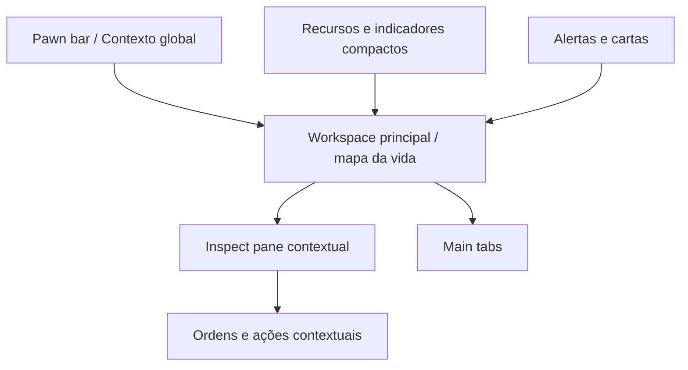

# Life Colony OS — RimWorld UI Style System

**Documento:** especificação visual, biblioteca de componentes e guia de implementação Flutter  
**Status:** normativo  
**Versão:** 1.1.0  
**Data:** 2026-08-07  
**Integra com:** `LIFE_COLONY_OS_SPEC.md`, `LIFE_COLONY_OS_MUSIC_ATLAS_SPEC.md` e `LIFE_COLONY_OS_IGNITION_ENGINE_SPEC.md`  
**Audiência:** produto, design, engenharia Flutter, ilustração, QA e agentes de IA responsáveis pela implementação  
**Contexto:** exercício de fidelidade visual. O alvo é a UI de RimWorld ficar **igual**, não “inspirada”.

---

## 0. Propósito

Este documento define, com precisão executável, como reproduzir no **Life Colony OS** a interface de RimWorld: utilitária, densa, escura, hierárquica, tátil e orientada a estados.

**Objetivo:** paridade visual e interacional com a UI vanilla de RimWorld. Mesmas cores, mesmas margens, mesma densidade, mesmos estados, mesma anatomia de painéis. O conteúdo muda (vida civil em vez de colônia sci-fi); o chrome, a tipografia e o comportamento da UI devem parecer o jogo.

Este spec substitui a interpretação genérica de “tema escuro industrial” do documento mestre por um sistema concreto:

- paleta ancorada em constantes do jogo e amostragem de screenshots;
- dimensões, margens, bordas e estados iguais às do vanilla;
- regras para texturas e 9-slice no estilo dos atlases `UI/Widgets`;
- tipografia Calibri/Arial (equivalente métrico no Flutter);
- anatomia das telas e componentes;
- aplicação a saúde, finanças, música, aprendizado e mobilização;
- arquitetura Flutter;
- pipeline de assets;
- testes visuais e critérios de aceite.

> **Regra central:** se uma captura do app for colocada ao lado de uma captura de RimWorld (mesma resolução, UI scale 1), a diferença deve ser só o conteúdo de domínio — não a moldura, a paleta, a densidade nem os estados.

---

## 1. Resultado visual desejado

Ao abrir o aplicativo, o usuário deve sentir que está diante de RimWorld com outro domínio:

1. uma colônia viva, não de um dashboard SaaS;
2. um sistema que mostra estado operacional, não métricas de vaidade;
3. uma interface feita para decisões frequentes, não para apresentações;
4. uma ferramenta com superfícies físicas, encaixadas e robustas;
5. uma grande quantidade de informação organizada por proximidade, alinhamento e repetição;
6. uma experiência séria, porém não militarista, cyberpunk ou corporativa;
7. um espaço em que cada alerta abre diretamente o contexto resolvível;
8. um sistema que aceita complexidade sem virar visualmente caótico.

### 1.1 Teste de reconhecimento

Uma captura do app deve transmitir imediatamente:

- “isso é RimWorld”;
- inspect pane;
- prioridades e necessidades;
- painéis escuros encaixados;
- mundo/workspace persistente ao fundo;
- ações contextuais e alertas laterais.

Se a captura parecer um app de banco, Notion, Linear, Material Design, um RPG mobile, um HUD sci-fi genérico ou um “tema escuro inspirado”, a implementação falhou.

---

## 2. Paridade com RimWorld

### 2.1 O que deve ficar igual

- hierarquia por painéis escuros;
- bordas duras e bevel do atlas de botão/janela;
- densidade informacional;
- inspect pane persistente;
- tabelas de prioridades e agenda;
- alertas em pilha;
- main tabs na borda inferior;
- retratos funcionais de entidades;
- barras horizontais de necessidade;
- menus contextuais compactos;
- botões quadrados de ação (gizmos/designators);
- amarelo puro no mouseover de opções;
- três níveis tipográficos (Tiny / Small / Medium);
- movimento mínimo;
- constantes de layout: margem 18, footer 55, close 120×40, quick search 240×24, list separator 25.

### 2.2 O que muda

Só o domínio e o conteúdo:

- labels e entidades de Life Colony OS (saúde, finanças, música, etc.);
- touch targets e layout responsivo quando o desktop vanilla não cabe;
- acessibilidade (focus, text scale, reduce motion) sem alterar a aparência em escala 100%;
- nomes internos Flutter `Colony*` (APIs do app; visualmente o chrome é RimWorld).

### 2.3 Estratégia

- tokens de produção = valores do jogo (não “aproximações criativas”);
- texturas 9-slice no mesmo tratamento visual dos atlases vanilla;
- ícones no mesmo tamanho e stroke dos widgets do jogo;
- tipografia: Tiny ≈ Calibri; Small/Medium ≈ Arial;
- `assets/reference/` guarda screenshots e contact sheets para diff visual.

---

## 3. Metodologia de pesquisa

A especificação separa evidências em quatro classes para não misturar constantes do jogo, amostragem e decisões de domínio.

### 3.1 Classe A — constantes do jogo

Valores em `Verse.Widgets`, `Verse.Window`, `Verse.Text` (referência comunitária decompilada):

| Constante | Valor |
|---|---|
| `Window.StandardMargin` | `18` |
| `Window.FooterRowHeight` | `55` |
| `Window.CloseButSize` | `120 × 40` |
| `Window.QuickSearchSize` | `240 × 24` |
| `Widgets.ListSeparatorHeight` | `25` |
| `Widgets.LightHighlight` | branco @ **4%** |
| `Widgets.AltTexture` | branco @ **5%** |
| `Widgets.NormalOptionColor` | `Color(0.8, 0.85, 1)` → `#CCD9FF` |
| `Widgets.MouseoverOptionColor` | `Color.yellow` → `#FFFF00` |
| `Widgets.SeparatorLabelColor` | `#CCCCCC` |
| `Widgets.SeparatorLineColor` | `#4D4D4D` |
| `Widgets.WindowBGFillColor` | `ColorInt(21, 25, 29)` → `#15191D` |
| `Widgets.WindowBGBorderColor` | `ColorInt(97, 108, 122)` → `#616C7A` |
| `Widgets.MenuSectionBGFillColor` | `ColorInt(42, 43, 44)` → `#2A2B2C` |
| `Widgets.MenuSectionBGBorderColor` | `ColorInt(135, 135, 135)` → `#878787` |
| `Widgets.BarFullTexHor` | `Color(0.2, 0.8, 0.85)` → `#33CCD9` |
| `Widgets.OptionUnselectedBGFillColor` | `Color(0.21, 0.21, 0.21)` → `#363636` |
| `Widgets.OptionSelectedBGFillColor` | `Color(0.32, 0.28, 0.21)` → `#524735` |
| `Widgets.InactiveColor` | `Color(0.37, 0.37, 0.37, 0.8)` |
| `Text` Tiny / Small / Medium | `Calibri_tiny` / `Arial_small` / `Arial_medium` |
| `Text.SmallFontHeight` | `22` |
| Botões | atlases `ButtonBG`, `ButtonBGMouseover`, `ButtonBGClick` |

Esses valores são a fonte normativa da paleta e das dimensões.

### 3.2 Classe B — medidas de screenshots

Capturas públicas e amostragem comunitária (ex.: wiki User:Pangaea) calibram texturas e regiões sem constante explícita:

- botão ocre ≈ `#6A512E`, texto de botão ≈ `#DFDDDB`;
- sleep schedule ≈ `#33337F`;
- anything/unrestricted ≈ `#808080`;
- superfícies de health/bio/needs alinhadas a `#15191D` / `#2A2B2C`;
- proporção de painéis, main tabs e células.

Compressão e versão do jogo alteram amostragem; em conflito, **Classe A vence**.

### 3.3 Classe C — padrões comunitários

Mods como RimHUD, UI Not Included, Dubs Mint Menus, Better Pawn Control e Work Tab mostram como o chrome vanilla se comporta sob densidade extrema. Usar como referência de layout, não como skin alternativa.

### 3.4 Classe D — decisão Life Colony OS

Só o que o jogo não define porque o domínio é outro:

- tokens semânticos de saúde e finanças além do palette de status vanilla;
- comportamento mobile / touch;
- acessibilidade;
- nomenclatura dos componentes Flutter;
- conteúdo de retratos do usuário;
- integração com Atlas Musical e Motor de Ignição.

---

## 4. Atlas de referência visual


### 4.1 O que observar na referência A — Schedule

- painel extenso ancorado na base;
- células pequenas repetidas em grade;
- labels de linha à esquerda e horas no topo;
- cores reservadas para categorias, não para decoração;
- bordas finas entre células;
- botão grande de gestão inserido na própria superfície;
- main tabs separadas do painel, na extremidade inferior;
- o mundo continua visível acima e ao lado.

### 4.2 O que observar na referência B — Work

- prioridade expressa em células numéricas compactas;
- labels verticais ou estreitos para economizar largura;
- alto contraste apenas nos conflitos e extremos;
- linhas alternadas muito sutis;
- ausência de cards individuais por pessoa;
- instrução contextual inserida no cabeçalho da tabela;
- densidade aceita como parte da identidade.

### 4.3 O que observar na referência C — Pawn/Character

- janela central com fundo cinza grafite;
- grupos divididos por alinhamento e espaços, não por dezenas de cards;
- retrato pequeno, porém reconhecível;
- skills em coluna, com valores e marcadores mínimos;
- condições de saúde em texto;
- botões ocres/dourados, sem gradientes modernos;
- título simples e discreto.

### 4.4 O que observar na referência D — Architect

- inspect pane pequeno no canto inferior esquerdo;
- categorias em botões retangulares densos;
- ações em designators quadrados;
- main tabs em toda a largura inferior;
- alertas empilhados na direita;
- recursos no topo/esquerda;
- retratos de pawns no topo central;
- o conteúdo principal ocupa quase toda a tela.

---

## 5. Princípios visuais normativos

### 5.1 Conteúdo primeiro

A interface não deve chamar mais atenção do que o estado que representa. Borda, textura, sombra e cor existem para:

- agrupar;
- separar;
- indicar interatividade;
- representar hierarquia;
- sinalizar mudança;
- conservar contexto.

### 5.2 Materialidade austera

Cada superfície deve parecer:

- pintada ou anodizada;
- usada, mas não enferrujada;
- industrial, mas civil;
- escura, porém legível;
- construída por camadas físicas.

Evitar vidro, blur, glow neon, transparência excessiva e gradientes de marketing.

### 5.3 Densidade deliberada

Densidade é parte da estética. Não converter automaticamente tudo em cards espaçosos. Tabelas, listas, barras e células são preferidas quando permitem comparar várias entidades.

### 5.4 Hierarquia pela caixa

A hierarquia deve vir, nesta ordem, de:

1. posição;
2. contorno;
3. superfície;
4. espaçamento;
5. tipografia;
6. cor semântica.

Não resolver hierarquia apenas aumentando fonte ou saturação.

### 5.5 Cor como evento

Em repouso, a interface é quase monocromática. Cores fortes aparecem quando algo:

- está selecionado;
- exige ação;
- representa uma categoria operacional;
- cruza um limiar;
- mostra progresso;
- é um link ou comando contextual.

### 5.6 Persistência espacial

Elementos importantes mantêm posições previsíveis:

- pawn/identidade no topo;
- navegação principal na base em desktop;
- recursos/resumos na esquerda;
- alertas na direita;
- inspect pane no canto ou lateral;
- workspace ao centro.

### 5.7 Pouca animação

A interface responde rapidamente, sem coreografias. O feedback deve parecer mecânico:

- highlight aparece;
- botão afunda 1–2 px;
- painel abre de modo curto;
- carta entra e permanece;
- barra muda apenas quando o dado muda.

---

## 6. Anatomia macro da aplicação



### 6.1 Desktop padrão

- `TopPawnBar`: 56–88 dp, central ou alinhada ao contexto;
- `ResourceReadout`: 88–180 dp de largura;
- `AlertStack`: 260–420 dp;
- `InspectPane`: 360–560 dp de largura e 220–520 dp de altura;
- `MainTabBar`: 48–64 dp;
- `Workspace`: todo o restante.

### 6.2 Aplicação no Life Colony OS

O “mapa” não precisa ser um cenário ilustrado literal. Pode ser:

- mapa de domínios de vida;
- timeline operacional;
- colônia abstrata;
- grafo do Atlas Musical;
- árvore de pesquisa;
- agenda;
- painel financeiro;
- visão de saúde.

A moldura global deve permanecer consistente entre módulos.

---

## 7. Paleta


### 7.1 Camadas de verdade

- `source.*`: constante do jogo (normativa);
- `observed.*`: amostragem de screenshot / wiki (calibração);
- `production.*`: o que o app consome — **igual a `source`/`observed`**, sem “suavizar” nem reinventar.

Em conflito, `source` > `observed` > opinião.

### 7.2 Superfícies de produção

```yaml
production:
  surface:
    void: "#080C10"          # amostragem: fundo de tabelas densas (Work)
    window: "#15191D"        # Widgets.WindowBGFillColor ColorInt(21,25,29)
    panel: "#2A2B2C"         # Widgets.MenuSectionBGFillColor ColorInt(42,43,44)
    raised: "#2B2C2D"        # observado: tabs / headings (Pangaea)
    optionUnselected: "#363636"  # Widgets.OptionUnselectedBGFillColor
    optionSelected: "#524735"    # Widgets.OptionSelectedBGFillColor
    tab: "#182028"           # observado: main tabs
    hoverOverlay: "#FFFFFF0D"    # ≈ AltTexture 5%
    lightHighlight: "#FFFFFF0A"  # Widgets.LightHighlight 4%
    scrim: "#000000A8"
    needsBar: "#33CCD9"      # Widgets.BarFullTexHor Color(0.2,0.8,0.85)
    tutorFill: "#85552C"     # Widgets.TutorWindowBGFillColor
    tutorBorder: "#B08B3D"   # Widgets.TutorWindowBGBorderColor
```

#### `surface.void`

Uso: interior de barras vazias, campos profundos, fundo de tabelas densas, áreas sem conteúdo. Não usar como fundo único de todas as telas.

#### `surface.window`

Uso: janelas, inspect panes, cartas, tooltips grandes, drawers. É o fill oficial `#15191D`.

#### `surface.panel`

Uso: seção de menu (`MenuSection`), linha elevada, controle, célula, category button. Fill oficial `#2A2B2C`.

#### `surface.raised`

Uso: tab ativa, cabeçalho interno, retrato, opção selecionada visualmente elevada.

#### `surface.tab`

Uso: main tab inativa, barras de navegação, abas compactas, rodapés.

### 7.3 Bordas

```yaml
production:
  border:
    outer: "#05080B"
    dark: "#1B2125"
    standard: "#616C7A"      # Widgets.WindowBGBorderColor ColorInt(97,108,122)
    highlight: "#878787"     # Widgets.MenuSectionBGBorderColor ColorInt(135,135,135)
    selected: "#D5D8D4"
    focus: "#CCD9FF"         # NormalOptionColor
    separator: "#4D4D4D"     # Widgets.SeparatorLineColor
```

A maioria das superfícies usa o tratamento do atlas vanilla:

1. sombra externa dura;
2. contorno `#616C7A` (janela) ou `#878787` (menu section);
3. highlight superior/esquerdo de 1 px vindo da textura;
4. bevel escuro inferior/direito de 1–2 px.

### 7.4 Texto

```yaml
production:
  text:
    primary: "#E6E6E6"       # observado (Pangaea / UI text)
    secondary: "#E1E1E1"
    muted: "#BDBEBE"
    separatorLabel: "#CCCCCC" # Widgets.SeparatorLabelColor
    disabled: "#5E5E5ECC"    # Widgets.InactiveColor 0.37@0.8
    inverse: "#101316"
    option: "#CCD9FF"        # Widgets.NormalOptionColor
    mouseover: "#FFFF00"     # Widgets.MouseoverOptionColor = Color.yellow
    button: "#DFDDDB"        # observado: texto sobre botão ocre
```

`text.mouseover` só no hover de opções/menus. Nunca em labels estáticos.

### 7.5 Ação dourada (botão ocre)

```yaml
production:
  action:
    base: "#6A512E"          # ButtonBG.png centro (amostrado)
    hover: "#886432"         # ButtonBGMouseover.png centro
    pressed: "#624927"       # ButtonBGClick.png centro
    border: "#8F7C5F"        # bevel claro observado
    disabled: "#2B2D2D"
```

Assets locais:

- vanilla (gitignored): `docs/produto/assets/reference/rimworld_vanilla/`
- produção redistribuível: `packages/colony_design_system/assets/ui/chrome/`
- fontes OFL: `packages/colony_design_system/assets/fonts/` (Arimo ≈ Arial, Carlito ≈ Calibri)

Uso: botões decisivos em janelas, confirmação, close button texturado. Ações comuns usam botões grafite do mesmo atlas em tom neutro.

### 7.6 Status

```yaml
production:
  status:
    good: "#70C46E"
    warning: "#D6B54A"
    risk: "#D47B48"
    critical: "#C83832"
    info: "#6FA9C2"
    unknown: "#7D8383"
    needsFill: "#33CCD9"     # mesma cor da barra horizontal vanilla
```

Todo status inclui no mínimo dois canais (cor + texto/ícone/padrão/posição).

### 7.7 Cores de agenda

Cores vanilla / amostradas da Schedule tab:

```yaml
production:
  schedule:
    anything: "#808080"      # observado: unrestricted / Anything (Pangaea)
    work: "#77783A"          # observado: Work
    sleep: "#33337F"         # observado: Sleep (Pangaea #33337F)
    recreation: "#715A78"    # observado: Joy/Recreation
    meditate: "#1A3434"      # observado: neutral/meditate family (Pangaea)
    focus: "#4EABB8"
    health: "#597748"
    social: "#7A5B4A"
    travel: "#8C743A"
```

Alias `flexible` → `anything`. Cores dessaturadas; a agenda é matriz operacional, não calendário infantil.

### 7.8 Overlays oficiais

```yaml
source:
  overlay:
    lightHighlight: "white @ 4%"   # Widgets.LightHighlight
    alternatingRow: "white @ 5%"   # Widgets.AltTexture
  text:
    option: "#CCD9FF"
    mouseover: "#FFFF00"
    separatorLabel: "#CCCCCC"
    separatorLine: "#4D4D4D"
```

Esses overlays são o que faz a UI parecer viva com tons quase iguais: diferença por opacidade branca, não por matiz novo.

### 7.9 Regras de contraste

- corpo de texto: alvo mínimo WCAG AA quando possível sem alterar a paleta vanilla;
- amarelo de hover só sobre fundo escuro (como no jogo);
- tema alto contraste é opt-in e não redefine o tema default.

### 7.10 Tema de alto contraste

```yaml
highContrast:
  surface.window: "#0E1114"
  border.standard: "#6F777A"
  border.highlight: "#A3A8A8"
  text.primary: "#FFFFFF"
  text.secondary: "#E2E4E2"
  text.muted: "#BFC3C1"
```

Sem tema claro no MVP. Tema claro futuro não é inversão automática.

---

## 8. Tipografia

### 8.1 O que o jogo usa

RimWorld carrega três fontes embutidas (`Verse.Text`):

| GameFont | Asset | Altura de linha útil |
|---|---|---|
| Tiny | `Fonts/Calibri_tiny` | menor |
| Small | `Fonts/Arial_small` | `SmallFontHeight = 22` |
| Medium | `Fonts/Arial_medium` | maior |

O reconhecimento vem de:

- Calibri (tiny) + Arial (small/medium);
- alto aproveitamento horizontal;
- baixo contraste de pesos;
- alinhamento superior esquerdo padrão;
- labels curtos;
- hierarquia de só três degraus;
- zero display fonts decorativas.

### 8.2 Família de produção

Alvo: métrica e aparência iguais às do jogo.

```yaml
typography:
  familyTiny: "Carlito"      # OFL, métrica Calibri (GameFont.Tiny)
  familyPrimary: "Arimo"     # OFL, métrica Arial (GameFont.Small/Medium)
  familyFallback:
    - "Arial"
    - "Calibri"
    - "Liberation Sans"
    - "sans-serif"
```

Bundle em `packages/colony_design_system/assets/fonts/`. Vanilla extrai `Calibri_tiny` / `Arial_tiny` (local, gitignored) para calibração. Não usar terminal, pixel art, monospace ou stencil como família principal.

### 8.3 Escala tipográfica

A escala é compacta e usa poucos degraus.

| Token | Desktop | Mobile | Peso | Uso |
|---|---:|---:|---:|---|
| `tiny` | 10–11 sp | 12 sp | 400 | metadata, horas, microlabels |
| `small` | 13–14 sp | 14–15 sp | 400 | corpo principal, células |
| `smallStrong` | 13–14 sp | 14–15 sp | 600 | labels, valores |
| `medium` | 18–20 sp | 18–20 sp | 500–600 | títulos de painel |
| `title` | 23–26 sp | 22–24 sp | 600 | janela ou entidade |
| `display` | 30–36 sp | 28–32 sp | 600 | uso raro, estado central |

### 8.4 Line height

```yaml
lineHeight:
  tiny: 1.10
  small: 1.18
  medium: 1.14
  title: 1.08
```

Evitar `1.5` como padrão de UI; produz aparência editorial moderna e reduz densidade.

### 8.5 Tracking

- corpo: `0` a `0.1 px`;
- títulos uppercase: `0.4–0.8 px`;
- números: `0`;
- botões: `0–0.2 px`;
- nunca usar tracking amplo de dashboard premium.

### 8.6 Alinhamento

- labels e parágrafos: superior esquerdo;
- inputs de uma linha: centro vertical, esquerda;
- valores numéricos: direita;
- títulos de main tab: centro;
- tooltip: superior esquerdo;
- botões: centro;
- células de prioridade: centro.

### 8.7 Números

Ativar:

- `FontFeature.tabularFigures()`;
- casas decimais consistentes por coluna;
- sinais `+` e `−` explícitos em modificadores;
- separadores locais conforme idioma;
- alinhamento por unidade.

### 8.8 Regras de truncamento

- tabelas: ellipsis em uma linha com tooltip;
- títulos de janela: máximo duas linhas apenas em mobile;
- main tabs: nunca truncar sem estratégia alternativa;
- alertas: uma ou duas linhas, detalhe ao abrir;
- nomes de entidades: permitir 2 linhas no inspect pane;
- não reduzir fonte dinamicamente abaixo do mínimo para “caber”.

### 8.9 Texto em português

Português exige mais largura que inglês. Portanto:

- labels de tabela podem ter abreviação explicitamente definida;
- tooltip mostra termo completo;
- usar verbos curtos em botões;
- evitar “Gerenciamento de...” quando “Gerir” resolve;
- categorias podem quebrar em duas linhas;
- não traduzir `pawn` na UI pública se o conceito for parte do produto; usar “Você”, “Pessoa” ou “Colono” conforme contexto.

---

## 9. Geometria e densidade

### 9.1 Grid base

```yaml
geometry:
  baseGrid: 4
  halfGrid: 2
  strokeThin: 1
  strokeStandard: 2
  strokeOuter: 3
  radiusNone: 0
  radiusMicro: 1
  radiusSmall: 2
```

Quase todas as dimensões devem ser múltiplas de 4, exceto linhas e offsets de pixel.

### 9.2 Constantes de referência e adaptação

| Elemento | Referência analisada | Produção desktop | Produção touch |
|---|---:|---:|---:|
| margem interna de janela | 18 | 18–20 | 20–24 |
| rodapé de janela | 55 | 56 | 64–72 |
| botão de fechar | 120×40 | 120×40 | 136×48 |
| busca rápida | 240×24 | 240×28 | 100%×44 |
| separador de lista | 25 | 24–28 | 32 |
| gizmo principal | 75×75 | 72–76 | 72–80 |
| ability compacta | 36×36 | 36 | 44–48 hitbox |
| checkbox | 24×24 | 24 | 32 visual / 44 hitbox |
| slider handle | ~12 | 12–16 | 20 visual / 44 hitbox |

A fidelidade desktop não justifica alvos de toque pequenos. No mobile, o visual pode permanecer 24 px, mas a hitbox deve ter 44–48 dp.

### 9.3 Raios

- janela: 0–2 px;
- botão: 0–2 px;
- tooltip: 0–2 px;
- carta: 0–2 px;
- portrait frame: 0–2 px;
- chip excepcional: máximo 4 px;
- nunca 12, 16, 24 ou “pill”.

### 9.4 Espaçamento

```yaml
spacing:
  xxs: 2
  xs: 4
  sm: 8
  md: 12
  window: 18
  lg: 24
  xl: 32
```

`12` e `18` são os espaços mais característicos. Evitar excesso de 24–32 dentro de tabelas.

### 9.5 Alturas de linha

| Densidade | Desktop | Touch | Uso |
|---|---:|---:|---|
| ultra | 22–24 | proibida | metadata técnica |
| compacta | 28–32 | 40–44 | work, finance, listas |
| normal | 36–40 | 44–52 | settings, health |
| confortável | 48–56 | 56–64 | onboarding e ações críticas |

### 9.6 Colunas

Tabelas usam largura derivada do conteúdo, não grid de cards. Ordem de prioridade:

1. label principal cresce;
2. valores têm largura fixa;
3. ícones têm largura fixa;
4. metadata colapsa;
5. ações migram para menu contextual;
6. somente então surge scroll horizontal.

### 9.7 Pixel snapping

- alinhar linhas de 1 px ao pixel físico;
- converter coordenadas lógicas usando `devicePixelRatio`;
- evitar transformações fracionárias em bordas;
- desabilitar filtragem em sprites de borda;
- testar 1×, 1.25×, 1.5×, 2× e 3×;
- golden tests devem detectar blur de borda.

---

## 10. Superfícies, textura e 9-slice


### 10.1 Por que 9-slice é obrigatório

Uma `BoxDecoration` plana aproxima as cores, mas não reproduz a materialidade. O sistema precisa de:

- cantos que não distorcem;
- bordas que se repetem;
- highlights internos consistentes;
- centro que expande;
- estados de botão visualmente distintos.

### 10.2 Anatomia da textura de painel

Atlas recomendado (mesmo tratamento do `ButtonBG` / window bg vanilla):

```text
panel_base.9.png
36 × 36 px em 1×
centerSlice: Rect.fromLTWH(12, 12, 12, 12)
```

Camadas:

1. 2–3 px externos quase pretos;
2. 1 px claro no topo/esquerda;
3. 1–2 px escuros embaixo/direita;
4. centro grafite;
5. ruído de luminância ±2–4;
6. variação ampla extremamente sutil.

### 10.3 Textura de ruído

- opacidade efetiva: 1–2%;
- tamanho mínimo de grão: 1 px em 1×;
- não repetir padrão óbvio em blocos menores que 128 px;
- não usar foto de metal;
- não usar scratches chamativos;
- desativável em modo de alto contraste;
- não aplicar ao texto ou barras quantitativas.

### 10.4 Sombra

```yaml
shadow:
  offset: [5, 6]
  blur: 0-2
  spread: 0
  color: "#00000080"
```

A sombra é dura. Blur grande torna a interface moderna demais.

### 10.5 Painel encaixado

Um painel dentro de janela pode inverter o bevel:

- topo/esquerda escuros;
- inferior/direita um pouco mais claros;
- fundo `surface.void` ou `surface.panel`;
- transmite cavidade.

### 10.6 Estados de botão

Assets separados:

```text
button_text_normal.9.png
button_text_hover.9.png
button_text_pressed.9.png
button_text_disabled.9.png
```

Não gerar hover apenas com alteração de opacidade. O estado deve mudar:

- superfície;
- contorno;
- highlight;
- offset do conteúdo;
- opcionalmente cor do texto.

### 10.7 Pressed

- deslocar conteúdo 1–2 px para baixo;
- reduzir highlight superior;
- escurecer o centro;
- remover ou reduzir sombra externa;
- feedback de 60–90 ms.

### 10.8 Hover

- elevar luminância do centro em 8–14%;
- borda opcionalmente amarela em ações pequenas;
- links mudam de `option` para amarelo;
- não aplicar glow.

### 10.9 Seleção

Seleção persistente não é hover. Deve usar:

- borda clara contínua;
- fundo ligeiramente elevado;
- estado de ícone;
- marcador lateral ou inferior quando necessário.

---

## 11. Iconografia

### 11.1 Direção

Ícones devem parecer pictogramas de uma simulação:

- silhueta forte;
- poucos detalhes;
- leitura em 16–24 px;
- contorno escuro;
- preenchimento de 1–3 tons;
- perspectiva frontal ou isométrica simplificada;
- sem estilo de emoji;
- sem aparência de biblioteca Material.

### 11.2 Grades

```yaml
icons:
  micro: 16
  standard: 24
  resource: 32
  designation: 64
  gizmoVisual: 64
  gizmoFrame: 75
  large: 128
```

A wiki cataloga widgets em 24×24, 36×36 e 75×75, e designações em 64×64. Usar esses tamanhos como escala normativa.

### 11.3 Stroke

- 1 px em 16;
- 1.5–2 px em 24;
- 2–3 px em 64;
- contorno externo mais escuro que o interior;
- detalhes internos devem sobreviver ao downscale.

### 11.4 Cor

- inativo: branco acinzentado ou cinza;
- ativo: cor semântica moderada;
- bloqueado: `text.disabled`;
- perigoso: vermelho apenas no símbolo crítico;
- selecionado: frame claro, não recolorir tudo.

### 11.5 Famílias de ícones

Cobrir o domínio Life Colony no mesmo idioma visual dos widgets vanilla (stroke, fill, contraste):

- saúde;
- sono;
- foco;
- dinheiro;
- aprendizado;
- música;
- relações;
- casa;
- viagem;
- mobilização;
- pesquisa;
- cronologia;
- integração;
- privacidade;
- confiança de dados.

### 11.6 Regras de fidelidade

- marcador de afinidade/paixão: mesma leitura visual das chamas de skill (tamanho, cor, posição na célula);
- gizmos/ações: quadrados 75×75 (ou escala mobile equivalente) no estilo designator;
- alertas: mesma silhueta e hierarquia de cor dos letters/alerts;
- não misturar stroke icons e filled icons aleatoriamente;
- se o ícone vanilla existir para o conceito, replicar a silhueta — não inventar um pictograma Material.

---

## 12. Motion e som

### 12.1 Tempos

```yaml
motion:
  hoverIn: 70ms
  hoverOut: 90ms
  press: 60ms
  select: 100ms
  tooltipDelayDesktop: 350ms
  paneOpen: 140ms
  paneClose: 110ms
  letterEnter: 160ms
  routeTransition: 120ms
```

### 12.2 Curvas

- entrada: `Curves.easeOutCubic` ou linear curta;
- saída: `Curves.easeInCubic`;
- pressed: linear;
- evitar spring, bounce e overshoot.

### 12.3 Animações permitidas

- fade curto;
- slide de 8–16 px;
- depressão de botão;
- preenchimento de barra ao mudar valor;
- expansão de inspect pane;
- carta entrando na pilha;
- focus ring.

### 12.4 Animações proibidas

- confetti;
- moedas voando;
- partículas contínuas;
- pulso infinito;
- shimmer de loading em toda parte;
- gradientes animados;
- mascote saltando;
- score aumentando com roleta.

### 12.5 Som

O som é opcional e deve ter o mesmo caráter dos clicks/UI do jogo (curto, seco, pouca cauda). Família:

- clique seco de botão;
- pequeno impacto metálico abafado;
- abrir janela;
- fechar janela;
- carta de alerta;
- confirmação;
- erro;
- início de Mobilização.

Duração ideal: 40–250 ms (faixa dos UI sounds vanilla). Respeitar modo silencioso e preferências de acessibilidade.

---

## 13. Biblioteca visual resumida


A imagem é ilustrativa. As seções seguintes são normativas.

---

## 14. `ColonyWindow`

### 14.1 Responsabilidade

Contêiner para tarefas focadas que interrompem parcialmente o workspace: edição, detalhes profundos, confirmação, importação, configuração e criação.

### 14.2 Anatomia

```text
┌──────────────────────────────────────────┐
│ título                         [ações]   │
│──────────────────────────────────────────│
│                                          │
│ conteúdo com margem de 18–20             │
│                                          │
│──────────────────────────────────────────│
│ busca opcional       [CANCELAR] [OK]     │
└──────────────────────────────────────────┘
```

### 14.3 Tokens

```yaml
ColonyWindow:
  background: surface.window
  outerBorder: border.outer / 3px
  innerBorder: border.standard / 1px
  topLeftHighlight: border.highlight / 1px
  marginDesktop: 18
  marginTouch: 22
  footerHeightDesktop: 56
  footerHeightTouch: 68
  titleHeight: 28
  shadowOffset: [5, 6]
  radius: 1
```

### 14.4 Tamanhos

- mínimo desktop: 420 × 280;
- padrão: 720 × 560;
- detalhado: 980 × 720;
- máximo: viewport menos 24 dp em cada eixo;
- mobile: fullscreen ou sheet de 92–100% da altura;
- nunca abrir múltiplas janelas modais empilhadas além de duas.

### 14.5 Estados

- normal;
- focused;
- background-gray-out;
- busy;
- destructive confirmation;
- error within form;
- resizeable no desktop;
- draggable somente se fizer sentido.

### 14.6 Regras

- o título não precisa de barra ornamental separada;
- ações globais no canto superior direito devem ser discretas;
- o botão primário pode usar dourado;
- o botão fechar é texto, ícone ou ambos, mas não um “X” flutuante enorme;
- Escape fecha quando seguro;
- o estado de dados não salvos precisa ser explícito;
- o rodapé permanece visível em conteúdo rolável.

### 14.7 API Flutter

```dart
ColonyWindow(
  title: 'Editar protocolo de mobilização',
  width: 760,
  footer: ColonyWindowFooter(
    primary: ColonyButton.primary(label: 'Salvar'),
    secondary: ColonyButton.secondary(label: 'Cancelar'),
  ),
  child: const IgnitionProtocolForm(),
)
```

---

## 15. `ColonyPanel`

### 15.1 Uso

- inspect pane;
- seção de configuração;
- módulo persistente;
- lista;
- quadro de modificadores;
- caixa de descrição.

### 15.2 Variantes

```dart
enum ColonyPanelVariant {
  raised,
  inset,
  flat,
  overlay,
  critical,
}
```

### 15.3 Regras

- painéis não devem proliferar sem necessidade;
- no máximo três níveis de nesting visível;
- painéis irmãos compartilham alinhamento;
- títulos usam separador, não uma faixa colorida grande;
- `critical` adiciona marcador lateral e não recolore toda a superfície.

---

## 16. `ColonySectionHeader`

### 16.1 Anatomia

```text
LABEL DE SEÇÃO                            ação opcional
─────────────────────────────────────────────────────
```

### 16.2 Tokens

```yaml
height: 25
labelColor: "#CCCCCC"
lineColor: "#4D4D4D"
font: smallStrong
lineThickness: 1
labelBottomGap: 3
```

### 16.3 Uso

- skills;
- condições;
- necessidades;
- fontes;
- modificadores;
- grupos de preferências;
- categorias de pesquisa.

Não usar heading gigante para cada grupo.

---

## 17. `ColonyButton`

### 17.1 Variantes

- `primary`: dourado;
- `secondary`: grafite com borda;
- `subtle`: overlay de 4–5%;
- `link`: texto azul-claro;
- `danger`: grafite com borda/vermelho, nunca superfície toda vermelha por padrão;
- `icon`: frame quadrado;
- `gizmo`: ação 64–75 px.

### 17.2 Estados obrigatórios

```text
rest → hover → pressed → rest
rest → focus → pressed
rest → disabled
rest → loading
rest → selected
```

### 17.3 Dimensões

| Variante | Altura desktop | Altura touch | Padding horizontal |
|---|---:|---:|---:|
| compact | 28 | 40 | 8–12 |
| standard | 36–40 | 48 | 16 |
| window action | 40 | 48 | 20–28 |
| icon | 36 | 44 | 0 |
| gizmo | 75 | 76–84 | 0 |

### 17.4 Conteúdo

- verbos no infinitivo ou imperativo consistente;
- não usar texto longo;
- ícone à esquerda quando agrega leitura;
- atalhos à direita podem ser exibidos no desktop;
- loading preserva largura;
- disabled mostra razão em tooltip.

### 17.5 Pseudocódigo visual

```dart
AnimatedContainer(
  duration: const Duration(milliseconds: 80),
  transform: Matrix4.translationValues(0, pressed ? 1 : 0, 0),
  decoration: ColonyDecorations.button(state),
  child: ...,
)
```

O produto final deve preferir `centerSlice` com atlases no estilo vanilla em vez de reconstruir todas as bordas com `BoxDecoration` plana.

---

## 18. `ColonyGizmo`

### 18.1 Conceito

Botão quadrado de comando contextual, na densidade e escala dos designators vanilla. Deve representar ações concretas:

- iniciar mobilização;
- registrar despesa;
- adicionar descoberta musical;
- iniciar sessão de estudo;
- marcar waypoint;
- criar projeto de pesquisa;
- iniciar foco;
- planejar viagem.

### 18.2 Anatomia

```text
┌───────────┐
│           │
│   icon    │
│           │
│ label  1  │
└───────────┘
```

- frame: 72–76 px;
- icon: 40–52 px;
- label: 10–12 sp, máximo duas linhas;
- badge: canto superior direito;
- hotkey: canto superior esquerdo;
- cooldown/progresso: overlay preenchido;
- disabled: desaturado + motivo.

### 18.3 Quantidade

- desktop: 5–12 visíveis;
- mobile: 3–5 visíveis, restante em drawer;
- ordenar por relevância contextual, não alfabeticamente;
- manter posição estável durante uma sessão para evitar erro motor.

---

## 19. `ColonyMainTabBar`

### 19.1 Papel

Navegação de primeiro nível. Em desktop, deve ficar no rodapé para preservar a silhueta de management sim.

### 19.2 Estrutura recomendada

```text
COLÔNIA | TRABALHO | AGENDA | RECURSOS | SAÚDE | ATLAS | PESQUISA | CRÔNICA | MAIS
```

`RECURSOS` pode conter Finanças, Casa, Viagens e inventário pessoal. `MAIS` recebe módulos menos frequentes.

### 19.3 Regras de lotação

- 6–9 tabs no desktop;
- máximo 5 destinos persistentes no mobile;
- não reduzir fonte abaixo de 13 sp para acomodar;
- usar agrupamento e menus, como demonstram mods que reduzem clutter;
- tab ativa usa superfície elevada e borda superior clara;
- tab com alerta usa pequeno marcador, não badge enorme.

### 19.4 Estados

- inactive;
- hover;
- active;
- attention;
- critical;
- disabled by feature flag;
- hidden by user preference.

### 19.5 Atalhos

- `F1...F8` configuráveis no desktop;
- `Ctrl+K` abre busca/comando;
- `Esc` retorna ao workspace;
- atalhos não aparecem no mobile.

---

## 20. `ColonySubTabs`

Usar dentro de inspect panes e janelas:

```text
Resumo | Saúde | Skills | Pensamentos | Registros
```

### 20.1 Forma

- retangulares;
- 32–44 px de altura;
- sem radius grande;
- borda compartilhada sempre que possível;
- ativa conectada visualmente ao conteúdo;
- scroll horizontal no mobile;
- setas ou fade indicam overflow.

---

## 21. `ColonyInspectPane`

### 21.1 Papel

É o componente mais importante do sistema. Exibe detalhes suficientes para entender a entidade selecionada sem abandonar o workspace.

### 21.2 Entidades suportadas

- o usuário/pawn;
- conta financeira;
- meta;
- hábito/protocolo;
- álbum, artista ou território musical;
- projeto;
- tarefa;
- viagem;
- pessoa;
- condição de saúde;
- fonte de dados;
- alerta;
- transação;
- sessão.

### 21.3 Anatomia

```text
┌─────────────────────────────────────────┐
│ ícone/retrato  nome              status │
│               subtítulo                 │
│─────────────────────────────────────────│
│ resumo / barras / propriedades          │
│                                         │
│ [Resumo] [Detalhes] [Registros]          │
│ conteúdo contextual                     │
│─────────────────────────────────────────│
│ ações rápidas              abrir completo│
└─────────────────────────────────────────┘
```

### 21.4 Variantes de layout

- `compact`: 320–380 px;
- `standard`: 420–520 px;
- `expanded`: 560–760 px;
- `floating`: usuário posiciona no desktop;
- `dockedLeft`, `dockedRight`, `dockedBottom`;
- `sheet` em mobile.

RimHUD mostra o valor de permitir pane redimensionável, floating e presets. O Life Colony OS deve adotar essa flexibilidade de forma controlada.

### 21.5 Conteúdo mínimo

- nome;
- tipo;
- estado atual;
- timestamp/freshness quando aplicável;
- origem dos dados;
- ação principal;
- acesso ao detalhe completo.

### 21.6 O que não colocar

- gráficos enormes;
- texto editorial longo;
- todos os campos disponíveis;
- settings permanentes;
- recomendações de IA sem provenance;
- métricas decorativas.

### 21.7 Alertas internos

Alertas críticos ficam próximos ao dado correspondente. Não usar banner global dentro do pane se o problema é uma barra específica.

---

## 22. `PawnPortrait`

### 22.1 Direção visual

Retratos no mesmo papel funcional dos pawn portraits:

- busto frontal simplificado;
- 3–5 camadas;
- cabeça, cabelo, roupa e acessório;
- contorno escuro;
- fundo quadrado grafite ou contextual;
- expressão discreta;
- proporção e enquadramento iguais aos do inspect pane / character card.

### 22.2 Tamanhos

- top bar: 40–56 px;
- inspect pane: 96–160 px;
- profile: 220–320 px;
- fallback: monograma + silhueta abstrata.

### 22.3 Estados no top bar

- selecionado: frame claro;
- alerta: pequeno canto colorido;
- atividade: ícone inferior;
- indisponível: overlay cinza;
- sincronizando: marcador discreto;
- jamais usar animação contínua de pulso.

### 22.4 Personalização

O usuário pode escolher:

- cabelo;
- roupa;
- fundo;
- acessórios;
- estilo de retrato;
- nível de abstração;
- ocultar retrato e usar símbolo.

---

## 23. `NeedBar`

### 23.1 Anatomia

```text
Sono              [██████████░░░░]  68%  operacional
```

### 23.2 Camadas

1. label;
2. rail profundo;
3. fill;
4. target band opcional;
5. threshold markers;
6. valor;
7. tendência;
8. freshness/provenance em tooltip.

### 23.3 Dimensões

```yaml
heightCompact: 16
heightStandard: 20
heightTouch: 24
border: 1
innerPadding: 2
labelWidthMin: 96
valueWidth: 44
```

### 23.4 Direção semântica

Nem toda barra é “mais é melhor”. Propriedade obrigatória:

```dart
enum NeedDirection {
  higherIsBetter,
  lowerIsBetter,
  targetBand,
  informational,
}
```

### 23.5 Valor desconhecido

Não preencher com zero. Renderizar:

- rail hachurado;
- label `sem dado`;
- provenance;
- ação opcional de conectar fonte.

### 23.6 Mudança

- não animar na abertura inicial por mais de 180 ms;
- mostrar delta apenas quando relevante;
- tooltip explica o intervalo;
- nunca representar diagnóstico médico.

---

## 24. `ModifierList`

### 24.1 Uso

Explica por que um estado mudou:

```text
Sono abaixo do esperado                     −12
Viagem próxima                               +5
Carga simultânea de projetos                 −7
Dado incompleto                               ?
```

### 24.2 Regras

- valores alinhados à direita;
- sinais explícitos;
- cor secundária, não saturação total;
- linhas alternadas em branco 5%;
- provenance no hover/tap;
- inferência marcada;
- fatores incertos não recebem número inventado;
- ordenação por impacto e recência configurável.

---

## 25. `PriorityGrid`

### 25.1 Uso

Traduz o Work tab para prioridades pessoais:

- trabalho;
- faculdade;
- saúde;
- casa;
- música;
- empresa;
- relações;
- manutenção;
- descanso.

### 25.2 Célula

Estados:

```text
blocked | auto | 1 | 2 | 3 | 4 | conflict | unavailable
```

- `1`: maior prioridade;
- `4`: menor prioridade ativa;
- `auto`: sistema decide dentro de limites;
- `blocked`: nunca agendar automaticamente;
- `conflict`: borda crítica, não novo número.

### 25.3 Interação desktop

- clique alterna;
- botão direito abre opções;
- drag pinta células;
- Shift aplica intervalo;
- Alt limpa;
- teclado navega por setas;
- `1–4` define prioridade.

### 25.4 Interação touch

- toque abre seletor compacto;
- long press inicia pintura;
- drag vertical/horizontal com preview;
- undo imediatamente disponível;
- haptic leve opcional.

### 25.5 Visual

- célula 32–40 desktop;
- 44–48 touch;
- fundo quase preto;
- número em tom areia;
- prioridade 1 pode usar amarelo;
- conflito usa contorno vermelho;
- zero não aparece.

---

## 26. `ScheduleGrid`

### 26.1 Estrutura

- linhas: dias, pessoas, rotinas ou contextos;
- colunas: intervalos de 30 ou 60 minutos;
- header: horas;
- grupos: manhã, tarde, noite;
- seleção: frame claro;
- categorias: cores dessaturadas.

### 26.2 Escalas

- 24 horas × 7 dias em desktop;
- dia por vez no mobile;
- zoom 15/30/60/120 min;
- sticky labels;
- sticky timeline;
- scroll sincronizado.

### 26.3 Diferença para calendário tradicional

A grade representa **modo esperado**, não necessariamente compromissos rígidos. Eventos do calendário podem aparecer em camada separada.

### 26.4 Motor de Ignição

Blocos podem conter waypoints e condições:

```text
07:30–08:00  Mobilização
  waypoint: dock do banheiro
  bundle: playlist matinal
  escudo: redes sociais
```

O detalhe abre no inspect pane, não dentro da célula.

---

## 27. `DenseTable`

### 27.1 Filosofia

O estilo depende de tabelas verdadeiras. Não converter uma tabela de 40 linhas em 40 cards.

### 27.2 Recursos

- sticky header;
- sticky first column;
- column resizing desktop;
- reorder opcional;
- sorting;
- filter/search;
- row selection;
- multi-select;
- keyboard navigation;
- virtualização;
- alternating overlay de 5%;
- row actions contextuais;
- compact/normal density.

### 27.3 Bordas

- não desenhar grade completa em todas as células por padrão;
- usar linha horizontal sutil;
- células operacionais podem ter borda individual;
- header com separador mais forte;
- hover de linha com overlay 4–5%.

### 27.4 Finanças

Colunas recomendadas:

```text
Data | Descrição | Conta | Categoria | Valor | Estado | Fonte
```

- valores negativos não precisam de vermelho se comuns;
- vermelho apenas para anomalia, atraso ou risco;
- valores monetários tabulares;
- seleção múltipla para categorizar.

### 27.5 Saúde

```text
Data | Métrica | Valor | Faixa | Tendência | Fonte | Confiança
```

Não usar verde/vermelho como diagnóstico.

---

## 28. `SkillRow`

### 28.1 Conteúdo

```text
Piano               12   [==== progress ====]   interesse alto
Flutter               8   [=====             ]   ativo
Culinária             4   [==                ]   explorando
```

### 28.2 Componentes

- label;
- nível discreto;
- progresso;
- interesse/afinidade;
- recência;
- ação de abrir trilha;
- evidências.

### 28.3 Marcador de afinidade

Usar a mesma leitura visual das chamas de paixão do skill panel: ícone pequeno à esquerda/direita do label, duas intensidades (minor/major), cor quente sobre o grafite da linha. Afinidade e proficiência continuam dimensões diferentes — só o marcador visual é o mesmo idioma do jogo.

---

## 29. `HealthConditionList`

### 29.1 Organização

```text
CORPO / SISTEMA
  Sono                     atenção
  Ombro direito            estável
  Energia                   variável

TRATAMENTOS / AÇÕES
  ...
```

### 29.2 Regras

- grupos por sistema ou contexto;
- severidade textual;
- localização quando aplicável;
- data e fonte;
- recomendações não substituem profissional;
- não usar body diagram copiado;
- produzir diagrama anatômico no estilo do health tab (opcional).

### 29.3 Privacidade

A UI deve permitir:

- modo discreto;
- ocultar detalhes em notificações;
- blur ao trocar de app;
- biometria por módulo;
- exportação seletiva.

---

## 30. `ColonyCheckbox`, `Radio` e `Toggle`

### 30.1 Checkbox

- visual 24×24 desktop;
- hitbox 44×44 touch;
- fundo profundo;
- borda clara;
- check verde-claro ou branco (como no jogo);
- estado indeterminado com traço horizontal;
- disabled com contraste suficiente.

### 30.2 Radio

- usar apenas quando opções são mutuamente exclusivas e todas visíveis;
- não estilizar como chip arredondado;
- círculo pode ser mantido, com contorno industrial.

### 30.3 Toggle

Toggles modernos em formato de pílula quebram a linguagem. Preferir:

- checkbox;
- botão `ATIVO / INATIVO` retangular;
- duas células segmentadas;
- ícone de estado.

---

## 31. `ColonyTextField`

### 31.1 Visual

- superfície inset;
- borda 1–2 px;
- altura 28–36 desktop;
- 44–48 touch;
- cursor e seleção em azul-claro;
- focus ring claro;
- label acima, não placeholder como única identificação;
- erro abaixo em vermelho moderado.

### 31.2 Busca

Busca rápida desktop pode ser compacta. No mobile, ocupa largura disponível.

### 31.3 IA/comando

O campo de comando não deve parecer chatbot. Deve ser:

```text
> Buscar ou emitir ordem…
```

Resultados divididos em:

- navegar;
- executar;
- registrar;
- consultar;
- criar.

---

## 32. `ColonyTooltip`

### 32.1 Papel

Tooltips são essenciais para manter densidade sem esconder explicação.

### 32.2 Anatomia

- título;
- explicação curta;
- valor/fórmula;
- fonte;
- atalho;
- ação opcional;
- max-width 360–480 desktop.

### 32.3 Timing

- 350 ms em controle comum;
- 100 ms ao atravessar itens da mesma lista após primeiro tooltip;
- fecha ao sair com grace period curto;
- fixável com clique/tecla;
- touch usa tap em ícone de informação ou long press.

### 32.4 Visual

- fundo mais escuro que janela;
- borda dupla;
- sombra dura;
- texto pequeno;
- sem balloon arrow grande;
- não usar blur.

---

## 33. `ColonyFloatMenu`

### 33.1 Uso

- ordens contextuais;
- opções de célula;
- mover para categoria;
- escolher prioridade;
- vincular entidade;
- selecionar protocolo;
- ações secundárias.

### 33.2 Estrutura

```text
Executar agora
Agendar…
────────────────
Vincular a projeto
Abrir detalhes
────────────────
Arquivar
```

### 33.3 Regras

- opções impossíveis podem ficar desabilitadas com motivo;
- opção perigosa fica separada;
- não exceder 14 itens sem submenus/busca;
- hover é overlay 5%;
- teclado e typeahead;
- fechar ao clicar fora;
- submenu abre com atraso curto.

---

## 34. `TimelineLetter`

### 34.1 Conceito

Uma carta é um acontecimento persistente na narrativa da vida, não uma notificação efêmera.

### 34.2 Severidades

- positive;
- neutral;
- info;
- attention;
- critical.

### 34.3 Anatomia

- faixa lateral de cor;
- severidade;
- título;
- resumo;
- timestamp;
- entidade relacionada;
- ação `ABRIR`;
- ações de resolver, adiar ou arquivar.

### 34.4 Exemplos

- “Primeiro mês com margem financeira positiva”;
- “Três noites consecutivas com sono reduzido”;
- “Expedição de jazz espiritual concluída”;
- “Prazo de prova dentro de sete dias”;
- “Rota matinal falhou em três contextos comparáveis”.

### 34.5 Narrativa

Texto gerado por IA deve ser marcado e nunca inventar fatos. A versão factual e as fontes permanecem acessíveis.

---

## 35. `AlertStack`

### 35.1 Diferença entre alerta e carta

- alerta: estado atual que pode demandar ação;
- carta: evento registrado na timeline.

### 35.2 Desktop

- pilha na direita;
- 3–7 alertas mais relevantes;
- texto alinhado à direita ou em painel compacto;
- clique abre contexto exato;
- agrupamento por causa;
- ícone discreto.

### 35.3 Mobile

- contador pequeno no top bar;
- drawer de alertas;
- críticos podem ocupar faixa breve;
- jamais bloquear toda abertura do app com alertas não críticos.

### 35.4 Priorização

```text
critical unresolved
> time-sensitive actionable
> degraded system/data
> attention
> informational
```

Alertas repetitivos devem ser deduplicados.

---

## 36. `ResourceReadout`

### 36.1 Tradução para a vida

Pode mostrar:

- tempo livre do dia;
- energia estimada;
- margem financeira;
- foco disponível;
- tarefas bloqueadas;
- compromissos próximos;
- sessões de estudo;
- expedições musicais ativas.

### 36.2 Regras

- 4–8 recursos no máximo;
- cada um abre detalhe;
- ícone + valor;
- label aparece no hover ou layout expandido;
- categorias colapsáveis;
- não reduzir a vida a uma moeda universal.

---

## 37. `TopPawnBar`

### 37.1 Possíveis entidades

Embora o app seja pessoal, a barra pode representar “agentes” ou frentes:

- Eu;
- Derrond;
- Faculdade;
- Música;
- Casa;
- Saúde;
- Viagem atual.

Esses não são pessoas fictícias; são contextos operacionais selecionáveis.

### 37.2 Interação

- clique seleciona contexto;
- double click abre detalhe;
- drag reordena em modo de edição;
- alerta aparece no frame;
- atividade atual em microlabel;
- limite visual de 8–12;
- overflow em grupo.

### 37.3 Cuidado conceitual

Não fragmentar a identidade do usuário de forma psicológica ou diagnóstica. Contextos são filtros de trabalho, não personalidades.

---

## 38. `DesignatorTray`

### 38.1 Papel

Bandeja de ações disponíveis no contexto atual.

### 38.2 Exemplo — Atlas Musical

```text
[Ouvir] [Registrar encontro] [Comparar] [Abrir expedição] [Criar ponte] [Praticar]
```

### 38.3 Exemplo — Finanças

```text
[Registrar] [Importar] [Categorizar] [Conciliar] [Planejar] [Exportar]
```

### 38.4 Exemplo — Motor de Ignição

```text
[Mobilizar] [Editar rota] [Marcar waypoint] [Ativar escudo] [Modo reduzido]
```

---

## 39. `ResearchTree`

### 39.1 Visual

- nós retangulares, não cards arredondados;
- linhas ortogonais ou suavemente curvas;
- grupos por era/domínio;
- estado locked/available/in-progress/completed;
- progresso inserido no nó;
- pré-requisitos legíveis;
- tooltip detalhado;
- zoom e pan.

### 39.2 Aplicação

- conhecimentos gerais;
- competências profissionais;
- culinária;
- teoria musical;
- arte e história;
- projetos técnicos;
- preparação de viagem.

### 39.3 Cor

- locked: cinza;
- available: borda azul-clara;
- active: dourado;
- complete: verde moderado;
- recommended: pequeno marcador, não glow.

### 39.4 Performance

- virtualizar nós fora do viewport;
- cachear paths;
- não redesenhar toda árvore a cada hover;
- semantics para navegação por teclado;
- lista alternativa acessível.

---

## 40. `MusicAtlasCanvas`

### 40.1 Integração estilística

O Atlas Musical não deve parecer um app externo. O grafo usa:

- fundo `surface.void`;
- nós com frame de painel;
- rótulos compactos;
- névoa de guerra por luminância e textura;
- rios históricos em linhas dessaturadas;
- seleção com frame claro;
- inspect pane padrão;
- designator tray para ouvir, comparar e registrar.

### 40.2 Estados de território

| Estado | Visual |
|---|---|
| desconhecido | silhueta baixa, label oculto ou parcial |
| avistado | contorno e label muted |
| ouvido | preenchimento mínimo |
| contextualizado | borda standard |
| conectado | conectores claros |
| internalizado | frame completo + pequeno selo |

### 40.3 Cuidado

Névoa não deve tornar texto essencial ilegível. Existe modo de lista e contraste elevado.

---

## 41. `IgnitionCommandScreen`

### 41.1 Ruptura controlada

Durante Mobilização, a interface reduz drasticamente a densidade. Ainda preserva materialidade:

```text
┌─────────────────────────────────────┐
│ MOBILIZAÇÃO  ·  PASSO 1 DE ?        │
│                                     │
│ COLOQUE OS DOIS PÉS NO CHÃO         │
│                                     │
│ [feito passivamente / aguardando]   │
│                                     │
│ ajuda   reduzir rota   sair seguro  │
└─────────────────────────────────────┘
```

### 41.2 Visual

- fundo quase preto;
- uma janela central ou fullscreen;
- texto grande, sem ilustração gamificada;
- progresso indeterminado quando o número de passos pode adaptar;
- próximo passo nunca visível antes da hora;
- botão de saída seguro sempre disponível;
- status do waypoint discreto;
- cor de ação apenas no comando atual.

### 41.3 Som e haptic

- início: confirmação curta;
- waypoint: click seco;
- falha de sensor: não usar som punitivo;
- conclusão: som positivo contido.

---

## 42. `FinanceColonyView`

### 42.1 Layout desktop

- recursos financeiros compactos à esquerda;
- tabela ou fluxo no centro;
- alertas de vencimento à direita;
- inspect pane de conta/transação;
- main tabs persistentes;
- designators para registrar, importar e conciliar.

### 42.2 Métricas

Evitar cards grandes para cada número. Preferir readout compacto:

```text
Caixa disponível       R$ X
Compromissos 30d        R$ Y
Margem projetada        R$ Z
Dados pendentes            14
```

### 42.3 Gráficos

Gráficos devem ser exceção e usar estética compatível:

- fundo inset;
- grid sutil;
- linhas sem glow;
- labels pequenos;
- tooltip industrial;
- sem gradiente de área decorativo;
- uma cor principal + status.

---

## 43. `HealthPawnView`

### 43.1 Layout

- retrato/diagrama à esquerda;
- necessidades e condições ao centro;
- modificadores e ações à direita;
- tabs Saúde, Sono, Energia, Exercício, Registros;
- fontes e consentimentos no rodapé técnico.

### 43.2 Linguagem

- “atenção”, “fora da faixa configurada”, “dado incompleto”;
- nunca “doente” ou diagnóstico automático;
- faixas personalizáveis;
- contexto e confiança visíveis.

---

## 44. `ChronicleView`

### 44.1 Visual

A Crônica é uma timeline de cartas:

- coluna vertical simples;
- cartas compactas;
- filtros por domínio;
- agrupamento por dia/mês/era;
- ícones originais;
- imagens opcionais em tamanho reduzido;
- inspect pane do evento.

### 44.2 Não fazer

- feed social;
- likes;
- reações;
- infinito sem marcos;
- card com radius grande;
- layout de Instagram.

---

## 45. Responsividade


### 45.1 Princípio

Responsividade preserva a **gramática**, não a posição literal.

### 45.2 Breakpoints funcionais

```yaml
breakpoints:
  compact: 0-599
  medium: 600-1023
  expanded: 1024-1439
  large: 1440+
```

Não usar apenas largura; considerar orientação, pointer e densidade.

### 45.3 Compact/mobile

- top bar simples;
- navegação de 4–5 destinos;
- main tabs restantes em menu;
- inspect pane como sheet full-height;
- designator tray horizontal;
- tabelas com sticky first column ou visão em lista densa;
- alertas em drawer;
- long press substitui clique direito;
- tooltips viram popovers fixáveis;
- targets de 44–48 dp.

### 45.4 Medium/tablet

- inspect pane no rodapé ou lateral;
- tabs inferiores completas em landscape;
- duas colunas em janelas;
- tabelas densas viáveis;
- hover pode ou não existir.

### 45.5 Expanded/desktop

- moldura completa;
- alertas laterais;
- inspect pane persistente;
- múltiplas tabelas;
- keyboard shortcuts;
- drag, resize e right click.

### 45.6 Desktop web

- impedir seleção acidental de texto em controles;
- preservar seleção em conteúdo textual;
- cursor semântico;
- scrollbars próprias;
- menu contextual do app suprime o browser apenas onde necessário;
- suporte a zoom 80–200%.

### 45.7 Mobile não deve virar RPG

Não transformar cada módulo em uma tela com ilustração de personagem, XP e botão grande. O estilo continua sendo gerencial e informacional.

---

## 46. Acessibilidade

### 46.1 Modo de densidade

O usuário escolhe:

- compacta;
- normal;
- ampliada.

Isso altera altura e padding, não a arquitetura.

### 46.2 Texto ampliado

- até 130%: preservar tabelas com scroll;
- 130–180%: reorganizar colunas secundárias;
- acima de 180%: apresentar versão linear acessível;
- nunca cortar labels essenciais.

### 46.3 Daltonismo

- padrões de preenchimento em agenda opcionais;
- ícones de estado;
- labels;
- paletas alternativas;
- prioridade numérica não depende de cor;
- alertas têm texto de severidade.

### 46.4 Leitor de tela

Cada componente precisa de semantics completos:

```text
“Foco, 42 por cento, abaixo da faixa desejada, tendência de queda,
atualizado há 20 minutos, fonte inferida.”
```

### 46.5 Teclado

- ordem de foco espacial;
- focus ring visível;
- setas em grids;
- Enter ativa;
- Espaço marca;
- Escape fecha;
- atalhos documentados;
- não prender foco.

### 46.6 Reduce motion

- remover slide;
- manter troca instantânea ou fade de 50 ms;
- sem barras animadas;
- cartas aparecem sem transição.

### 46.7 Modo discreto

- mascara valores financeiros;
- oculta dados de saúde;
- reduz texto de notificações;
- substitui retrato;
- atalho rápido de privacidade.

---

## 47. Arquitetura Flutter

### 47.1 Princípio

`ThemeData` sozinho não é suficiente. Criar uma biblioteca de chrome e componentes própria.

### 47.2 Estrutura

```text
lib/
  design_system/
    tokens/
      colony_colors.dart
      colony_spacing.dart
      colony_geometry.dart
      colony_typography.dart
      colony_motion.dart
    theme/
      colony_theme.dart
      colony_chrome.dart
      colony_density.dart
    surfaces/
      colony_surface.dart
      colony_window_frame.dart
      colony_inset.dart
      colony_nine_slice.dart
    components/
      buttons/
      tables/
      inspect/
      alerts/
      tabs/
      inputs/
      bars/
      grids/
      portraits/
      tooltips/
    icons/
    semantics/
    testing/
```

### 47.3 Theme extension

O pacote inclui `assets/tokens/colony_chrome.dart` como ponto de partida. O código deve ser movido para `lib/design_system/theme/` e ampliado.

### 47.4 Tokens imutáveis

Nenhum componente de feature deve conter HEX ou dimensão visual hardcoded.

Proibido:

```dart
Container(color: const Color(0xFF15191C))
```

Correto:

```dart
final chrome = Theme.of(context).extension<ColonyChrome>()!;
Container(color: chrome.windowSurface)
```

### 47.5 `ColonyDensity`

```dart
enum ColonyDensity { compact, normal, enlarged }

@immutable
class ColonyMetrics extends ThemeExtension<ColonyMetrics> {
  final double rowHeight;
  final double controlHeight;
  final double windowMargin;
  final double touchTarget;
  // ...
}
```

### 47.6 9-slice

Opções:

1. `DecorationImage(centerSlice: ...)`;
2. widget próprio com `paintImage`;
3. `CustomPainter` para fallback vetorial;
4. assets 1×/2×/3×.

Exemplo conceitual:

```dart
DecoratedBox(
  decoration: BoxDecoration(
    image: DecorationImage(
      image: const AssetImage('assets/ui/panel_base.png'),
      centerSlice: const Rect.fromLTWH(12, 12, 12, 12),
      fit: BoxFit.fill,
      filterQuality: FilterQuality.none,
    ),
  ),
  child: Padding(
    padding: const EdgeInsets.all(18),
    child: child,
  ),
)
```

Validar comportamento real de `centerSlice` em todos os targets Flutter antes de padronizar.

### 47.7 Pixel snapping helper

```dart
double snapToPhysicalPixel(BuildContext context, double logical) {
  final dpr = MediaQuery.devicePixelRatioOf(context);
  return (logical * dpr).round() / dpr;
}
```

Aplicar a strokes e posições de separadores.

### 47.8 Estados de interação

Usar `WidgetStateProperty` quando possível:

```dart
Color resolveText(Set<WidgetState> states) {
  if (states.contains(WidgetState.disabled)) return chrome.textDisabled;
  if (states.contains(WidgetState.hovered)) return chrome.mouseoverText;
  return chrome.textPrimary;
}
```

### 47.9 Pointer capabilities

```dart
final mouseLike = switch (MediaQuery.pointerDeviceKindOf(context)) {
  PointerDeviceKind.mouse || PointerDeviceKind.trackpad => true,
  _ => false,
};
```

Não depender de hover para descobrir ações em touch.

### 47.10 Overlays

Tooltips, float menus e cartas usam um serviço central:

```text
ColonyOverlayController
  showTooltip
  pinTooltip
  showFloatMenu
  showLetter
  showContextInspector
  dismissLayer
```

Evitar implementações independentes que criem z-index inconsistente.

### 47.11 Navegação

- desktop: rotas preservam workspace e seleção;
- inspect pane não é nova página por padrão;
- deep links abrem módulo + entidade + tab;
- back fecha overlay antes de sair da rota;
- mobile pode promover inspect pane a página.

### 47.12 Virtualização

Tabelas e árvores grandes precisam de:

- slivers;
- viewport-aware rendering;
- cache de medida de texto;
- repaint boundaries;
- seleção por IDs;
- diffs incrementais;
- evitar `IntrinsicWidth` em centenas de linhas.

### 47.13 Renderização de grafos

Atlas e Research Tree:

- `CustomPainter` para edges;
- widgets ou layers para nodes interativos;
- spatial index para hit testing;
- pan/zoom desacoplado do estado de domínio;
- semântica alternativa em lista;
- cache de layout.

### 47.14 Animação

Centralizar tempos em `ColonyMotion`. Features não inventam durações.

### 47.15 Som

Serviço:

```dart
abstract interface class ColonySoundService {
  Future<void> play(ColonySoundCue cue);
}
```

Respeitar volume, modo silencioso e reduce motion/sensory settings.

---

## 48. Assets de produção

### 48.1 Estrutura

```text
assets/
  ui/
    surfaces/
      panel_base.png
      panel_inset.png
      window_base.png
      tooltip_base.png
    buttons/
      text_normal.png
      text_hover.png
      text_pressed.png
      text_disabled.png
      gizmo_normal.png
      gizmo_hover.png
      gizmo_pressed.png
    controls/
      checkbox_off.png
      checkbox_on.png
      checkbox_mixed.png
      radio_off.png
      radio_on.png
      slider_rail.png
      slider_handle.png
    frames/
      portrait.png
      selected.png
      alert.png
    patterns/
      unknown_diagonal.png
      fog_noise.png
      warning_hatch.png
  icons/
    domains/
    actions/
    status/
    resources/
  portraits/
  audio/
```

### 48.2 Nomenclatura

```text
<family>_<role>_<state>_<density>@<scale>.png
```

Exemplo:

```text
button_text_hover_compact@2x.png
```

Nomes podem espelhar a família vanilla (`button_bg`, `button_bg_mouseover`, `button_bg_click`) ou usar prefixo `colony_`. O visual é o que importa.

### 48.3 Export

- PNG com alpha;
- sem perfil de cor inesperado;
- pixel dimensions registradas;
- versões 1×, 2×, 3× quando raster;
- SVG somente para ícones que renderizam consistentemente;
- screenshots de validação em cada plataforma;
- checksum de assets.

### 48.4 Ferramentas

- Figma para tokens, layout e componentes;
- Aseprite/Krita para texturas raster pequenas;
- Illustrator/Inkscape para ícones vetoriais;
- script Python para ruído, validação e contact sheets;
- Flutter golden tests para resultado final.

### 48.5 Procedural vs manual

Procedural é adequado para:

- ruído;
- pequenas variações;
- padrões de desconhecido;
- geração de escalas;
- validação.

Manual é necessário para:

- cantos e bevel;
- ícones;
- retratos;
- equilíbrio de botão;
- sons.

---

## 49. Processo de criação de cada asset

### 49.1 Painel

1. desenhar em 36×36;
2. marcar center slice 12×12;
3. criar contorno externo;
4. criar highlight superior/esquerdo;
5. criar bevel inferior/direito;
6. adicionar ruído mínimo;
7. testar em 100×100, 400×200 e fullscreen;
8. testar sobre fundos diferentes;
9. exportar escalas;
10. golden test.

### 49.2 Botão

1. partir do painel;
2. aumentar distinção do centro;
3. criar normal;
4. criar hover com luminância e borda;
5. criar pressed com bevel invertido;
6. criar disabled;
7. testar com labels curtos e longos;
8. testar mouse, teclado e touch.

### 49.3 Ícone

1. começar em 64 ou 128;
2. definir silhueta;
3. reduzir a 24;
4. remover detalhes que somem;
5. testar sobre `surface.panel` e `surface.window`;
6. criar versão ativa/inativa somente se necessária;
7. adicionar semantic label no código.

### 49.4 Retrato

1. gerar camadas originais;
2. testar em 48, 96 e 160;
3. preservar contraste de cabeça/fundo;
4. não depender de detalhes faciais pequenos;
5. criar fallback;
6. validar personalização e diversidade sem estereótipos.

---

## 50. Estado visual por interação

### 50.1 Matriz

| Estado | Superfície | Borda | Texto | Movimento |
|---|---|---|---|---|
| rest | base | standard | primary | nenhum |
| hover | +5–10% luminância | highlight/amarelo pontual | mouseover em links | 70 ms |
| focus | base | focus 2 px | primary | nenhum |
| pressed | escura | bevel invertido | primary | +1 px Y |
| selected | raised | selected | primary | 100 ms |
| disabled | escura | dark | disabled | nenhum |
| loading | base | standard | secondary | indicador discreto |
| error | base | critical | primary | nenhum |
| stale | base | warning pontual | muted | nenhum |

### 50.2 Hover versus focus

- hover pode usar amarelo;
- focus deve ser azul-claro/branco para acessibilidade;
- ambos simultâneos preservam focus ring;
- seleção não desaparece ao perder hover.

### 50.3 Loading

- spinner pequeno ou texto `Carregando…`;
- não usar skeleton shimmer em tabelas inteiras;
- dados anteriores podem permanecer com badge stale;
- ações críticas mostram estado local.

---

## 51. Conteúdo e microcopy

### 51.1 Voz

- concreta;
- curta;
- operacional;
- sem entusiasmo artificial;
- sem linguagem punitiva;
- sem “parabéns” repetitivo;
- sem metáforas militares em saúde mental.

### 51.2 Labels

Preferir:

- `Abrir`, `Planejar`, `Registrar`, `Comparar`, `Mobilizar`, `Arquivar`;
- `Sem dado`, `Atualizado há 2 h`, `Fonte manual`, `Confiança média`;
- `Atenção necessária`, `Bloqueado por`, `Disponível após`.

Evitar:

- `Arrase hoje!`;
- `Você falhou`;
- `Streak perdida`;
- `Seja produtivo`;
- `Score de disciplina`;
- `Hackear sua vida`.

### 51.3 Capitalização

- títulos: sentence case ou uppercase moderado;
- botões: sentence case;
- section headers podem ser uppercase;
- não usar Title Case em português.

---

## 52. Padrões de tela por módulo

### 52.1 Colônia

```text
Top: contextos/pawns
Left: recursos de hoje
Center: mapa de domínios e situação
Right: alertas
Bottom-left: inspect pane da seleção
Bottom: main tabs
```

### 52.2 Trabalho

- `PriorityGrid` como superfície principal;
- atividades por coluna;
- contextos/projetos por linha;
- capacidade e conflitos em header;
- presets no topo;
- explicação no inspect pane.

### 52.3 Agenda

- `ScheduleGrid`;
- compromissos em camada;
- modo esperado em células;
- waypoints;
- filtros;
- seleção abre detalhe.

### 52.4 Saúde

- pawn inspect expandido;
- needs/conditions;
- registros densos;
- privacidade;
- fontes.

### 52.5 Finanças

- resource readout;
- tabela;
- projeções;
- alertas;
- ações contextuais.

### 52.6 Atlas Musical

- canvas/grafo;
- fog;
- território selecionado;
- expedição ativa;
- designators;
- registros de encontro.

### 52.7 Pesquisa

- árvore;
- projeto ativo;
- prerequisitos;
- backlog;
- sessões e evidências.

### 52.8 Crônica

- timeline de cartas;
- filtros;
- marcos;
- exportação.

### 52.9 Mobilização

- comando único;
- baixa densidade temporária;
- ação física;
- saída segura.

---

## 53. Mockup de referência Life Colony OS


O mockup demonstra:

- moldura global;
- top contexts;
- recursos;
- alertas;
- inspect pane;
- necessidades;
- modificadores;
- ordens;
- main tabs.

Ele não é layout final, mas deve ser usado como baseline visual inicial para golden tests de composição.

---

## 54. Anti-padrões

### 54.1 “Material dark theme com cores parecidas”

Sintomas:

- cards radius 16;
- FAB;
- bottom nav pill;
- switches Material;
- elevation blur;
- typography grande;
- muito padding.

Correção: usar biblioteca própria e superfícies 9-slice.

### 54.2 “Cyberpunk”

Sintomas:

- cyan neon;
- linhas luminosas;
- scanlines;
- monospaced;
- hexágonos;
- preto puro em toda parte.

Correção: grafite quente/frio, borda física e sans comum.

### 54.3 “RPG mobile”

Sintomas:

- XP gigante;
- moedas;
- baús;
- streak;
- personagem central;
- partículas;
- botões com gemas.

Correção: estado operacional, barras explicáveis e eventos narrativos.

### 54.4 “Dashboard executivo”

Sintomas:

- quatro KPI cards;
- gráficos enormes;
- espaços vazios;
- gradiente de marca;
- hero number.

Correção: tabelas, readout, inspect pane e contexto.

### 54.5 “Quase RimWorld”

Sintomas:

- cinzas “parecidos” mas não `#15191D` / `#2A2B2C`;
- hover azul ou branco em vez de amarelo `#FFFF00`;
- radius 8–12 px;
- tipografia Inter/Roboto;
- cards Material com elevação.

Correção: aplicar tokens `source`/`production` literais e atlases 9-slice.

### 54.6 “Densidade sem hierarquia”

Sintomas:

- tudo pequeno;
- todas as bordas iguais;
- nenhuma seleção clara;
- texto cinza demais;
- 20 cores.

Correção: níveis de superfície, alinhamento e contraste semântico.

---

## 55. Testes visuais

### 55.1 Golden tests obrigatórios

- cada estado de botão;
- painel 100×100, 400×200 e 1200×800;
- inspect pane compact/standard/expanded;
- PriorityGrid com 5, 20 e 100 linhas;
- ScheduleGrid;
- tooltip em quatro bordas da tela;
- float menu com disabled/destructive;
- alert stack;
- tema alto contraste;
- text scale 1.0, 1.3, 1.8;
- DPR 1, 1.25, 1.5, 2 e 3;
- Windows, Android, iOS e web.

### 55.2 Baselines

Golden tests comparam contra mockups Life Colony **e**, na revisão visual, contra screenshots vanilla de RimWorld na mesma anatomia (Work, Schedule, Character, Inspect). Diferença aceitável: conteúdo de domínio. Diferença inaceitável: chrome, cor, densidade, tipografia.

### 55.3 Métricas

- diff pixel a pixel para assets determinísticos;
- tolerância perceptual para texto por plataforma;
- detecção de blur em linhas;
- bounding box de overflow;
- contraste automatizado;
- teste de hitbox.

### 55.4 Review manual

Checklist:

- parece fisicamente encaixado?
- hover e pressed são distinguíveis?
- há amarelo demais?
- alguma borda está borrada?
- tabela compara linhas rapidamente?
- o conteúdo domina a moldura?
- o mobile preserva utilidade?
- a tela parece cópia literal?

---

## 56. Performance budgets

### 56.1 Frames

- 60 fps em aparelhos medianos;
- 120 fps onde suportado não é requisito de MVP;
- frame raster <16.6 ms em interações comuns;
- pan/zoom de grafo sem reconstruir widgets desnecessariamente.

### 56.2 Assets

- chrome UI inicial <2 MB comprimido;
- ícones carregados por atlas ou grupos;
- retratos lazy-loaded;
- referências de pesquisa não entram no build;
- evitar texturas 4K para painéis.

### 56.3 Repaints

- `RepaintBoundary` em canvas, portrait e pane;
- barras individuais não repintam tabela inteira;
- hover local;
- overlays isolados;
- `ValueListenable` ou providers granulares.

### 56.4 Tabelas

- 1.000 linhas navegáveis com virtualização;
- seleção em lote sem rebuild integral;
- sort/filter em isolate quando necessário;
- cache de largura de coluna.

---

## 57. QA de acessibilidade e usabilidade

### 57.1 Cenários

1. usuário com mouse encontra ação por hover e shortcut;
2. usuário touch encontra a mesma ação sem hover;
3. leitor de tela percorre uma linha de prioridade;
4. text scale 180% mantém ação principal;
5. daltonismo diferencia agenda por pattern/label;
6. modo discreto mascara saúde e finanças;
7. navegação por teclado fecha overlays corretamente;
8. reduce motion remove transições;
9. erro de sync aparece sem apagar dado local;
10. dado desconhecido não parece zero.

### 57.2 Teste de compreensão

Perguntas para participantes:

- qual é a entidade selecionada?
- qual é o problema mais urgente?
- onde você clicaria para resolver?
- qual dado é inferido?
- qual categoria está ativa?
- prioridade 1 ou 4 vem primeiro?
- o que está bloqueado?

A interface só passa se respostas forem consistentes.

---

## 58. Integração com o documento mestre

### 58.1 Substituir seção 7

A seção `# 7. Sistema visual` do master spec deve ser substituída por:

```markdown
# 7. Sistema visual

A fonte normativa do sistema visual é:
`LIFE_COLONY_OS_RIMWORLD_UI_STYLE_SPEC.md`.

Todos os tokens, componentes, assets, estados, regras responsivas,
acessibilidade e critérios de aceite definidos naquele documento são
obrigatórios. Em caso de conflito, o style spec prevalece sobre esta seção.
```

### 58.2 Expandir seção 8

A biblioteca do master deve importar:

- `ColonyWindow`;
- `ColonyPanel`;
- `ColonySectionHeader`;
- `ColonyButton`;
- `ColonyGizmo`;
- `ColonyMainTabBar`;
- `ColonySubTabs`;
- `ColonyInspectPane`;
- `PawnPortrait`;
- `NeedBar`;
- `ModifierList`;
- `PriorityGrid`;
- `ScheduleGrid`;
- `DenseTable`;
- `SkillRow`;
- `HealthConditionList`;
- `ColonyCheckbox`;
- `ColonyTextField`;
- `ColonyTooltip`;
- `ColonyFloatMenu`;
- `TimelineLetter`;
- `AlertStack`;
- `ResourceReadout`;
- `TopPawnBar`;
- `DesignatorTray`;
- `ResearchTree`;
- `MusicAtlasCanvas`;
- `IgnitionCommandScreen`.

### 58.3 Dependência nos módulos

O Atlas Musical e o Motor de Ignição não definem tema próprio. Eles consomem o mesmo design system.

---

## 59. Roadmap de implementação visual

### Fase 0 — pesquisa e baseline

- aprovar este spec;
- registrar referências e screenshots vanilla;
- criar Figma tokens com HEX `source`;
- criar mockup de Colônia e Pawn side-by-side com o jogo.

### Fase 1 — tokens

- colors;
- typography;
- spacing;
- geometry;
- motion;
- density;
- high contrast.

### Fase 2 — chrome

- 9-slice panels;
- windows;
- buttons;
- tabs;
- separators;
- shadows;
- focus.

### Fase 3 — controles

- checkbox;
- radio;
- input;
- slider;
- scrollbars;
- tooltip;
- float menu.

### Fase 4 — componentes de simulação

- NeedBar;
- ModifierList;
- PriorityGrid;
- ScheduleGrid;
- DenseTable;
- SkillRow.

### Fase 5 — moldura global

- top contexts;
- resources;
- alerts;
- inspect pane;
- designator tray;
- main tabs.

### Fase 6 — telas base

- Colony;
- Pawn;
- Work;
- Schedule;
- Health;
- Finance.

### Fase 7 — canvas avançados

- ResearchTree;
- MusicAtlasCanvas;
- Chronicle;
- maps.

### Fase 8 — mobile e tablet

- navigation transformation;
- sheets;
- touch interactions;
- density;
- accessibility.

### Fase 9 — polish

- sounds;
- portraits;
- icon family;
- textures;
- visual regression;
- performance.

---

## 60. Definition of Done visual

Uma feature só está pronta quando:

- não contém cor hardcoded fora do design system;
- usa superfície correta;
- possui rest/hover/focus/pressed/disabled;
- funciona sem hover;
- possui semantics;
- funciona em text scale 1.3;
- passa golden tests;
- não usa Material default visível;
- chrome side-by-side com RimWorld passa no teste de §1.1;
- não cria card arredondado incompatível;
- mantém pixel snapping;
- usa cor apenas semanticamente;
- funciona em compact e expanded;
- explica dados inferidos;
- tem loading, empty, stale e error state;
- foi revisada em contexto, não apenas no Storybook.

---

## 61. Checklist para design review

### Composição

- [ ] workspace é maior que chrome;
- [ ] inspect pane tem posição clara;
- [ ] alertas não cobrem ação;
- [ ] navegação é estável;
- [ ] grupos usam proximidade;
- [ ] não há nesting excessivo.

### Superfície

- [ ] borda externa presente;
- [ ] bevel coerente;
- [ ] sombra dura e discreta;
- [ ] ruído quase imperceptível;
- [ ] radius máximo 2 px;
- [ ] estados usam assets corretos.

### Cor

- [ ] repouso quase monocromático;
- [ ] amarelo só em hover/prioridade especial;
- [ ] vermelho só em risco;
- [ ] status possui canal adicional;
- [ ] contraste validado;
- [ ] unknown não parece zero.

### Tipografia

- [ ] sans neutra;
- [ ] três níveis dominantes;
- [ ] números tabulares;
- [ ] labels alinhados;
- [ ] truncamento tem tooltip;
- [ ] touch não usa texto minúsculo.

### Interação

- [ ] pressed afunda;
- [ ] focus é visível;
- [ ] right click tem equivalente touch;
- [ ] tooltip está disponível;
- [ ] disabled explica motivo;
- [ ] atalhos não bloqueiam acessibilidade.

### Fidelidade RimWorld

- [ ] `surface.window` = `#15191D`;
- [ ] `surface.panel` = `#2A2B2C`;
- [ ] `border.standard` = `#616C7A`;
- [ ] opção hover = `#FFFF00` sobre `#CCD9FF`;
- [ ] tipografia Tiny/Small/Medium no espírito Calibri/Arial;
- [ ] margem de janela 18, footer 55, close 120×40;
- [ ] side-by-side com screenshot vanilla passa no §1.1.

---

## 62. Prompt operacional para IA desenvolvedora

Copiar o bloco abaixo para o agente responsável por implementar o design system.

```text
Você está implementando o design system do Life Colony OS em Flutter.

Fontes normativas:
1. LIFE_COLONY_OS_RIMWORLD_UI_STYLE_SPEC.md
2. assets/tokens/rim_style_tokens.json
3. mockups em assets/generated/ e referências em assets/reference/
4. LIFE_COLONY_OS_SPEC.md para domínio e arquitetura

Objetivo:
Replicar a UI de RimWorld com paridade visual. O conteúdo é Life Colony OS;
o chrome, as cores, a densidade e os estados devem ficar iguais ao jogo.
Isto é um exercício de fidelidade — não “inspirar-se”.

Regras inegociáveis:
- usar os HEX e dimensões deste spec (constantes Verse.*), sem reinventar paleta;
- não usar widgets Material com aparência default;
- não hardcodar HEX ou dimensões nas features;
- criar ThemeExtensions para chrome e métricas;
- usar 9-slice ou painter equivalente para superfícies;
- radius entre 0 e 2 px na maior parte da UI;
- preservar densidade e tabelas;
- implementar rest, hover, focus, pressed, selected, disabled, loading e error;
- garantir equivalentes touch para hover e right-click;
- suportar teclado, semantics, text scaling e reduce motion;
- produzir golden tests e diffs side-by-side com RimWorld.

Ordem:
1. tokens e ThemeExtensions;
2. ColonySurface e 9-slice;
3. ColonyButton e ColonyWindow;
4. tabs, inputs, tooltip e float menu;
5. NeedBar, PriorityGrid, ScheduleGrid e DenseTable;
6. moldura global e InspectPane;
7. telas Pawn e Colony;
8. responsividade;
9. acessibilidade;
10. performance e golden tests.

Para cada componente entregue:
- documente API;
- inclua todos os estados;
- inclua exemplo no catalog app;
- inclua golden tests em múltiplos DPRs;
- inclua semantics test;
- inclua uso mobile e desktop;
- declare qualquer divergência deste spec como ADR.

Não tente melhorar o visual com cards arredondados, glassmorphism, gradients,
neon, partículas, large hero metrics ou animações de recompensa.
```

---

## 63. Arquivos entregues com este spec

```text
LIFE_COLONY_OS_RIMWORLD_UI_STYLE_SPEC.md
SOURCE_MANIFEST.md
assets/
  reference/
    reference_contact_sheet.jpg
  generated/
    palette_board.png
    component_state_sheet.png
    nine_slice_blueprint.png
    life_colony_pawn_mockup.png
    responsive_layouts.png
  tokens/
    rim_style_tokens.json
    colony_chrome.dart
```

`assets/reference` é material de calibração visual (screenshots, contact sheets). Pode ficar fora do bundle de release se o tamanho incomodar; não é “contrabando”.

---

## 64. Referências de pesquisa

### Interface e sistemas do jogo

- RimWorld Wiki — Menus: <https://rimworldwiki.com/wiki/Menus>
- RimWorld Wiki — Work: <https://rimworldwiki.com/wiki/Work>
- RimWorld Wiki — Skills: <https://rimworldwiki.com/wiki/Skills>
- RimWorld Wiki — categoria de imagens de interface: <https://rimworldwiki.com/wiki/Category:Images_-_Interface>
- RimWorld Wiki — categoria de widgets: <https://rimworldwiki.com/wiki/Category:Images_-_Widgets>
- Amostragem de cores de UI (User:Pangaea): <https://rimworldwiki.com/wiki/User:Pangaea>

### Modding e widgets

- RimWorld Wiki — Modding Tutorials: <https://rimworldwiki.com/wiki/Modding_Tutorials>
- Tutorial comunitário de Widgets: <https://github.com/roxxploxx/RimWorldModGuide/wiki/SHORTTUTORIAL:-Widgets>
- Tutorial comunitário de User Interface: <https://github.com/roxxploxx/RimWorldModGuide/wiki/SHORTTUTORIAL:-UserInterface>
- Recursos comunitários de modding: <https://spdskatr.github.io/RWModdingResources/>

### Mods de referência de layout

- RimHUD: <https://github.com/Jaxe-Dev/RimHUD>
- RimHUD Workshop: <https://steamcommunity.com/sharedfiles/filedetails/?id=1508850027>

### Constantes técnicas

- `Widgets.cs`: <https://github.com/Chillu1/RimWorldDecompiled/blob/master/Verse/Widgets.cs>
- `Text.cs`: <https://github.com/Chillu1/RimWorldDecompiled/blob/master/Verse/Text.cs>
- `Window.cs`: <https://github.com/Chillu1/RimWorldDecompiled/blob/master/Verse/Window.cs>
- Guia de decompilação: <https://rimworldwiki.com/wiki/Modding_Tutorials/Decompiling_source_code>

Fonte normativa das cores/dimensões da §3.1 e §7.

---

## 65. Decisão final de direção artística

Fórmula:

```text
RimWorld UI parity (cores, chrome, densidade, estados)
+ Life Colony domain content
+ touch/acessibilidade sem quebrar escala 100%
+ Flutter implementation
− Material / SaaS / habit-tracker / cyberpunk HUD
```

A fidelidade será julgada por side-by-side com o jogo:

1. composição;
2. densidade;
3. hierarquia;
4. estados;
5. superfícies e HEX;
6. tipografia;
7. comportamento;
8. consistência entre módulos.

---

## 66. Medições observadas em screenshots

Amostragem e quantização de capturas públicas. Variam com compressão/versão; **não vencem as constantes `source` da §3.1**. Servem para texturas e regiões sem constante explícita.

| Região amostrada | Cor dominante aproximada | Participação aproximada | Interpretação |
|---|---|---:|---|
| Schedule, painel esquerdo | `#15191D` | 39% | `WindowBGFillColor` |
| Schedule, detalhe elevado | `#2D3134` | 12% | superfície raised |
| Schedule, main tabs | `#1B2028` / `#252D33` | 13–15% | gradiente/variação de tab |
| Work, área de tabela | `#080C10` | 57–68% | void profundo |
| Work, separadores | `#3B3D3C` / `#48504E` | 3–4% | linhas e frames |
| Character / menu section | `#2A2B2C` | — | `MenuSectionBGFillColor` |
| Character button | `#6A512E` | 9–14% | botão ocre (Pangaea) |
| Character button highlight | `#8F7C5F` | 5–7% | bevel e luz |
| Architect inspect pane | `#15191D` | 41% | `WindowBGFillColor` |
| Architect main tabs | `#182229` / `#364144` | 10–14% | tab e borda |
| Window border | `#616C7A` | — | `WindowBGBorderColor` |
| Menu section border | `#878787` | — | `MenuSectionBGBorderColor` |
| Needs bar fill | `#33CCD9` | — | `BarFullTexHor` |
| Sleep schedule | `#33337F` | — | Schedule Sleep |
| Anything / unrestricted | `#808080` | — | Schedule Anything |

### 66.1 Como interpretar a variação

A interface não possui um “background oficial único” aparente. Painéis podem parecer mais pretos ou mais cinza conforme:

- a textura;
- o tipo de janela;
- a captura;
- a opacidade;
- o mundo por trás;
- a versão;
- o estado do controle.

Escada de luminância normativa (constantes + amostragem):

```text
#080C10  void
#15191D  window          (WindowBGFillColor)
#182028  tab
#2A2B2C  panel           (MenuSectionBGFillColor)
#2B2C2D  raised
#616C7A  border          (WindowBGBorderColor)
#878787  highlight       (MenuSectionBGBorderColor)
```

A distância entre degraus é pequena. Esse é um dos elementos mais importantes da fidelidade.

### 66.2 Temperatura

As superfícies não devem tender fortemente a azul. Pequenas diferenças frias são aceitáveis, mas o sistema precisa continuar grafite. O dourado dos botões funciona porque é o principal contraste quente.

### 66.3 Saturação

Em repouso:

- superfícies: saturação muito baixa;
- texto: quase neutro;
- categorias: saturação baixa a média;
- alerts: saturação média;
- hover amarelo: alta, porém localizado.

### 66.4 Validação prática

Para validar uma nova tela:

1. converter screenshot para grayscale;
2. verificar se hierarquia permanece clara;
3. contar pixels altamente saturados;
4. saturação alta não deve dominar mais que pequena fração da interface;
5. comparar distribuição de luminância com screenshot vanilla na mesma tela.

---

## 67. Inventário técnico de assets estudados

Recursos de interface referenciados pelo jogo. No app Flutter, replicar o mesmo tratamento visual (atlas 9-slice, estados normal/hover/click). Nomes internos podem espelhar a família:

### 67.1 Famílias de recursos

```text
UI/Widgets/DropShadow
UI/Widgets/ButtonBG
UI/Widgets/ButtonBGMouseover
UI/Widgets/ButtonBGClick
UI/Widgets/RangeSlider
UI/Widgets/RadioButOff
UI/Widgets/FillChangeArrowRight
UI/Widgets/FillChangeArrowLeft
UI/Widgets/ButtonSubtleAtlas
UI/Buttons/SliderRail
UI/Buttons/SliderHandle
```

Arquitetura visual:

- sombra é asset separado;
- botão tem atlas separado por estado;
- sliders têm rail e handle;
- controles pequenos são sprites específicos;
- uma biblioteca central desenha widgets coerentes.

A implementação Life Colony adota a mesma separação de atlases e as mesmas escalas.

### 67.2 Escalas

- background de ability / gizmo: 75×75;
- versão reduzida: 36×36;
- checkbox on/off: 24×24;
- designator background: 75×75;
- color wheel: 128×128;
- widgets especiais em 64×64 ou dimensões customizadas.

```text
16/24 → microcontroles
32/36 → comando compacto
64 → pictograma
75 → frame de gizmo
128 → controle especial ou source icon
```

### 67.3 Touch

Em desktop, usar as escalas acima. Em touch, aumentar hitbox sem mudar o desenho visível (padding invisível), para não “engordar” o chrome.

---

## 68. Lições da comunidade de mods

### 68.1 RimHUD

Problema resolvido:

- o inspect pane vanilla não comporta todas as informações desejadas por usuários avançados.

Lições:

- pane redimensionável;
- floating e docking;
- presets;
- widgets configuráveis;
- warnings visuais próximos à informação;
- suporte a extensões de outros mods.

Aplicação:

- `ColonyInspectPane` usa layout slots e presets;
- features registram widgets por interface, não fazem fork do pane;
- usuário escolhe `compact`, `balanced` ou `analytical`;
- risco crítico aparece próximo à condição.

### 68.2 UI Not Included

Problema resolvido:

- main tabs e menus ficam lotados com muitos mods.

Lições:

- esconder e reordenar tabs;
- dropdowns;
- escolher ícone, texto ou ambos;
- reduzir clutter sem perder acesso.

Aplicação:

- módulos do Life Colony são configuráveis;
- `Mais` agrega baixa frequência;
- desktop preserva 6–9 destinos;
- mobile preserva apenas 4–5;
- busca global acessa tudo.

### 68.3 Dubs Mint Menus

Problema resolvido:

- listas grandes e árvores se tornam difíceis de navegar.

Lições:

- busca;
- filtro;
- agrupamento;
- menus alternativos densos;
- seletor radial apenas em contextos adequados.

Aplicação:

- Research e Atlas têm busca persistente;
- categorias não dependem de pan infinito;
- comandos frequentes podem ter radial opcional em touch, mas o default continua tray retangular.

### 68.4 Better Pawn Control

Problema resolvido:

- políticas individuais são lentas em situações de emergência.

Lições:

- presets de política;
- aplicação em massa;
- troca rápida de contexto;
- emergência como estado explícito.

Aplicação:

- presets de rotina;
- perfis de capacidade;
- `dia normal`, `prova`, `viagem`, `capacidade reduzida`;
- uma troca atualiza prioridades e schedule sem destruir configuração base.

### 68.5 Work Tab

Problema resolvido:

- prioridades simples não cobrem usuários avançados.

Lições:

- hierarquia mais profunda;
- expansão de subtrabalho;
- escala temporal;
- customização de tabela;
- densidade configurável.

Aplicação:

- prioridades podem ter subcategorias;
- usuário comum vê matriz simples;
- modo analítico expande;
- capacidade evita microgestão excessiva.

### 68.6 GUILocator

Problema resolvido:

- modders precisam encontrar qual código desenha um elemento visível.

Lição:

- componentização e debug visual são essenciais.

Aplicação:

Criar um `ColonyDebugInspector` em builds internas:

- Ctrl+Alt+click mostra widget path;
- exibe token de superfície;
- exibe bounds;
- exibe semantics;
- exibe feature owner;
- copia código de localização;
- ativa overlay de grid e pixel snapping.

---

## 69. Organização do arquivo de design

### 69.1 Páginas Figma

```text
00 — Foundations
01 — Surfaces and Chrome
02 — Typography
03 — Icons
04 — Controls
05 — Tables and Grids
06 — Inspect and Pawn
07 — Alerts and Chronicle
08 — Global Frame
09 — Modules
10 — Responsive
11 — Accessibility
12 — Prototypes
90 — Research Reference [DO NOT EXPORT]
99 — Deprecated
```

### 69.2 Variables

Collections:

- `Color / Dark`;
- `Color / High Contrast`;
- `Spacing`;
- `Geometry`;
- `Typography`;
- `Density / Compact`;
- `Density / Normal`;
- `Density / Enlarged`;
- `Motion`.

### 69.3 Component properties

Exemplo de botão:

```text
Variant: Primary | Secondary | Subtle | Link | Danger | Gizmo
State: Rest | Hover | Focus | Pressed | Selected | Disabled | Loading
Density: Compact | Normal | Enlarged
Icon: None | Leading | Trailing | Only
Width: Hug | Fill | Fixed
```

### 69.4 Naming

Figma e Flutter devem compartilhar nomes semânticos. Não usar `Gray700` ou `Blue300` como API de feature. Usar:

- `surface.window`;
- `text.option`;
- `status.critical`;
- `action.base`.

### 69.5 Research reference

A página de referência:

- não participa de componentes;
- não é publicada na library;
- possui watermark `REFERENCE ONLY`;
- contém origem de cada imagem;
- é apagável sem quebrar o design system.

---

## 70. Contratos de API dos principais componentes

### 70.1 `ColonySurface`

```dart
class ColonySurface extends StatelessWidget {
  const ColonySurface({
    required this.child,
    this.variant = ColonySurfaceVariant.panel,
    this.padding,
    this.selected = false,
    this.focused = false,
    this.clipBehavior = Clip.none,
    this.semanticLabel,
    super.key,
  });
}
```

### 70.2 `ColonyButton`

```dart
class ColonyButton extends StatelessWidget {
  const ColonyButton({
    required this.label,
    required this.onPressed,
    this.variant = ColonyButtonVariant.secondary,
    this.icon,
    this.shortcutLabel,
    this.loading = false,
    this.selected = false,
    this.disabledReason,
    this.density,
    super.key,
  });
}
```

Regras:

- `onPressed == null` exige `disabledReason` quando a indisponibilidade não for óbvia;
- `loading` impede duplo envio;
- `selected` não substitui estado de checkbox quando semântica é binária;
- `shortcutLabel` é escondido em touch.

### 70.3 `ColonyInspectPane`

```dart
class ColonyInspectPane extends StatelessWidget {
  const ColonyInspectPane({
    required this.entity,
    required this.sections,
    required this.actions,
    this.layout = ColonyInspectLayout.standard,
    this.dock = ColonyDock.right,
    this.onOpenFull,
    this.onResize,
    super.key,
  });
}
```

`entity` deve fornecer:

```dart
abstract interface class InspectableEntity {
  String get id;
  String get title;
  String? get subtitle;
  ColonyEntityVisual get visual;
  ColonyStatus? get status;
  DataFreshness? get freshness;
  DataProvenance? get provenance;
}
```

### 70.4 `NeedBar`

```dart
class NeedBar extends StatelessWidget {
  const NeedBar({
    required this.label,
    required this.value,
    required this.direction,
    this.targetBand,
    this.thresholds = const [],
    this.statusText,
    this.trend,
    this.freshness,
    this.provenance,
    this.onInspect,
    super.key,
  });
}
```

`value` é nullable. `null` significa desconhecido.

### 70.5 `PriorityGrid`

```dart
class PriorityGrid<RowId, ColumnId> extends StatefulWidget {
  const PriorityGrid({
    required this.rows,
    required this.columns,
    required this.valueFor,
    required this.onValuesChanged,
    this.mode = PriorityGridMode.manual,
    this.lockedReasonFor,
    this.conflictFor,
    this.presets = const [],
    super.key,
  });
}
```

Mudanças em drag devem ser emitidas como batch atômico para undo.

### 70.6 `ScheduleGrid`

```dart
class ScheduleGrid<RowId> extends StatefulWidget {
  const ScheduleGrid({
    required this.rows,
    required this.start,
    required this.end,
    required this.resolution,
    required this.blocks,
    required this.onBlocksChanged,
    this.overlays = const [],
    this.readOnly = false,
    super.key,
  });
}
```

### 70.7 `TimelineLetter`

```dart
class TimelineLetter extends StatelessWidget {
  const TimelineLetter({
    required this.letter,
    required this.onOpen,
    this.onResolve,
    this.onSnooze,
    this.onArchive,
    super.key,
  });
}
```

### 70.8 `ColonyTooltipData`

```dart
class ColonyTooltipData {
  final String title;
  final String body;
  final List<ColonyProperty> properties;
  final DataProvenance? provenance;
  final String? shortcut;
  final ColonyAction? action;
}
```

---

## 71. Scrollbars

### 71.1 Desktop

A scrollbar deve ser visível em painéis longos:

- rail 10–14 px;
- handle grafite claro;
- borda 1 px;
- hover aumenta luminância;
- page click suportado;
- drag preciso;
- sem radius de pílula.

### 71.2 Touch

- indicador fino pode aparecer durante scroll;
- não exigir drag do handle;
- listas extensas podem oferecer índice ou busca;
- nested scrolling deve ser evitado.

### 71.3 Tabelas bidirecionais

- horizontal no rodapé;
- vertical à direita;
- corner filler;
- sticky headers não cobrem handle;
- wheel+Shift para horizontal.

---

## 72. Empty, error, stale e offline

### 72.1 Empty

Empty state compatível:

```text
SEM REGISTROS
Ainda não há encontros musicais neste território.
[Registrar encontro]
```

- sem ilustração gigante;
- um pequeno pictograma;
- causa e ação;
- ocupa painel, não tela inteira, salvo onboarding.

### 72.2 Error

- marcador lateral vermelho;
- texto claro;
- detalhe técnico colapsado;
- retry;
- dado local preservado;
- não usar modal para todo erro.

### 72.3 Stale

- dado continua visível;
- badge `desatualizado`;
- timestamp;
- sync manual;
- cor de atenção, não crítico.

### 72.4 Offline

- indicador persistente pequeno;
- ações locais continuam;
- fila de sync acessível;
- conflitos viram cartas/alertas quando requerem decisão;
- não escurecer a UI inteira.

---

## 73. Tooltips de explicabilidade

### 73.1 Need bar

```text
FOCO — 42%
Estimativa baseada em sono, agenda e início de sessões.
Faixa desejada configurada: 55–80%.
Confiança: baixa.
Atualizado há 20 min.
[Abrir cálculo]
```

### 73.2 Prioridade

```text
PRIORIDADE 2
Executada depois das prioridades 1 disponíveis.
Pode ser adiada quando a capacidade estiver reduzida.
```

### 73.3 Atlas

```text
CONTEXTUALIZADO
Você registrou escuta, contexto histórico e ao menos uma conexão.
Este estado não significa domínio completo.
```

### 73.4 Finanças

```text
MARGEM PROJETADA
Receitas confirmadas menos compromissos conhecidos nos próximos 30 dias.
Não inclui despesas ainda não importadas.
```

---

## 74. Presets de interface

### 74.1 Compact

- rows 28–30;
- inspect pane 360;
- tiny labels habilitados;
- mais colunas;
- ideal desktop.

### 74.2 Balanced

- rows 36–40;
- inspect pane 440;
- labels small;
- default.

### 74.3 Analytical

Não significa mais denso. Significa mais informação:

- inspect pane expandido;
- provenance visível;
- confidence;
- tendências;
- fórmulas;
- mais tabs.

### 74.4 Focused

- menos recursos;
- alertas somente actionable;
- uma tarefa central;
- usado em estudo, escrita e Mobilização;
- não altera dados, apenas apresentação.

### 74.5 Custom

Usuário pode:

- redimensionar inspect pane;
- reordenar main tabs;
- escolher resource readout;
- ocultar alertas informativos;
- salvar layout por dispositivo.

Presets são sincronizáveis, mas posições podem ser específicas por form factor.

---

## 75. Rubrica de fidelidade visual

Cada tela recebe nota de 0 a 4 em oito dimensões.

| Dimensão | 0 | 2 | 4 |
|---|---|---|---|
| composição | dashboard genérico | alguns painéis | moldura idêntica ao vanilla |
| superfície | flat/Material | bordas simples | 9-slice, bevel e estados vanilla |
| densidade | cards vazios | média | densidade Work/Schedule |
| tipografia | Inter/Roboto/display | sans neutra | Calibri/Arial Tiny·Small·Medium |
| cor | inventada | perto | HEX `source` literais |
| interação | touch genérico | alguns estados | hover amarelo, pressed, contexto |
| responsividade | desktop encolhido | adaptações parciais | gramática preservada |
| paridade side-by-side | não parece RimWorld | “inspirado” | indistinguível no chrome |

### 75.1 Critério de merge

- nenhuma dimensão abaixo de 2;
- média mínima 3.25;
- paridade side-by-side obrigatoriamente 4;
- HEX de janela/painel/borda/opção iguais à §7;
- acessibilidade avaliada separadamente (sem alterar escala 100%).

---

## 76. Capturas de aceite

Antes de considerar o design system maduro, produzir capturas originais em:

1. desktop 1920×1080 — Colony;
2. desktop 2560×1440 — Work grid;
3. desktop 1440×900 — Pawn inspect;
4. tablet landscape — Schedule;
5. tablet portrait — Health;
6. mobile 360×800 — Colony;
7. mobile 390×844 — Mobilization;
8. mobile 412×915 — Music Atlas inspect;
9. desktop high contrast;
10. desktop text scale 130%;
11. mobile text scale 180%;
12. offline/conflict state.

Cada captura deve incluir anotações de tokens e componentes na revisão interna.

---

## 77. Decisões abertas

As seguintes decisões exigem protótipo, não opinião:

1. Arimo versus Noto Sans;
2. textura raster 9-slice versus painter procedural;
3. main tabs com apenas texto versus ícone+texto;
4. top context bar como retratos versus emblemas;
5. altura ideal de tabela em touchscreen;
6. intensidade do ruído;
7. sombra 0 px blur versus 2 px;
8. inspect pane default à direita versus inferior;
9. menu radial opcional no mobile;
10. grau de ilustração do mapa da Colônia.

Para cada decisão, executar teste comparativo com baseline e registrar ADR.

---

## 78. ADRs obrigatórios

- `ADR-UI-001`: política de paridade visual com RimWorld (exercício);
- `ADR-UI-002`: família tipográfica (Calibri tiny / Arial small·medium);
- `ADR-UI-003`: estratégia de 9-slice / atlases;
- `ADR-UI-004`: densidade e touch targets;
- `ADR-UI-005`: arquitetura de overlays;
- `ADR-UI-006`: docking do inspect pane;
- `ADR-UI-007`: navegação mobile;
- `ADR-UI-008`: icon pipeline;
- `ADR-UI-009`: portrait system;
- `ADR-UI-010`: golden test + side-by-side tolerances;
- `ADR-UI-011`: tema de alto contraste;
- `ADR-UI-012`: sons e haptics.

---

## 79. Conclusão normativa

Para ficar igual ao RimWorld, a equipe não inventa uma paleta. Constrói, nesta ordem:

1. a moldura espacial (main tabs, inspect pane, workspace);
2. as superfícies com HEX `source` (`#15191D`, `#2A2B2C`, `#616C7A`, …);
3. os estados (highlight 4%, alt row 5%, mouseover amarelo);
4. a tipografia Tiny/Small/Medium;
5. tabelas e inspect panes na densidade vanilla;
6. atlases 9-slice de botão/janela;
7. ícones e gizmos na escala correta;
8. testes side-by-side com o jogo.

Só depois aplica essa biblioteca a cada módulo. O resultado correto é: lado a lado com RimWorld, só o conteúdo muda.
