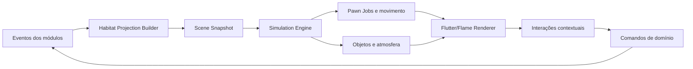
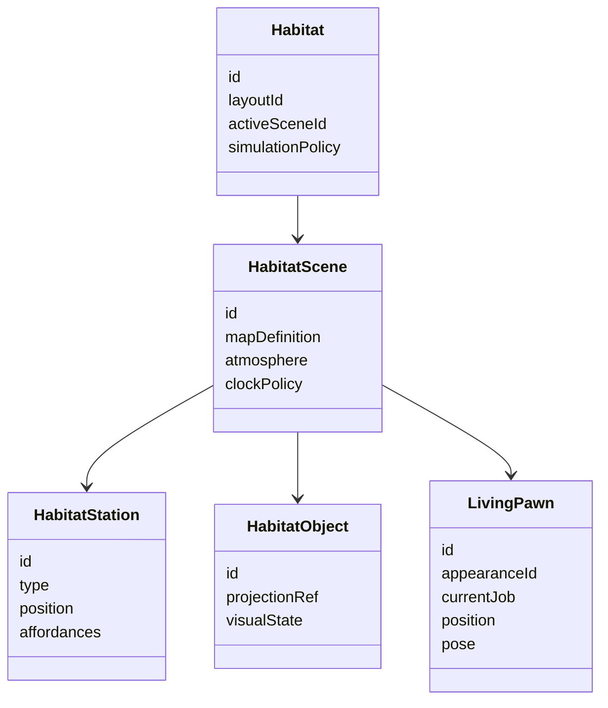
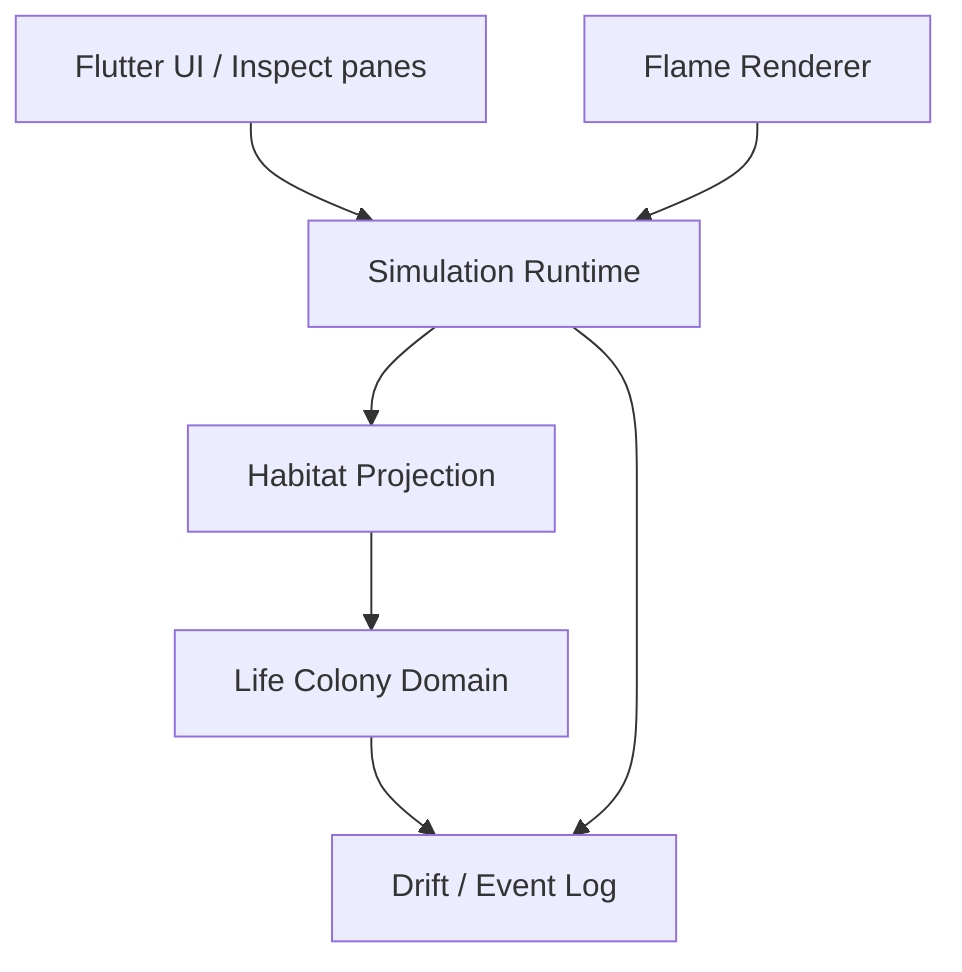
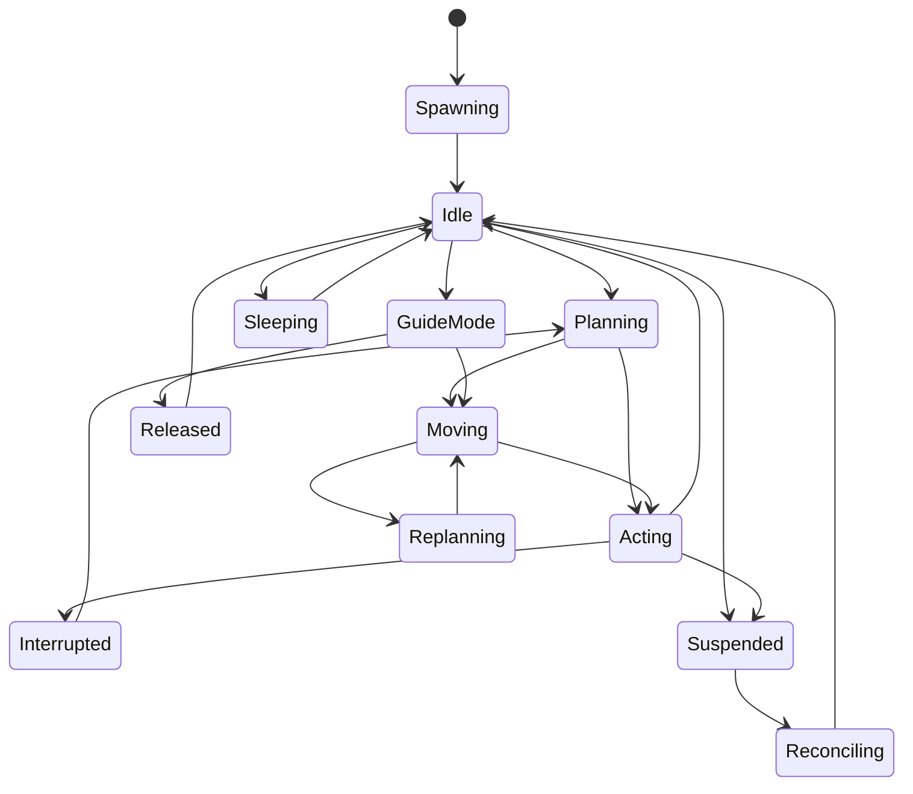
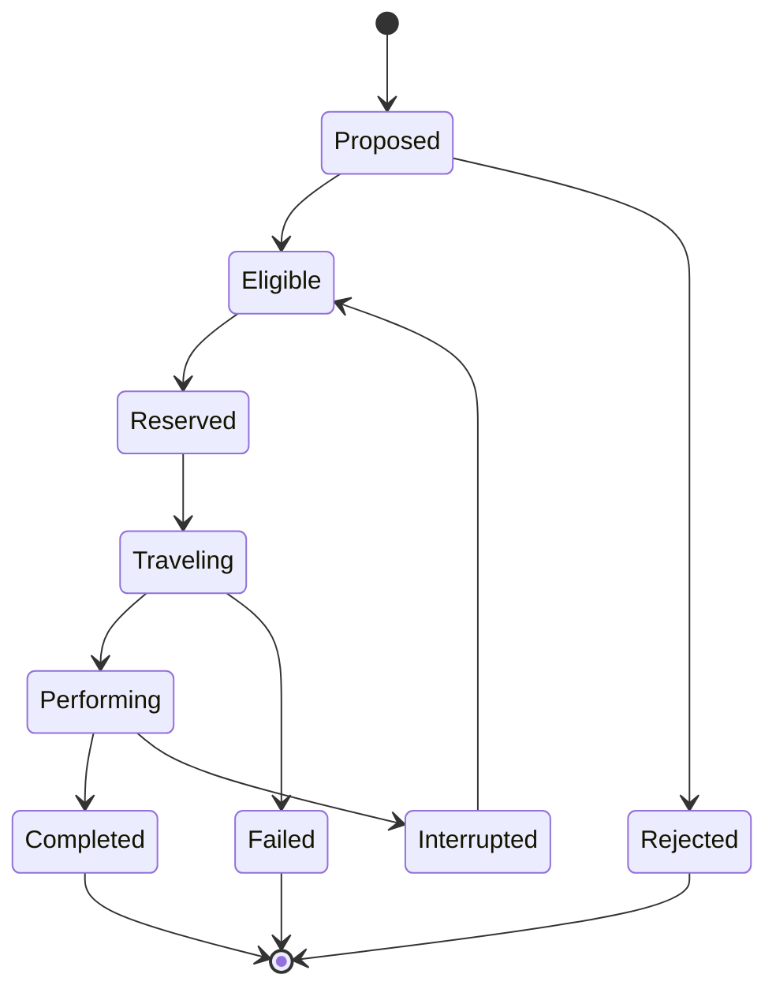

# LIFE COLONY OS — PAWN VIVO E HABITAT PESSOAL
## Especificação funcional, comportamental, visual e técnica do simulador ambiental que representa o usuário dentro da Colônia

**Documento pai:** `LIFE_COLONY_OS_SPEC.md`  
**Integrações normativas:** `LIFE_COLONY_OS_RIMWORLD_UI_STYLE_SPEC.md`, `LIFE_COLONY_OS_IGNITION_ENGINE_SPEC.md`, `LIFE_COLONY_OS_MUSIC_ATLAS_SPEC.md`  
**Catálogo de assets (pré-produção):** `06-LIFE_COLONY_OS_LIVING_PAWN_ASSET_CATALOG.md`  
**Guia de implementação (resultados primeiro):** `07-LIFE_COLONY_OS_LIVING_PAWN_VISUAL_FIRST_BUILD.md`  
**Nome interno do módulo:** `Living Habitat`  
**Nome recomendado na interface:** `Habitat`  
**Nome coloquial da funcionalidade:** `Pawn Vivo`  
**Status:** especificação de produto e engenharia  
**Versão:** 1.1.0  
**Data:** 2026-08-07  
**Audiência:** produto, UX, game design, ilustração 2D, engenharia Flutter/Flame, dados, IA, QA e agentes de desenvolvimento

---

# Sumário

1. Decisão executiva
2. A ideia em uma frase
3. Problema que a funcionalidade resolve
4. O que torna o Pawn Vivo diferente de um Tamagotchi comum
5. Encaixe natural no Life Colony OS
6. Princípios normativos
7. Metáfora central: um espelho diegético, não um juiz
8. Estrutura conceitual do Habitat
9. Modos do simulador
10. A unidade fundamental: episódio de vida simulada
11. O pawn como entidade visual
12. Personalização do pawn
13. Sistema de vestimentas e loadouts
14. Expressões, postura e linguagem corporal
15. O cenário vivo
16. Estações funcionais
17. Objetos como projeções de vida
18. Arquitetura de cômodos e mapas
19. Ciclo de dia, luz e atmosfera
20. Sistema de autonomia
21. Jobs e ordens
22. Utility AI
23. Prioridades de trabalho
24. Agenda e ritmo diário
25. Necessidades e capacidades
26. Humor, pensamentos e motes
27. Estado desconhecido e confiança
28. Ociosidade saudável
29. Sistema de memória
30. Crônica visual e replay
31. Integração com o Motor de Ignição
32. O Pawn-Guia e o rastro do próximo movimento
33. Integração com tarefas e projetos
34. Integração com saúde
35. Integração com finanças
36. Integração com aprendizado
37. Integração com o Atlas Musical
38. Integração com casa, cozinha e manutenção
39. Integração com relações
40. Integração com viagens
41. Integração com equipamentos e inventário
42. Integração com Storyteller
43. Assistente de IA do Habitat
44. Tela principal — Habitat
45. Inspect pane do pawn
46. Tela de personalização
47. Editor de Habitat
48. Menu contextual e interação direta
49. Mini-Habitat e presença global
50. Desktop, tablet, mobile e widgets
51. Tutorial e onboarding
52. Progressão sem pontos vazios
53. Construções e evolução ambiental
54. Coleções e lembranças
55. Eventos especiais
56. Som e áudio
57. Direção de arte
58. Sistema de sprites e camadas
59. Animações
60. Arquitetura Flutter + Flame
61. Loop de simulação
62. Simulação em background e fast-forward
63. Pathfinding e navegação
64. Modelo de dados
65. Eventos de domínio
66. State machines
67. Algoritmos e pseudocódigo
68. Sincronização e determinismo
69. Performance e bateria
70. Privacidade e segurança
71. Salvaguardas psicológicas e anti-gamificação coercitiva
72. Acessibilidade
73. Analytics e métricas
74. Testes
75. Failure modes
76. Roadmap de implementação
77. Vertical slices
78. Backlog inicial
79. ADRs obrigatórios
80. Definition of Done
81. Seeds personalizados
82. Patch para o documento mestre
83. Prompt operacional para uma IA desenvolvedora
84. Referências de pesquisa

---

# 1. Decisão executiva

É tecnicamente viável e conceitualmente muito coerente manter um pequeno personagem vivo dentro do Life Colony OS, caminhando por um cenário, escolhendo atividades e reagindo ao estado do sistema.

A implementação recomendada não é um Tamagotchi independente nem um minigame anexado à home. Ela deve ser o **corpo visível da arquitetura inteira**.

O Habitat transforma dados abstratos em acontecimentos espaciais:

- um projeto ativo vira uma bancada ou construção em andamento;
- uma sessão de piano leva o pawn ao instrumento;
- uma reunião iminente faz o pawn preparar a mesa ou pegar sua mochila;
- uma noite de sono aparece como repouso real no cenário;
- uma descoberta do Atlas Musical pode aparecer como um disco, mapa ou livro recém-chegado;
- uma viagem futura traz malas, documentos e uma área de preparação;
- uma transição travada aciona o Pawn-Guia do Motor de Ignição;
- um período sem dados não é interpretado como fracasso: o cenário simplesmente reconhece incerteza.

O resultado deve produzir a sensação de que existe uma pequena vida paralela persistente, mas profundamente ligada à vida real do usuário.

## 1.1 Nome e posição no produto

Na navegação, usar:

```text
COLÔNIA | HABITAT | PAWN | TRABALHO | AGENDA | RECURSOS | ATLAS | CRÔNICA | MAIS
```

Em telas compactas, `Habitat` pode ser a própria visualização central da `Colônia`, sem criar um destino redundante.

Deep links:

```text
/colony/habitat
/colony/habitat/edit
/colony/habitat/replay/:date
/pawn/me/live
/pawn/me/customize
/pawn/me/loadouts
/habitat/objects/:objectId
/habitat/stations/:stationId
/habitat/scenarios/:scenarioId
```

---

# 2. A ideia em uma frase

> Um pequeno mundo persistente em que uma versão estilizada do usuário vive, trabalha, descansa, aprende, explora e se prepara, tornando visível o estado da sua vida sem exigir que ele alimente manualmente mais um sistema.

---

# 3. Problema que a funcionalidade resolve

O Life Colony OS organiza muitos domínios, mas um sistema completo corre o risco de se tornar cognitivamente abstrato:

- tabelas explicam, mas não criam presença;
- dashboards mostram estado, mas não produzem apego;
- listas registram intenções, mas não mostram fluxo;
- módulos separados podem parecer fragmentos de vidas diferentes;
- o usuário precisa abrir cada área para perceber o todo;
- registros passivos podem ser úteis sem serem emocionalmente legíveis.

O Pawn Vivo cria:

1. **continuidade** — o sistema parece existir entre uma abertura e outra;
2. **identificação** — informações pertencem a alguém visível, não a uma conta;
3. **causalidade percebida** — compromissos, recursos e energia alteram ações no cenário;
4. **orientação** — é possível enxergar o que está acontecendo agora;
5. **memória** — dias deixam marcas visuais e cenas reencenáveis;
6. **motivação pré-reflexiva** — observar o pawn iniciar uma ação pode reduzir a distância até o primeiro movimento real;
7. **integração** — saúde, música, estudo, trabalho, finanças e relações coexistem no mesmo espaço.

O objetivo não é convencer o usuário a manter um boneco feliz. O objetivo é tornar sua própria vida mais legível, concreta e convidativa.

---

# 4. O que torna o Pawn Vivo diferente de um Tamagotchi comum

## 4.1 Tamagotchi tradicional

Normalmente depende de:

- necessidades artificiais;
- input frequente;
- ciclos de punição por ausência;
- medo de perder progresso;
- repetição de ações sem relação com a vida real;
- cuidado unilateral de uma criatura separada do usuário.

## 4.2 Pawn Vivo

O Pawn Vivo:

- não morre;
- não adoece porque o usuário não abriu o app;
- não exige alimentação manual fictícia;
- não possui streak de cuidado;
- não culpa o usuário;
- não inventa sofrimento para gerar retenção;
- não converte dinheiro, peso, passos ou produtividade em valor moral;
- usa eventos já existentes no Life Colony OS;
- atua como espelho, interface e ensaio visual;
- pode continuar existindo com zero input dedicado.

## 4.3 Regra de ouro

> Toda ação pedida ao usuário deve ter valor fora do simulador.

Exemplos válidos:

- colocar o celular no dock do banheiro;
- iniciar a sessão de foco já planejada;
- confirmar que uma mala está pronta;
- registrar que um sintoma mudou;
- escolher qual projeto ocupa a bancada principal;
- ajustar a privacidade de uma fonte de dados.

Exemplos inválidos:

- tocar cinco vezes para “dar energia” ao pawn;
- limpar uma sujeira criada apenas para forçar abertura;
- comprar comida virtual para impedir uma animação triste;
- assistir anúncio para recuperar motivação;
- preencher check-in redundante para manter o personagem vivo.

---

# 5. Encaixe natural no Life Colony OS

O Pawn Vivo não cria uma cópia dos dados. Ele é uma **projeção de leitura** sobre entidades existentes.

| Elemento visual | Fonte de verdade |
|---|---|
| atividade atual | `ActiveSession`, agenda, foco ou override explícito |
| sono | `NeedState`, Health Connect/HealthKit autorizado, rotina ou estado desconhecido |
| bancada de projeto | `Project`, `Workstream`, `Task` |
| objeto musical | `MusicEncounter`, `KnowledgeSource`, repertório |
| mala | `Trip`, documentos e checklist |
| visitante/mensagem | `RelationshipEvent`, agenda ou contato explícito |
| equipamento carregado | `InventoryItem`, documentos, contexto de viagem |
| pensamento | fator confirmado, evento de Crônica ou template seguro |
| roupa | preferência visual e loadout contextual |
| estação ativa | `HabitatStation` ligada a domínio e affordances |
| construção ambiental | marco real ou personalização manual |

## 5.1 Fluxo de dados



## 5.2 Relação com a tela Colônia

Existem duas opções de apresentação, ambas suportadas:

### Opção A — Habitat como mapa central da Colônia

A home mostra o cenário vivo ao centro. Setores e módulos aparecem como estações e painéis contextuais ao redor.

### Opção B — Habitat como destino próprio

A home Colônia mantém mapa operacional abstrato, enquanto `Habitat` oferece a camada viva. O top pawn bar exibe uma miniatura animada.

A recomendação é iniciar com a Opção B no MVP e, após validar legibilidade, permitir que o usuário escolha `Habitat como Home`.

---

# 6. Princípios normativos

1. **A vida vem antes do jogo.**
2. **O pawn representa; não julga.**
3. **O simulador explica de onde veio cada estado.**
4. **Incerteza deve ser visível.**
5. **Descanso é comportamento legítimo.**
6. **O cenário não pune ausência.**
7. **A personalização pertence ao usuário.**
8. **O app nunca muda aparência corporal com base em peso ou saúde sem escolha explícita.**
9. **Dados sensíveis podem ser omitidos sem quebrar a experiência.**
10. **Autonomia simulada não pode executar ações reais irreversíveis.**
11. **Ações do pawn nunca substituem confirmação do usuário.**
12. **O mundo deve ser interessante em silêncio.**
13. **Poucas animações expressivas valem mais que ruído constante.**
14. **A simulação deve funcionar offline.**
15. **O estado persistente deve ser determinístico e auditável.**
16. **O estilo mira paridade visual com RimWorld** (pawn top-down, habitat em grid, idle/wander).
17. **Assets RimWorld e de modders podem ser usados na implementação** quando isso for legal no contexto do projeto (cópia Steam local / licença do mod) e for o caminho mais direto para qualidade. Catálogo em `06-LIFE_COLONY_OS_LIVING_PAWN_ASSET_CATALOG.md`.
18. **O usuário pode desligar a simulação e manter todos os módulos funcionais.**
19. **Desenvolvimento orientado a resultados visuais** — ver `07-LIFE_COLONY_OS_LIVING_PAWN_VISUAL_FIRST_BUILD.md`. Não construir infraestrutura de domínio/DB antes de haver cena jogável na tela.

---

# 7. Metáfora central: um espelho diegético, não um juiz

A interface é diegética quando as informações parecem existir dentro do mundo representado.

Em vez de mostrar apenas:

```text
Projeto: motor gráfico
Status: em andamento
Próxima tarefa: corrigir câmera
```

O Habitat pode mostrar:

- uma mesa com blueprint aberto;
- o pawn sentado diante do computador;
- uma pequena peça incompleta sobre a bancada;
- ao tocar, o inspect pane revela a tarefa real e sua origem.

A representação não precisa ser literal. A bancada é uma metáfora espacial do projeto.

## 7.1 Três níveis de fidelidade

Cada projeção recebe um nível:

```text
CONFIRMADO   — evento ou estado explicitamente registrado
DERIVADO     — regra transparente com dados suficientemente fortes
SUGERIDO     — hipótese visual fraca, sem impacto decisório
```

Exemplo:

```text
Pawn dormindo
Origem: janela de sono informada + dispositivo em modo sono
Confiança: média
[Ajustar] [Ocultar inferência]
```

## 7.2 O pawn não é um gêmeo digital clínico

Ele não modela de forma confiável:

- diagnóstico;
- emoções ocultas;
- intenção real;
- fadiga médica;
- personalidade completa;
- capacidade futura;
- produtividade potencial;
- risco de saúde.

É uma representação operacional e narrativa, não uma verdade ontológica sobre o usuário.

---

# 8. Estrutura conceitual do Habitat

O Habitat possui sete camadas:

1. **Mapa** — pisos, paredes, zonas e navegação.
2. **Estações** — locais que oferecem jobs possíveis.
3. **Objetos** — representações de projetos, recursos, memórias e equipamento.
4. **Pawn** — corpo visual, estado, jobs e memória.
5. **Atmosfera** — luz, clima simbólico, som e densidade.
6. **Projeção** — tradução dos dados do Life Colony para o mundo.
7. **Interface** — inspect panes, tabs, alertas, ações e overlays.



---

# 9. Modos do simulador

## 9.1 `LIVE_MIRROR` — Espelho Vivo

Modo padrão.

O pawn escolhe atividades plausíveis a partir de:

- horário;
- agenda;
- sessão ativa;
- prioridades;
- necessidades disponíveis;
- contexto do dispositivo;
- jobs oferecidos pelas estações;
- overrides do usuário.

Ele não precisa reproduzir cada minuto real. Deve representar o estado predominante.

## 9.2 `PATHFINDER` — Pawn-Guia

Usado pelo Motor de Ignição.

Uma projeção fantasma ou versão-guia do pawn encena o próximo movimento físico:

```text
cama → banheiro → chuveiro → roupa → água → mesa
```

O pawn atual acompanha a rota conforme provas reais são detectadas.

## 9.3 `CHRONICLE_REPLAY` — Replay da Crônica

Reencena um dia ou período em velocidade acelerada.

- 30 segundos para um dia;
- 2 minutos para uma semana;
- marcadores para momentos significativos;
- sem inventar cenas quando não há dados;
- pausável e inspecionável.

## 9.4 `SANDBOX` — Planejamento de cenário

Permite experimentar sem alterar a vida real:

- “Como ficaria uma manhã com treino antes do trabalho?”
- “Onde cabe prática de piano nesta semana?”
- “Que objetos e zonas aparecem se este projeto virar prioridade?”

O sandbox deve ser explicitamente marcado como simulação contrafactual.

## 9.5 `AMBIENT` — Presença reduzida

- pawn caminha ou executa idle leve;
- render a 20–30 fps;
- sem alertas intrusivos;
- ideal para mini-Habitat ou desktop lateral.

## 9.6 `PRIVATE` — Ocultação

- substitui textos por categorias genéricas;
- esconde nomes de projetos;
- pode trocar o pawn por uma silhueta;
- não mostra finanças, saúde ou relações;
- mantém animação neutra.

## 9.7 `SLEEP` — Suspensão visual

- simulação não renderiza;
- apenas snapshots e eventos persistem;
- ao retornar, executa reconciliação temporal.

---

# 10. A unidade fundamental: episódio de vida simulada

Um `SimulationEpisode` é uma sequência coerente entre duas mudanças significativas.

Exemplos:

- acordar e iniciar manhã;
- trabalhar em um projeto;
- deslocar-se para compromisso;
- praticar piano;
- fazer refeição;
- relaxar;
- preparar viagem;
- revisar finanças;
- dormir.

```yaml
simulation_episode:
  id: uuid
  pawn_id: uuid
  mode: live_mirror
  started_at: instant
  ended_at: instant?
  source_events: [uuid]
  primary_job: work_at_desk
  station_id: desk_main
  confidence: 0.78
  representation_level: derived
  user_override: false
  chronicle_policy: summarize_only
```

O episódio não precisa ser salvo a cada frame. Salvar:

- início;
- mudança de job;
- estação;
- resultado;
- eventos relevantes;
- snapshot visual opcional.

---

# 11. O pawn como entidade visual

O pawn possui quatro identidades simultâneas:

1. **Identidade civil** — nome, pronomes opcionais, roles e bio.
2. **Identidade visual** — corpo estilizado, cabelo, roupas e acessórios.
3. **Identidade operacional** — atividade, disponibilidade, capacidade e equipamento.
4. **Identidade narrativa** — memórias, marcos, preferências e crônica.

## 11.1 O que aparece no mapa

No zoom padrão:

- silhueta do corpo;
- cabeça e cabelo;
- roupa dominante;
- item carregado quando relevante;
- sombra;
- direção do olhar;
- mote raro;
- indicador de seleção.

No zoom próximo:

- olhos/piscar opcional;
- expressão discreta;
- mãos ou gesto simplificado;
- detalhes de roupa;
- animações contextuais.

No zoom distante:

- marcador legível;
- cor de identidade;
- ícone de atividade;
- label opcional.

## 11.2 Paridade com o pawn de RimWorld

O alvo visual é o pawn humanlike vanilla (e extensões de modders quando úteis):

- top-down ortográfico;
- stack de camadas body → apparel → head → hair → held;
- 4 direções (`south` / `east` / `north` / `west`, west pode espelhar east);
- body types (`Male` / `Female` / `Thin` / `Fat` / `Hulk`) como base de personalização;
- contorno escuro e sombreamento de poucos tons;
- silhueta legível a distância de tile.

**Assets:** usar os PNGs já capturados em `docs/produto/assets/reference/living_pawn/` (e packs de modders com licença compatível, ex. ISOR3X CC-BY, ShowMeYourHands MIT). Se for legal no contexto do exercício/produto e acelerar a qualidade, **preferir os sprites vanilla** a reinventar proporções “parecidas”. Arte própria só entra quando faltar cobertura ou quando a licença de um asset específico impedir o bundle.

---

# 12. Personalização do pawn

A personalização deve ser profunda o suficiente para gerar identificação, mas rápida no onboarding.

## 12.1 Categorias

### Corpo visual

- estrutura estilizada A/B/C, sem rótulos normativos;
- altura visual apenas estética;
- tom de pele;
- formato de cabeça;
- detalhes faciais;
- postura base;
- mão dominante opcional.

### Cabelo

- corte;
- textura;
- volume;
- cor principal;
- cor secundária opcional;
- barba e bigode;
- sobrancelha.

### Rosto

- olhos;
- nariz simplificado;
- boca;
- sardas/sinais opcionais;
- óculos;
- expressão padrão.

### Roupa

- camiseta;
- camisa;
- casaco;
- calça;
- sapato;
- conjunto profissional;
- conjunto casual;
- conjunto de viagem;
- conjunto de exercício;
- conjunto doméstico.

### Acessórios

- relógio;
- fones;
- mochila;
- caderno;
- instrumento;
- caneca;
- pins de áreas de interesse;
- item simbólico pessoal.

## 12.2 Criação rápida

Fluxo em menos de dois minutos:

1. escolher silhueta;
2. escolher pele e cabelo;
3. escolher roupa base;
4. escolher um acessório de identidade;
5. visualizar no Habitat;
6. concluir.

O editor completo fica disponível depois.

## 12.3 Foto como referência

Pode existir uma opção futura para sugerir características a partir de foto, mas:

- deve ser opt-in;
- processamento local preferencial;
- nenhuma foto enviada sem consentimento específico;
- resultado editável;
- imagem original deletável imediatamente;
- nunca usar reconhecimento de identidade;
- nunca inferir raça, saúde, peso, humor ou idade;
- não é requisito do MVP.

## 12.4 Identidades alternativas

O usuário pode salvar aparências sem criar personas diferentes:

- `Casa`;
- `Trabalho`;
- `Universidade`;
- `Música`;
- `Viagem`;
- `Noite`;
- `Treino`.

Isso forma os `PawnLoadouts`.

---

# 13. Sistema de vestimentas e loadouts

Um loadout liga aparência, equipamento visual e contexto.

```yaml
pawn_loadout:
  id: work_default
  label: Trabalho
  visual_layers:
    outfit: overshirt_dark
    shoes: sneaker_gray
    accessory: headphones
  projected_inventory:
    - laptop
    - notebook
  activation_rules:
    - active_domain == work
    - calendar_event.tag == office
  auto_apply: suggest
```

## 13.1 Políticas

- `manual`: apenas o usuário troca;
- `suggest`: o sistema oferece;
- `automatic`: troca visualmente quando a regra é segura;
- `disabled`: não usar contexto.

## 13.2 Roupa não representa moral ou capacidade

Não alterar para aparência “desleixada” porque tarefas estão atrasadas. Não rasgar roupas por falta de uso. Não usar aparência como punição.

---

# 14. Expressões, postura e linguagem corporal

A expressão deve ser sutil e baseada em estados permitidos.

## 14.1 Estados visuais seguros

- neutro;
- atento;
- concentrado;
- relaxado;
- sonolento;
- curioso;
- satisfeito;
- incerto;
- apressado;
- em pausa.

## 14.2 Estados proibidos por inferência automática

- deprimido;
- ansioso;
- doente;
- desesperado;
- fracassado;
- culpado;
- preguiçoso;
- irritado com o usuário.

Esses estados só podem aparecer como linguagem explicitamente escolhida pelo usuário e ainda assim com cautela.

## 14.3 Posturas

- caminhar;
- sentar;
- reclinar;
- digitar;
- ler;
- tocar instrumento;
- preparar objeto;
- alongar;
- observar mapa;
- conversar;
- descansar;
- dormir.

---

# 15. O cenário vivo

O cenário é uma base pessoal simbólica. Não precisa reproduzir a planta real da casa.

## 15.1 Seed recomendado

```text
┌──────────────────────────────────────────────────────┐
│ Janela / luz       Estante        Piano              │
│                                                      │
│ Cama               Área livre     Mesa de trabalho   │
│                                                      │
│ Banheiro simbólico Cozinha        Porta / saída      │
└──────────────────────────────────────────────────────┘
```

## 15.2 Temas

- apartamento urbano;
- estúdio industrial;
- oficina civil;
- refúgio de montanha;
- nave civil abstrata;
- biblioteca-oficina;
- casa tropical;
- base minimalista.

Todos preservam a gramática visual do Life Colony OS.

## 15.3 O mundo não precisa ser realista

A cama pode ficar próxima ao banheiro mesmo que isso não corresponda à casa. O layout otimiza legibilidade e significado.

---

# 16. Estações funcionais

Uma estação é um local que oferece ações.

| Estação | Domínios | Exemplos de jobs |
|---|---|---|
| cama | sono, recuperação | dormir, levantar, repousar |
| banheiro | mobilização, cuidado | preparar banho, higiene |
| cozinha | alimentação, casa | preparar refeição, água, café |
| mesa principal | trabalho, estudo | foco, reunião, planejamento |
| piano/instrumento | música | praticar, improvisar, revisar repertório |
| estante | aprendizado | ler, estudar, organizar fontes |
| mapa/mesa de viagem | viagens | planejar, conferir documentos, empacotar |
| quadro financeiro | finanças | revisar, decidir, arquivar documento |
| sofá/poltrona | descanso | ouvir música, ler, relaxar |
| área de movimento | saúde | alongar, treinar, caminhar |
| porta | transição | sair, voltar, preparar deslocamento |
| bancada criativa | projetos | desenhar, programar, prototipar |

## 16.1 Affordances

```yaml
station:
  id: piano_01
  type: instrument
  capabilities:
    - music_practice
    - repertoire_review
    - improvisation
  availability:
    schedule: any
    privacy: local_only
  domain_links:
    - music_atlas
    - skills
    - ignition
```

## 16.2 Estações podem existir sem integração automática

O usuário pode colocar um piano porque gosta da imagem, mesmo sem registrar práticas.

---

# 17. Objetos como projeções de vida

Objetos são a principal ponte entre módulos e cenário.

## 17.1 Taxonomia

### Objetos operacionais

- notebook;
- documento;
- mala;
- relógio;
- garrafa;
- livro ativo;
- ferramenta;
- quadro de tarefas.

### Objetos de projeto

- blueprint;
- protótipo;
- pilha de arquivos;
- peça em construção;
- diagrama;
- caixa de materiais.

### Objetos de conhecimento

- livros;
- discos;
- mapas;
- fichas;
- instrumentos;
- amostras;
- mural de conexões.

### Objetos de memória

- ingresso;
- fotografia abstrata;
- souvenir;
- placa de marco;
- pôster;
- item de viagem.

### Objetos de alerta

- envelope;
- indicador no quadro;
- caixa aguardando decisão;
- documento com corner badge.

## 17.2 Sem clutter punitivo

Tarefas atrasadas não espalham lixo pelo chão. Muitas pendências podem aparecer como:

- quadro mais cheio;
- bancada ocupada;
- caixas etiquetadas;
- luz de atenção.

A estética deve comunicar carga sem humilhar.

## 17.3 Inspeção

Ao tocar em um objeto:

```text
PROJETO — MOTOR GRÁFICO
Estado: ativo
Último avanço: ontem, 22:14
Próxima ação concreta: corrigir transformação da câmera
Origem: Projeto > Engine
[Abrir projeto] [Iniciar foco] [Mover bancada] [Ocultar do Habitat]
```

---

# 18. Arquitetura de cômodos e mapas

## 18.1 Tipos de mapa

1. `SingleRoom` — MVP e mobile.
2. `CompactApartment` — 2–4 zonas.
3. `WorkshopBase` — módulos em salas.
4. `OutdoorCourtyard` — descanso e movimento.
5. `TravelCamp` — cenário temporário.
6. `ChronicleMuseum` — memórias e marcos.

## 18.2 Grid

Recomendação inicial:

- tile lógico: `48 dp` desktop/tablet;
- tile lógico: `40–44 dp` mobile;
- mapa MVP: `16 × 11` tiles;
- colisão em grid inteiro;
- decoração pode ocupar subgrid de 1/2 tile;
- câmera ortográfica;
- sem perspectiva isométrica no MVP.

## 18.3 Câmera

- pan por drag;
- zoom por pinça/scroll;
- duplo toque centraliza pawn;
- tecla `F` segue pawn no desktop;
- câmera nunca move sozinha durante edição;
- pan narrativo opcional e raro em eventos.

## 18.4 Presets

- `Compact Focus`;
- `Balanced Life`;
- `Music Studio`;
- `Research Workshop`;
- `Travel Ready`;
- `Minimal Calm`.

---

# 19. Ciclo de dia, luz e atmosfera

## 19.1 Relógios

Existem três relógios:

- `RealClock`: hora real do dispositivo;
- `SceneClock`: hora visual do Habitat;
- `SimulationClock`: ticks do motor.

Por padrão:

```text
SceneClock = RealClock no fuso ativo
```

O usuário pode usar:

- ciclo real;
- ciclo comprimido apenas em replay;
- luz fixa por acessibilidade;
- tema automático do sistema.

## 19.2 Iluminação

- manhã: luz lateral suave;
- tarde: neutra;
- noite: fontes locais e janela escura;
- madrugada: baixa intensidade, sem azul neon;
- foco: luminária da estação ativa;
- descanso: iluminação ampla e menos contraste.

## 19.3 Clima simbólico

Pode existir como decoração, não como inferência emocional:

- chuva real da localização apenas com permissão e fonte meteorológica;
- vento/folhas em tema externo;
- céu baseado em horário;
- clima não deve representar humor automaticamente.

---

# 20. Sistema de autonomia

O pawn precisa parecer vivo sem tomar decisões reais pelo usuário.

## 20.1 Camadas de decisão

1. `HardState`: dormir, sessão ativa, mobilização, compromisso confirmado.
2. `ScheduleIntent`: blocos da agenda e rotina.
3. `WorkPriority`: domínios prioritários.
4. `NeedsOpportunity`: descanso, água, movimento, recreação.
5. `AmbientIdle`: comportamentos neutros.

## 20.2 Ordem de precedência

```text
user direct order
> safety/incident mode
> active mobilization
> confirmed active session
> current calendar commitment
> explicit schedule block
> user priority
> need-supporting action
> ambient idle
```

## 20.3 O pawn pode recusar uma ordem visual?

Não de forma dramatizada. Uma ordem indisponível aparece com motivo:

```text
Não é possível representar “reunião” agora:
- evento já terminou;
- estação de reunião oculta;
- dados de agenda desativados.
```

O usuário pode forçar apenas uma **representação visual**, nunca alterar registros externos sem fluxo próprio.

---

# 21. Jobs e ordens

## 21.1 Job

Um `PawnJob` é uma atividade simulada com:

- estação alvo;
- duração representacional;
- animação;
- fonte;
- confiança;
- ações contextuais;
- política de interrupção.

```yaml
pawn_job:
  id: uuid
  type: practice_music
  target_station: piano_01
  source:
    module: agenda
    entity_id: event_123
  representation:
    label: Praticando piano
    animation: seated_instrument
    carried_item: score_sheet
  interruptibility: soft
  confidence: 1.0
```

## 21.2 Ordens diretas

O usuário pode dar ordens visuais:

- `Ir até`;
- `Representar atividade`;
- `Fixar estação atual`;
- `Descansar visualmente`;
- `Trocar roupa`;
- `Seguir próxima rota`;
- `Abrir contexto real`.

## 21.3 Ordens reais

Ações que afetam dados devem abrir o módulo correspondente:

- iniciar sessão de foco;
- marcar tarefa;
- iniciar mobilização;
- registrar check-in;
- editar agenda;
- confirmar documento.

---

# 22. Utility AI

A seleção de jobs deve usar utility scoring simples, transparente e testável.

## 22.1 Fórmula

```text
utility(job) =
  hard_state_fit
  + schedule_fit
  + active_intent_fit
  + priority_fit
  + need_support
  + continuity_bonus
  + environment_affordance
  + novelty_small_bonus
  - switching_cost
  - uncertainty_penalty
  - intrusion_penalty
  - unavailable_penalty
```

## 22.2 Pesos iniciais

```yaml
weights:
  hard_state_fit: 100
  schedule_fit: 40
  active_intent_fit: 50
  priority_fit: 18
  need_support: 12
  continuity_bonus: 15
  environment_affordance: 8
  novelty_small_bonus: 2
  switching_cost: 10
  uncertainty_penalty: 20
  intrusion_penalty: 30
```

## 22.3 Histerese

Para evitar o pawn mudando de ideia a cada poucos segundos:

- job atual recebe `continuity_bonus`;
- só trocar quando nova utilidade superar por margem mínima;
- jobs de sono, foco e mobilização possuem lock contextual;
- ambient idles podem ser interrompidos imediatamente.

## 22.4 Explicabilidade

No inspect pane:

```text
Por que ele está na mesa?
+ sessão de foco ativa
+ projeto principal definido
+ mesa disponível
- nenhuma reunião nos próximos 20 min
Confiança: alta
```

---

# 23. Prioridades de trabalho

A matriz de prioridades do Life Colony pode alimentar o pawn, mas não precisa ser exibida como cobrança.

```text
              PRIORIDADE
Saúde            1
Trabalho         2
Universidade     2
Música           3
Casa             3
Finanças         3
Cultura          4
```

## 23.1 Escala

- `1`: essencial/agora;
- `2`: foco atual;
- `3`: manter;
- `4`: quando houver espaço;
- `off`: não gerar jobs autônomos.

## 23.2 Prioridade não significa tempo total

Uma prioridade alta altera a escolha entre jobs elegíveis; não autoriza o sistema a ocupar a agenda inteira.

---

# 24. Agenda e ritmo diário

A agenda cria janelas representacionais.

## 24.1 Antes de compromisso

O pawn pode:

- olhar relógio;
- preparar mochila;
- caminhar até porta;
- sentar na estação de reunião;
- exibir ícone de deslocamento.

## 24.2 Durante compromisso

- reunião remota: mesa;
- aula: estante/mesa de estudo;
- evento externo: pawn sai do mapa ou aparece em cena externa abstrata;
- viagem: cenário temporário.

## 24.3 Depois

- retorno;
- breve transição;
- objeto/notas entram na bancada se houver follow-up.

## 24.4 Margens

O sistema deve respeitar buffers e não representar uma transição impossível.

---

# 25. Necessidades e capacidades

As necessidades do documento mestre podem alterar **oportunidades** e linguagem corporal, nunca produzir punição.

## 25.1 Categorias visuais

- sono;
- hidratação;
- alimentação;
- movimento;
- descanso;
- foco;
- recreação;
- conexão;
- autonomia;
- expressão criativa;
- ambiente.

## 25.2 Regras

- dado manual confirmado prevalece;
- estimativa expirada vira desconhecida;
- need bar não precisa ficar sempre visível;
- estados sensíveis podem ser ocultados do mapa;
- o pawn pode escolher beber água como idle de cuidado, mas isso não registra consumo real;
- nenhuma animação substitui ação ou registro real.

## 25.3 Capacidade

O `CapacityMode` do Motor de Ignição pode ajustar:

- velocidade de caminhada visual;
- duração dos jobs;
- densidade do cenário;
- quantidade de ordens simultâneas;
- escolha por atividades leves.

Não usar animação caricata de fraqueza.

---

# 26. Humor, pensamentos e motes

## 26.1 Pensamentos

Pensamentos são pequenas legendas ligadas a fatos:

```text
“Boa sessão de piano.”
“Preciso decidir o próximo passo deste projeto.”
“Viagem se aproximando.”
“Uma tarde sem compromissos.”
```

## 26.2 Fontes permitidas

- nota escrita pelo usuário;
- check-in;
- evento de Crônica;
- marco real;
- template factual;
- reflexão do Storyteller claramente marcada.

## 26.3 Motes visuais

Ícones discretos por 1–3 segundos:

- nota musical;
- lâmpada/ideia;
- relógio;
- envelope;
- xícara;
- mapa;
- ponto de interrogação para estado desconhecido.

Não usar corações compulsivos, moedas ou confete frequente.

## 26.4 Frequência

- no máximo um mote ambiental por 2–5 minutos;
- eventos importantes podem gerar um;
- respeitar redução de movimento;
- opção `sem pensamentos`.

---

# 27. Estado desconhecido e confiança

Um simulador vivo pode parecer convincente demais. Por isso, deve expor quando está apenas representando.

## 27.1 Visual de incerteza

- pequeno `?` no ícone da atividade;
- label `atividade não informada`;
- pawn executa idle neutro;
- inspect pane mostra fontes ausentes.

## 27.2 Nunca preencher silêncio com produtividade fictícia

Se não há dados, o pawn não precisa aparecer trabalhando. Ele pode:

- caminhar;
- observar janela;
- sentar;
- organizar um objeto neutro;
- ouvir ambiente;
- permanecer fora da cena.

## 27.3 Correção simples

Ação contextual:

```text
[Isso não representa meu momento]
```

Opções:

- descansar;
- trabalhando;
- estudando;
- fora de casa;
- ocupado;
- não quero informar.

O override expira conforme política definida.

---

# 28. Ociosidade saudável

O pawn deve parecer vivo mesmo quando não há objetivo.

## 28.1 Idles

- andar até a janela;
- sentar e levantar;
- olhar estante;
- ajustar objeto;
- beber algo de forma puramente visual;
- ouvir um disco;
- tocar uma nota curta;
- alongar;
- observar mapa;
- apagar/acender luminária conforme hora.

## 28.2 Ociosidade não é falha

A UI nunca usa:

- `ocioso há 47 minutos` em tom negativo;
- `tempo desperdiçado`;
- animação de tédio punitiva;
- alarme por inatividade sem configuração.

Pode mostrar:

```text
Sem atividade representada
Próximo compromisso: 15:00
```

---

# 29. Sistema de memória

O pawn possui memória narrativa derivada da Crônica, não uma personalidade opaca.

## 29.1 Tipos

- marco;
- descoberta;
- conclusão;
- encontro;
- viagem;
- apresentação;
- criação;
- recuperação;
- decisão;
- mudança de ambiente.

## 29.2 Manifestação visual

- objeto em prateleira;
- fotografia abstrata;
- placa;
- livro;
- mapa marcado;
- item de roupa;
- decoração.

## 29.3 Curadoria

O usuário escolhe:

- fixar no Habitat;
- arquivar no Museu da Crônica;
- ocultar;
- tornar privado;
- substituir representação.

---

# 30. Crônica visual e replay

## 30.1 Replay de um dia

Timeline:

```text
07:50  acordou / transição matinal
09:05  trabalho em projeto
12:30  pausa e refeição
15:00  reunião
18:20  deslocamento
20:10  música / escuta
23:40  preparação para dormir
```

O motor usa keyframes, não simulação minuto a minuto.

## 30.2 Replay honesto

- lacunas ficam como transição neutra;
- eventos com baixa confiança são pontilhados;
- usuário pode corrigir;
- nenhuma cena emocional é inventada;
- duração visual não implica duração exata.

## 30.3 Exportação

Pode gerar:

- imagem estática do Habitat;
- resumo textual;
- pequena animação local;
- página de Crônica.

Não exportar dados sensíveis sem revisão.

---

# 31. Integração com o Motor de Ignição

Esta é uma das integrações mais importantes.

## 31.1 Problema

Quando o usuário está na cama e precisa começar a vida, uma lista de rotina ainda exige decisão executiva.

## 31.2 Solução visual

O Habitat entra em `PATHFINDER`:

- o pawn atual aparece no ponto inicial;
- um `Pawn-Guia` translúcido percorre o próximo waypoint;
- a câmera mostra apenas o trajeto imediato;
- o comando textual do Motor de Ignição aparece em overlay;
- a confirmação passiva move o pawn real até o guia;
- a rota futura permanece parcialmente oculta.

```text
┌──────────────────────────────────────┐
│ MOBILIZAÇÃO · PASSO 1                │
│                                      │
│ [Pawn atual]  ·····→  [Guia na porta]│
│                                      │
│ COLOQUE OS DOIS PÉS NO CHÃO          │
│                                      │
│ [Adaptar]                     [Sair] │
└──────────────────────────────────────┘
```

## 31.3 Princípio

O pawn não “vai viver por você”. Ele demonstra a menor transição e aguarda evidência do mundo real.

## 31.4 Conclusão

Ao alcançar o estado operacional:

- o guia se funde visualmente ao pawn;
- não há explosão de recompensa;
- surge uma pequena legenda: `Rota concluída`;
- o pawn inicia o primeiro job real previsto;
- a Crônica registra o episódio conforme política.

---

# 32. O Pawn-Guia e o rastro do próximo movimento

O Pawn-Guia é uma representação do **eu de daqui a poucos minutos**, não uma segunda personalidade.

## 32.1 Visual

- mesma aparência;
- opacidade 35–50%;
- contorno frio ou claro;
- sem rosto detalhado;
- rastro de passos discreto;
- animação em loop curto apenas no waypoint atual.

## 32.2 Distância temporal

- padrão: um passo;
- opcional: visão da rota completa;
- nunca mostrar uma “vida ideal perfeita” como comparação constante.

## 32.3 Uso fora da manhã

- começar piano;
- abrir workspace;
- arrumar mala;
- iniciar exercício;
- sair de casa;
- preparar cozinha;
- voltar ao trabalho após pausa.

---

# 33. Integração com tarefas e projetos

## 33.1 Projetos como construções

Cada projeto pode escolher uma metáfora:

- estrutura;
- bancada;
- mapa;
- máquina;
- manuscrito;
- jardim;
- quadro.

## 33.2 Progresso

Não usar barra percentual arbitrária. Atualizar por marcos reais:

```text
Fundação: concluída
Módulo de navegação: em construção
Testes de integração: aguardando
```

## 33.3 Próxima ação

O objeto principal deve revelar uma ação concreta.

## 33.4 Muitos projetos

- somente 1–3 aparecem ativos no espaço principal;
- demais ficam em armazenamento/arquivo visual;
- o usuário define `bancada principal`;
- o Storyteller pode sugerir reduzir work-in-progress, sem impor.

---

# 34. Integração com saúde

## 34.1 Representações adequadas

- sono → cama/iluminação;
- movimento → área externa/alongamento;
- consulta → documento e agenda;
- medicamento registrado → caixa neutra, somente se o usuário quiser;
- exame → pasta segura;
- rotina de cuidado → estação.

## 34.2 Representações proibidas

- mudança automática de corpo;
- aparência doente por dado incompleto;
- cor de pele alterada;
- emagrecimento/engorda gamificada;
- “HP” de saúde geral;
- doença dramatizada;
- recomendação clínica por animação.

## 34.3 Privacidade

Objetos de saúde podem usar:

- label genérico `cuidado pessoal`;
- baú trancado visual;
- ocultação completa;
- PIN/biometria no inspect pane.

---

# 35. Integração com finanças

Finanças não devem transformar riqueza em beleza ou pobreza em decadência.

## 35.1 Representações adequadas

- documentos a revisar;
- envelopes de contas;
- quadro de planejamento;
- cofre simbólico neutro;
- caixas de orçamento por finalidade;
- obra futura ligada a objetivo financeiro.

## 35.2 O cenário não melhora porque o saldo aumentou

Progresso visual deve vir de:

- organização;
- decisão concluída;
- objetivo definido;
- documento resolvido;
- consistência de dados;
- escolha estética manual.

Não do valor absoluto de patrimônio.

## 35.3 Alertas

Um risco financeiro pode gerar um objeto/ícone, mas valores ficam ocultos por padrão no mapa.

---

# 36. Integração com aprendizado

## 36.1 Trilhas

- livros na estante;
- mapa de pesquisa;
- cartões de conceitos;
- quadro com pré-requisitos;
- bancada de experimento.

## 36.2 Sessão

Quando uma sessão está ativa:

- pawn lê, escreve ou observa painel;
- fonte atual aparece sobre a mesa;
- foco visual vai para um objeto, não para XP.

## 36.3 Domínio

Conhecimento internalizado pode liberar representações e conexões, mas o sistema não declara maestria sem critérios explícitos.

---

# 37. Integração com o Atlas Musical

O Habitat é a manifestação física do Pawn Musical.

## 37.1 Elementos

- estante de discos;
- toca-discos;
- fones;
- piano/violão/sax ou instrumento escolhido;
- mural do Atlas;
- mapas de cenas;
- ingressos e memorabilia;
- partituras;
- caixa de descobertas recentes.

## 37.2 Comportamentos

- ouvir álbum;
- comparar gravações;
- praticar repertório;
- estudar corrente histórica;
- improvisar;
- preparar expedição musical;
- revisitar descoberta.

## 37.3 Nova descoberta

Uma descoberta significativa pode chegar como um pequeno pacote:

```text
NOVO MARCO MUSICAL
Herbie Hancock — Head Hunters
Conexões reveladas: jazz-funk, fusion, sintetizadores
[Abrir no Atlas] [Colocar na estante]
```

Reprodução bruta não gera objeto automaticamente.

---

# 38. Integração com casa, cozinha e manutenção

## 38.1 Casa

- tarefas reais de manutenção viram work orders;
- objetos quebrados só aparecem quando registrados;
- projeto de decoração pode ser visualizado no editor;
- rotinas domésticas não geram sujeira artificial.

## 38.2 Cozinha

- refeição planejada pode aparecer na bancada;
- receita em aprendizado vira livro aberto;
- lista de compras vira cesta ou quadro;
- não exigir log alimentar detalhado.

## 38.3 Ambiente real

Integrações com Home Assistant podem alterar:

- luz do cenário;
- status de waypoint;
- presença de dispositivo;
- confirmação de rotina.

Sempre com escopo granular.

---

# 39. Integração com relações

## 39.1 Representação

Outras pessoas não precisam virar pawns permanentes.

Podem aparecer como:

- retrato em mensagem;
- visitante abstrato em evento confirmado;
- cadeira ocupada durante reunião;
- fotografia/memória;
- carta recebida;
- ícone social no pawn.

## 39.2 Consentimento

Não modelar saúde, humor ou rotina de terceiros sem autorização. Não inferir proximidade por volume de mensagens apenas.

## 39.3 Social idle

O pawn pode fazer uma ligação visual quando uma chamada real está ativa ou explicitamente registrada.

---

# 40. Integração com viagens

## 40.1 Fase de preparação

- mala no chão;
- documentos na mesa;
- mapa aberto;
- checklist inspecionável;
- roupa de viagem disponível;
- contagem regressiva discreta.

## 40.2 Durante viagem

O Habitat pode trocar para `TravelCamp`:

- quarto abstrato;
- skyline ou elementos originais do destino;
- fuso local;
- agenda de viagem;
- documentos essenciais;
- retorno ao Habitat principal depois.

## 40.3 Sem localização precisa obrigatória

Cidade ou região é suficiente. Nunca mostrar endereço privado na cena.

---

# 41. Integração com equipamentos e inventário

O inventário é simbólico e contextual.

## 41.1 Categorias

- documentos;
- dispositivos;
- instrumentos;
- itens de viagem;
- livros/fontes;
- chaves;
- equipamentos de exercício;
- itens de trabalho.

## 41.2 Carregar item

O pawn só exibe item quando melhora legibilidade:

- mochila ao sair;
- mala em viagem;
- livro em estudo;
- partitura no piano;
- caneca em idle;
- notebook ao mudar de estação.

Não renderizar todos os itens simultaneamente.

---

# 42. Integração com Storyteller

O Storyteller usa o Habitat para **encenar relevância**, não criar caos.

## 42.1 Intervenções possíveis

- direcionar câmera a uma construção esquecida;
- colocar um objeto de descoberta na mesa;
- mostrar o pawn diante de duas bancadas para uma decisão;
- reencenar um bom momento da semana;
- sugerir abrir espaço no cenário;
- convidar a revisar um padrão.

## 42.2 Intervenções proibidas

- gerar acidente;
- fazer o pawn sofrer para chamar atenção;
- criar dívida fictícia;
- simular emergência;
- ameaçar perda de objeto;
- fabricar conflito social;
- usar sustos ou jumpscares.

## 42.3 Frequência

- rara;
- configurável;
- respeita quiet hours;
- não interrompe mobilização, foco ou incidente.

---

# 43. Assistente de IA do Habitat

## 43.1 Papéis

- explicar a cena;
- sugerir layout;
- mapear projetos para objetos;
- escrever descrições curtas de memórias;
- propor jobs visuais;
- resumir replay;
- detectar inconsistências de representação;
- ajudar a criar um cenário de planejamento.

## 43.2 Não pode

- diagnosticar pelo comportamento do pawn;
- inventar emoção;
- inferir fracasso;
- alterar dados sem confirmação;
- criar fala contínua para maximizar engagement;
- personificar o pawn como entidade dependente;
- alegar que conhece o “verdadeiro eu”.

## 43.3 Contrato de resposta

```json
{
  "scene_suggestion": {
    "title": "Preparação para a viagem",
    "objects": [
      {"type": "suitcase", "source_ref": "trip:123"},
      {"type": "document_folder", "source_ref": "trip:123:docs"}
    ],
    "confidence": "high",
    "assumptions": [],
    "requires_confirmation": true
  }
}
```

## 43.4 Pensamentos gerados por IA

Devem ser:

- opcionais;
- curtos;
- baseados em fontes;
- revisáveis;
- armazenados como sugestão até confirmação quando subjetivos.

---

# 44. Tela principal — Habitat

## 44.1 Desktop

```text
┌─────────────────────────────────────────────────────────────────────────────┐
│ 06 AGO · 19:10    HABITAT     Caio · preparando sessão      sync local      │
├──────────────┬──────────────────────────────────────────────┬───────────────┤
│ PAWN BAR     │                                              │ ALERTAS       │
│              │             CENÁRIO VIVO                     │               │
│ [retrato]    │                                              │ Próximo: aula │
│ atividade    │   cama        estante         piano          │ Documento     │
│ capacidade   │                                              │ aguardando    │
│ agenda       │          pawn → mesa de trabalho             │               │
│              │                                              │               │
├──────────────┴──────────────────────────────────────────────┴───────────────┤
│ [Inspecionar] [Ordenar] [Mobilizar] [Replay] [Editar Habitat] [Mais]       │
├─────────────────────────────────────────────────────────────────────────────┤
│ COLÔNIA | HABITAT | PAWN | TRABALHO | AGENDA | ATLAS | CRÔNICA | MAIS      │
└─────────────────────────────────────────────────────────────────────────────┘
```

## 44.2 Elementos

- top bar global;
- pawn bar recolhível;
- canvas Flame;
- alert stack;
- gizmos contextuais;
- main tab bar;
- inspect pane flutuante/dockável;
- mini timeline opcional.

## 44.3 Estados vazios

Se o usuário não configurou dados:

- cenário ainda é vivo;
- pawn usa ambient idles;
- aparecem apenas convites contextuais;
- nunca uma home vazia com formulário gigante.

---

# 45. Inspect pane do pawn

## 45.1 Cabeçalho

- retrato;
- nome;
- atividade;
- local simbólico;
- estado de confiança;
- próximo compromisso;
- privacidade.

## 45.2 Tabs

1. Agora;
2. Necessidades;
3. Trabalho;
4. Skills;
5. Equipamento;
6. Social;
7. Bio;
8. Memórias;
9. Aparência;
10. Debug opcional.

## 45.3 Tab Agora

```text
ATIVIDADE
Preparando ambiente de trabalho

ORIGEM
Sessão “Motor gráfico” inicia às 19:15

PRÓXIMO
Abrir issue CAMERA-42

ESTADO
Representação derivada · confiança alta

[Abrir sessão] [Mobilizar] [Isso está errado]
```

## 45.4 Tab Memórias

- objetos fixados;
- marcos;
- descobertas;
- replay relacionado;
- política de privacidade.

---

# 46. Tela de personalização

## 46.1 Layout desktop/tablet

```text
┌──────────────────────────────────────────────────────────────┐
│ PERSONALIZAR PAWN                                            │
├───────────────┬─────────────────────────┬────────────────────┤
│ Categorias    │ Preview vivo            │ Opções             │
│ Corpo         │                         │ cabelo 01 02 03    │
│ Rosto         │ pawn caminha em loop    │ cor                │
│ Cabelo        │ vira 4 direções         │ detalhes           │
│ Roupa         │ senta na estação        │                    │
│ Acessórios    │                         │                    │
│ Loadouts      │                         │                    │
├───────────────┴─────────────────────────┴────────────────────┤
│ [Randomizar parcialmente] [Desfazer] [Salvar]               │
└──────────────────────────────────────────────────────────────┘
```

## 46.2 Preview

- iluminação do tema atual;
- quatro direções;
- caminhada;
- sentar;
- close-up;
- miniatura 48 px;
- contraste em fundos diferentes.

## 46.3 Randomização

Permitir randomizar:

- tudo;
- apenas cabelo;
- apenas roupa;
- paleta;
- acessórios.

Nunca mudar tom de pele no random parcial sem seleção explícita.

---

# 47. Editor de Habitat

## 47.1 Modos

- mover;
- construir;
- decorar;
- ligar dados;
- zonas;
- iluminação;
- privacidade;
- testar navegação.

## 47.2 Catálogo

Categorias:

- estrutura;
- trabalho;
- estudo;
- música;
- descanso;
- cozinha;
- saúde;
- viagem;
- memória;
- decoração;
- utilidades.

## 47.3 Vincular objeto

Exemplo:

```text
Esta bancada representa:
( ) nenhum dado
( ) projeto específico
( ) domínio Trabalho
( ) sessão ativa
( ) regra personalizada
```

## 47.4 Validação

Antes de salvar:

- todas as estações alcançáveis;
- spawn livre;
- porta principal acessível;
- objetos sensíveis com política;
- nenhum loop de pathfinding;
- contraste mínimo.

---

# 48. Menu contextual e interação direta

## 48.1 Pawn selecionado

Gizmos:

```text
[Inspecionar] [Representar atividade] [Mobilizar] [Trocar loadout]
[Seguir] [Ir até] [Replay de hoje] [Privacidade]
```

## 48.2 Estação selecionada

```text
[Abrir domínio] [Iniciar sessão] [Definir como principal]
[Editar] [Mover] [Ocultar] [Ver jobs]
```

## 48.3 Objeto selecionado

```text
[Abrir origem] [Fixar] [Arquivar] [Mover] [Privacidade]
```

## 48.4 Long press/mobile

Abre `ColonyFloatMenu` com ações possíveis e motivo das indisponíveis.

---

# 49. Mini-Habitat e presença global

O pawn deve permanecer perceptível sem ocupar toda a interface.

## 49.1 Top Pawn Bar

- retrato animado em baixa frequência;
- atividade atual;
- ícone de estação;
- clique abre mini inspect.

## 49.2 Mini-Habitat

Card opcional em qualquer módulo:

```text
┌─────────────────────────────┐
│ Agora                       │
│  [pawn na mesa]             │
│  Trabalho · 24 min          │
│  Próximo: pausa às 20:00    │
└─────────────────────────────┘
```

## 49.3 Regras

- não renderizar múltiplas instâncias completas;
- usar snapshot ou renderer compartilhado;
- pausar quando fora da viewport;
- reduzir animações em telas de análise.

---

# 50. Desktop, tablet, mobile e widgets

## 50.1 Desktop

- cenário persistente;
- inspect pane dockável;
- hover e clique direito;
- atalhos;
- janela lateral opcional;
- modo always-on-top opcional, desativado por padrão.

## 50.2 Tablet

- cenário quase completo;
- pane em overlay lateral;
- editor funcional;
- split view.

## 50.3 Mobile

- câmera segue pawn;
- mapa em viewport menor;
- bottom sheet para inspeção;
- edição simplificada;
- ações em gizmos horizontais;
- zoom mínimo que preserve legibilidade.

## 50.4 Widget de sistema

Widgets externos devem usar snapshot estático ou animação muito limitada:

- atividade atual;
- próxima transição;
- retrato;
- botão Mobilizar;
- botão Abrir Habitat.

Não depender de simulação contínua em background.

## 50.5 Lock screen

Apenas estados úteis, quando suportados pela plataforma:

- rota de mobilização ativa;
- sessão em andamento;
- próxima transição.

O pawn completo não é requisito.

---

# 51. Tutorial e onboarding

## 51.1 Primeiro encontro

1. cenário vazio, mas acolhedor;
2. criação rápida do pawn;
3. escolha de três estações relevantes;
4. seleção de um domínio principal;
5. primeira atividade representada;
6. demonstração do inspect pane;
7. opção de ativar integração gradualmente.

## 51.2 Texto

```text
Este é o seu Habitat.
Ele representa o que acontece no Life Colony OS, mas não decide quem você é.
Você pode corrigir, ocultar ou desligar qualquer projeção.
```

## 51.3 Primeiro valor em cinco minutos

O usuário deve conseguir:

- ver o pawn caminhar;
- tocar e inspecionar;
- vincular uma estação a um projeto;
- iniciar um job visual;
- fechar o app sem obrigação futura.

---

# 52. Progressão sem pontos vazios

A progressão deve acontecer por **densidade de significado**, não XP.

## 52.1 Fontes de evolução

- projetos reais concluídos;
- conhecimento explorado;
- viagens;
- objetos fixados;
- habilidades praticadas;
- melhorias manuais no ambiente;
- novas integrações ativadas;
- marcos escolhidos.

## 52.2 Sem moedas de produtividade

Não criar:

- moedas por tarefas;
- energia comprável;
- loja com FOMO;
- loot boxes;
- streak multiplier;
- raridade baseada em comportamento saudável.

## 52.3 Desbloqueios

Podem existir desbloqueios estéticos por descoberta real, mas sempre com alternativa manual:

- um mapa musical libera decoração temática;
- uma viagem permite adicionar souvenir;
- uma prática instrumental libera postura/animação;
- concluir um projeto permite fixar uma placa.

O usuário também pode liberar tudo em `Modo Criativo`.

---

# 53. Construções e evolução ambiental

## 53.1 Projetos de longo prazo

Uma construção evolui por marcos:

```text
Ideia → desenho → fundação → módulos → validação → concluído
```

## 53.2 Persistência

Ao concluir:

- objeto pode permanecer como memória;
- ser arquivado;
- virar decoração funcional;
- liberar espaço para próximo projeto.

## 53.3 Não representar backlog como ruína

Itens parados usam status neutro:

- coberto;
- armazenado;
- em espera;
- aguardando recurso;
- arquivado.

---

# 54. Coleções e lembranças

## 54.1 Museu da Crônica

Uma cena separada pode guardar:

- projetos concluídos;
- álbuns decisivos;
- viagens;
- apresentações;
- certificados;
- criações;
- objetos afetivos.

## 54.2 Curadoria limitada

Para evitar acúmulo automático:

- tudo entra primeiro na Crônica;
- apenas itens escolhidos aparecem fisicamente;
- sugestões de curadoria são raras;
- o usuário define número máximo visível.

---

# 55. Eventos especiais

## 55.1 Tipos

- aniversário de marco;
- início de viagem;
- conclusão de projeto;
- nova habilidade;
- concerto/show;
- mudança de casa;
- início de semestre;
- retorno a algo importante;
- revisão anual.

## 55.2 Encenação

- luz temporária;
- objeto chega;
- pawn observa;
- pequena carta aparece;
- sem confete obrigatório;
- replay curto opcional.

## 55.3 Incidentes reais

Em modo incidente, o Habitat perde ornamentação e mostra somente contexto útil.

---

# 56. Som e áudio

## 56.1 Camadas

- ambiente muito baixo;
- passos;
- interação com objeto;
- confirmação;
- transição;
- alerta;
- silêncio.

## 56.2 Direção

- madeira, metal leve, papel, tecido;
- sem sons copiados de RimWorld;
- sem slot-machine;
- sem reforço sonoro excessivo;
- áudio desligado por padrão em ambientes sensíveis.

## 56.3 Música

Não tocar música automaticamente sem escolha. Integração com Atlas/streaming apenas controla conteúdo autorizado e pode usar o Habitat como visualização.

---

# 57. Direção de arte

Aplicar integralmente `LIFE_COLONY_OS_RIMWORLD_UI_STYLE_SPEC.md`.

## 57.1 Fórmula

```text
RimWorld visual parity (pawn + habitat grid)
+ Life Colony domain content (jobs ← vida real)
+ layered pawn (vanilla / modder / LC)
+ functional objects
+ dark graphite UI chrome
+ warm lived-in scene
− cute mobile pet / Tamagotchi guilt
− corporate dashboard
− cyberpunk neon
− infrastructure before pixels on screen
```

## 57.2 Mundo versus UI

- UI: grafite, metálica, densa, baixa saturação;
- mundo: materiais ligeiramente mais quentes;
- highlights: funcionais;
- pawn: contraste suficiente para leitura;
- alertas: permanecem no chrome, não tingem toda a cena.

## 57.3 Resolução de assets

Fonte recomendada:

- tile base: 96 × 96 px exportado para 2×;
- pawn frame: 128 × 128 px;
- objetos pequenos: 64–128 px;
- objetos grandes: múltiplos de tile;
- sprites sem trimming inconsistente;
- atlas com padding para evitar bleeding.

---

# 58. Sistema de sprites e camadas

## 58.1 Stack do pawn

```text
00 shadow
10 legs/back limb
20 body base
30 lower apparel
40 upper apparel
50 carried object behind
60 head
70 facial base
80 hair behind/front split
90 beard/glasses/accessory
100 carried object front
110 selection ring
120 mote/status
```

## 58.2 Direções

MVP:

- norte;
- leste;
- sul;
- oeste.

Fase posterior:

- diagonais;
- blend de cabeça/olhar;
- animações mais específicas.

## 58.3 Paletas

Usar recoloração por máscara para reduzir número de assets:

- pele;
- cabelo;
- tecido primário;
- tecido secundário;
- metal/acessório.

## 58.4 Compatibilidade

Toda camada define:

```yaml
visual_layer:
  anchor: head_center
  z_index: 80
  directions: [n, e, s, w]
  masks: [primary, secondary]
  compatible_body_sets: [a, b, c]
  occludes: [ear_left]
```

---

# 59. Animações

## 59.1 Animações MVP

- idle respirando;
- caminhar;
- virar;
- sentar;
- levantar;
- dormir;
- digitar/trabalhar;
- ler;
- beber;
- tocar instrumento simplificado;
- olhar objeto;
- pegar/deixar item;
- gesto de atenção;
- Pawn-Guia.

## 59.2 Frequência

- walk: 6–10 fps de sprite;
- idle: 2–4 fps ou tween leve;
- render: 60 fps quando ativo;
- ambient low-power: 20–30 fps;
- reduced motion: 0–10 fps, crossfade/pose.

## 59.3 Princípios

- não animar todos os elementos;
- usar antecipação curta;
- manter hitbox estável;
- evitar squash excessivamente cartunesco;
- animações de trabalho devem ser legíveis a distância;
- rosto opcional para performance.

## 59.4 Modders como referência conceitual

Mods de animação e expressão demonstram o valor de:

- camadas faciais opcionais;
- possibilidade de desligar animação;
- compatibilidade por offsets;
- performance previsível;
- animações ligadas a jobs;
- não substituir o corpo inteiro quando uma camada resolve.

A implementação pode reutilizar assets e padrões desses mods quando a licença permitir; caso contrário, recria o princípio (camada facial opcional, offsets, ligar animação a job) com arte própria ou vanilla.

---

# 60. Arquitetura Flutter + Flame

## 60.1 Decisão

Usar Flutter para toda UI de produto e **Flame** para o mundo 2D.

Motivos:

- loop de update/render;
- árvore de componentes;
- sprites e animações;
- câmera;
- inputs;
- collision detection quando necessário;
- integração natural por `GameWidget` e overlays Flutter.

## 60.2 Limites

O domínio da simulação não deve depender de Flame.

```text
packages/
  living_habitat_domain/
  living_habitat_projection/
  living_habitat_simulation/
  living_habitat_renderer_flame/
  living_habitat_assets/
  living_habitat_flutter_ui/
```

## 60.3 Camadas



## 60.4 Renderer

`LivingHabitatGame extends FlameGame` contém:

- `HabitatWorld`;
- `CameraComponent`;
- `TileLayerComponent`;
- `FurnitureComponent`s;
- `LivingPawnComponent`;
- `MoteLayer`;
- `SelectionLayer`;
- `DebugLayer`.

## 60.5 Overlays

Flutter overlays:

- inspect pane;
- float menu;
- mobilização;
- editor;
- alert stack;
- context gizmos;
- tutorial.

---

# 61. Loop de simulação

## 61.1 Separação update/render

- render acompanha frame disponível;
- simulação usa fixed timestep;
- decisões de job em frequência baixa;
- movimento interpola.

## 61.2 Frequências

```yaml
simulation:
  movement_tick_hz: 10
  job_tick_hz: 2
  decision_tick_hz: 0.2
  projection_refresh: event_driven
  persistence_interval_seconds: 30
```

## 61.3 Fixed step

```dart
accumulator += frameDelta;
while (accumulator >= fixedStep) {
  simulation.update(fixedStep);
  accumulator -= fixedStep;
}
renderer.interpolate(accumulator / fixedStep);
```

## 61.4 Eventos, não polling global

Mudanças de agenda, tarefa, necessidade ou sessão devem publicar eventos. O Habitat recalcula apenas projeções afetadas.

---

# 62. Simulação em background e fast-forward

Aplicativos móveis não podem depender de um loop contínuo enquanto estão fechados.

## 62.1 Regra

Ao sair do foreground:

1. persistir snapshot;
2. registrar `paused_at`;
3. pausar Flame;
4. agendar apenas trabalho permitido e necessário;
5. não tentar simular frames em background.

Ao retornar:

1. obter eventos ocorridos desde `paused_at`;
2. construir timeline compacta;
3. avançar o estado por transições determinísticas;
4. escolher posição final plausível;
5. opcionalmente tocar catch-up de 1–3 segundos;
6. retomar loop.

## 62.2 Exemplo

App fechado às 09:00 com pawn na mesa. Durante ausência:

- 10:00 sessão terminou;
- 12:30 compromisso de almoço;
- 14:00 reunião;
- 16:00 app reaberto.

O motor não simula sete horas de passos. Ele gera keyframes:

```text
mesa → transição → fora/pausa → mesa de reunião → estado atual
```

## 62.3 Background tasks

Usar apenas para:

- reconciliar dados autorizados;
- preparar snapshot;
- agendar notificações úteis;
- manutenção curta.

Nunca usar serviço persistente apenas para manter o pawn “vivo”.

---

# 63. Pathfinding e navegação

## 63.1 Algoritmo

A* em grid é suficiente para o MVP.

Custos:

- tile livre: 1;
- tapete/área preferida: 0.9;
- porta: 1;
- zona apertada: 1.3;
- obstáculo: infinito;
- tile reservado: 4 ou bloqueado.

## 63.2 Reservas

Mesmo com um pawn, reservar:

- estação alvo;
- posição de interação;
- tile de objeto em movimento.

Isso prepara perfis adicionais futuros.

## 63.3 Path cache

- cache entre estações;
- invalidar ao editar layout;
- não recalcular a cada frame;
- fallback para teleport discreto após erro, com evento de debug.

## 63.4 Navegação sem caminho

A UI mostra:

```text
A estação Piano não está acessível.
[Corrigir layout] [Mover estação] [Ignorar]
```

---

# 64. Modelo de dados

## 64.1 Tabelas principais

```sql
CREATE TABLE living_pawns (
  id TEXT PRIMARY KEY,
  profile_id TEXT NOT NULL,
  display_name TEXT NOT NULL,
  appearance_id TEXT NOT NULL,
  active_loadout_id TEXT,
  simulation_enabled INTEGER NOT NULL DEFAULT 1,
  privacy_mode TEXT NOT NULL DEFAULT 'normal',
  created_at TEXT NOT NULL,
  updated_at TEXT NOT NULL
);

CREATE TABLE pawn_appearances (
  id TEXT PRIMARY KEY,
  pawn_id TEXT NOT NULL,
  body_set TEXT NOT NULL,
  skin_palette TEXT NOT NULL,
  head_shape TEXT NOT NULL,
  hair_style TEXT,
  hair_palette TEXT,
  facial_layers_json TEXT NOT NULL,
  default_expression TEXT NOT NULL,
  version INTEGER NOT NULL,
  created_at TEXT NOT NULL,
  updated_at TEXT NOT NULL
);

CREATE TABLE pawn_loadouts (
  id TEXT PRIMARY KEY,
  pawn_id TEXT NOT NULL,
  label TEXT NOT NULL,
  visual_layers_json TEXT NOT NULL,
  projected_inventory_json TEXT NOT NULL,
  activation_rules_json TEXT NOT NULL,
  activation_policy TEXT NOT NULL,
  sort_order INTEGER NOT NULL,
  created_at TEXT NOT NULL,
  updated_at TEXT NOT NULL
);

CREATE TABLE habitats (
  id TEXT PRIMARY KEY,
  profile_id TEXT NOT NULL,
  name TEXT NOT NULL,
  theme_id TEXT NOT NULL,
  active_scene_id TEXT NOT NULL,
  home_preference TEXT NOT NULL,
  simulation_policy_json TEXT NOT NULL,
  created_at TEXT NOT NULL,
  updated_at TEXT NOT NULL
);

CREATE TABLE habitat_scenes (
  id TEXT PRIMARY KEY,
  habitat_id TEXT NOT NULL,
  name TEXT NOT NULL,
  scene_type TEXT NOT NULL,
  width_tiles INTEGER NOT NULL,
  height_tiles INTEGER NOT NULL,
  floor_map_json TEXT NOT NULL,
  atmosphere_json TEXT NOT NULL,
  clock_policy_json TEXT NOT NULL,
  version INTEGER NOT NULL,
  created_at TEXT NOT NULL,
  updated_at TEXT NOT NULL
);

CREATE TABLE habitat_stations (
  id TEXT PRIMARY KEY,
  scene_id TEXT NOT NULL,
  station_type TEXT NOT NULL,
  label TEXT NOT NULL,
  position_x INTEGER NOT NULL,
  position_y INTEGER NOT NULL,
  rotation INTEGER NOT NULL,
  footprint_json TEXT NOT NULL,
  capabilities_json TEXT NOT NULL,
  domain_links_json TEXT NOT NULL,
  privacy_class TEXT NOT NULL,
  enabled INTEGER NOT NULL DEFAULT 1,
  created_at TEXT NOT NULL,
  updated_at TEXT NOT NULL
);

CREATE TABLE habitat_objects (
  id TEXT PRIMARY KEY,
  scene_id TEXT NOT NULL,
  object_type TEXT NOT NULL,
  asset_key TEXT NOT NULL,
  position_x REAL NOT NULL,
  position_y REAL NOT NULL,
  rotation INTEGER NOT NULL,
  projection_ref_type TEXT,
  projection_ref_id TEXT,
  visual_state_json TEXT NOT NULL,
  privacy_class TEXT NOT NULL,
  pinned INTEGER NOT NULL DEFAULT 0,
  created_at TEXT NOT NULL,
  updated_at TEXT NOT NULL
);

CREATE TABLE habitat_projection_rules (
  id TEXT PRIMARY KEY,
  habitat_id TEXT NOT NULL,
  source_type TEXT NOT NULL,
  source_filter_json TEXT NOT NULL,
  target_representation TEXT NOT NULL,
  target_config_json TEXT NOT NULL,
  confidence_policy TEXT NOT NULL,
  enabled INTEGER NOT NULL DEFAULT 1,
  created_at TEXT NOT NULL,
  updated_at TEXT NOT NULL
);

CREATE TABLE pawn_jobs (
  id TEXT PRIMARY KEY,
  pawn_id TEXT NOT NULL,
  episode_id TEXT,
  job_type TEXT NOT NULL,
  target_station_id TEXT,
  source_type TEXT NOT NULL,
  source_ref_id TEXT,
  confidence REAL NOT NULL,
  state TEXT NOT NULL,
  interruptibility TEXT NOT NULL,
  started_at TEXT,
  ended_at TEXT,
  payload_json TEXT NOT NULL,
  created_at TEXT NOT NULL
);

CREATE TABLE simulation_episodes (
  id TEXT PRIMARY KEY,
  pawn_id TEXT NOT NULL,
  scene_id TEXT NOT NULL,
  mode TEXT NOT NULL,
  primary_job_id TEXT,
  representation_level TEXT NOT NULL,
  confidence REAL NOT NULL,
  source_event_ids_json TEXT NOT NULL,
  started_at TEXT NOT NULL,
  ended_at TEXT,
  chronicle_policy TEXT NOT NULL,
  user_override INTEGER NOT NULL DEFAULT 0
);

CREATE TABLE simulation_snapshots (
  id TEXT PRIMARY KEY,
  habitat_id TEXT NOT NULL,
  scene_id TEXT NOT NULL,
  schema_version INTEGER NOT NULL,
  simulation_time TEXT NOT NULL,
  real_time TEXT NOT NULL,
  rng_seed INTEGER NOT NULL,
  pawn_state_json TEXT NOT NULL,
  object_state_json TEXT NOT NULL,
  scene_state_json TEXT NOT NULL,
  checksum TEXT NOT NULL,
  created_at TEXT NOT NULL
);

CREATE TABLE pawn_memories (
  id TEXT PRIMARY KEY,
  pawn_id TEXT NOT NULL,
  chronicle_event_id TEXT,
  memory_type TEXT NOT NULL,
  title TEXT NOT NULL,
  summary TEXT,
  object_representation_json TEXT,
  privacy_class TEXT NOT NULL,
  pinned INTEGER NOT NULL DEFAULT 0,
  created_at TEXT NOT NULL,
  archived_at TEXT
);
```

## 64.2 Índices

```sql
CREATE INDEX idx_jobs_pawn_state ON pawn_jobs(pawn_id, state);
CREATE INDEX idx_episode_pawn_started ON simulation_episodes(pawn_id, started_at);
CREATE INDEX idx_objects_projection ON habitat_objects(projection_ref_type, projection_ref_id);
CREATE INDEX idx_snapshots_habitat_time ON simulation_snapshots(habitat_id, real_time DESC);
```

---

# 65. Eventos de domínio

```text
LivingPawnCreated
PawnAppearanceUpdated
PawnLoadoutActivated
HabitatCreated
HabitatSceneChanged
HabitatLayoutEdited
HabitatStationAdded
HabitatStationLinked
HabitatObjectProjected
HabitatObjectPinned
HabitatPrivacyChanged
SimulationStarted
SimulationPaused
SimulationResumed
SimulationFastForwarded
PawnJobProposed
PawnJobStarted
PawnJobInterrupted
PawnJobCompleted
PawnPositionCorrected
PawnRepresentationOverridden
PawnGuideActivated
PawnGuideWaypointReached
PawnGuideReleased
PawnMemoryCreated
PawnMemoryPinned
ChronicleReplayStarted
ChronicleReplayCompleted
```

## 65.1 Eventos que não devem existir

```text
PawnNeglected
PawnPunished
PawnStarvingBecauseAppClosed
DisciplineScoreDropped
StreakBroken
PawnDisappointedInUser
```

---

# 66. State machines

## 66.1 Pawn runtime



## 66.2 Job



## 66.3 Habitat editor

```text
viewing → editing → validating → saving → viewing
                     ↘ invalid → editing
```

## 66.4 Background lifecycle

```text
foreground → snapshotting → suspended → reconciling → foreground
```

---

# 67. Algoritmos e pseudocódigo

## 67.1 Gerar candidatos

```dart
List<PawnJobCandidate> generateCandidates(HabitatContext context) {
  return [
    ...hardStateProvider.jobs(context),
    ...activeSessionProvider.jobs(context),
    ...calendarProvider.jobs(context),
    ...priorityProvider.jobs(context),
    ...needsProvider.jobs(context),
    ...ambientProvider.jobs(context),
  ].where((job) => job.isRepresentable).toList();
}
```

## 67.2 Escolher job

```dart
PawnJobCandidate chooseJob(
  List<PawnJobCandidate> candidates,
  PawnRuntimeState pawn,
) {
  final scored = candidates.map((candidate) {
    final score = utilityModel.score(candidate, pawn);
    return (candidate: candidate, score: score);
  }).toList()
    ..sort((a, b) => b.score.compareTo(a.score));

  final best = scored.first;
  if (pawn.currentJob != null &&
      best.score < pawn.currentJob!.score + switchThreshold) {
    return pawn.currentJob!.candidate;
  }
  return best.candidate;
}
```

## 67.3 Reconciliar ausência

```dart
Future<ReconciliationResult> reconcile({
  required SimulationSnapshot snapshot,
  required DateTime resumedAt,
}) async {
  final events = await eventLog.between(snapshot.realTime, resumedAt);
  final keyframes = projectionTimeline.build(events);
  final finalState = deterministicReducer.apply(snapshot, keyframes);
  return ReconciliationResult(
    finalState: finalState,
    optionalCatchUp: catchUpBuilder.from(keyframes),
  );
}
```

## 67.4 Projeção com confiança

```dart
ProjectedActivity projectActivity(EvidenceSet evidence) {
  if (evidence.hasExplicitActiveSession) {
    return ProjectedActivity.confirmed(evidence.activeSession);
  }
  if (evidence.calendarNow && evidence.deviceContextSupportsIt) {
    return ProjectedActivity.derived(
      value: evidence.calendarEvent,
      confidence: 0.82,
    );
  }
  return ProjectedActivity.unknown();
}
```

## 67.5 Pawn-Guia

```text
current waypoint confirmed?
  yes → move real pawn to waypoint, reveal next
  no  → keep guide looping, wait, optionally adapt
route complete?
  yes → merge guide, release mobilization
```

---

# 68. Sincronização e determinismo

## 68.1 Fonte de verdade

- entidades da vida: módulos do Life Colony;
- layout: banco local + sync opcional;
- simulação transitória: local;
- eventos significativos: event log;
- frames: nunca sincronizar.

## 68.2 Determinismo

Snapshots armazenam:

- seed;
- versão do schema;
- posição;
- job;
- estado de objetos;
- relógio;
- projeções.

Ambient idles podem usar RNG determinístico por dia:

```text
seed = hash(profileId + localDate + sceneId)
```

## 68.3 Conflitos

- layout editado em dois dispositivos: merge por objetos quando possível;
- mesma posição ocupada: abrir resolução visual;
- appearance: last explicit edit wins com histórico;
- runtime: dispositivo foreground é autoridade visual;
- replay: derivado do event log comum.

---

# 69. Performance e bateria

## 69.1 Budgets

- 60 fps em dispositivos médios quando Habitat está em primeiro plano;
- frame raster/UI abaixo do budget de 16,67 ms;
- modo ambiente 30 fps;
- simulação 10 Hz ou menos;
- decisão 0,2 Hz;
- memória incremental alvo abaixo de 150 MB no cenário MVP;
- atlas de sprites limitado e paginado;
- carregamento inicial do Habitat abaixo de 1,5 s após cache local em hardware alvo;
- zero serviço permanente apenas para animação.

## 69.2 Otimizações

- sprite batching;
- atlases por tema;
- culling fora da câmera;
- pooling de motes;
- componentes estáticos pré-renderizados;
- evitar widgets Flutter sobre cada tile;
- overlays apenas para UI;
- cache de paths;
- pausar quando app invisível;
- reduzir cabelo/rosto em low-power.

## 69.3 Perfis gráficos

- `Full`;
- `Balanced`;
- `Battery Saver`;
- `Reduced Motion`;
- `Static Snapshot`.

---

# 70. Privacidade e segurança

## 70.1 Classes

```text
PUBLIC_IN_APP
STANDARD
SENSITIVE
HIGHLY_SENSITIVE
HIDDEN_FROM_HABITAT
```

## 70.2 Regras

- dados de saúde e finanças não aparecem por padrão como texto no cenário;
- nomes de pessoas podem ser anonimizados;
- modo apresentação oculta tudo sensível;
- screenshot warning opcional;
- proteção biométrica em inspect panes sensíveis;
- assets e layouts não devem incluir dados nos nomes de arquivo;
- processamento local sempre que possível;
- telemetria opt-in.

## 70.3 Exclusão

O usuário pode:

- apagar aparência;
- resetar Habitat;
- excluir snapshots;
- manter Crônica sem simulação;
- exportar layout;
- desativar fonte específica;
- apagar memória projetada sem apagar evento original, e vice-versa conforme confirmação.

---

# 71. Salvaguardas psicológicas e anti-gamificação coercitiva

## 71.1 O pawn nunca é refém

Proibido:

- ameaça de morte;
- abandono;
- fome;
- choro por falta de abertura;
- mensagens “estou com saudade” usadas para retenção;
- culpa;
- perda de itens por ausência;
- decadência do Habitat por baixa produtividade;
- comparação social automática;
- classificação de disciplina.

## 71.2 Autonomia

O usuário pode:

- desligar jobs automáticos;
- deixar o pawn apenas decorativo;
- usar Modo Criativo;
- congelar o cenário;
- ocultar necessidades;
- impedir pensamentos;
- definir quiet hours;
- corrigir qualquer inferência.

## 71.3 Distanciamento saudável

Texto de onboarding e configurações deve lembrar:

> O pawn é uma representação parcial. Ele não mede seu valor, sua saúde mental ou a qualidade da sua vida.

## 71.4 Falta de uso

Ao voltar após meses:

```text
Bem-vindo de volta.
O Habitat foi reconciliado com os dados disponíveis.
[Ver mudanças] [Continuar sem revisão]
```

Nada morreu ou se deteriorou.

## 71.5 Evidência comportamental

Avatares e pets virtuais podem aumentar identificação ou motivação em alguns contextos, mas os resultados não justificam prometer mudança sustentada. O produto deve medir benefício real, respeitar habituação e permitir que a funcionalidade se torne silenciosa com o tempo.

---

# 72. Acessibilidade

## 72.1 Leitor de tela

Fornecer descrição semântica do cenário:

```text
Habitat. Caio está sentado na mesa de trabalho, representando uma sessão ativa.
Há seis estações: cama, cozinha, mesa, piano, estante e porta.
Próximo compromisso em 42 minutos.
```

## 72.2 Navegação

- lista alternativa de objetos;
- foco por teclado;
- ordem lógica;
- atalhos;
- zoom;
- labels persistentes opcionais.

## 72.3 Movimento

`Reduced Motion`:

- sem caminhada contínua;
- pawn troca entre poses por fade;
- Pawn-Guia usa caminho estático;
- sem câmera automática;
- motes desativados;
- luz sem pulsação.

## 72.4 Visão

- alto contraste;
- padrões além de cor;
- outline configurável;
- escalabilidade de UI independente do mundo;
- modo monocromático;
- labels grandes.

## 72.5 Cognitivo

- modo simples;
- somente uma ação contextual;
- ocultar alertas não urgentes;
- descrição textual do porquê;
- sem contadores compulsivos.

---

# 73. Analytics e métricas

## 73.1 North Star

```text
Percentual de sessões em que o Habitat melhora a compreensão ou inicia uma ação útil
sem aumentar input manual, culpa ou tempo improdutivo no próprio app.
```

## 73.2 Métricas

- Habitat open rate;
- inspect-to-domain navigation;
- correction rate de inferências;
- passive representation rate;
- manual input dedicado;
- Pawn-Guia completion;
- time-to-first-useful-action;
- editor completion;
- low-power activation;
- feature disable rate;
- reduced motion use;
- perceived attachment;
- perceived guilt;
- perceived accuracy;
- battery impact;
- crash/jank rate.

## 73.3 Guardrails

- aumento do tempo gasto sem ação;
- abertura compulsiva;
- culpa reportada;
- dependência do Pawn-Guia;
- piora de bateria;
- falsas inferências;
- exposição de dados sensíveis;
- abandono de módulos não visuais;
- valorização excessiva de produtividade.

## 73.4 Analytics local

Preferência padrão:

- calcular localmente;
- enviar apenas agregados opt-in;
- nunca enviar nomes de projetos, saúde, finanças ou relações.

---

# 74. Testes

## 74.1 Unitários

- utility scoring;
- histerese;
- projection confidence;
- fast-forward;
- deterministic seed;
- pathfinding;
- privacy filtering;
- state machines;
- loadout rules;
- object mapping.

## 74.2 Golden tests

- quatro direções do pawn;
- combinações de cabelo/roupa;
- dia/noite;
- seleção;
- reduced motion;
- private mode;
- inspect pane;
- editor;
- Pawn-Guia;
- cenário mobile/desktop.

## 74.3 Integração

- agenda cria job;
- sessão ativa move pawn à estação;
- evento musical cria objeto;
- mobilização ativa guia;
- app background/foreground reconcilia;
- layout sync resolve conflito;
- privacidade oculta valor;
- Crônica reproduz keyframes.

## 74.4 Performance

- 1 pawn + 100 objetos;
- 1 pawn + 500 objetos estáticos;
- pan/zoom;
- editor;
- troca de loadout;
- catch-up;
- dispositivos low-end;
- memória após 30 minutos;
- battery profiling.

## 74.5 Testes humanos

Perguntas:

- “Parece você sem parecer invasivo?”
- “Você entendeu por que o pawn fez isso?”
- “A cena ajudou a saber o próximo passo?”
- “Você se sentiu julgado?”
- “A ausência de input pareceu confiável?”
- “O mundo continuou interessante depois de duas semanas?”

---

# 75. Failure modes

## 75.1 O pawn faz atividade errada

Mitigação:

- confidence badge;
- `isso está errado`;
- override rápido;
- reduzir peso da fonte;
- aprendizado local de correções.

## 75.2 Parece boneco decorativo sem utilidade

Mitigação:

- objetos abrem dados reais;
- estação inicia fluxo útil;
- Pawn-Guia;
- replay;
- integração com projetos.

## 75.3 Parece mais um habit tracker

Mitigação:

- remover streaks;
- zero cuidado fictício;
- usar eventos passivos;
- representar descanso;
- progressão por significado.

## 75.4 Consome bateria

Mitigação:

- ambient 30 fps;
- pausar invisível;
- snapshot;
- quality profiles;
- sem background loop.

## 75.5 Uncanny ou infantil

Mitigação:

- direção estilizada adulta;
- expressão discreta;
- UI robusta;
- temas civis;
- sem fala excessiva.

## 75.6 Cenário vira bagunça

Mitigação:

- limite de objetos projetados;
- curadoria;
- storage visual;
- presets;
- auto-layout apenas sugerido.

## 75.7 Avatar passa a determinar identidade

Mitigação:

- múltiplos loadouts;
- Modo Abstrato;
- texto de parcialidade;
- fácil redesign;
- sem score de autenticidade.

## 75.8 Dados incompletos parecem certeza

Mitigação:

- estados desconhecidos;
- confidence;
- source inspector;
- nenhuma emoção inferida.

---

# 76. Roadmap de implementação

Ordem detalhada e critérios visuais: **`07-LIFE_COLONY_OS_LIVING_PAWN_VISUAL_FIRST_BUILD.md`**.

## Fase 0 — V0 na tela (obrigatória primeiro)

- Flame (ou renderer mínimo) embedded;
- grid + floor tiles (assets `living_pawn/`);
- pawn camadas body/head/hair;
- **idle/wander** (anda → para → anda), sem A* completo;
- screenshot; sem Drift/projection.

## Fase 1 — Cena + interação + jobs manuais

- `SingleRoom` com props e walkable;
- tap/selection + inspect stub;
- pathfinding curto + 3 jobs manuais (dormir/sentar/mesa);
- só então agenda/sessão real (leitura).

## Fase 2 — Personalização

- corpo/cabelo/roupa;
- 4 direções;
- loadouts;
- preview;
- persistência.

## Fase 3 — Objetos projetados

- projetos;
- tarefas;
- agenda;
- objetos inspecionáveis;
- privacidade.

## Fase 4 — Motor de autonomia

- utility AI;
- prioridades;
- necessidades;
- histerese;
- explicabilidade.

## Fase 5 — Pawn-Guia

- integração com Ignition;
- waypoints;
- visual fantasma;
- confirmação passiva;
- modo reduzido.

## Fase 6 — Música e aprendizado

- piano;
- estante;
- Atlas;
- descobertas;
- repertório.

## Fase 7 — Crônica e replay

- keyframes;
- dia/semana;
- memórias;
- Museu.

## Fase 8 — Editor de Habitat

- build mode;
- catálogo;
- validação;
- presets;
- sync.

## Fase 9 — Viagem, relações e casa

- TravelCamp;
- visitantes abstratos;
- Home Assistant opcional;
- objetos domésticos.

## Fase 10 — Storyteller e IA

- intervenções raras;
- layouts sugeridos;
- resumo de cena;
- contratos e safety.

## Fase 11 — Multiplataforma avançado

- desktop side window;
- widgets;
- tablet editor;
- atalhos;
- perfis gráficos.

## Fase 12 — Polimento e validação longitudinal

- 4–8 semanas de uso;
- habituação;
- culpa;
- bateria;
- retenção saudável;
- ajustes de autonomia.

---

# 77. Vertical slices

## 77.1 `Morning Alive`

- app abre 07:30;
- pawn na cama;
- agenda indica manhã;
- botão Mobilizar;
- guia vai ao banheiro;
- waypoint confirmado;
- pawn chega à mesa;
- primeira sessão abre.

## 77.2 `Project Bench`

- projeto ativo vira bancada;
- pawn inicia foco;
- caminha até bancada;
- animação de trabalho;
- inspect abre issue;
- conclusão altera objeto.

## 77.3 `Music Evening`

- sessão de piano na agenda;
- pawn troca loadout casual;
- vai ao piano;
- repertório aparece;
- sessão encerra;
- descoberta opcional entra na estante.

## 77.4 `Return After Absence`

- app fechado por 12 horas;
- eventos ocorreram;
- snapshot reconciliado;
- catch-up curto;
- cena atual correta;
- nenhuma simulação contínua.

## 77.5 `Private Presentation`

- usuário projeta tela;
- privacy mode ativa;
- nomes e números ocultos;
- pawn e cena permanecem;
- inspect sensível bloqueado.

---

# 78. Backlog inicial

## Épico HAB-001 — Runtime

- FlameGame;
- world/camera;
- fixed timestep;
- lifecycle;
- snapshot;
- debug overlay.

## Épico HAB-002 — Pawn visual

- asset contract;
- layer renderer;
- recolor masks;
- four-direction movement;
- idle;
- selection.

## Épico HAB-003 — Personalização

- appearance schema;
- editor;
- preview;
- loadouts;
- migration.

## Épico HAB-004 — Mapa

- floor/walls;
- furniture;
- station anchors;
- collision grid;
- pathfinding;
- validation.

## Épico HAB-005 — Jobs

- candidate providers;
- utility model;
- state machine;
- reservation;
- explanations.

## Épico HAB-006 — Projeções

- agenda;
- sessão ativa;
- projeto;
- tarefa;
- need state;
- unknown state.

## Épico HAB-007 — UI

- Habitat screen;
- pawn pane;
- object pane;
- gizmos;
- float menu;
- mobile sheet.

## Épico HAB-008 — Ignition

- guide component;
- route overlay;
- waypoint events;
- release animation;
- accessibility.

## Épico HAB-009 — Crônica

- memory objects;
- keyframes;
- replay;
- museum;
- export.

## Épico HAB-010 — Safety

- privacy filters;
- no-guilt content lint;
- sensitive object rules;
- audit log;
- delete/reset.

---

# 79. ADRs obrigatórios

1. ADR-HAB-001: Flame versus CustomPainter puro.
2. ADR-HAB-002: grid ortográfico versus isométrico.
3. ADR-HAB-003: fixed-step e frequências.
4. ADR-HAB-004: formato do mapa.
5. ADR-HAB-005: asset atlas e recolor masks.
6. ADR-HAB-006: utility AI explicável.
7. ADR-HAB-007: background reconciliation.
8. ADR-HAB-008: deterministic snapshots.
9. ADR-HAB-009: privacy projection layer.
10. ADR-HAB-010: separation domain/renderer.
11. ADR-HAB-011: animation authoring pipeline.
12. ADR-HAB-012: no coercive pet mechanics.
13. ADR-HAB-013: accessibility alternative view.
14. ADR-HAB-014: multiple devices and runtime authority.
15. ADR-HAB-015: IP boundary and original art.

---

# 80. Definition of Done

A funcionalidade só está madura quando:

- o pawn caminha e age sem jank;
- toda atividade possui fonte ou estado desconhecido;
- o app fechado não exige loop de background;
- retorno após horas é reconciliado corretamente;
- nenhuma ausência pune o pawn;
- personalização funciona em quatro direções;
- objetos abrem entidades reais;
- o usuário corrige inferência em até dois toques;
- dados sensíveis podem desaparecer integralmente;
- reduced motion oferece experiência completa;
- o Habitat funciona offline;
- golden tests cobrem combinações críticas;
- performance passa em dispositivo Android fraco definido;
- Pawn-Guia integra com uma rota real;
- Crônica reproduz um dia sem inventar eventos;
- UI segue o style spec;
- assets são originais e auditados;
- testes humanos não apontam culpa ou dependência relevante;
- o módulo pode ser desativado sem afetar dados.

---

# 81. Seeds personalizados

Estes seeds são exemplos editáveis para um usuário com interesses em programação, música, aprendizado, cozinha e viagens.

## 81.1 Habitat `Oficina Cultural`

Estações:

- cama;
- banheiro simbólico;
- mesa de desenvolvimento;
- piano;
- estante de música e história;
- cozinha;
- mapa de viagem;
- poltrona de escuta.

Objetos iniciais:

- notebook;
- caderno;
- partitura;
- dois discos simbólicos;
- livro atual;
- mala guardada;
- quadro de projetos.

## 81.2 Jobs iniciais

```text
Programar
Estudar
Praticar piano
Ouvir álbum
Ler
Preparar refeição
Planejar viagem
Revisar semana
Descansar
Dormir
```

## 81.3 Loadouts

- `Desenvolvimento`: overshirt + fones + notebook;
- `Piano`: roupa casual + partitura;
- `Universidade`: mochila + caderno;
- `Viagem`: jaqueta + mala;
- `Casa`: roupa leve + caneca.

## 81.4 Rota de ignição

```text
Cama
→ banheiro
→ cozinha/água
→ mesa
→ abrir tarefa definida
```

## 81.5 Atmosfera

- noite com luminária quente;
- janela urbana abstrata;
- som ambiente opcional;
- objetos musicais como principal fonte de identidade.

---

# 82. Patch para o documento mestre

Aplicar as seguintes alterações em `LIFE_COLONY_OS_SPEC.md`.

## 82.1 Visão

Adicionar:

> O usuário também pode existir como um Pawn Vivo dentro de um Habitat persistente. Essa camada transforma eventos, projetos, necessidades, agenda, aprendizados e memórias em atividades e objetos espaciais inspecionáveis, sem criar um segundo conjunto de dados.

## 82.2 Navegação

Adicionar `Habitat` entre `Colônia` e `Pawn`, ou opção `Habitat como Home`.

## 82.3 Tela Colônia

Adicionar variante:

```text
map_mode: operational | living_habitat
```

## 82.4 Pawn

Estender com:

- aparência;
- loadouts;
- atividade simulada;
- posição no Habitat;
- memórias visuais;
- `Abrir ao vivo`.

## 82.5 Crônica

Adicionar replay e objetos de memória.

## 82.6 Storyteller

Adicionar encenações raras e seguras no Habitat.

## 82.7 Arquitetura

Adicionar packages:

```text
living_habitat_domain
living_habitat_projection
living_habitat_simulation
living_habitat_renderer_flame
living_habitat_assets
living_habitat_flutter_ui
```

## 82.8 ADRs

Adicionar ADRs HAB-001 a HAB-015.

## 82.9 Roadmap

Inserir a vertical slice do Habitat após o núcleo de Pawn/Needs e antes de integrações de IA avançada.

---

# 83. Prompt operacional para uma IA desenvolvedora

```text
Você está implementando o módulo Pawn Vivo e Habitat Pessoal do Life Colony OS.

Ordem de leitura:
1. 07-LIFE_COLONY_OS_LIVING_PAWN_VISUAL_FIRST_BUILD.md  ← guia de execução
2. 06-LIFE_COLONY_OS_LIVING_PAWN_ASSET_CATALOG.md
3. 05-LIFE_COLONY_OS_LIVING_PAWN_SPEC.md (este documento)
4. 04-LIFE_COLONY_OS_RIMWORLD_UI_STYLE_SPEC.md
5. LIFE_COLONY_OS_SPEC.md para domínio

Método: resultados visuais primeiro. Não abrir packages de domínio/DB/projection
antes do Milestone V0 (grid + pawn wander idle) estar na tela.

Assets: pode usar PNGs em docs/produto/assets/reference/living_pawn/
(vanilla local + modders licenciados). Preferir paridade RimWorld.

Regras de produto (quando a camada existir):
- Flame é renderer; depois a simulação ganha fonte de verdade própria;
- pawn nunca morre / pune por ausência;
- privacy-first; reduced motion;
- objetos abrem entidades reais só após a cena viva existir.

Primeira entrega (V0) — obrigatória antes de qualquer backend:
- mapa em grid com floor tiles;
- um pawn composto (body+head+hair no mínimo);
- comportamento idle/wander: anda → para → anda (como JobGiver_Wander);
- câmera segue ou enquadra o habitat;
- screenshot / golden da cena.

Só depois: pathfinding A*, jobs, agenda, inspect, projection, Drift, Pawn-Guia.

Entregue em cada PR visual:
- o que aparece na tela;
- assets usados (path);
- como reproduzir (rota / flutter run);
- screenshot.
```

---

# 84. Referências de pesquisa

Referências de jogo, wiki e mods. Assets locais já capturados: ver catálogo `06`.

## 84.1 RimWorld e estrutura conceitual

- RimWorld Steam — descrição oficial do jogo como colony sim orientado por storyteller: <https://store.steampowered.com/app/294100/RimWorld/>
- RimWorld Wiki — Needs: <https://rimworldwiki.com/wiki/Needs>
- RimWorld Wiki — Mood: <https://rimworldwiki.com/wiki/Mood>
- RimWorld Wiki — Thoughts: <https://rimworldwiki.com/wiki/Thoughts>
- RimWorld Wiki — Mental break: <https://rimworldwiki.com/wiki/Mental_break>
- RimWorld Wiki — Basics e schedule: <https://rimworldwiki.com/wiki/Basics>

Decisões derivadas:

- necessidades, pensamentos, jobs e schedule formam uma gramática sistêmica forte;
- o Life Colony deve reinterpretá-la sem reproduzir penalidades ou ficção de sofrimento;
- inspect pane e causalidade são mais importantes que imitação visual literal.

## 84.2 Comunidade e modding

- RimHUD: <https://github.com/Jaxe-Dev/RimHUD>
- Camera+: <https://github.com/pardeike/CameraPlus>
- Facelift: <https://github.com/Outpost-21/Facelift>
- Despicable 2: <https://github.com/DJcri/Despicable>
- Melee Animation: <https://github.com/Epicguru/Melee-Animation>

Decisões derivadas:

- inspect panes redimensionáveis e informação contextual melhoram legibilidade;
- marcadores distantes precisam permanecer claros;
- detalhes faciais devem ser opcionais e em camadas;
- animações ligadas a jobs são mais coerentes que animações aleatórias;
- compatibilidade, performance e opção de desligar são requisitos de primeira classe.

## 84.3 Flutter e Flame

- Flame docs: <https://docs.flame-engine.org/>
- FlameGame e lifecycle: <https://docs.flame-engine.org/latest/flame/game.html>
- Sprite components: <https://docs.flame-engine.org/latest/flame/components/sprite_components.html>
- Images, sprites e animations: <https://docs.flame-engine.org/latest/flame/rendering/images.html>
- Collision detection: <https://docs.flame-engine.org/latest/flame/collision_detection.html>
- Flutter animations: <https://docs.flutter.dev/ui/animations>
- Flutter rendering performance: <https://docs.flutter.dev/perf/rendering-performance>
- Flutter performance best practices: <https://docs.flutter.dev/perf/best-practices>
- CustomPainter: <https://api.flutter.dev/flutter/rendering/CustomPainter-class.html>

Decisões derivadas:

- Flame é apropriado para render e loop 2D dentro de um app Flutter;
- a UI de produto deve permanecer em Flutter overlays;
- sprites precisam de atlases consistentes e não-trimmed quando o pipeline exigir offsets estáveis;
- performance deve ser medida com DevTools, não presumida.

## 84.4 Background e lifecycle

- Android background work: <https://developer.android.com/develop/background-work>
- Android WorkManager: <https://developer.android.com/develop/background-work/background-tasks/persistent>
- Android process lifecycle: <https://developer.android.com/guide/components/activities/process-lifecycle>
- Apple Background Tasks: <https://developer.apple.com/documentation/backgroundtasks>
- Apple — choosing background strategies: <https://developer.apple.com/documentation/backgroundtasks/choosing-background-strategies-for-your-app>

Decisões derivadas:

- não é correto depender de simulação contínua quando o app está fechado;
- usar snapshot, eventos e reconciliação;
- background work deve ser curto, permitido e orientado a valor real.

## 84.5 Avatares, pets virtuais e motivação

- Stanford VHIL — Proteus Effect: <https://vhil.stanford.edu/publications/avatars-and-agents/proteus-effect-implications-transformed-digital-self-representation>
- Future-self avatar mobile health intervention: <https://pmc.ncbi.nlm.nih.gov/articles/PMC9305430/>
- Systematic review of avatar health interventions: <https://innovationcenter.msu.edu/wp-content/uploads/2021/07/Enhancing-Healthy-Behaviors-Through-Virtual-Self-A-Systematic-Review-of-Health-Interventions-Using-Avatars.pdf>
- Virtual agents and physical activity: <https://pmc.ncbi.nlm.nih.gov/articles/PMC8143732/>
- Gamification and self-determination: <https://pmc.ncbi.nlm.nih.gov/articles/PMC8391751/>

Decisões derivadas:

- identificação com uma representação pode influenciar motivação em alguns contextos;
- similaridade e agência podem importar;
- evidência é heterogênea e não garante mudança sustentada;
- autonomia, competência e ausência de coerção devem prevalecer;
- medir habituação e efeitos adversos é obrigatório.

---

# Conclusão normativa

O Pawn Vivo deve ser o elemento que faz o Life Colony OS deixar de parecer apenas um conjunto avançado de ferramentas e passar a parecer um **mundo pessoal coerente**.

A genialidade da funcionalidade não estará em o boneco ser fofo, falar muito ou pedir cuidado. Estará em quatro propriedades:

1. ele vive sem exigir manutenção artificial;
2. tudo que faz pode ser rastreado a uma parte real do sistema;
3. ele transforma abstrações em espaço, movimento e memória;
4. quando o usuário está travado, ele deixa de ser espelho e se torna um guia visual para o próximo movimento concreto.

A experiência ideal é abrir o aplicativo, observar o pawn por poucos segundos e compreender intuitivamente:

- onde a vida está concentrada;
- o que está em andamento;
- o que se aproxima;
- onde há espaço;
- qual é o próximo movimento possível.

Esse é o critério final de sucesso.
