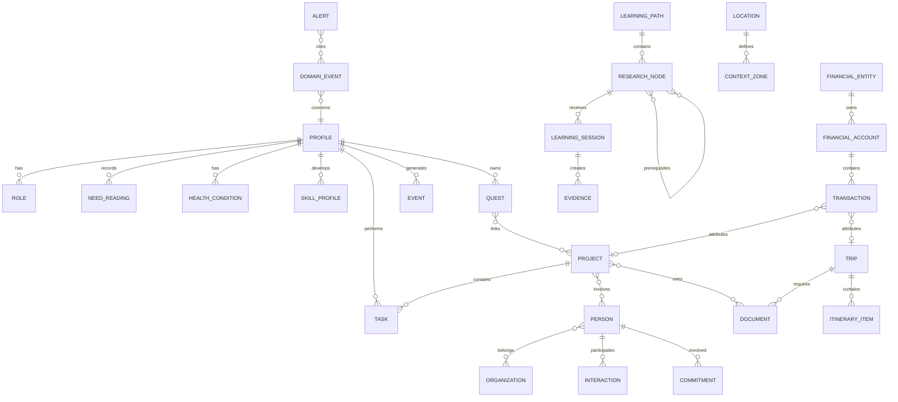
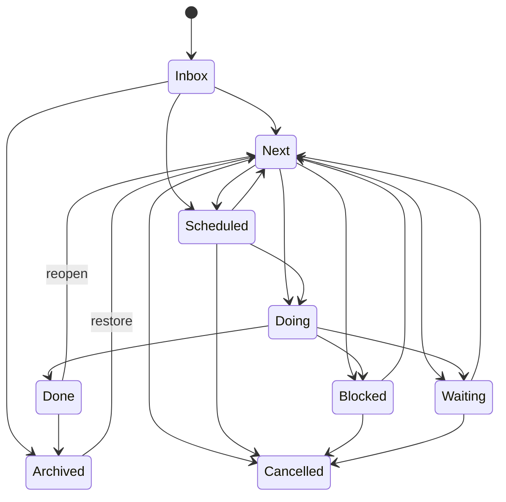
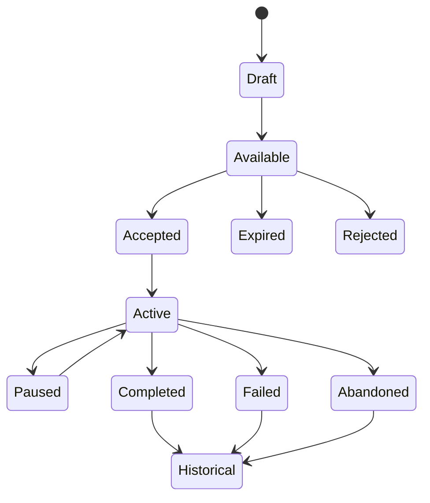

# LIFE COLONY OS
## Especificação de produto, experiência e engenharia para um sistema operacional pessoal inspirado em jogos de gestão de colônia

**Documento:** Product Requirements Document + UX Specification + Technical Design Document + AI Implementation Guide  
**Status:** Especificação mestre v1.0  
**Data de referência:** 6 de agosto de 2026  
**Plataforma primária:** Flutter — Android, iOS, Windows, macOS e Linux; web como cliente secundário  
**Idioma inicial:** Português do Brasil  
**Usuário inicial:** single-user, com arquitetura preparada para múltiplos perfis e compartilhamento seletivo  
**Codinome do produto:** `Life Colony OS`  
**Nome curto sugerido na interface:** `Colônia`  

---

# Índice mestre

- [0. Instrução soberana para a IA desenvolvedora](#0-instrucao-soberana-para-a-ia-desenvolvedora)
- [1. Visão do produto](#1-visao-do-produto)
- [2. Contexto pessoal inicial](#2-contexto-pessoal-inicial)
- [3. Iterações conceituais](#3-iteracoes-conceituais)
- [4. Vocabulário de domínio](#4-vocabulario-de-dominio)
- [5. Princípios de produto e UX](#5-principios-de-produto-e-ux)
- [6. Arquitetura de informação e navegação](#6-arquitetura-de-informacao-e-navegacao)
- [7. Sistema visual original](#7-sistema-visual-original)
- [8. Biblioteca de componentes](#8-biblioteca-de-componentes)
- [9. Tela Colônia](#9-tela-colonia)
- [10. Tela Pawn — visão geral](#10-tela-pawn-visao-geral)
- [11. Necessidades](#11-necessidades)
- [12. Mente, humor e fatores](#12-mente-humor-e-fatores)
- [13. Saúde](#13-saude)
- [14. Capacidades](#14-capacidades)
- [15. Skills e perfil](#15-skills-e-perfil)
- [16. Bio, papéis, traços e valores](#16-bio-papeis-tracos-e-valores)
- [17. Equipamento, inventário e patrimônio físico](#17-equipamento-inventario-e-patrimonio-fisico)
- [18. Trabalho: prioridades](#18-trabalho-prioridades)
- [19. Agenda](#19-agenda)
- [20. Ordens, tarefas e Bills](#20-ordens-tarefas-e-bills)
- [21. Missões e projetos](#21-missoes-e-projetos)
- [22. Pesquisa e aprendizado](#22-pesquisa-e-aprendizado)
- [23. Finanças](#23-financas)
- [24. Relações e facções](#24-relacoes-e-faccoes)
- [25. Casa, locais e zonas](#25-casa-locais-e-zonas)
- [26. Viagens e expedições](#26-viagens-e-expedicoes)
- [27. Caixa de entrada universal](#27-caixa-de-entrada-universal)
- [28. Crônica e histórico](#28-cronica-e-historico)
- [29. Alertas, cartas e atenção](#29-alertas-cartas-e-atencao)
- [30. Storyteller pessoal](#30-storyteller-pessoal)
- [31. Assistente de IA](#31-assistente-de-ia)
- [32. Modelo de dados transversal](#32-modelo-de-dados-transversal)
- [33. Cálculos e índices](#33-calculos-e-indices)
- [34. Arquitetura Flutter](#34-arquitetura-flutter)
- [35. Local-first, sincronização e backup](#35-local-first-sincronizacao-e-backup)
- [36. Segurança e privacidade](#36-seguranca-e-privacidade)
- [37. Integrações](#37-integracoes)
- [38. Importação e qualidade](#38-importacao-e-qualidade)
- [39. Notificações](#39-notificacoes)
- [40. Acessibilidade](#40-acessibilidade)
- [41. Performance](#41-performance)
- [42. Observabilidade local](#42-observabilidade-local)
- [43. Testes](#43-testes)
- [44. CI/CD](#44-cicd)
- [45. Roadmap por vertical slices](#45-roadmap-por-vertical-slices)
- [46. Critérios de aceitação por fluxo](#46-criterios-de-aceitacao-por-fluxo)
- [47. Seeds de demonstração](#47-seeds-de-demonstracao)
- [48. Pseudocódigo de casos de uso](#48-pseudocodigo-de-casos-de-uso)
- [49. Regras de código](#49-regras-de-codigo)
- [50. Definition of Done](#50-definition-of-done)
- [51. Backlog detalhado inicial](#51-backlog-detalhado-inicial)
- [52. ADRs obrigatórios](#52-adrs-obrigatorios)
- [53. Perguntas abertas controladas](#53-perguntas-abertas-controladas)
- [54. Referências de pesquisa e decisões derivadas](#54-referencias-de-pesquisa-e-decisoes-derivadas)
- [55. Prompt de execução para a IA de desenvolvimento](#55-prompt-de-execucao-para-a-ia-de-desenvolvimento)
- [56. Primeiro plano de implementação concreto](#56-primeiro-plano-de-implementacao-concreto)
- [57. Resultado esperado da primeira versão madura](#57-resultado-esperado-da-primeira-versao-madura)
- [58. Onboarding e criação da colônia](#58-onboarding-e-criacao-da-colonia)
- [59. Personalização sem fragmentação](#59-personalizacao-sem-fragmentacao)
- [60. Especificação detalhada de telas](#60-especificacao-detalhada-de-telas)
- [61. Máquinas de estado](#61-maquinas-de-estado)
- [62. Schema relacional inicial](#62-schema-relacional-inicial)
- [63. Contrato de sincronização remoto](#63-contrato-de-sincronizacao-remoto)
- [64. Criptografia detalhada](#64-criptografia-detalhada)
- [65. Matriz de permissões e privacidade](#65-matriz-de-permissoes-e-privacidade)
- [66. Taxonomia de erros](#66-taxonomia-de-erros)
- [67. UX de gráficos e análise](#67-ux-de-graficos-e-analise)
- [68. Motor estatístico local](#68-motor-estatistico-local)
- [69. Foco e execução](#69-foco-e-execucao)
- [70. Sistema de decisões](#70-sistema-de-decisoes)
- [71. Gestão de energia, carga e recuperação](#71-gestao-de-energia-carga-e-recuperacao)
- [72. Conhecimento e biblioteca pessoal](#72-conhecimento-e-biblioteca-pessoal)
- [73. Alimentação, receitas e cozinha](#73-alimentacao-receitas-e-cozinha)
- [74. Empresas e projetos profissionais](#74-empresas-e-projetos-profissionais)
- [75. Critérios de qualidade da IA desenvolvedora](#75-criterios-de-qualidade-da-ia-desenvolvedora)
- [76. Cenários end-to-end de validação](#76-cenarios-end-to-end-de-validacao)
- [77. Checklist de release 1.0](#77-checklist-de-release-10)
- [78. Princípio final de implementação](#78-principio-final-de-implementacao)

---

# 0. Instrução soberana para a IA desenvolvedora

Este documento é a fonte de verdade do produto. A IA encarregada da implementação deve tratá-lo simultaneamente como:

1. especificação funcional;
2. contrato de experiência do usuário;
3. especificação de arquitetura;
4. catálogo de entidades e regras de domínio;
5. plano de testes;
6. ordem de implementação;
7. definição de pronto.

A IA **não deve** tentar implementar todo o sistema em um único salto. Deve desenvolver vertical slices completos, cada um contendo domínio, persistência, estado, interface, testes, telemetria local e documentação. Toda decisão que divergir desta especificação deve ser registrada em um Architecture Decision Record — ADR — com problema, opções, decisão, consequências e plano de reversão.

## 0.1 Regras absolutas

- Não copiar assets, logos, nomes, fontes, sons, ícones, textos, personagens ou layouts pixel a pixel de RimWorld.
- Criar uma linguagem visual original de “painel de gestão de colônia de fronteira”, apenas inspirada em seus princípios de densidade, hierarquia, inspect panes, barras de estado, prioridades e menus contextuais.
- O aplicativo é um **instrumento de reflexão e decisão**, não um árbitro moral.
- Nenhuma pontuação deve definir o valor da pessoa.
- Falhas, dias ruins, doenças, descanso e pausas não podem ser tratados como derrota, punição ou perda de streak irreversível.
- Dados derivados devem sempre informar origem, atualização, confiança e premissas.
- Correlação nunca deve ser apresentada como causalidade comprovada.
- O módulo de saúde não diagnostica, prescreve nem substitui profissionais.
- O módulo financeiro não executa operações, não promete retorno e não fornece recomendação de investimento personalizada sem contexto regulatório apropriado.
- Toda integração sensível deve ser opt-in, granular, revogável e explicável.
- O app deve funcionar de maneira útil sem conta, sem nuvem e sem internet.
- O usuário deve conseguir exportar e apagar integralmente seus dados.
- Toda ação destrutiva deve ser reversível quando tecnicamente possível.
- A primeira versão madura deve privilegiar confiabilidade e legibilidade, não quantidade de animações.

## 0.2 Processo obrigatório de implementação

Para cada épico:

1. ler a seção correspondente;
2. elaborar um plano técnico curto;
3. escrever ou atualizar ADRs;
4. criar modelos e contratos de domínio;
5. escrever testes de regras antes ou junto da implementação;
6. implementar repositório local;
7. implementar caso de uso;
8. implementar estado e tela;
9. adicionar estados vazio, carregando, erro, offline e permissão negada;
10. adicionar acessibilidade e atalhos;
11. executar testes unitários, widget, golden e integração pertinentes;
12. atualizar fixtures e documentação;
13. demonstrar critérios de aceitação;
14. só então iniciar o épico seguinte.

---

# 1. Visão do produto

## 1.1 Declaração de visão

`Life Colony OS` é um sistema operacional pessoal que transforma informações dispersas sobre vida, saúde, finanças, aprendizado, trabalho, relações, projetos, viagens e patrimônio em uma representação coerente, investigável e acionável.

O usuário aparece como o “pawn central” de uma colônia composta por:

- necessidades fisiológicas e psicológicas;
- capacidades atuais;
- competências em desenvolvimento;
- recursos materiais e financeiros;
- compromissos e prioridades;
- projetos e missões;
- relações e responsabilidades;
- ambientes e rotinas;
- eventos externos;
- uma crônica longitudinal da própria vida.

A inspiração em RimWorld não é superficial. O sistema adota a mesma classe de raciocínio que torna um simulador de colônia interessante:

- recursos são limitados;
- atividades competem por tempo e energia;
- decisões têm dependências;
- estados se degradam ou se recuperam;
- pequenos eventos acumulam efeitos;
- contexto muda prioridades;
- indicadores agregados escondem causas que precisam ser inspecionadas;
- o usuário precisa poder alternar entre visão macro e detalhe granular;
- a história emerge do registro dos acontecimentos e das escolhas.

## 1.2 Proposta de valor

O produto deve responder, com poucos toques, às perguntas:

- Como estou, de verdade, agora?
- O que exige minha atenção primeiro e por quê?
- Onde meu tempo, dinheiro e energia estão sendo consumidos?
- Quais compromissos estão em risco?
- Quais hábitos ou contextos parecem estar associados a bons ou maus períodos?
- Que capacidades estou construindo?
- O que avancei nos últimos meses?
- Quais decisões foram tomadas e com quais premissas?
- Qual é o próximo passo mínimo que melhora minha situação?
- Como minha vida mudou ao longo do tempo?

## 1.3 North Star

A métrica principal não será “minutos no app” nem “tarefas concluídas”. Será:

> **Semanas em que o usuário realizou ao menos uma revisão informada e tomou ao menos uma decisão registrada com base em dados suficientemente confiáveis.**

Métricas auxiliares locais:

- tempo até capturar uma informação;
- proporção de itens com próxima ação clara;
- compromissos importantes não esquecidos;
- redução de alertas vencidos;
- qualidade de dados por domínio;
- quantidade de recomendações aceitas, rejeitadas ou corrigidas;
- frequência de exportação/backup bem-sucedido;
- satisfação declarada, não inferida.

## 1.4 Antiobjetivos

O aplicativo não deve se tornar:

- uma lista de tarefas com skin de videogame;
- um score único de vida;
- um mecanismo de culpa por streaks;
- um prontuário médico sem governança;
- uma planilha financeira opaca;
- uma rede social de comparação;
- um coach invasivo;
- um feed infinito;
- uma máquina de notificações;
- um substituto para terapia, medicina, contabilidade ou consultoria financeira;
- uma cópia visual ilegal de RimWorld;
- uma plataforma dependente de nuvem para tarefas básicas.

---

# 2. Contexto pessoal inicial

A configuração inicial deve ser personalizável, porém o seed de desenvolvimento poderá refletir uma pessoa com múltiplas frentes simultâneas:

- formação universitária e aprendizado técnico;
- carreira em ciência de dados, software, produto e negócios;
- projetos empresariais paralelos;
- finanças pessoais e investimentos;
- saúde, sono, alimentação, treino e exames;
- música, piano, guitarra, teoria, composição e escuta ativa;
- viagens complexas com documentos, reservas, roteiro e orçamento;
- interesse em arte, cinema, literatura, história, culinária e idiomas;
- desenvolvimento de software e jogos;
- gestão de casa, equipamentos, compras e manutenção;
- networking, relações pessoais e compromissos sociais.

Esses domínios não devem existir como silos. O produto precisa permitir conexões como:

- uma viagem gera orçamento, documentos, agenda, checklist, aprendizado linguístico e crônica;
- um projeto empresarial gera tarefas, decisões, contatos, riscos, receita esperada e carga mental;
- uma prova gera agenda de estudo, árvore de conteúdo, horas planejadas e impacto temporário na rotina;
- um instrumento musical gera patrimônio, manutenção, prática, repertório e objetivos de aprendizado;
- um exame médico gera documento, métricas, perguntas para consulta e acompanhamento longitudinal;
- uma compra recorrente afeta orçamento, inventário e rotina;
- sono e treino podem ser comparados com energia e foco declarados, sem concluir causalidade automaticamente.

---

# 3. Iterações conceituais

## 3.1 Iteração A — “RimWorld literal” — rejeitada

Ideia: reproduzir menus, cores, tabs, pawn card, work grid e eventos quase literalmente.

Problemas:

- risco de propriedade intelectual;
- ergonomia de mouse não funciona integralmente em celular;
- excesso de densidade para captura cotidiana;
- metáforas violentas ou negativas inadequadas para saúde mental;
- lógica de jogo tende a maximizar produtividade, enquanto a vida exige cuidado, incerteza e descanso;
- interface de simulador pressupõe observador externo onisciente; na vida, os dados são incompletos.

## 3.2 Iteração B — “dashboard bonito de vida” — rejeitada

Ideia: cards de saúde, finanças, estudos e tarefas com gráficos modernos.

Problemas:

- reproduz apps genéricos existentes;
- cards não revelam dependências;
- gráficos mostram o que aconteceu, mas não ajudam a decidir;
- falta história, contexto e inspeção;
- não captura o encanto sistêmico de um simulador de colônia.

## 3.3 Iteração C — “simulador pessoal interpretável” — escolhida

Combina:

- visão de colônia;
- painel detalhado do pawn;
- agenda e prioridades;
- missões e projetos;
- árvore de pesquisa;
- inventário e patrimônio;
- efeitos temporários e contexto;
- alertas orientados a risco;
- crônica narrativa;
- captura rápida no celular;
- análise local e IA opcional;
- design original e acessível.

---

# 4. Vocabulário de domínio

| Conceito no app | Metáfora de gestão | Significado real |
|---|---|---|
| Colônia | Base principal | Visão integrada da vida atual |
| Pawn | Personagem inspecionável | O usuário ou um perfil dependente opcional |
| Necessidade | Need | Estado que requer manutenção: sono, alimentação, descanso, vínculo, etc. |
| Capacidade | Capacity | Aptidão momentânea: energia, mobilidade, foco, disponibilidade |
| Condição | Hediff reinterpretado | Sintoma, lesão, contexto ou estado temporário, sem diagnóstico automático |
| Pensamento | Thought | Evento ou percepção registrada que afeta humor declarado |
| Humor | Mood | Autoavaliação subjetiva e seus fatores informados |
| Trabalho | Work type | Categoria de atividade que compete por capacidade |
| Prioridade | Work priority | Importância operacional por contexto |
| Ordem | Order | Próxima ação concreta |
| Bill | Receita de produção | Rotina repetível com alvo, limite e condições |
| Agenda | Schedule | Blocos de tempo e modos de atividade |
| Missão | Quest | Resultado com recompensa, prazo, risco e critérios |
| Projeto | Construction/quest chain | Resultado composto por marcos e dependências |
| Pesquisa | Research | Aquisição estruturada de conhecimento ou capacidade |
| Skill | Skill | Competência desenvolvida por prática e evidência |
| Paixão | Passion | Interesse intrínseco declarado, não um multiplicador arbitrário |
| Gear | Equipamento | Itens usados e carregados |
| Inventário | Stockpile | Bens, documentos, insumos, assinaturas e ativos físicos |
| Fação | Faction | Empresa, universidade, grupo, família, organização ou comunidade |
| Relação | Social | Vínculo e histórico de interação |
| Zona | Area | Lugar ou contexto em que certas atividades são possíveis |
| Alerta | Alert/letter | Situação que exige ciência ou decisão |
| Incidente | Event | Ocorrência externa ou interna relevante |
| Storyteller | Motor de narrativa | Curadoria de eventos, revisões e desafios, nunca gerador aleatório de crise |
| Crônica | History | Linha do tempo auditável da vida |
| Save | Snapshot | Backup versionado, exportável e restaurável |

---

# 5. Princípios de produto e UX

## 5.1 Macro e micro no mesmo sistema

Toda entidade importante deve ter:

- uma representação resumida;
- uma tela de inspeção;
- histórico;
- origem dos dados;
- relações com outras entidades;
- ações contextuais;
- permissões e privacidade;
- possibilidade de anexar notas ou documentos.

## 5.2 Informação progressiva

A interface terá três níveis:

1. **Sinal:** cor, ícone, barra, badge ou texto curto;
2. **Explicação:** fatores, atualização, confiança e tendência;
3. **Evidência:** eventos, dados brutos, fórmula e fonte.

Nunca obrigar o usuário a interpretar uma barra sem saber como foi produzida.

## 5.3 Densidade controlável

Três modos globais:

- `Foco`: poucos elementos, ações de hoje;
- `Gestão`: densidade padrão, semelhante a um painel de colônia;
- `Análise`: tabelas, filtros, dados e comparações avançadas.

A densidade é uma preferência de visualização, não perfis de dados distintos.

## 5.4 Dados com incerteza

Cada valor derivado pode conter:

```text
value
confidence: 0..1
freshness: current | recent | stale | unknown
sources[]
calculation_version
explanation
```

Um valor sem dados suficientes deve aparecer como “desconhecido”, não como zero.

## 5.5 Cuidado acima de gamificação

- streaks são opcionais e recuperáveis;
- descanso planejado conta como execução correta;
- métricas de saúde podem ser ocultadas;
- não usar vermelho para toda falha;
- permitir “pausar missão”, “reduzir escopo” e “abandonar conscientemente”;
- mostrar progresso absoluto e contexto, não apenas comparação com meta;
- recompensas devem celebrar evidência, reflexão e consistência flexível.

## 5.6 Captura em menos de dez segundos

O usuário deve poder capturar rapidamente:

- tarefa;
- gasto;
- refeição simples;
- sintoma;
- humor/energia;
- ideia;
- aprendizado;
- contato/interação;
- item para comprar;
- documento por foto;
- evento futuro.

A captura pode permanecer na `Caixa de Entrada` para classificação posterior.

## 5.7 Ações irreversíveis exigem fricção; ações comuns não

- criar registro: rápido;
- editar: direto;
- concluir: um toque;
- excluir definitivamente: confirmação + período de lixeira;
- apagar todos os dados: autenticação + frase de confirmação + exportação sugerida;
- enviar dados a IA externa: consentimento por sessão ou regra explícita.

---

# 6. Arquitetura de informação e navegação

## 6.1 Destinos de primeiro nível

1. **Colônia** — visão integrada e mapa operacional;
2. **Pawn** — detalhes pessoais;
3. **Trabalho** — prioridades, ordens, agenda e rotinas;
4. **Missões** — objetivos e projetos;
5. **Pesquisa** — aprendizado e competências;
6. **Recursos** — finanças, patrimônio e inventário;
7. **Relações** — pessoas, organizações e compromissos;
8. **Crônica** — timeline, diário e revisões;
9. **Dados** — integrações, qualidade, importações e exportações;
10. **Configurações**.

## 6.2 Navegação por breakpoint

### Celular compacto

- barra inferior com: Colônia, Pawn, Trabalho, Missões, Mais;
- botão flutuante de captura;
- detalhes abrem como tela completa;
- filtros em bottom sheets;
- tabelas usam linhas fixas, scroll horizontal e presets;
- painel de inspeção pode ser arrastado para cima.

### Tablet

- navigation rail à esquerda;
- conteúdo central;
- inspect pane à direita quando houver seleção;
- suporte a mouse, teclado e touch.

### Desktop

- barra superior fina com data, status de sync, busca/comando e alertas;
- navegação principal inferior ou lateral configurável;
- área central multicoluna;
- inspect pane persistente à esquerda ou direita;
- menus contextuais no clique direito;
- atalhos de teclado completos;
- múltiplas janelas apenas em fase posterior.

## 6.3 Command palette

Atalho: `Ctrl/Cmd + K`.

Comandos:

- navegar para tela;
- criar entidade;
- procurar pessoa, projeto, documento ou transação;
- registrar estado;
- iniciar foco;
- abrir revisão;
- sincronizar;
- exportar;
- executar ação contextual permitida.

A busca deve tolerar acentos, aliases e erros pequenos.

## 6.4 Deep links internos

Exemplos:

```text
/colony
/pawn/me/needs
/pawn/me/health?range=90d
/work/priorities
/work/schedule?date=2026-08-06
/quests/:questId
/research/projects/:researchId
/resources/finance/transactions/:transactionId
/relations/people/:personId
/chronicle/events/:eventId
/data/sources/:sourceId
```

Todo alerta deve abrir exatamente o contexto em que pode ser entendido ou resolvido.

---

# 7. Sistema visual original

## 7.1 Direção artística

Tema: **terminal de colônia civil, industrial e humano**, com painéis escuros, bordas metálicas discretas, superfícies de grafite, tipografia altamente legível e pequenos acentos funcionais.

A aparência deve evocar:

- uma estação remota organizada;
- um painel de comando construído para durar;
- informações densas e pragmáticas;
- humanidade expressa por retratos, crônicas, notas e pequenos detalhes;
- não um HUD militar, cyberpunk neon ou dashboard corporativo.

## 7.2 Tokens de cor

Os tokens abaixo são semânticos; valores finais devem ser validados por contraste WCAG e golden tests.

```yaml
surface:
  void: "#111315"
  base: "#191C1F"
  raised: "#22262A"
  panel: "#292E33"
  hover: "#32383E"
  selected: "#3B434A"

border:
  subtle: "#3B4147"
  standard: "#505861"
  strong: "#727C86"

text:
  primary: "#ECE8DE"
  secondary: "#B9B6AE"
  muted: "#85898D"
  inverse: "#151719"

accent:
  cyan: "#58C7CE"
  sand: "#C7A96A"
  moss: "#83A66B"
  violet: "#A68BC4"
  orange: "#CF8B53"

status:
  good: "#82B97A"
  attention: "#D1B25E"
  risk: "#D27B5F"
  critical: "#D95F5F"
  info: "#6FA8C7"
  unknown: "#7F858C"
```

Regras:

- cor nunca é o único portador de significado;
- barras incluem rótulo ou tooltip;
- críticos têm ícone, texto e contraste;
- o usuário pode ativar paletas para daltonismo;
- existe tema claro, mas o escuro é a direção principal;
- nenhum gradiente decorativo em indicadores quantitativos.

## 7.3 Tipografia

- UI principal: sans humanista de licença aberta;
- números e tabelas: variante tabular;
- títulos de painel: uppercase moderado, tracking pequeno;
- corpo mínimo equivalente a 14 px em desktop e 15–16 px em mobile;
- não usar fonte de RimWorld;
- o design system deve permitir troca global da família.

## 7.4 Forma e profundidade

- radius padrão: 2–6 px, nunca cards excessivamente arredondados;
- bordas visíveis, sombras discretas;
- painéis encaixados, não bolhas flutuantes;
- divisores funcionais;
- seleção com borda e fundo, não apenas sombra;
- texturas somente sutis e opcionais.

## 7.5 Ícones

Criar ou usar biblioteca aberta com estilo consistente:

- contorno de 1.5–2 px;
- silhueta simples;
- legível em 16, 20 e 24 px;
- versões preenchidas apenas para estado ativo;
- categorias têm pictogramas; ações usam verbos visuais.

## 7.6 Movimento

- 100–180 ms para hover/seleção;
- 180–260 ms para painel;
- respeitar reduce motion;
- evitar partículas de recompensa;
- barras animam apenas na primeira apresentação ou mudança real;
- alertas críticos não piscam continuamente.

---

# 8. Biblioteca de componentes

## 8.1 `ColonyPanel`

Contêiner base com:

- título;
- ícone;
- ações;
- estado selecionado;
- opção de colapsar;
- densidade;
- ajuda contextual;
- foco de teclado.

## 8.2 `InspectPane`

Painel reutilizável para qualquer entidade:

- cabeçalho com nome, tipo, status, imagem/ícone;
- tabs;
- resumo curto;
- ações contextuais;
- provenance footer;
- link “abrir completo”.

## 8.3 `NeedBar`

Propriedades:

```dart
NeedBarData(
  label,
  normalizedValue,
  targetBand,
  warningThreshold,
  criticalThreshold,
  direction,
  confidence,
  freshness,
  sourceSummary,
  statusText,
)
```

Suporta:

- faixa-alvo em vez de meta exata;
- valor desconhecido;
- tendência;
- previsão opcional;
- tooltip com fórmula;
- modo sem cor.

## 8.4 `ModifierList`

Lista de fatores positivos, negativos e incertos:

```text
Sono insuficiente               -12   confiança média
Treino concluído                 +4   informado pelo usuário
Semana de prova                  -?   contexto, sem peso automático
```

Pesos só aparecem quando existem e são interpretáveis.

## 8.5 `PriorityCell`

- valores: bloqueado, 1, 2, 3, 4, automático;
- clique/toque alterna;
- shift modifica intervalo;
- drag preenche várias células;
- tooltip explica conflito;
- acessível por teclado.

## 8.6 `TimelineLetter`

Evento estilo “carta”:

- severidade;
- título;
- resumo;
- timestamp;
- entidade relacionada;
- ações;
- estado lido, resolvido, adiado ou arquivado;
- fonte;
- opcionalmente narrativa gerada.

## 8.7 `DataProvenanceBadge`

Estados:

- manual;
- importado;
- integração;
- inferido;
- IA;
- corrigido;
- conflitado.

## 8.8 `ConfidenceChip`

Nunca mostrar falsa precisão. Labels padrão:

- alta;
- média;
- baixa;
- insuficiente.

O valor decimal fica disponível no detalhe técnico.

## 8.9 `ContextActionMenu`

Inspirado em ordens contextuais:

- só exibe ações possíveis;
- ações indisponíveis podem aparecer desabilitadas com motivo;
- grupos: executar, planejar, relacionar, registrar, compartilhar, arquivar;
- no desktop, clique direito;
- no mobile, long press ou botão de ações.

---

# 9. Tela Colônia

## 9.1 Objetivo

Exibir a situação operacional atual, não uma coleção de vanity metrics.

## 9.2 Layout desktop

### Barra superior

- data e hora local;
- modo atual: Foco, Gestão ou Análise;
- status local/sync;
- busca/comando;
- sino de alertas;
- avatar do pawn.

### Coluna esquerda — pawn bar

- retrato original abstrato ou customizado;
- nome;
- atividade atual;
- energia declarada/estimada;
- humor declarado;
- próximo compromisso;
- badges de alertas.

Preparada para perfis adicionais: parceiro, filho, pet ou equipe pessoal, sempre com consentimento e escopo explícito.

### Centro — mapa operacional

Não é mapa geográfico literal. É um “mapa da base” configurável com setores:

- Saúde;
- Trabalho;
- Empresas;
- Universidade;
- Finanças;
- Música;
- Casa;
- Relações;
- Viagens;
- Cultura;
- Caixa de entrada.

Cada setor é um bloco modular mostrando:

- estado;
- trabalho em andamento;
- recurso limitante;
- próximo marco;
- alertas;
- tendência.

O usuário pode reorganizar os setores por drag-and-drop. Layout salvo por dispositivo e sincronizado como preferência.

### Direita — alertas e cartas

Ordenação padrão:

1. segurança e saúde urgente;
2. prazo inadiável;
3. risco financeiro;
4. conflito de agenda;
5. decisão aguardando;
6. manutenção;
7. oportunidade;
8. informação.

### Inferior — barra principal

Ícones e rótulos dos destinos de primeiro nível, evocando menus de gestão, mas com design original.

## 9.3 Widgets do mapa operacional

### Estado da colônia

Não mostrar score único. Exibir matriz:

| Dimensão | Estado | Tendência | Confiança |
|---|---|---|---|
| Capacidade | Sustentável | ↓ | média |
| Compromissos | Sob controle | → | alta |
| Finanças | Estável | → | alta |
| Saúde | Dados incompletos | ? | baixa |
| Aprendizado | Em progresso | ↑ | alta |
| Carga mental | Elevada | ↑ | média |

### Agora

- atividade atual;
- tempo decorrido;
- próxima transição;
- ações: pausar, concluir, registrar bloqueio, mudar plano.

### Próximas 24 horas

Linha temporal compacta com conflitos e margens de deslocamento.

### Recursos críticos

Exemplos:

- horas livres até o fim da semana;
- orçamento discricionário restante;
- sono acumulado informado;
- tarefas de alta prioridade abertas;
- documentos de viagem pendentes.

### Construções em andamento

Projetos ativos com progresso por entregável real, não percentual subjetivo.

## 9.4 Modo incidente

Quando há incidente crítico confirmado pelo usuário:

- reduzir densidade;
- destacar apenas fatos, contatos, ações e documentos relevantes;
- suspender gamificação;
- oferecer checklist seguro;
- não gerar recomendações especulativas.

Exemplos: perda de documento em viagem, prazo financeiro, ida a atendimento de saúde, vazamento em casa.

---

# 10. Tela Pawn — visão geral

## 10.1 Cabeçalho

- retrato/avatar;
- nome preferido;
- idade opcional;
- ocupações/roles atuais;
- localização geral opcional;
- atividade atual;
- disponibilidade;
- status de dados;
- botão de privacidade rápida.

## 10.2 Tabs

1. Resumo;
2. Necessidades;
3. Saúde;
4. Mente;
5. Capacidades;
6. Skills;
7. Perfil;
8. Equipamento;
9. Social;
10. Bio;
11. Histórico.

## 10.3 Resumo

Blocos:

- necessidades mais relevantes;
- condições ativas;
- agenda próxima;
- papéis atuais;
- competências em foco;
- missões ativas;
- relações recentes;
- itens/documentos carregados;
- notas fixadas.

O resumo deve explicar “o que está acontecendo”, não apenas exibir números.

---

# 11. Necessidades

## 11.1 Modelo

Necessidades são configuráveis. Seed inicial:

- sono;
- alimentação;
- hidratação;
- movimento;
- descanso não produtivo;
- conexão social;
- autonomia;
- variedade/recreação;
- ambiente;
- segurança financeira percebida;
- foco mental;
- tempo sozinho;
- expressão criativa.

Algumas são objetivas, outras subjetivas. O app deve diferenciar.

## 11.2 Fontes

- autoavaliação rápida;
- registros manuais;
- agenda;
- sensores autorizados;
- dados importados;
- regras personalizadas;
- estimativas transparentes.

## 11.3 Atualização

Cada necessidade define:

```yaml
calculation_mode: manual | rule_based | imported | hybrid
refresh_policy: event | hourly | daily | on_open
validity_window: duration
preferred_range: [min, max]
warning_behavior: silent | dashboard | notification
privacy_class: standard | sensitive | highly_sensitive
```

## 11.4 Tela

Esquerda:

- barras;
- tendência;
- atualização;
- origem.

Direita:

- fatores associados;
- eventos recentes;
- ações de cuidado disponíveis;
- comparação opcional com faixa pessoal;
- botão “isso está errado”.

## 11.5 Regras de segurança

- sem score de “disciplina”;
- sem penalizar descanso;
- sem meta calórica automática sem configuração consciente;
- sem inferir transtorno, depressão, ansiedade ou doença;
- permitir ocultar qualquer necessidade;
- dados subjetivos prevalecem sobre inferências quando conflitantes.

---

# 12. Mente, humor e fatores

## 12.1 Check-in

Check-in mínimo:

- humor: escala de 5 ou 7 pontos configurável;
- energia;
- tensão;
- foco;
- nota opcional;
- tags de contexto.

O usuário pode escolher linguagem numérica, verbal ou visual.

## 12.2 “Pensamentos” reinterpretados

São fatores registrados ou sugeridos:

- interação positiva;
- preocupação com prazo;
- ambiente agradável;
- frustração técnica;
- música/prática;
- viagem;
- conflito;
- dor ou desconforto;
- descanso;
- avanço significativo.

Sugestões automáticas devem ser confirmadas antes de afetar qualquer resumo subjetivo.

## 12.3 Decomposição de humor

A tela pode exibir:

```text
Humor declarado: bom
Fatores mencionados:
  + Ensaio produtivo
  + Conversa com amigo
  - Sono curto
  - Incerteza sobre prazo
Dados relacionados disponíveis, mas não confirmados:
  ? Dia com alta carga de reuniões
```

Nunca somar fatores arbitrários para substituir o humor declarado.

## 12.4 Diário orientado

Prompts opcionais:

- O que consumiu energia?
- O que restaurou energia?
- Qual preocupação precisa virar ação, decisão ou aceitação?
- O que foi melhor do que parecia?
- Há algo que deve ser levado a um profissional?

---

# 13. Saúde

## 13.1 Escopo

O módulo organiza:

- sintomas;
- condições informadas por profissional;
- medicamentos e suplementos registrados pelo usuário;
- consultas;
- exames e documentos;
- sono;
- atividade física;
- medidas corporais;
- alimentação em nível escolhido;
- perguntas para profissionais;
- histórico e correlações exploratórias.

## 13.2 Tabs

1. Visão geral;
2. Corpo;
3. Condições ativas;
4. Sono;
5. Treino;
6. Nutrição;
7. Exames;
8. Consultas;
9. Medicações;
10. Documentos;
11. Insights;
12. Permissões.

## 13.3 Body map

Ilustração original neutra, frontal e posterior. O usuário pode registrar região, intensidade, natureza, início, duração e nota. Não sugerir diagnóstico a partir da região.

## 13.4 Condição de saúde

```yaml
HealthCondition:
  id
  title
  type: symptom | diagnosis_reported | injury | recovery | context
  status: active | monitoring | resolved | archived
  onset_at
  resolved_at
  severity_user_reported
  body_regions[]
  clinician_confirmed: bool
  clinician_name_optional
  notes
  attachments[]
  related_measurements[]
  red_flag_acknowledgements[]
```

## 13.5 Exames

Pipeline:

1. importar PDF, imagem ou dado estruturado;
2. preservar arquivo original imutável;
3. extrair texto localmente quando possível;
4. permitir revisão manual;
5. estruturar analitos, unidade, referência, laboratório e data;
6. manter valor original e valor normalizado separados;
7. detectar mudanças de unidade;
8. mostrar tendência sem diagnóstico;
9. gerar perguntas, não conclusões clínicas.

## 13.6 Integrações

- Android Health Connect;
- Apple HealthKit;
- importação CSV/JSON;
- dispositivos via APIs específicas futuramente.

Permissões devem ser por tipo de dado. Configurações devem permitir pausar sincronização e abrir o gerenciador de acesso do sistema.

## 13.7 Segurança clínica

O motor deve conter uma camada determinística de segurança para termos potencialmente urgentes. O comportamento correto não é diagnosticar, mas recomendar busca de atendimento apropriado quando o próprio usuário registra sinais de alerta configurados por fontes médicas validadas.

Qualquer feature dessa natureza exige revisão clínica antes de produção.

## 13.8 Correlações exploratórias

Exemplo:

```text
Nos 18 dias com registro suficiente, energia matinal foi maior após noites com mais sono.
Associação observacional; n=18; dados de sono com cobertura de 72%; sem controle de variáveis.
```

Obrigatório mostrar:

- tamanho da amostra;
- cobertura;
- período;
- método;
- variáveis ausentes;
- não causalidade.

---

# 14. Capacidades

Capacidades são estados operacionais, não atributos fixos:

- energia;
- foco;
- mobilidade;
- tolerância social;
- disponibilidade temporal;
- capacidade financeira discricionária;
- capacidade de decisão;
- criatividade;
- recuperação.

Cada capacidade pode ser:

- informada;
- estimada;
- desconhecida.

## 14.1 Readiness contextual

Não criar “readiness global”. Criar prontidão para uma atividade específica.

```text
Prontidão para treino intenso
  sono recente          0.30
  recuperação declarada 0.25
  dor declarada         0.25
  agenda/logística      0.10
  preferência pessoal   0.10
```

A fórmula é editável, versionada e explicável. Para atividades sensíveis, a decisão final é sempre do usuário ou profissional.

---

# 15. Skills e perfil

## 15.1 Categorias iniciais

- Programação;
- Ciência de dados;
- Engenharia de software;
- Produto e UX;
- Negócios e liderança;
- Finanças e derivativos;
- Comunicação;
- Piano;
- Guitarra;
- Teoria musical;
- Composição;
- Culinária;
- Idiomas;
- Literatura;
- História da arte;
- Cinema;
- Condicionamento físico;
- Organização doméstica;
- Viagem e autonomia prática.

## 15.2 Evidência de skill

Progresso não deve depender apenas de XP por tempo. Evidências possíveis:

- sessão de prática;
- projeto entregue;
- avaliação;
- peça executada;
- prova;
- feedback;
- artefato;
- explicação produzida;
- repetição espaçada;
- observação pessoal.

## 15.3 Níveis

Escala sem falsa objetividade:

```text
0 Não iniciado
1 Familiaridade
2 Fundamentos assistidos
3 Execução independente básica
4 Competência consistente
5 Competência avançada
6 Referência/ensino
```

Cada skill pode adotar rubrica própria.

## 15.4 Paixões e interesses

`InterestProfile`:

- interesse atual;
- importância de longo prazo;
- prazer durante a prática;
- desejo de aprofundar;
- fase: explorar, construir, manter, pausar.

A UI pode usar uma, duas ou três chamas originais, mas sem copiar o ícone do jogo.

## 15.5 Decaimento

Não reduzir nível silenciosamente. Mostrar:

- “última evidência há X dias”;
- “confiança na avaliação pode estar desatualizada”;
- opção de reavaliar.

---

# 16. Bio, papéis, traços e valores

## 16.1 Bio

- linha do tempo de formação;
- empregos;
- mudanças de cidade/casa;
- viagens importantes;
- projetos;
- marcos pessoais;
- artefatos associados.

## 16.2 Papéis atuais

Exemplos:

- estudante;
- cientista de dados;
- desenvolvedor;
- fundador;
- irmão;
- amigo;
- músico;
- viajante;
- morador/gestor da casa.

Cada papel pode ter:

- responsabilidades;
- pessoas relacionadas;
- compromissos recorrentes;
- métricas relevantes;
- limites;
- data de revisão.

## 16.3 Traços

Traços são auto descrições editáveis, nunca inferências rígidas. Devem aceitar contradição e contexto.

```yaml
Trait:
  label: "Curioso"
  evidence_notes: []
  contexts_where_helpful: []
  contexts_where_costly: []
  confidence: user_asserted
  review_at
```

## 16.4 Valores

Valores têm:

- definição pessoal;
- comportamentos observáveis;
- tensões com outros valores;
- exemplos recentes;
- tempo e dinheiro associados;
- revisão trimestral.

O app pode comparar alocação de recursos com valores, mas deve tratar isso como ferramenta reflexiva, não julgamento.

---

# 17. Equipamento, inventário e patrimônio físico

## 17.1 Tipos

- carregado;
- em casa;
- emprestado;
- armazenado;
- em manutenção;
- vendido/doado;
- documento;
- assinatura/licença;
- consumível.

## 17.2 Exemplos

- computador;
- celular;
- instrumentos musicais;
- cabos e acessórios;
- documentos de viagem;
- medicamentos;
- eletrodomésticos;
- roupas importantes;
- equipamentos de treino;
- livros;
- licenças de software.

## 17.3 Campos

```yaml
InventoryItem:
  id
  name
  category
  status
  location_id
  owner_profile_id
  purchase_date
  purchase_price
  current_value_optional
  serial_number_encrypted
  warranty_end
  maintenance_interval
  next_maintenance_at
  attachments[]
  tags[]
  linked_financial_asset_id
```

## 17.4 Loadout

Loadouts contextuais:

- faculdade;
- trabalho;
- viagem internacional;
- ensaio;
- academia;
- emergência;
- fim de semana.

Checklist pode ser gerado por diferença entre loadout e itens confirmados, sem rastrear localização física automaticamente por padrão.

---

# 18. Trabalho: prioridades

## 18.1 Objetivo

Representar quais categorias devem receber atenção sob diferentes contextos.

## 18.2 Work types iniciais

- Saúde urgente;
- Administração pessoal;
- Universidade;
- Trabalho principal;
- Empresa/projeto A;
- Empresa/projeto B;
- Finanças;
- Casa;
- Relações;
- Música;
- Aprendizado geral;
- Exercício;
- Planejamento de viagem;
- Descanso e recreação;
- Captura e organização.

## 18.3 Grade de prioridades

Linhas podem ser papéis, contextos ou perfis. Colunas são work types.

Valores:

- `1` imediato;
- `2` alta;
- `3` normal;
- `4` baixa;
- `A` automática;
- `—` desabilitada.

Presets:

- semana normal;
- semana de prova;
- viagem;
- crise de saúde;
- fechamento de projeto;
- férias;
- recuperação.

## 18.4 Motor de seleção

Uma atividade candidata recebe score operacional apenas para ordenação, não valor moral:

```text
priority_score =
  explicit_priority_weight
  + deadline_pressure
  + dependency_unblocking
  + risk_reduction
  + context_fit
  + energy_fit
  + batching_bonus
  - switching_cost
  - estimated_overload
```

Cada parcela deve ser explicável e desligável. O usuário pode ordenar manualmente.

## 18.5 Conflitos

Exibir:

- duas prioridades 1 competindo;
- atividade incompatível com local;
- falta de tempo estimada;
- dependência pendente;
- energia informada incompatível;
- tarefa aguardando outra pessoa;
- excesso de work in progress.

---

# 19. Agenda

## 19.1 Modos de bloco

- Dormir;
- Rotina;
- Foco;
- Aula/reunião;
- Flexível;
- Exercício;
- Deslocamento;
- Social;
- Recreação;
- Recuperação;
- Livre;
- Indisponível.

## 19.2 Grade 24 horas

Inspirada em schedule grids, mas adaptada:

- 24 colunas em desktop ou timeline vertical em mobile;
- presets por dia;
- seleção por arraste;
- recorrência;
- margem de transição;
- timezone;
- viagem;
- sono cruzando meia-noite;
- diferença entre plano e realizado.

## 19.3 Integração de calendário

- importar eventos;
- associar a missão, projeto, pessoa ou lugar;
- preservar ID externo;
- não alterar calendário externo sem confirmação;
- detectar conflito;
- considerar deslocamento e preparação;
- suportar eventos sem hora e janelas de data.

## 19.4 Planejamento por capacidade

A agenda mostra orçamento de:

- tempo;
- energia esperada;
- foco profundo;
- sociabilidade;
- deslocamento.

Não bloquear agendamento; apenas explicar riscos.

---

# 20. Ordens, tarefas e Bills

## 20.1 Task

```yaml
Task:
  id
  title
  description
  status: inbox | next | scheduled | doing | blocked | waiting | done | cancelled | archived
  work_type_id
  project_id_optional
  quest_id_optional
  due_at_optional
  scheduled_start_optional
  estimated_duration_optional
  actual_duration_optional
  energy_requirement: low | medium | high | unknown
  context_ids[]
  location_id_optional
  assignee_profile_id
  waiting_for_person_id_optional
  dependencies[]
  recurrence_rule_optional
  source
  created_at
  completed_at
```

## 20.2 Bill

Uma `Bill` gera ou mantém ações repetíveis com condições.

Exemplos:

- praticar piano 3 vezes por semana, sem recuperar sessões perdidas automaticamente;
- revisar finanças todo dia 5;
- fazer backup quando houver 7 dias sem snapshot;
- revisar assinaturas trimestralmente;
- estudar um tópico até atingir evidência definida;
- agendar manutenção 30 dias antes da garantia.

```yaml
Bill:
  recipe_id
  target_quantity_or_state
  repeat_mode: fixed | until_state | maintain_stock | interval | quota_window
  conditions[]
  pause_rules[]
  generation_policy
  priority
```

## 20.3 Próxima ação

Todo projeto ativo deve ter ao menos uma próxima ação ou um motivo explícito:

- aguardando;
- incubado;
- bloqueado;
- sem decisão;
- concluído.

---

# 21. Missões e projetos

## 21.1 Diferença

- **Projeto:** estrutura de trabalho para produzir um resultado.
- **Missão:** framing de decisão com propósito, risco, prazo e recompensa.

Um projeto pode existir sem gamificação. Uma missão pode envolver vários projetos.

## 21.2 Tipos

- principal;
- secundária;
- recorrente;
- expedição/viagem;
- manutenção;
- aprendizado;
- oportunidade;
- emergência;
- experimento;
- someday/maybe.

## 21.3 Estrutura de missão

```yaml
Quest:
  title
  narrative_summary
  purpose
  success_criteria[]
  failure_or_exit_criteria[]
  deadline_optional
  acceptance_deadline_optional
  status
  stakes
  risks[]
  rewards[]
  costs[]
  prerequisites[]
  linked_projects[]
  linked_people[]
  linked_locations[]
  decision_log[]
  review_cadence
```

## 21.4 Recompensas

Recompensa pode ser:

- resultado real;
- aprendizado;
- experiência;
- dinheiro;
- relação fortalecida;
- item;
- descanso planejado;
- marco simbólico.

O app nunca deve criar gasto impulsivo como recompensa padrão.

## 21.5 Dificuldade

Dificuldade é uma avaliação composta e transparente:

- esforço;
- incerteza;
- dependências;
- custo;
- prazo;
- exposição social;
- novidade;
- risco.

Representar por dimensões, não apenas estrelas.

## 21.6 Quest chain

Exemplo de viagem internacional:

1. documentos;
2. seguro;
3. conectividade;
4. pagamentos;
5. reservas;
6. roteiro;
7. bagagem;
8. execução;
9. reconciliação financeira;
10. crônica e aprendizados.

---

# 22. Pesquisa e aprendizado

## 22.1 Visão

A árvore de pesquisa representa competências e conhecimentos desejados. Projetos ficam à direita de pré-requisitos. O usuário pode explorar livremente, mas só marcar domínio quando houver evidência.

## 22.2 Tipos de nó

- conceito;
- técnica;
- ferramenta;
- obra;
- curso;
- projeto;
- avaliação;
- repertório;
- hábito de prática;
- marco.

## 22.3 Estados

- desconhecido;
- descoberto;
- disponível;
- em pesquisa;
- praticando;
- demonstrado;
- dominado para o objetivo atual;
- desatualizado;
- arquivado.

## 22.4 Pesquisa ativa

Diferente do jogo, múltiplas pesquisas podem existir, mas o app deve recomendar limite de WIP configurável, por exemplo:

- 1 foco principal;
- 2 secundários;
- explorações ilimitadas sem compromisso.

## 22.5 Sessão de aprendizado

```yaml
LearningSession:
  node_id
  started_at
  duration
  mode: read | watch | practice | build | teach | review | assess
  source_id_optional
  notes
  questions[]
  evidence_created[]
  perceived_difficulty
  focus_quality_optional
  next_step
```

## 22.6 Repetição espaçada

Pode existir como subsistema, mas não deve obrigar todo conhecimento a virar flashcard. Suportar:

- cartões;
- exercícios;
- repertório;
- revisão de projeto;
- recordação livre;
- prática intercalada.

## 22.7 Trilhas personalizadas

Exemplos:

- francês;
- harmonia jazzística;
- piano de acompanhamento;
- história da arte;
- culinária técnica;
- arquitetura Flutter;
- derivativos;
- cinema por movimentos;
- game engine.

Cada trilha tem definição de “bom o suficiente”.

---

# 23. Finanças

## 23.1 Objetivos

- saber posição e fluxo;
- reconciliar transações;
- planejar compromissos;
- analisar categorias;
- acompanhar ativos e passivos;
- separar pessoal e empresas;
- simular cenários;
- controlar viagens e projetos;
- registrar decisões financeiras.

## 23.2 Submódulos

1. Contas;
2. Transações;
3. Orçamento;
4. Fluxo de caixa;
5. Patrimônio;
6. Investimentos;
7. Dívidas;
8. Assinaturas;
9. Metas;
10. Viagens;
11. Cenários;
12. Documentos;
13. Importações;
14. Regras.

## 23.3 Multi-entidade

`FinancialEntity`:

- pessoal;
- empresa A;
- empresa B;
- projeto;
- viagem;
- compartilhada.

Transferências entre entidades devem ser explicitamente representadas para evitar dupla contagem.

## 23.4 Conta

```yaml
FinancialAccount:
  institution
  name
  type: checking | savings | cash | credit_card | investment | receivable | payable | other
  currency
  owner_entity_id
  external_connection_id_optional
  current_balance
  balance_as_of
  include_in_net_worth
  sensitive_display_mode
```

## 23.5 Transação

```yaml
Transaction:
  account_id
  external_id_optional
  occurred_at
  posted_at_optional
  description_original
  merchant_normalized_optional
  amount_minor
  currency
  direction
  category_id_optional
  subcategory_id_optional
  project_id_optional
  trip_id_optional
  person_id_optional
  transfer_pair_id_optional
  installment_group_id_optional
  status: pending | posted | reconciled | ignored
  source
  import_batch_id_optional
  fingerprint
```

## 23.6 Classificação

- regras determinísticas primeiro;
- sugestão por modelo local/IA depois;
- nunca sobrescrever classificação manual sem pedir;
- aprender com correções;
- mostrar confiança;
- suportar split.

## 23.7 Orçamento

Modelos:

- envelope;
- limite mensal;
- rolling average;
- projeto;
- viagem;
- anual;
- meta de caixa.

Permitir despesas que pertencem ao mês seguinte ou a uma viagem específica.

## 23.8 Investimentos

Representar:

- ativo;
- corretora;
- classe;
- quantidade;
- custo;
- preço importado ou manual;
- indexador;
- vencimento;
- liquidez;
- impostos estimados opcionais;
- tese/decisão;
- documentos.

Não calcular rentabilidade misturando aportes sem método explícito. Suportar TWR e XIRR com explicação.

## 23.9 Open Finance

A integração real no Brasil não deve ser presumida como uma API aberta a qualquer app pessoal sem requisitos. Implementar camada de provedor:

```dart
abstract interface class BankingDataProvider {
  Future<ConsentSession> beginConsent(...);
  Stream<ImportProgress> syncAccounts(...);
  Future<void> revokeConsent(...);
}
```

Fase inicial:

- OFX;
- CSV;
- PDF assistido;
- e-mail/arquivo exportado pelo banco;
- entrada manual.

Fase posterior:

- parceiro regulado/agregador compatível;
- consentimento explícito;
- escopo e validade visíveis;
- revogação simples;
- auditoria.

## 23.10 Simulação

Cenários usam premissas editáveis:

- renda;
- custo fixo;
- inflação;
- viagem;
- compra;
- aporte;
- câmbio;
- prazo.

Resultados devem separar:

- dado observado;
- premissa;
- cálculo;
- incerteza.

---

# 24. Relações e facções

## 24.1 Pessoa

```yaml
Person:
  display_name
  preferred_name
  relationship_types[]
  organization_ids[]
  contact_methods_encrypted[]
  birthday_optional
  location_general_optional
  important_context
  boundaries_notes_private
  last_interaction_at
  next_follow_up_optional
  consent_scope_optional
```

## 24.2 Interação

- encontro;
- ligação;
- mensagem;
- reunião;
- ajuda;
- conflito;
- decisão;
- promessa;
- presente;
- introdução.

Registrar relações não deve transformar pessoas em CRM comercial involuntário. Informações sensíveis sobre terceiros exigem minimização e proteção.

## 24.3 Facções/organizações

- empresa;
- universidade;
- grupo de amigos;
- família;
- associação;
- comunidade;
- fornecedor;
- instituição financeira;
- clínica.

Campos:

- relação;
- reputação subjetiva privada;
- compromissos;
- pessoas;
- documentos;
- projetos;
- decisões;
- riscos.

## 24.4 Promessas

Entidade explícita:

```yaml
Commitment:
  made_by
  made_to
  description
  due_at_optional
  status
  source_event_id
  privacy_level
```

O app pode lembrar compromissos, sem calcular “qualidade da amizade”.

---

# 25. Casa, locais e zonas

## 25.1 Local

- casa;
- trabalho;
- universidade;
- academia;
- estúdio;
- cidade;
- hotel;
- aeroporto;
- destino de viagem.

## 25.2 Zona contextual

Uma zona define atividades possíveis e restrições:

```yaml
ContextZone:
  name
  location_id_optional
  capabilities[]
  unavailable_work_types[]
  required_items[]
  connectivity
  noise_profile
  privacy_profile
```

Exemplo: “avião” permite leitura offline e notas, mas não chamadas ou tarefas dependentes de rede.

## 25.3 Manutenção doméstica

- item/sistema;
- periodicidade;
- fornecedor;
- custo;
- garantia;
- histórico;
- checklist;
- documentação.

---

# 26. Viagens e expedições

## 26.1 Trip

```yaml
Trip:
  title
  destinations[]
  timezone_sequence[]
  start_at
  end_at
  participants[]
  purpose
  budget_id
  documents[]
  bookings[]
  itinerary_items[]
  packing_loadout_id
  contingencies[]
  local_connectivity_plan
  payment_plan
  insurance_policy_optional
```

## 26.2 Itinerário

- voo;
- trem;
- hotel;
- curso;
- tour;
- refeição;
- deslocamento;
- tempo livre;
- compra;
- margem;
- descanso.

## 26.3 Modo viagem

- dados essenciais disponíveis offline;
- relógios de timezone;
- documentos com acesso biométrico;
- endereços e textos úteis;
- orçamento em moedas;
- reconciliação rápida;
- checklist de saída;
- alerta de passaporte/documento;
- sem IA remota por padrão em rede não confiável.

## 26.4 Contingência

Para cada reserva importante:

- contato;
- política;
- comprovante;
- alternativa;
- prazo para mudança;
- custo de falha.

---

# 27. Caixa de entrada universal

## 27.1 Entrada

Fontes:

- texto;
- voz;
- foto;
- arquivo;
- share sheet;
- e-mail encaminhado futuramente;
- clipboard;
- widget;
- atalho de teclado.

## 27.2 Classificação

Tipos sugeridos:

- tarefa;
- evento;
- gasto;
- nota;
- documento;
- pessoa;
- item;
- sintoma;
- refeição;
- aprendizado;
- projeto;
- ideia.

O classificador nunca deve remover o item original.

## 27.3 Processamento

Ações:

- fazer agora;
- transformar;
- relacionar;
- agendar;
- delegar/aguardar;
- arquivar;
- descartar;
- deixar na inbox.

Métrica principal: itens com significado e próxima ação claros, não inbox zero obrigatório.

---

# 28. Crônica e histórico

## 28.1 Event sourcing pragmático

Não é necessário reconstruir toda a aplicação apenas por eventos, mas toda mudança relevante deve gerar um `DomainEvent` auditável.

```yaml
DomainEvent:
  id
  aggregate_type
  aggregate_id
  event_type
  occurred_at
  recorded_at
  actor
  source
  payload_version
  payload
  correlation_id_optional
  causation_id_optional
  privacy_class
```

## 28.2 Timeline

Filtros:

- domínio;
- pessoa;
- projeto;
- período;
- severidade;
- local;
- fonte;
- manual/automático;
- marco.

## 28.3 Crônica narrativa

A IA pode produzir resumos semanais/mensais a partir de eventos selecionados, mas:

- sempre manter links para evidências;
- distinguir fatos de interpretação;
- permitir editar;
- nunca inventar emoção;
- respeitar exclusões por domínio;
- armazenar prompt, modelo e versão quando salvo.

## 28.4 Revisões

### Diária — 2 a 5 minutos

- o que aconteceu;
- estado atual;
- compromissos de amanhã;
- uma correção de rota.

### Semanal — 15 a 30 minutos

- fatos;
- vitórias;
- problemas;
- recursos;
- projetos;
- relações;
- aprendizado;
- finanças;
- próxima semana.

### Mensal

- fluxo financeiro;
- saúde e energia;
- progresso por skill;
- decisões;
- mudanças de prioridade;
- itens para abandonar.

### Trimestral

- papéis;
- valores;
- estratégia;
- portfólio de projetos;
- patrimônio;
- visão de longo prazo.

---

# 29. Alertas, cartas e atenção

## 29.1 Categorias

- crítico;
- ação necessária;
- prazo;
- risco;
- conflito;
- manutenção;
- dado ausente;
- oportunidade;
- insight;
- informativo.

## 29.2 Estrutura

```yaml
Alert:
  title
  body
  severity
  category
  generated_by: rule | integration | user | ai
  evidence_refs[]
  confidence
  created_at
  expires_at_optional
  snooze_options[]
  recommended_actions[]
  status
  deduplication_key
```

## 29.3 Budget de atenção

- máximo de notificações push por dia configurável;
- críticos furam o limite apenas sob regra validada;
- oportunidades ficam no inbox;
- alertas repetidos são agrupados;
- snooze inteligente não altera prazo real;
- canal silencioso para dados incompletos.

## 29.4 Explicabilidade

Todo alerta automático responde:

- O que ocorreu?
- Por que isso importa?
- De onde veio?
- Qual a confiança?
- O que posso fazer?
- Como desligar ou ajustar esta regra?

---

# 30. Storyteller pessoal

## 30.1 Objetivo

O Storyteller é um curador de ritmo e reflexão, não um gerador de caos. Ele seleciona momentos adequados para:

- revisão;
- celebração discreta;
- desafio opcional;
- detecção de projeto estagnado;
- lembrança de valor negligenciado;
- sugestão de reduzir escopo;
- convite a documentar um marco.

## 30.2 Perfis

- `Calmo`: poucas intervenções;
- `Analista`: mais insights e dados;
- `Explorador`: sugere experiências;
- `Guardião`: prioriza manutenção e risco;
- `Personalizado`.

Não usar nomes de storytellers do jogo.

## 30.3 Regras

- sem eventos falsos;
- sem criar urgência artificial;
- sem desafios durante incidente ou baixa capacidade declarada;
- respeitar quiet hours;
- máximo semanal;
- toda sugestão é dispensável;
- feedback positivo/negativo ajusta frequência.

## 30.4 Motor híbrido

1. regras determinísticas detectam candidatos;
2. ranking local seleciona relevância;
3. IA opcional redige texto;
4. safety filter remove linguagem inadequada;
5. usuário pode inspecionar motivo.

---

# 31. Assistente de IA

## 31.1 Funções permitidas

- classificar inbox com confirmação;
- resumir dados selecionados;
- encontrar entidades relacionadas;
- propor próxima ação;
- decompor projeto;
- gerar perguntas para consulta;
- explicar tendência;
- criar rascunho de revisão;
- converter linguagem natural em filtro;
- sugerir regras;
- comparar cenários;
- detectar inconsistências.

## 31.2 Funções proibidas ou restritas

- diagnóstico médico;
- alteração silenciosa de dados;
- envio de mensagem, pagamento ou transação sem confirmação explícita;
- criação de memória sobre terceiros sem ação do usuário;
- treinamento externo com dados pessoais sem consentimento;
- conclusão causal não suportada;
- manipulação emocional para engajamento.

## 31.3 Tool architecture

```dart
abstract interface class AiTool {
  String get name;
  JsonSchema get inputSchema;
  ToolRisk get risk;
  Future<ToolResult> execute(ToolContext context, JsonMap input);
}
```

Níveis:

- `read_only`;
- `draft`;
- `local_write_reversible`;
- `external_write`;
- `sensitive`.

Tudo acima de `read_only` exige preview; external write exige confirmação no momento da ação.

## 31.4 Context builder

O assistente não recebe todo o banco. Pipeline:

1. interpretar intenção;
2. selecionar domínios autorizados;
3. recuperar registros mínimos;
4. redigir contexto com provenance;
5. remover campos não necessários;
6. executar modelo;
7. validar saída estruturada;
8. mostrar fontes internas;
9. registrar auditoria.

## 31.5 Modos de privacidade

- IA desligada;
- apenas modelo local;
- nuvem com dados anonimizados/minimizados;
- nuvem com seleção explícita;
- regras por domínio.

## 31.6 Resposta estruturada

```json
{
  "facts": [],
  "interpretations": [],
  "unknowns": [],
  "recommendations": [],
  "evidence_refs": [],
  "confidence": "low|medium|high",
  "safety_notes": []
}
```

---

# 32. Modelo de dados transversal

## 32.1 Convenções

- IDs UUIDv7 ou equivalente ordenável;
- timestamps UTC + timezone de origem quando relevante;
- dinheiro em minor units + currency ISO;
- unidades preservam valor original;
- soft delete com tombstone;
- `created_at`, `updated_at`, `deleted_at` em entidades sincronizadas;
- `version` para optimistic concurrency;
- `source` e `provenance` obrigatórios em dados importados/derivados;
- anexos content-addressed por hash;
- campos sensíveis separados quando possível.

## 32.2 Entidades centrais



## 32.3 Tags e links

Evitar tags como substituto de modelagem. Usar:

- relações tipadas para semântica importante;
- tags para classificação flexível;
- `EntityLink` para conexões ad hoc.

```yaml
EntityLink:
  from_type
  from_id
  to_type
  to_id
  relation_type
  note_optional
  created_by
```

## 32.4 Provenance

```yaml
Provenance:
  source_type: manual | file | integration | derived | ai
  source_id
  imported_at
  original_value_optional
  transformation_chain[]
  parser_version_optional
  reviewed_by_user
  confidence
```

---

# 33. Cálculos e índices

## 33.1 Regra geral

Todos os cálculos derivados precisam de:

- `calculation_id`;
- versão;
- fórmula;
- parâmetros;
- inputs;
- data;
- confiança;
- explicação legível;
- testes de propriedade.

## 33.2 Qualidade de dados

Por domínio:

```text
coverage = observed_expected_ratio
freshness = time_decay(last_update, validity_window)
source_quality = weighted_source_reliability
consistency = 1 - conflict_ratio
quality = geometric_mean(non_missing_dimensions)
```

Não calcular quando dimensão essencial estiver ausente.

## 33.3 Carga comprometida

```text
committed_minutes = fixed_events + scheduled_tasks + expected_routines
available_minutes = waking_window - buffers - protected_rest
load_ratio = committed_minutes / available_minutes
```

Mostrar intervalos quando durações forem incertas.

## 33.4 Saúde financeira

Nunca reduzir a um score. Exibir dimensões:

- liquidez;
- compromissos próximos;
- volatilidade de renda;
- concentração;
- dívida;
- reservas;
- metas;
- qualidade de dados.

## 33.5 Progresso de projeto

Preferência por marcos ponderados:

```text
progress = completed_weight / total_defined_weight
```

Se escopo muda, registrar baseline e recalcular de forma transparente.

## 33.6 Skill confidence

```text
confidence = evidence_quality * recency_factor * context_coverage
```

Nível declarado e nível inferido permanecem separados.

---

# 34. Arquitetura Flutter

## 34.1 Estilo arquitetural

- modular monolith no cliente;
- feature-first;
- camadas UI, application/domain e data;
- repositories como fonte de verdade da feature;
- local-first;
- event log transversal;
- interfaces para integrações;
- domínio puro em Dart sempre que possível;
- platform channels isolados em packages/adapters.

## 34.2 Stack recomendada

Baseline verificada em agosto de 2026; pin exato deve ser feito no início do repositório e atualizado apenas por PR dedicado.

```yaml
state_and_di:
  flutter_riverpod: 3.x
  riverpod_annotation: compatible
  riverpod_generator: compatible

routing:
  go_router: 17.x
  go_router_builder: compatible

local_database:
  drift: 2.x
  sqlite3_flutter_libs_or_current_equivalent: compatible

models:
  freezed_annotation
  freezed
  json_annotation
  json_serializable

network:
  http_or_dio_behind_adapter

secure_storage:
  flutter_secure_storage_or_platform_adapter

files:
  path_provider
  file_picker
  share_plus

platform:
  local_auth
  package_info_plus
  connectivity_plus
  battery_plus
  workmanager_where_supported

observability:
  logging
  custom_local_diagnostics

charts:
  choose_one_well_maintained_library_behind_design_system
```

Não adicionar package sem:

- licença compatível;
- manutenção ativa;
- suporte às plataformas necessárias;
- avaliação de segurança;
- justificativa em ADR;
- wrapper quando o package invade domínio.

## 34.3 Estrutura de repositório

```text
life_colony/
  apps/
    colony_app/
      lib/
        app/
          bootstrap/
          routing/
          theme/
          localization/
        core/
          domain/
          data/
          security/
          sync/
          ai/
          analytics/
          widgets/
          utils/
        features/
          colony/
          pawn/
          needs/
          health/
          work/
          schedule/
          tasks/
          quests/
          research/
          finance/
          inventory/
          relations/
          places/
          travel/
          inbox/
          chronicle/
          alerts/
          settings/
        main.dart
      test/
      integration_test/
  packages/
    colony_design_system/
    colony_domain/
    colony_database/
    colony_sync_protocol/
    colony_health_bridge/
    colony_ai_contracts/
  tooling/
  docs/
    adr/
    product/
    privacy/
    runbooks/
```

## 34.4 Estrutura interna de feature

```text
features/quests/
  domain/
    entities/
    value_objects/
    repositories/
    services/
    policies/
  application/
    commands/
    queries/
    controllers/
  data/
    daos/
    mappers/
    repositories/
    remote/
  presentation/
    routes/
    screens/
    widgets/
    view_models/
  tests/
```

## 34.5 State management

Regras Riverpod:

- providers pequenos;
- `Notifier`/`AsyncNotifier` para estado de aplicação;
- repository provider por interface;
- não acessar banco diretamente em widget;
- efeitos colaterais em commands/use cases;
- usar `select` para reduzir rebuild;
- providers de tela autoDispose quando apropriado;
- estado de formulário separado do estado persistido;
- não usar provider global mutável como service locator informal.

## 34.6 Navegação

- rotas tipadas;
- ShellRoutes por destino principal;
- deep links estáveis;
- restauração de estado;
- URLs sem informação sensível;
- parâmetros complexos por ID, nunca objeto inteiro;
- guard de lock/biometria para telas sensíveis.

## 34.7 Banco local

Drift/SQLite é a escolha padrão por:

- dados relacionais;
- joins;
- migrações;
- transações;
- queries reativas;
- execução em isolate;
- exportação e auditoria.

Tabelas devem ser agrupadas por feature, com DAOs específicos e migrations testadas do primeiro schema suportado até o atual.

## 34.8 Isolates

Usar para:

- importação de grandes CSV/PDF;
- hashing e criptografia de anexos;
- análises estatísticas;
- geração de exportação;
- parsing;
- reconstrução de índices.

Nunca bloquear UI com processamento pesado.

---

# 35. Local-first, sincronização e backup

## 35.1 Fonte operacional

O banco local é lido e escrito imediatamente. O usuário não espera rede para:

- capturar;
- editar;
- concluir;
- consultar histórico;
- revisar;
- abrir documentos já baixados.

## 35.2 Outbox

Toda mutação sincronizável gera:

```yaml
SyncOperation:
  id
  entity_type
  entity_id
  operation: upsert | delete
  base_version
  payload_ciphertext_or_delta
  created_at
  attempts
  next_attempt_at
  status
```

## 35.3 Sync remoto opcional

Servidor armazena:

- identidade mínima;
- blobs criptografados;
- metadados mínimos para sync;
- versões;
- tombstones;
- device registry.

Preferência: criptografia client-side com chaves que o servidor não possui para backups pessoais. Para colaboração futura, usar envelopes de chave por destinatário.

## 35.4 Conflitos

Políticas por campo:

- append-only para eventos;
- union para tags;
- last-write-wins apenas em preferência simples;
- merge manual para texto importante;
- pairwise reconciliation para transações;
- nunca mesclar silenciosamente condição de saúde ou decisão.

Tela de conflito mostra ambos os lados e contexto.

## 35.5 Backup

- snapshot criptografado;
- manifest com schema e hashes;
- anexos deduplicados;
- teste de restauração;
- retenção configurável;
- exportação local;
- destino opcional: arquivo, nuvem pessoal ou servidor próprio.

## 35.6 Recovery key

- gerar frase/chave;
- nunca enviar em plaintext;
- confirmação de backup;
- explicar que perda pode tornar backup irrecuperável;
- permitir rotação com recriptografia.

---

# 36. Segurança e privacidade

## 36.1 Classificação

- público do usuário;
- pessoal;
- confidencial;
- sensível;
- altamente sensível.

Saúde, credenciais, documentos, contatos e dados financeiros são sensíveis ou altamente sensíveis.

## 36.2 Controles

- lock local;
- biometria;
- timeout;
- redaction no app switcher;
- secure storage para chaves;
- criptografia de banco/colunas conforme threat model;
- anexos criptografados;
- logs sem PII;
- clipboard protegido para segredos;
- screenshot blocking opcional em telas sensíveis;
- exportação auditada;
- revogação de dispositivo.

## 36.3 Threat model mínimo

Ameaças:

- aparelho perdido;
- malware com acesso a arquivos;
- backup vazado;
- servidor comprometido;
- modelo de IA recebendo dados excessivos;
- package malicioso;
- shoulder surfing;
- sincronização conflitante;
- importação de arquivo hostil;
- prompt injection em documentos.

## 36.4 Prompt injection

Todo conteúdo importado é dado não confiável. O sistema nunca deve executar instruções contidas em PDF, e-mail ou nota como comandos da IA. Separar instruções do sistema, intenção do usuário e conteúdo recuperado.

## 36.5 LGPD

Mesmo sendo inicialmente pessoal, o design deve seguir:

- finalidade;
- adequação;
- necessidade;
- livre acesso;
- qualidade;
- transparência;
- segurança;
- prevenção;
- não discriminação;
- responsabilização.

Se comercializado, produzir inventário de tratamento, bases legais, política, retenção, direitos do titular, incident response e avaliação específica para dados sensíveis.

---

# 37. Integrações

## 37.1 Contrato padrão

```dart
abstract interface class DataConnector<TConfig> {
  ConnectorMetadata get metadata;
  Future<PermissionState> permissions(TConfig config);
  Future<ConnectionTest> test(TConfig config);
  Stream<ImportEvent> import(TConfig config, ImportCursor? cursor);
  Future<void> disconnect(TConfig config);
}
```

## 37.2 Calendário

- Google Calendar;
- Apple Calendar/EventKit;
- calendários locais;
- ICS.

## 37.3 Saúde

- Health Connect;
- HealthKit;
- CSV;
- FHIR/medical records quando disponível e justificado.

## 37.4 Finanças

- OFX;
- CSV;
- APIs de agregador autorizado;
- Open Finance via parceiro adequado;
- preço de ativos por provedor configurável.

## 37.5 Arquivos

- filesystem;
- share sheet;
- câmera;
- scanner;
- armazenamento pessoal.

## 37.6 Música e aprendizado — posterior

- importar repertório;
- histórico de prática;
- metadados de streaming apenas com consentimento;
- MIDI para sessões de piano, sem avaliar musicalidade apenas por notas corretas.

---

# 38. Importação e qualidade

## 38.1 Pipeline

1. ingestão imutável;
2. detecção de tipo;
3. validação de tamanho e conteúdo;
4. parsing em isolate;
5. preview;
6. mapeamento de campos;
7. deduplicação;
8. validação;
9. commit transacional;
10. relatório;
11. possibilidade de desfazer lote.

## 38.2 Deduplicação

Usar fingerprints específicos. Nunca confiar apenas em descrição e valor.

## 38.3 Quarentena

Arquivo suspeito, parser inconsistente ou lote com erro permanece em quarentena, sem contaminar dados principais.

## 38.4 Correção

Toda correção manual preserva valor original e regra aprendida opcional.

---

# 39. Notificações

## 39.1 Tipos

- lembrete solicitado;
- prazo;
- compromisso;
- alerta crítico validado;
- revisão;
- manutenção;
- sync/backup problemático.

## 39.2 Regras

- timezone-aware;
- quiet hours;
- agrupamento;
- ações rápidas;
- conteúdo sensível oculto na lock screen;
- fallback local;
- não usar push para engajamento vazio;
- registrar entrega quando plataforma permitir, sem assumir leitura.

---

# 40. Acessibilidade

- WCAG 2.2 AA como meta;
- screen reader labels;
- ordem de foco consistente;
- navegação integral por teclado;
- touch targets adequados;
- zoom de texto;
- alto contraste;
- paletas de daltonismo;
- reduce motion;
- não depender de hover;
- tabelas com semântica de linha/coluna;
- descrições textuais de gráficos;
- idioma simples em alertas;
- ícones sempre com tooltip/label.

---

# 41. Performance

## 41.1 Orçamentos

- cold start útil em dispositivo intermediário: meta < 2.5 s;
- navegação local comum: percepção < 100 ms;
- abertura de painel: < 200 ms;
- scroll: 60 fps em listas normais;
- importações grandes não bloqueiam UI;
- banco com índices e EXPLAIN verificado;
- thumbnails, não originais, em listas;
- consultas de dashboard incrementalmente materializadas quando necessário.

## 41.2 Grandes volumes

Test fixtures:

- 10 anos de eventos;
- 200 mil transações;
- 20 mil tarefas;
- 10 mil documentos;
- 1 milhão de leituras de saúde agregáveis.

UI pagina, agrega e virtualiza.

---

# 42. Observabilidade local

## 42.1 Diagnóstico

- logs estruturados;
- níveis;
- correlation IDs;
- painel de saúde do banco;
- status de migrations;
- sync queue;
- connectors;
- espaço usado;
- últimos erros;
- export de diagnostic bundle com redaction.

## 42.2 Analytics

Por padrão, apenas local. Telemetria remota é opt-in e minimizada. Não enviar conteúdo de notas, saúde, finanças, pessoas ou documentos.

---

# 43. Testes

## 43.1 Pirâmide

- unitários de domínio;
- repositório/DAO;
- providers/controllers;
- widget;
- golden do design system;
- integração;
- end-to-end crítico;
- migrations;
- segurança;
- performance;
- acessibilidade.

## 43.2 Casos obrigatórios

### Dados

- timezone e horário de verão;
- moedas;
- arredondamento;
- unidades;
- importação duplicada;
- merge conflitante;
- soft delete;
- restore;
- migration desde versões antigas.

### Saúde

- permissão parcial;
- dado revogado;
- unidade alterada;
- intervalo de referência distinto;
- arquivo sem data;
- inferência sem cobertura suficiente.

### Finanças

- transferência;
- estorno;
- parcelamento;
- pending/postado;
- split;
- câmbio;
- XIRR;
- conta excluída;
- reconciliação.

### UX

- fonte grande;
- screen reader;
- teclado;
- mobile narrow;
- tablet split view;
- offline;
- empty/error/stale.

## 43.3 Property-based tests

- soma de splits = total;
- transferências líquidas não alteram patrimônio consolidado;
- progress ∈ [0,1];
- confidence ∈ [0,1];
- migrations preservam invariantes;
- serialização round-trip;
- timezone conversion round-trip quando possível.

## 43.4 Golden tests

Cobrir:

- themes;
- densidades;
- estados de barra;
- painel de pawn;
- work grid;
- quest card;
- alertas;
- gráficos;
- escalas de texto.

---

# 44. CI/CD

Pipeline:

1. format;
2. analyze;
3. custom lints;
4. unit tests;
5. widget/golden;
6. migration tests;
7. build Android/iOS/Desktop;
8. dependency audit;
9. license report;
10. secret scan;
11. SBOM;
12. artifact signing;
13. release notes geradas e revisadas.

Ambientes:

- local;
- development;
- internal alpha;
- beta;
- production.

Feature flags locais e remotas não podem quebrar schema.

---

# 45. Roadmap por vertical slices

## Fase 0 — Fundação

Entregas:

- monorepo;
- design system;
- routing;
- Riverpod;
- Drift;
- migrations;
- logs;
- lock local;
- settings;
- fixture generator;
- CI.

Critério: app abre em todas as plataformas-alvo, cria perfil local e restaura estado.

## Fase 1 — Captura, tarefas e crônica

- inbox;
- task;
- events;
- timeline;
- command palette;
- notificações locais;
- export JSON.

Este é o primeiro produto utilizável.

## Fase 2 — Pawn e necessidades

- pawn inspect;
- check-in;
- needs;
- mood factors;
- capacities;
- daily review.

## Fase 3 — Trabalho e agenda

- priority grid;
- schedule;
- context;
- bills;
- recommendation explanation.

## Fase 4 — Missões e projetos

- quests;
- projects;
- dependencies;
- decision log;
- weekly review.

## Fase 5 — Pesquisa e skills

- graph;
- sessions;
- evidence;
- rubrics;
- learning paths.

## Fase 6 — Finanças locais

- accounts;
- transactions;
- CSV/OFX;
- categorization;
- budgets;
- net worth;
- trips/projects attribution.

## Fase 7 — Saúde local

- conditions;
- symptoms;
- appointments;
- exams;
- documents;
- charts;
- permission architecture.

## Fase 8 — Inventário, relações, casa e viagem

- inventory;
- people;
- organizations;
- commitments;
- maintenance;
- trip mode.

## Fase 9 — Sync e backup criptografado

- device identity;
- outbox;
- remote blob store;
- conflicts;
- recovery;
- restore drills.

## Fase 10 — Integrações

- calendar;
- Health Connect;
- HealthKit;
- finance provider adapters;
- import improvements.

## Fase 11 — IA e Storyteller

- local rules first;
- RAG interno;
- structured responses;
- tool confirmations;
- narrative reviews;
- privacy modes.

## Fase 12 — Maturidade

- desktop polish;
- performance;
- accessibility audit;
- security review;
- clinical review for health alerts;
- legal/privacy preparation;
- localization;
- beta migration guarantees.

---

# 46. Critérios de aceitação por fluxo

## 46.1 Capturar tarefa

Dado que o app está bloqueado ou aberto, o usuário consegue:

1. abrir quick capture;
2. digitar título;
3. salvar em inbox;
4. ver imediatamente offline;
5. transformar em tarefa completa;
6. desfazer;
7. encontrar na timeline.

Tempo-alvo de interação: menos de 10 segundos sem classificação.

## 46.2 Registrar check-in

- escolher humor, energia, foco e tensão;
- omitir qualquer campo;
- adicionar nota;
- salvar offline;
- corrigir;
- visualizar origem manual;
- não receber diagnóstico.

## 46.3 Inspecionar alerta

- abrir alerta;
- entender regra;
- ver evidências;
- navegar à entidade;
- executar ação;
- adiar ou desligar regra;
- registrar resolução.

## 46.4 Importar extrato

- escolher arquivo;
- detectar formato;
- mapear campos;
- pré-visualizar;
- detectar duplicatas;
- importar transacionalmente;
- desfazer lote;
- reconciliar.

## 46.5 Criar missão

- definir propósito;
- critérios;
- prazo;
- riscos;
- projetos;
- próxima ação;
- aceitar;
- pausar/abandonar com motivo;
- revisar histórico.

## 46.6 Restaurar backup

- selecionar snapshot;
- validar senha/chave;
- verificar manifest e hashes;
- simular impacto;
- restaurar;
- verificar schema;
- produzir relatório;
- não perder backup original.

---

# 47. Seeds de demonstração

Criar dados fictícios coerentes, nunca usar dados pessoais reais em screenshots públicas.

## 47.1 Pawn demo

- Alex Vale;
- múltiplos papéis;
- uma semana com trabalho, aula, treino e música;
- dados incompletos intencionais;
- um projeto bloqueado;
- viagem futura;
- orçamento em duas moedas;
- skill tree de piano e programação.

## 47.2 Cenários

1. semana normal;
2. semana sobrecarregada;
3. viagem;
4. offline por vários dias;
5. conflito de sync;
6. importação duplicada;
7. permissão de saúde revogada;
8. recuperação de backup;
9. fonte grande e alto contraste;
10. 10 anos de histórico.

---

# 48. Pseudocódigo de casos de uso

## 48.1 Criar tarefa

```dart
class CreateTaskCommand {
  CreateTaskCommand(this._tasks, this._events, this._clock);

  final TaskRepository _tasks;
  final DomainEventRepository _events;
  final Clock _clock;

  Future<Task> execute(CreateTaskInput input) async {
    final task = Task.create(
      id: TaskId.newId(),
      title: TaskTitle(input.title),
      status: input.status ?? TaskStatus.inbox,
      createdAt: _clock.nowUtc(),
      source: input.source,
    );

    return _tasks.transaction(() async {
      await _tasks.insert(task);
      await _events.append(TaskCreated.from(task));
      return task;
    });
  }
}
```

## 48.2 Registrar necessidade

```dart
Future<NeedReading> recordNeed(RecordNeedInput input) async {
  final reading = NeedReading.manual(
    needId: input.needId,
    value: input.value,
    observedAt: input.observedAt,
    note: input.note,
  );
  await repository.save(reading);
  await derivedStateInvalidator.invalidateNeed(input.needId);
  return reading;
}
```

## 48.3 Explicar recomendação

```dart
RecommendationExplanation explain(ActivityCandidate candidate) {
  return RecommendationExplanation(
    rank: candidate.rank,
    factors: [
      Factor("Prioridade explícita", candidate.priorityContribution),
      Factor("Prazo", candidate.deadlineContribution),
      Factor("Desbloqueia projeto", candidate.unblockContribution),
      Factor("Compatível com energia", candidate.energyFitContribution),
      Factor("Custo de troca", -candidate.switchingCost),
    ],
    uncertainties: candidate.unknownInputs,
  );
}
```

---

# 49. Regras de código

- Dart analysis strict;
- immutable domain entities;
- sealed unions para estados;
- value objects para dinheiro, datas, IDs, unidades e títulos;
- nenhum `dynamic` sem fronteira justificada;
- erros tipados;
- `Result`/exceptions coerentes por camada;
- nenhum `BuildContext` fora da presentation;
- nenhum SQL em widget;
- nenhum texto de UI hardcoded fora de localization;
- relógio, IDs e RNG injetáveis para teste;
- UTC internamente;
- logs sem conteúdo sensível;
- comentários explicam por quê, não o óbvio;
- TODO sempre com issue/owner/critério;
- migrations imutáveis após release.

---

# 50. Definition of Done

Uma feature só está pronta quando:

- domínio e regras estão documentados;
- todos os estados de UI existem;
- offline funciona;
- erro é recuperável;
- provenance aparece;
- acessibilidade foi testada;
- unit/widget/integration tests relevantes passam;
- golden atualizado de forma consciente;
- migration test existe se schema mudou;
- dados podem ser exportados;
- ação destrutiva é segura;
- performance foi medida;
- strings estão localizadas;
- nenhuma informação sensível aparece em log;
- documentação e ADRs estão atualizados;
- critérios de aceitação foram demonstrados.

---

# 51. Backlog detalhado inicial

## Épico DS-001 — Design system

- tokens;
- themes;
- typography;
- icon wrapper;
- ColonyPanel;
- InspectPane;
- NeedBar;
- ModifierList;
- TimelineLetter;
- PriorityCell;
- DataProvenanceBadge;
- ConfidenceChip;
- ContextActionMenu;
- chart wrapper;
- responsive scaffold;
- catalog app;
- golden suite.

## Épico CORE-001 — Perfil e segurança local

- perfil;
- preferências;
- lock;
- biometria;
- key management;
- privacy screen;
- session timeout;
- redacted app switcher;
- local backup skeleton.

## Épico CORE-002 — Eventos e auditoria

- event table;
- append API;
- timeline query;
- correlation IDs;
- provenance;
- export;
- retention policy.

## Épico INBOX-001 — Captura

- quick capture;
- text;
- voice adapter placeholder;
- photo/file;
- share intent;
- classifier contract;
- transform flows;
- undo.

## Épico TASK-001 — Tarefas

- CRUD;
- statuses;
- dependencies;
- recurring;
- waiting;
- contexts;
- agenda;
- notifications;
- history.

## Épico PAWN-001 — Pawn pane

- header;
- tabs;
- summary;
- avatar;
- roles;
- privacy;
- responsive behavior.

## Épico NEED-001 — Check-ins

- need definitions;
- manual readings;
- ranges;
- validity;
- trend;
- explanations;
- daily check-in.

## Épico WORK-001 — Prioridades

- grid;
- presets;
- rules;
- ranking;
- explanation;
- keyboard controls.

## Épico QUEST-001 — Missões

- quest entity;
- acceptance;
- criteria;
- risks;
- project links;
- decision log;
- chain view.

## Épico RESEARCH-001 — Árvore

- graph model;
- prerequisites;
- layout;
- active research;
- evidence;
- sessions;
- progress.

## Épico FIN-001 — Ledger

- entities;
- accounts;
- transactions;
- transfer;
- split;
- import;
- reconciliation;
- categories;
- budgets.

## Épico HEALTH-001 — Registro longitudinal

- conditions;
- symptoms;
- measurements;
- exams;
- attachments;
- charts;
- safety copy;
- connector contracts.

---

# 52. ADRs obrigatórios

1. ADR-001: Flutter e plataformas;
2. ADR-002: arquitetura modular;
3. ADR-003: Riverpod;
4. ADR-004: Drift/SQLite;
5. ADR-005: local-first;
6. ADR-006: estratégia de sync;
7. ADR-007: criptografia e key recovery;
8. ADR-008: event log;
9. ADR-009: IA local/remota;
10. ADR-010: health integrations;
11. ADR-011: financial imports/Open Finance;
12. ADR-012: design inspiration e IP boundaries;
13. ADR-013: analytics/privacy;
14. ADR-014: charting library;
15. ADR-015: attachment storage.

---

# 53. Perguntas abertas controladas

Estas perguntas não impedem Fases 0–2:

- nome final do produto;
- backend de sync;
- criptografia integral de SQLite versus campos/blobs;
- provedor de IA;
- suporte inicial a web;
- integração bancária regulada;
- escopo de perfis adicionais;
- política de colaboração;
- modelo de negócio;
- distribuição desktop;
- revisão clínica;
- identidade visual final.

Cada pergunta deve virar issue com prazo de decisão e opção default reversível.

---

# 54. Referências de pesquisa e decisões derivadas

## 54.1 RimWorld como referência de interação

A pesquisa de referência confirma os seguintes padrões do jogo que podem ser reinterpretados:

- menus de gestão como Architect, Work, Schedule, Assign, Research, Quests, World e History;
- painel de pawn com tabs e inspeção contextual;
- necessidades e humor decompostos em fatores;
- work priorities;
- research tech tree com pré-requisitos;
- quests com requisitos, prazo e recompensa;
- ordens contextuais que só aparecem quando executáveis.

Fontes:

- [RimWorld Wiki — Menus](https://rimworldwiki.com/wiki/Menus)
- [RimWorld Wiki — Research](https://rimworldwiki.com/wiki/Research)
- [RimWorld Wiki — Work](https://rimworldwiki.com/wiki/Work)
- [RimWorld Wiki — Orders](https://rimworldwiki.com/wiki/Orders)
- [RimWorld Wiki — Quests](https://rimworldwiki.com/wiki/Quests)

A implementação deve observar os padrões conceituais e produzir interface e arte originais.

## 54.2 Flutter e local-first

A arquitetura segue a recomendação de separar UI, domínio e dados, usar repositories como fonte de verdade e combinar fonte local/remota em aplicações offline-first.

- [Flutter — Offline-first support](https://docs.flutter.dev/app-architecture/design-patterns/offline-first)
- [Flutter — Architecture design patterns](https://docs.flutter.dev/app-architecture/design-patterns)
- [Flutter — Persistent storage architecture: SQL](https://docs.flutter.dev/app-architecture/design-patterns/sql)
- [Dart — Concurrency](https://dart.dev/language/concurrency)
- [Dart — Isolates](https://dart.dev/language/isolates)

Packages pesquisados em agosto de 2026:

- [Drift](https://pub.dev/packages/drift)
- [Flutter Riverpod](https://pub.dev/packages/flutter_riverpod)
- [go_router](https://pub.dev/packages/go_router)

Versões observadas na data de referência: Drift 2.34.3, flutter_riverpod 3.4.2 e go_router 17.4.0. O projeto deve piná-las ou substituí-las por versões estáveis compatíveis no bootstrap, sem confiar eternamente nestes números.

## 54.3 Saúde e permissões

- [Android Health Connect — Get started](https://developer.android.com/health-and-fitness/health-connect/get-started)
- [Android Health Connect — Data types](https://developer.android.com/health-and-fitness/health-connect/data-types)
- [Android Health Connect — Permissions and data access](https://developer.android.com/health-and-fitness/health-connect/ui/permissions)
- [Apple HealthKit — Authorizing access](https://developer.apple.com/documentation/healthkit/authorizing-access-to-health-data)
- [Apple HealthKit — Protecting user privacy](https://developer.apple.com/documentation/healthkit/protecting-user-privacy)

As plataformas exigem acesso granular; o app deve pedir apenas tipos de dados necessários e dar controle explícito de conexão e permissões.

## 54.4 Finanças e privacidade no Brasil

- [Banco Central — Open Finance](https://www.bcb.gov.br/estabilidadefinanceira/openfinance)
- [Open Finance Brasil — Escopo de dados](https://openfinancebrasil.org.br/escopo-de-dados-dicionario-2/)
- [ANPD — Guia de Segurança da Informação](https://www.gov.br/anpd/pt-br/centrais-de-conteudo/materiais-educativos-e-publicacoes/guia-vf.pdf)
- [Lei Geral de Proteção de Dados — Lei 13.709/2018](https://www.planalto.gov.br/ccivil_03/_ato2015-2018/2018/lei/l13709.htm)

O compartilhamento de Open Finance depende de consentimento e ecossistema regulado. A primeira versão não deve fingir integração direta universal.

## 54.5 Personal informatics e gamificação

O fluxo de produto contempla preparação, coleta, integração, reflexão e ação, conforme o modelo clássico de personal informatics. A literatura sobre gamificação em saúde mostra resultados possíveis, porém mistos e modestos em vários contextos; por isso o produto prioriza autonomia, explicabilidade e flexibilidade.

- [Li et al. — A stage-based model of personal informatics systems](https://dl.acm.org/doi/10.1145/1753326.1753409)
- [Johnson et al. — Gamification for health and wellbeing: systematic review](https://pmc.ncbi.nlm.nih.gov/articles/PMC6096297/)
- [Xu et al. — Effects of mHealth-based gamification interventions](https://pmc.ncbi.nlm.nih.gov/articles/PMC8855282/)

---

# 55. Prompt de execução para a IA de desenvolvimento

Use o prompt abaixo ao iniciar cada sessão de implementação:

```text
Você é o principal engenheiro e product designer do Life Colony OS.
Leia LIFE_COLONY_OS_SPEC.md e os ADRs existentes antes de alterar código.

Objetivo desta sessão:
<INSERIR UM ÚNICO VERTICAL SLICE>

Regras:
1. Não implemente features adjacentes fora do escopo.
2. Preserve local-first, provenance, privacidade e reversibilidade.
3. Escreva primeiro as invariantes e critérios de aceitação.
4. Mostre plano de arquivos e migrations antes de codificar.
5. Use domínio puro e repositories; widgets não acessam banco diretamente.
6. Cubra estados normal, vazio, loading, erro, offline, stale e permissão negada quando aplicável.
7. Adicione testes unitários, widget e integração proporcionais ao risco.
8. Não copie assets ou layouts de RimWorld; use o design system original.
9. Não introduza package sem ADR ou justificativa registrada.
10. Ao terminar, reporte: arquivos, decisões, testes, limitações, débito e próximo slice.

Não declare concluído enquanto os critérios de aceitação não forem demonstrados.
```

---

# 56. Primeiro plano de implementação concreto

## Sprint 0

- bootstrap do monorepo;
- Flutter stable fixado;
- melos ou ferramenta equivalente;
- lint strict;
- CI;
- design tokens;
- app shell responsivo;
- router tipado;
- Drift database v1;
- profile local;
- settings;
- logs;
- fixture generator.

## Sprint 1

- DomainEvent;
- quick capture;
- inbox list;
- criar/editar/arquivar;
- timeline;
- undo;
- export JSON;
- widget/golden/integration tests.

## Sprint 2

- Task;
- status workflow;
- next action;
- contexts;
- scheduled date;
- local notification;
- task inspect pane;
- command palette.

## Sprint 3

- Pawn header;
- check-in;
- need definitions;
- manual readings;
- NeedBar;
- modifier list;
- daily review.

Ao fim do Sprint 3, o app já deve ser utilizável todos os dias, offline, sem IA e sem conta.

---

# 57. Resultado esperado da primeira versão madura

O usuário abre o aplicativo e vê uma colônia pessoal legível. Ele identifica compromissos, recursos e estados que merecem atenção. Seleciona o próprio pawn e entende necessidades, capacidades, condições, habilidades, papéis, equipamento e relações. Planeja tempo por prioridade e contexto. Conduz missões e projetos com dependências. Aprende por uma árvore de pesquisa baseada em evidências. Controla finanças em ledger reconciliável. Organiza saúde longitudinalmente com segurança. Prepara viagens e mantém patrimônio. Registra a história da própria vida.

O sistema continua funcionando offline. Toda derivação é inspecionável. A IA é opcional e subordinada aos dados, às permissões e à intenção do usuário. O design lembra a eficiência e a profundidade de um simulador de colônia, mas possui identidade própria, linguagem cuidadosa e maturidade suficiente para uso real por muitos anos.

---

# 58. Onboarding e criação da colônia

## 58.1 Objetivo

O onboarding deve produzir uma configuração útil em até cinco minutos, sem obrigar o usuário a modelar a vida inteira. Ele deve ser retomável, permitir pular todas as integrações e começar com dados locais mínimos.

## 58.2 Fluxo

### Etapa 1 — Criar colônia

Campos:

- nome da colônia;
- nome do pawn;
- idioma;
- timezone;
- moeda principal;
- primeiro dia da semana;
- formato de horário;
- tema e densidade.

Defaults devem vir do sistema operacional, mas sempre ser editáveis.

### Etapa 2 — Escolher setores

Seleção opcional:

- saúde;
- finanças;
- trabalho;
- universidade;
- projetos;
- aprendizado;
- música/criatividade;
- relações;
- casa;
- viagens.

A seleção apenas organiza a home e o onboarding. Nenhum módulo deve ser apagado estruturalmente.

### Etapa 3 — Definir o momento atual

Perguntas simples:

- Quais são seus três papéis mais importantes neste momento?
- Há algum prazo importante nas próximas quatro semanas?
- Que área você mais quer colocar sob controle?
- Existe algo que você não quer acompanhar?

Respostas podem ser ignoradas. Não inferir perfil psicológico.

### Etapa 4 — Privacidade

Explicar em uma tela:

- dados ficam locais por padrão;
- backup e IA são opcionais;
- integrações pedem permissões separadamente;
- dados podem ser exportados e apagados.

O botão principal deve ser “Continuar com dados locais”.

### Etapa 5 — Primeiro registro

Escolher uma ação:

- registrar como estou;
- adicionar compromisso;
- criar missão;
- importar transações;
- começar vazio.

## 58.3 Progressive onboarding

Features avançadas são ensinadas no momento de uso:

- work grid ao abrir prioridades;
- provenance ao primeiro dado importado;
- sync ao ativar segundo dispositivo;
- árvore de pesquisa ao criar trilha;
- regras ao repetir uma tarefa;
- IA ao solicitar análise.

## 58.4 Importação de configuração

Permitir iniciar por:

- arquivo de backup;
- template;
- pacote de configuração sem dados;
- perfil demo.

---

# 59. Personalização sem fragmentação

## 59.1 Home layouts

O usuário pode criar layouts:

- Hoje;
- Trabalho;
- Estudo;
- Saúde;
- Viagem;
- Revisão mensal.

Cada layout guarda apenas apresentação, filtros e painéis. Dados permanecem únicos.

## 59.2 Campos customizados

Entidades extensíveis podem receber `CustomFieldDefinition`:

```yaml
CustomFieldDefinition:
  entity_type
  key
  label
  data_type: text | number | money | date | boolean | enum | entity_ref | url
  validation
  privacy_class
  display_order
```

Regras:

- campos essenciais do domínio não podem ser substituídos;
- custom fields entram em exportação;
- mudança de tipo exige migration guiada;
- IA não cria campo automaticamente.

## 59.3 Templates

Templates iniciais:

- semestre universitário;
- lançamento de produto;
- viagem internacional;
- compra importante;
- plano de estudo;
- repertório musical;
- mudança de casa;
- revisão financeira anual;
- consulta médica;
- organização de evento.

Templates criam entidades reais e editáveis, não checklists opacos.

## 59.4 Regras pessoais

Editor visual:

```text
QUANDO [evento]
SE [condições]
ENTÃO [ação local reversível]
E/OU [criar alerta]
```

Exemplo:

```text
Quando uma garantia estiver a 30 dias de acabar,
se o item ainda estiver ativo,
criar tarefa de revisão e alerta informativo.
```

Ações externas ficam fora do editor inicial.

---

# 60. Especificação detalhada de telas

## 60.1 Convenções universais

Toda tela de lista deve ter:

- título e contagem contextual;
- busca;
- filtros salvos;
- ordenação;
- agrupamento;
- seleção múltipla quando seguro;
- estado vazio útil;
- import/export quando aplicável;
- indicação de offline/stale;
- atalhos;
- inspect pane.

Toda tela de detalhe deve ter:

- identidade;
- status;
- ações;
- tabs;
- relações;
- histórico;
- provenance;
- lixeira/arquivamento;
- deep link copiável sem conteúdo sensível.

## 60.2 Tela Hoje

Embora `Colônia` seja a home estratégica, `Hoje` é um layout operacional.

Seções:

1. check-in rápido;
2. agenda do dia;
3. três próximas ações sugeridas;
4. tarefas fixadas;
5. alertas;
6. recursos do dia;
7. captura;
8. nota diária.

Ações sugeridas devem incluir “por que agora?” e opção “não sugerir isto novamente neste contexto”.

## 60.3 Tela Caixa de entrada

Desktop:

- lista à esquerda;
- conteúdo original ao centro;
- painel de transformação à direita.

Mobile:

- cards compactos;
- swipe configurável;
- processamento em tela cheia;
- ações inferiores.

Estados:

- não processado;
- sugerido;
- parcialmente processado;
- convertido;
- arquivado;
- descartado.

## 60.4 Tela Work Grid

Cabeçalho:

- preset ativo;
- data de validade;
- modo manual/assistido;
- aviso de prioridades conflitantes.

Grid:

- primeira coluna congelada;
- cabeçalho congelado;
- zoom de densidade;
- preenchimento por arraste;
- teclado 1–4/A/0;
- undo/redo;
- diff contra preset anterior.

Rodapé:

- explicação;
- tarefas afetadas;
- simulação da fila;
- salvar como preset.

## 60.5 Tela Schedule

Modos:

- dia;
- semana;
- template;
- plano versus realizado.

Camadas:

- eventos externos;
- blocos pessoais;
- tarefas agendadas;
- deslocamento;
- buffers;
- sono.

Conflitos não devem apenas sobrepor cores. Exibir faixa lateral e lista explicativa.

## 60.6 Tela Quest Board

Colunas opcionais:

- disponíveis;
- aceitas;
- em andamento;
- bloqueadas;
- revisão;
- concluídas;
- históricas.

Cards mostram:

- propósito;
- próximo marco;
- prazo;
- risco principal;
- custo comprometido;
- próxima ação;
- status de dados.

## 60.7 Tela Research Tree

Controles:

- pan/zoom;
- minimapa;
- busca;
- filtro por trilha;
- foco no ativo;
- mostrar dependências;
- comparação entre planejado e evidenciado.

Acessibilidade:

- modo lista hierárquica equivalente;
- navegação por teclado;
- descrição textual do caminho.

## 60.8 Tela Finance Ledger

Colunas configuráveis:

- data;
- descrição;
- conta;
- valor;
- categoria;
- entidade;
- projeto/viagem;
- status;
- fonte;
- revisão.

Recursos:

- edição em massa;
- split;
- transferência;
- regra de categoria;
- reconciliação;
- anexar comprovante;
- ignorar da análise sem excluir.

## 60.9 Tela Health Timeline

Combina:

- sintomas;
- medidas;
- sono;
- treino;
- medicação registrada;
- consultas;
- exames;
- eventos de contexto.

O usuário escolhe camadas. Não exibir tudo simultaneamente por padrão.

## 60.10 Tela Relations

Visualizações:

- pessoas;
- organizações;
- compromissos;
- timeline;
- rede opcional.

A rede é secundária e não atribui força de relação por frequência sem validação.

## 60.11 Tela Data Center

Subtelas:

- fontes;
- importações;
- qualidade;
- conflitos;
- permissões;
- sync;
- backups;
- armazenamento;
- exportação;
- auditoria;
- diagnósticos.

Esta tela deve tornar o sistema inspecionável por um usuário técnico.

---

# 61. Máquinas de estado

## 61.1 Task lifecycle



Invariantes:

- `Done` exige `completed_at`;
- `Waiting` pode exigir pessoa ou condição;
- `Blocked` exige motivo;
- recorrência gera nova instância conforme política, não reabre a mesma;
- cancelar não é excluir.

## 61.2 Quest lifecycle



Regras:

- `Accepted` registra premissas e data;
- `Abandoned` exige motivo opcional, nunca texto culpabilizante;
- `Completed` valida critérios ou override justificado;
- `Failed` não é usado para objetivos subjetivos sem critério objetivo.

## 61.3 Project lifecycle

```text
idea → incubating → planned → active → blocked/waiting → review → completed/cancelled/archived
```

## 61.4 Import batch lifecycle

```text
selected → validating → mapping → preview → importing → committed
                                      ↘ cancelled
importing → failed → retrying
committed → reverted
```

## 61.5 Sync operation lifecycle

```text
pending → sending → acknowledged
pending → failed_retryable → pending
pending → conflict → resolved → pending
pending → failed_terminal → manual_review
```

## 61.6 Alert lifecycle

```text
active → seen → resolved
active → snoozed → active
active → dismissed
active → expired
resolved → reopened
```

---

# 62. Schema relacional inicial

Esta seção é uma referência conceitual. Nomes finais devem seguir convenções Drift e migrations.

## 62.1 Core

```sql
CREATE TABLE profiles (
  id TEXT PRIMARY KEY,
  display_name TEXT NOT NULL,
  preferred_name TEXT,
  timezone TEXT NOT NULL,
  locale TEXT NOT NULL,
  base_currency TEXT NOT NULL,
  created_at INTEGER NOT NULL,
  updated_at INTEGER NOT NULL,
  deleted_at INTEGER,
  version INTEGER NOT NULL DEFAULT 1
);

CREATE TABLE domain_events (
  id TEXT PRIMARY KEY,
  aggregate_type TEXT NOT NULL,
  aggregate_id TEXT NOT NULL,
  event_type TEXT NOT NULL,
  occurred_at INTEGER NOT NULL,
  recorded_at INTEGER NOT NULL,
  source_type TEXT NOT NULL,
  payload_version INTEGER NOT NULL,
  payload_json TEXT NOT NULL,
  correlation_id TEXT,
  causation_id TEXT,
  privacy_class TEXT NOT NULL
);
CREATE INDEX idx_events_aggregate ON domain_events(aggregate_type, aggregate_id, occurred_at);
CREATE INDEX idx_events_time ON domain_events(occurred_at);
```

## 62.2 Tasks

```sql
CREATE TABLE tasks (
  id TEXT PRIMARY KEY,
  profile_id TEXT NOT NULL REFERENCES profiles(id),
  title TEXT NOT NULL,
  description TEXT,
  status TEXT NOT NULL,
  work_type_id TEXT,
  project_id TEXT,
  quest_id TEXT,
  due_at INTEGER,
  scheduled_start INTEGER,
  estimated_minutes INTEGER,
  actual_minutes INTEGER,
  energy_requirement TEXT,
  location_id TEXT,
  waiting_for_person_id TEXT,
  blocked_reason TEXT,
  recurrence_rule TEXT,
  source_type TEXT NOT NULL,
  created_at INTEGER NOT NULL,
  updated_at INTEGER NOT NULL,
  completed_at INTEGER,
  deleted_at INTEGER,
  version INTEGER NOT NULL DEFAULT 1
);
CREATE INDEX idx_tasks_status_due ON tasks(status, due_at);
CREATE INDEX idx_tasks_project ON tasks(project_id, status);
```

## 62.3 Needs

```sql
CREATE TABLE need_definitions (
  id TEXT PRIMARY KEY,
  profile_id TEXT NOT NULL,
  name TEXT NOT NULL,
  calculation_mode TEXT NOT NULL,
  preferred_min REAL,
  preferred_max REAL,
  validity_seconds INTEGER,
  privacy_class TEXT NOT NULL,
  is_enabled INTEGER NOT NULL DEFAULT 1,
  config_json TEXT NOT NULL,
  created_at INTEGER NOT NULL,
  updated_at INTEGER NOT NULL
);

CREATE TABLE need_readings (
  id TEXT PRIMARY KEY,
  need_id TEXT NOT NULL REFERENCES need_definitions(id),
  observed_at INTEGER NOT NULL,
  normalized_value REAL,
  raw_value REAL,
  raw_unit TEXT,
  source_type TEXT NOT NULL,
  source_id TEXT,
  confidence REAL,
  note TEXT,
  created_at INTEGER NOT NULL
);
CREATE INDEX idx_need_readings_time ON need_readings(need_id, observed_at);
```

## 62.4 Projects and quests

```sql
CREATE TABLE projects (
  id TEXT PRIMARY KEY,
  profile_id TEXT NOT NULL,
  title TEXT NOT NULL,
  purpose TEXT,
  status TEXT NOT NULL,
  start_at INTEGER,
  target_at INTEGER,
  review_at INTEGER,
  progress_mode TEXT NOT NULL,
  created_at INTEGER NOT NULL,
  updated_at INTEGER NOT NULL,
  deleted_at INTEGER,
  version INTEGER NOT NULL DEFAULT 1
);

CREATE TABLE quests (
  id TEXT PRIMARY KEY,
  profile_id TEXT NOT NULL,
  title TEXT NOT NULL,
  narrative_summary TEXT,
  purpose TEXT NOT NULL,
  status TEXT NOT NULL,
  acceptance_deadline INTEGER,
  completion_deadline INTEGER,
  stakes TEXT,
  review_cadence TEXT,
  created_at INTEGER NOT NULL,
  accepted_at INTEGER,
  completed_at INTEGER,
  updated_at INTEGER NOT NULL,
  deleted_at INTEGER,
  version INTEGER NOT NULL DEFAULT 1
);
```

## 62.5 Finance

```sql
CREATE TABLE financial_entities (
  id TEXT PRIMARY KEY,
  profile_id TEXT NOT NULL,
  name TEXT NOT NULL,
  type TEXT NOT NULL,
  base_currency TEXT NOT NULL,
  is_active INTEGER NOT NULL DEFAULT 1
);

CREATE TABLE financial_accounts (
  id TEXT PRIMARY KEY,
  entity_id TEXT NOT NULL REFERENCES financial_entities(id),
  institution TEXT,
  name TEXT NOT NULL,
  type TEXT NOT NULL,
  currency TEXT NOT NULL,
  include_in_net_worth INTEGER NOT NULL,
  balance_minor INTEGER,
  balance_as_of INTEGER,
  external_connection_id TEXT,
  created_at INTEGER NOT NULL,
  updated_at INTEGER NOT NULL,
  deleted_at INTEGER
);

CREATE TABLE transactions (
  id TEXT PRIMARY KEY,
  account_id TEXT NOT NULL REFERENCES financial_accounts(id),
  external_id TEXT,
  occurred_at INTEGER NOT NULL,
  posted_at INTEGER,
  description_original TEXT NOT NULL,
  merchant_normalized TEXT,
  amount_minor INTEGER NOT NULL,
  currency TEXT NOT NULL,
  category_id TEXT,
  project_id TEXT,
  trip_id TEXT,
  person_id TEXT,
  transfer_pair_id TEXT,
  installment_group_id TEXT,
  status TEXT NOT NULL,
  source_type TEXT NOT NULL,
  import_batch_id TEXT,
  fingerprint TEXT NOT NULL,
  created_at INTEGER NOT NULL,
  updated_at INTEGER NOT NULL,
  deleted_at INTEGER
);
CREATE UNIQUE INDEX idx_transaction_external ON transactions(account_id, external_id) WHERE external_id IS NOT NULL;
CREATE INDEX idx_transaction_time ON transactions(account_id, occurred_at);
CREATE INDEX idx_transaction_fingerprint ON transactions(fingerprint);
```

## 62.6 Attachments

```sql
CREATE TABLE attachments (
  id TEXT PRIMARY KEY,
  content_hash TEXT NOT NULL,
  media_type TEXT NOT NULL,
  original_name TEXT,
  byte_size INTEGER NOT NULL,
  encryption_version INTEGER NOT NULL,
  local_path TEXT,
  remote_blob_id TEXT,
  created_at INTEGER NOT NULL,
  deleted_at INTEGER
);
CREATE UNIQUE INDEX idx_attachment_hash ON attachments(content_hash);

CREATE TABLE entity_attachments (
  entity_type TEXT NOT NULL,
  entity_id TEXT NOT NULL,
  attachment_id TEXT NOT NULL REFERENCES attachments(id),
  relation_type TEXT NOT NULL,
  display_order INTEGER NOT NULL DEFAULT 0,
  PRIMARY KEY(entity_type, entity_id, attachment_id)
);
```

## 62.7 Sync

```sql
CREATE TABLE sync_operations (
  id TEXT PRIMARY KEY,
  entity_type TEXT NOT NULL,
  entity_id TEXT NOT NULL,
  operation TEXT NOT NULL,
  base_version INTEGER,
  payload BLOB NOT NULL,
  status TEXT NOT NULL,
  attempts INTEGER NOT NULL DEFAULT 0,
  next_attempt_at INTEGER,
  created_at INTEGER NOT NULL,
  updated_at INTEGER NOT NULL
);
CREATE INDEX idx_sync_pending ON sync_operations(status, next_attempt_at);
```

---

# 63. Contrato de sincronização remoto

## 63.1 Objetivos

- suportar múltiplos dispositivos;
- servidor incapaz de ler payload E2EE quando modo privado estiver ativo;
- operações idempotentes;
- retomada após falha;
- paginação por cursor;
- exclusões por tombstone;
- compatibilidade de schema.

## 63.2 Device registration

```json
{
  "device_id": "uuid",
  "device_public_key": "base64",
  "app_version": "semver",
  "schema_version": 12,
  "platform": "android",
  "capabilities": ["e2ee-v1", "blob-chunks-v1"]
}
```

## 63.3 Push operations

```json
{
  "batch_id": "uuid",
  "device_id": "uuid",
  "operations": [
    {
      "operation_id": "uuid",
      "entity_type": "task",
      "entity_id": "uuid",
      "base_version": 3,
      "operation": "upsert",
      "ciphertext": "base64",
      "content_hash": "sha256",
      "created_at": "2026-08-06T20:00:00Z"
    }
  ]
}
```

## 63.4 Server response

```json
{
  "accepted": [
    {"operation_id": "uuid", "new_version": 4}
  ],
  "conflicts": [
    {
      "operation_id": "uuid",
      "entity_id": "uuid",
      "server_version": 5,
      "server_ciphertext": "base64"
    }
  ],
  "rejected": []
}
```

## 63.5 Pull

- cursor monotônico por usuário/vault;
- lote limitado;
- hash de integridade;
- ack separado;
- não avançar cursor local antes do commit no banco.

## 63.6 Compatibilidade

Se dispositivo não entende payload:

- guardar operação criptografada;
- não destruir;
- indicar app desatualizado;
- impedir edição daquela entidade até upgrade ou fallback seguro.

---

# 64. Criptografia detalhada

## 64.1 Hierarquia de chaves

```text
Recovery Secret
   ↓ KDF com salt e parâmetros versionados
Root Key
   ├── Database Key
   ├── Attachment Master Key
   ├── Sync Envelope Key
   └── Export Key
```

Cada blob usa data encryption key aleatória, envolvida pela master key.

## 64.2 Rotação

- nova key version;
- novos dados usam nova versão;
- recriptografia lazy ou background;
- manifest mantém versão;
- operação interrompida é retomável;
- snapshots antigos permanecem restauráveis com material de chave adequado.

## 64.3 Biometria

Biometria desbloqueia acesso à chave protegida pelo sistema; não é a chave em si. Deve haver fallback configurado.

## 64.4 Exportação

Tipos:

- JSON legível com confirmação forte;
- pacote criptografado completo;
- CSV por módulo;
- PDF de relatório selecionado;
- FHIR/formatos especializados futuramente.

Export plaintext deve alertar sobre sensibilidade.

---

# 65. Matriz de permissões e privacidade

| Capacidade | Default | Momento da solicitação | Escopo | Revogação |
|---|---:|---|---|---|
| Notificações | off | ao criar primeiro lembrete | sistema | settings do app/sistema |
| Calendário leitura | off | conectar calendário | calendários selecionados | connector settings |
| Calendário escrita | off | primeira ação de escrita | calendário selecionado | connector settings |
| Health Connect | off | abrir integração | tipos selecionados | app e sistema |
| HealthKit | off | abrir integração | tipos selecionados | sistema |
| Câmera | off | fotografar documento | sessão/sistema | sistema |
| Microfone | off | captura por voz | sessão/sistema | sistema |
| Arquivos | sob ação | escolher arquivo | item selecionado | sistema |
| Localização | off | feature explícita futura | while-in-use | sistema |
| Biometria | off | ativar lock | dispositivo | security settings |
| IA remota | off | primeira consulta remota | domínio/solicitação | AI settings |
| Telemetria | off | settings opt-in | eventos técnicos mínimos | settings |

Regras:

- não pedir pacote de permissões no onboarding;
- explicar benefício antes do prompt do sistema;
- funcionar parcialmente com permissão negada;
- não repetir prompts agressivamente;
- registrar consentimento e versão da explicação.

---

# 66. Taxonomia de erros

## 66.1 Tipos

```dart
sealed class AppFailure {
  const AppFailure();
}

final class ValidationFailure extends AppFailure {}
final class NotFoundFailure extends AppFailure {}
final class PermissionFailure extends AppFailure {}
final class ConnectivityFailure extends AppFailure {}
final class ConflictFailure extends AppFailure {}
final class StorageFailure extends AppFailure {}
final class CorruptDataFailure extends AppFailure {}
final class UnsupportedVersionFailure extends AppFailure {}
final class IntegrationFailure extends AppFailure {}
final class SecurityFailure extends AppFailure {}
final class UnknownFailure extends AppFailure {}
```

## 66.2 UX de erro

Mensagem contém:

- o que não foi concluído;
- se dados foram preservados;
- ação imediata;
- opção de detalhes técnicos;
- correlation ID quando útil;
- caminho de suporte/export diagnóstico.

Exemplo:

```text
O extrato não foi importado.
Nenhuma transação foi adicionada. A coluna “Valor” contém formatos incompatíveis nas linhas 14 e 27.
[Ajustar mapeamento] [Ver linhas]
```

Evitar “Algo deu errado” sem contexto.

## 66.3 Safe mode

Se migration, plugin ou banco falhar:

- abrir modo seguro read-only quando possível;
- permitir exportar;
- mostrar diagnóstico;
- não executar sync destrutivo;
- oferecer restore em cópia, não sobre o original imediatamente.

---

# 67. UX de gráficos e análise

## 67.1 Princípios

- gráfico responde pergunta explícita;
- título declarativo;
- unidade visível;
- período visível;
- dados ausentes não viram zero;
- pontos importados e manuais distinguíveis;
- descrição textual;
- tabela acessível;
- zoom e seleção;
- sem 3D;
- sem eixo truncado enganoso.

## 67.2 Tipos permitidos

- linha para série temporal;
- barras para comparação discreta;
- stacked bars apenas com soma significativa;
- scatter para associação;
- waterfall para fluxo financeiro;
- heatmap para agenda/hábitos;
- box plot em modo análise;
- sankey apenas para fluxo financeiro avançado, com alternativa tabular.

## 67.3 Insight cards

Um insight contém:

- pergunta;
- observação;
- evidência;
- incerteza;
- ação possível;
- feedback.

Exemplo:

```text
Pergunta: Como os gastos de alimentação variaram?
Observação: a média semanal foi 18% maior nas semanas com viagens.
Evidência: 8 semanas; 23 transações atribuídas a viagens.
Incerteza: 11 transações sem categoria.
```

---

# 68. Motor estatístico local

## 68.1 Escopo

- agregações;
- médias robustas;
- percentis;
- rolling windows;
- tendências;
- correlações;
- detecção simples de anomalia;
- previsões de fluxo de caixa com cenários.

## 68.2 Regras

- métodos versionados;
- amostra mínima;
- missingness report;
- outliers não removidos silenciosamente;
- escolha entre Pearson/Spearman explicitada;
- múltiplas comparações limitadas;
- nada de p-value decorativo;
- resultados exploratórios rotulados.

## 68.3 Job model

```yaml
AnalysisJob:
  id
  analysis_type
  input_query
  parameters
  data_snapshot_hash
  algorithm_version
  status
  result
  warnings[]
  created_at
```

Jobs pesados executam em isolate e podem ser cancelados.

---

# 69. Foco e execução

## 69.1 Focus session

- tarefa/projeto opcional;
- duração aberta ou timer;
- objetivo da sessão;
- interrupções;
- resultado;
- próximo passo;
- energia antes/depois opcional.

## 69.2 Interface

Modo foco remove dashboards e mostra:

- objetivo;
- tempo;
- referência/documentos;
- captura rápida de interrupção;
- pausar/concluir;
- condição de saída.

Não bloquear apps ou usar punição por interrupção na versão inicial.

## 69.3 Switching log

Opcional. O usuário pode registrar mudança de contexto, mas o app não deve vigiar uso de aplicativos por padrão.

---

# 70. Sistema de decisões

## 70.1 DecisionRecord

```yaml
DecisionRecord:
  title
  context
  decision
  alternatives[]
  criteria[]
  assumptions[]
  expected_outcomes[]
  risks[]
  reversibility: easy | moderate | hard
  decided_at
  review_at_optional
  linked_entities[]
  evidence_refs[]
  outcome_review_optional
```

## 70.2 Decision matrix

- pesos editáveis;
- notas com justificativa;
- análise de sensibilidade;
- opção sem pontuação;
- preservar alternativas descartadas.

## 70.3 Premortem

Prompt:

- imagine que deu errado;
- liste causas;
- classifique controle;
- crie mitigação;
- associe alerta ou tarefa.

## 70.4 Revisão posterior

Separar qualidade da decisão de qualidade do resultado. Registrar o que era conhecido naquele momento.

---

# 71. Gestão de energia, carga e recuperação

## 71.1 Capacity budget

Planejamento semanal pode definir:

- horas de foco profundo;
- reuniões;
- social;
- exercício;
- tarefas administrativas;
- recuperação;
- margem não alocada.

## 71.2 Overload detector

Candidatos:

- agenda acima da capacidade configurada;
- muitas missões ativas;
- tarefas vencidas crescendo;
- sono declarado baixo;
- ausência de buffers;
- muitas trocas de contexto planejadas.

Saída correta:

```text
A próxima semana contém mais compromissos do que sua capacidade planejada.
Principais fontes: 9h de reuniões adicionais e dois prazos no mesmo dia.
Opções: reduzir escopo, mover tarefas flexíveis ou aumentar buffers.
```

Não dizer “você terá burnout”.

## 71.3 Recovery mode

Ativado manualmente:

- reduz recomendações;
- prioriza essenciais;
- pausa bills opcionais;
- mantém medicações/lembretes configurados;
- sugere revisar prazos;
- não acumula “dívida de hábito”.

---

# 72. Conhecimento e biblioteca pessoal

## 72.1 Source

```yaml
KnowledgeSource:
  title
  type: book | article | paper | video | course | podcast | conversation | artwork | album | film | other
  creators[]
  status
  started_at
  completed_at
  rating_optional
  notes
  external_ids[]
  attachments[]
  linked_research_nodes[]
```

## 72.2 Atomic note

- afirmação ou ideia;
- fonte;
- localização na fonte;
- interpretação;
- confiança;
- links;
- revisão.

## 72.3 Obras culturais

Suportar:

- álbuns;
- filmes;
- peças;
- exposições;
- poemas;
- livros.

Registrar experiência sem forçar produtividade. Campo “impacto/ressonância” é subjetivo e opcional.

## 72.4 Repertório musical

```yaml
RepertoireItem:
  piece
  composer_or_artist
  instrument
  arrangement
  target_level
  status
  sections[]
  tempo_targets[]
  evidence_recordings[]
  maintenance_frequency_optional
```

---

# 73. Alimentação, receitas e cozinha

## 73.1 Escopo

- refeições simples;
- receitas;
- compras;
- estoque;
- custo;
- preparo;
- preferências;
- planejamento.

Não exigir contagem nutricional.

## 73.2 Recipe

```yaml
Recipe:
  name
  servings
  ingredients[]
  steps[]
  active_time
  total_time
  equipment[]
  skill_tags[]
  cost_estimate
  nutrition_optional
  variations[]
  source
  personal_notes
```

## 73.3 Meal log modes

- foto e texto;
- refeição padrão;
- receita;
- ingredientes detalhados;
- apenas satisfação/fome;
- não registrar.

## 73.4 Stockpile doméstico

Bills de reposição podem usar `maintain_stock`, com limite mínimo e máximo. Não comprar automaticamente.

---

# 74. Empresas e projetos profissionais

## 74.1 Separação de contextos

O app pessoal pode acompanhar múltiplos projetos e empresas, mas:

- dados corporativos sensíveis devem ter vault separado opcional;
- não importar dados de clientes sem base e autorização;
- permitir desligar IA por vault;
- exportar cada entidade separadamente;
- aplicar retenção distinta.

## 74.2 Opportunity

```yaml
Opportunity:
  title
  organization_id
  stage
  estimated_value_optional
  probability_user_estimate_optional
  next_action
  deadline_optional
  risks[]
  decision_record_id_optional
```

## 74.3 Estratégia

- visão;
- objetivos;
- hipóteses;
- indicadores;
- iniciativas;
- riscos;
- decisões;
- revisão.

O produto não deve se transformar em ERP. O escopo é visão executiva pessoal e conexão com tempo, decisões e compromissos.

---

# 75. Critérios de qualidade da IA desenvolvedora

A IA que implementar este projeto será avaliada por:

## 75.1 Correção

- invariantes preservadas;
- dados não perdidos;
- migrations seguras;
- cálculos testados;
- timezone/moeda corretos.

## 75.2 Fidelidade de produto

- experiência de inspeção;
- densidade configurável;
- explicabilidade;
- identidade visual original;
- integração entre domínios;
- ausência de gamificação punitiva.

## 75.3 Maturidade

- offline real;
- error recovery;
- export/restore;
- segurança;
- acessibilidade;
- performance;
- diagnósticos.

## 75.4 Disciplina de escopo

- vertical slices;
- sem abstrações prematuras;
- sem pacote desnecessário;
- sem feature incompleta escondida;
- débito registrado.

## 75.5 Evidência

Toda entrega deve conter:

```text
Resumo
Critérios atendidos
Demonstração
Testes executados
Migrations
Impacto de privacidade
Impacto de performance
Limitações
Próximo passo
```

---

# 76. Cenários end-to-end de validação

## 76.1 Semana universitária e profissional

1. importar calendário;
2. criar missão “concluir avaliações”;
3. montar research tree;
4. ajustar work preset;
5. planejar blocos;
6. registrar energia;
7. detectar conflito;
8. reduzir tarefa secundária;
9. concluir prova;
10. gerar revisão baseada em fatos.

## 76.2 Viagem internacional

1. criar trip;
2. anexar voos/hotel;
3. definir budget;
4. criar documentos;
5. loadout;
6. timezone;
7. funcionamento offline;
8. registrar gastos multi-moeda;
9. contingência;
10. reconciliação e crônica.

## 76.3 Sintoma e consulta

1. registrar sintoma manual;
2. anexar notas;
3. acompanhar duração;
4. importar exame;
5. revisar extração;
6. criar perguntas;
7. marcar consulta;
8. registrar orientação recebida;
9. acompanhar condição;
10. exportar resumo selecionado.

O app não diagnostica em nenhum passo.

## 76.4 Compra de instrumento

1. criar decisão;
2. opções;
3. orçamento;
4. pesquisa;
5. teste presencial;
6. decisão;
7. transação;
8. item no inventário;
9. garantia/manutenção;
10. trilha de skill e repertório.

## 76.5 Falha de dispositivo

1. dispositivo sem acesso;
2. instalar app novo;
3. usar recovery key;
4. baixar snapshot;
5. verificar hashes;
6. restaurar;
7. retomar sync;
8. revogar dispositivo antigo;
9. auditar;
10. confirmar integridade.

---

# 77. Checklist de release 1.0

## Produto

- fluxos principais completos;
- onboarding testado;
- copy review;
- sem dark patterns;
- ajuda contextual;
- demo data.

## Dados

- migrations completas;
- import/export;
- restore drill;
- conflict UI;
- data quality.

## Segurança

- threat model revisado;
- dependency audit;
- secrets scan;
- lock/biometria;
- redaction;
- privacy policy;
- incident runbook.

## Saúde

- disclaimers adequados;
- permissions granulares;
- clinical safety review se houver red flags;
- nenhum diagnóstico automático.

## Finanças

- arredondamento e moedas;
- reconciliação;
- transferências;
- avisos de natureza informativa;
- consentimentos de integração.

## Engenharia

- CI verde;
- performance budget;
- crash-free beta;
- logs redigidos;
- SBOM;
- signed builds;
- rollback.

## Acessibilidade

- audit manual;
- screen reader;
- keyboard;
- contrast;
- text scale;
- reduce motion.

---

# 78. Princípio final de implementação

A complexidade deste produto é intencional, mas a experiência cotidiana não pode ser complexa por obrigação. A arquitetura deve suportar profundidade extrema; a interface deve revelar essa profundidade apenas quando ela ajuda.

O teste decisivo para cada feature é:

> Ela ajuda o usuário a perceber melhor a situação, preservar informação, tomar uma decisão ou executar uma ação — ou apenas aumenta a sensação de controle?

Se for apenas sensação de controle, a feature deve ser removida, simplificada ou transformada em reflexão explícita.
